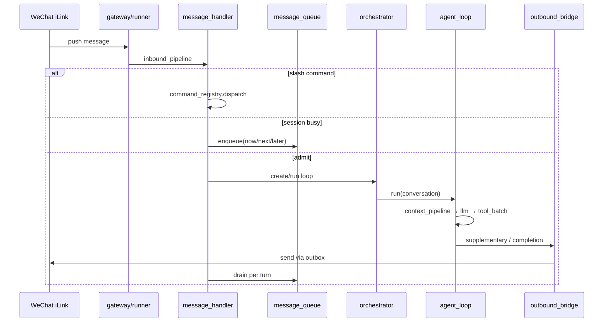

# Butler v4 — 工程蓝图文档

> **版本**：2026-06-12（分析包）  
> **SSOT 原文**：[`../v4-detailed-design.md`](../v4-detailed-design.md) v2.2；[`../v4-architecture.md`](../v4-architecture.md)；[`../../guides/project-knowledge-graph-2026-06.md`](../../guides/project-knowledge-graph-2026-06.md)  
> **规划**：[`../../plans/active/post-consolidation-roadmap-2026-05.md`](../../plans/active/post-consolidation-roadmap-2026-05.md)；[`../../plans/decisions/roadmap-backlog-and-boundaries-2026-05.md`](../../plans/decisions/roadmap-backlog-and-boundaries-2026-05.md)  
> **读者**：高级模型 — 用于架构落地完整性、模块边界、演进路线与 Backlog 优先级审阅

---

## 0. 蓝图定位

本文档描述 Butler v4 **工程实现蓝图**：理论五元组 → 六层模块映射、关键数据流、配置面、部署与观测、**当前实现状态**及**后续轨道**。

**v3→v4 架构决策**：自建 Agent Loop（`butler/core/`），不 import Hermes `AIAgent`；微信 Gateway 为 Butler 原生 iLink。

---

## 1. 理论到工程的层映射

### 1.1 六层架构总图

```text
┌─────────────────────────────────────────────────────────┐
│ L1  WeChat 界面层    [Gateway = 𝒢]                       │
│     iLink · message_handler · message_queue · outbox     │
│     command_registry · outbound_bridge · inbound_media   │
├─────────────────────────────────────────────────────────┤
│ L2  管家智能层       [Loop = ℒ]                          │
│     agent_loop · context_pipeline · llm_retry            │
│     tool_batch · orchestrator · tool_guardrails        │
├─────────────────────────────────────────────────────────┤
│ L3  PIM 层           [Π_I]                               │
│     tenant · contacts/memo/expense/habits/reminder       │
├─────────────────────────────────────────────────────────┤
│ L4  开发引擎层       [Π_D]                               │
│     delegate_task · dev_engine · coding_knowledge        │
│     task_orchestrator · b9_* 质量环                      │
├─────────────────────────────────────────────────────────┤
│ L5  项目管理层       [Π_P]                               │
│     project/manager · workflows · runtime · project_todos│
├─────────────────────────────────────────────────────────┤
│ L6  记忆与安全       [ℳ + 𝒜]                           │
│     memory/* · skills/* · permissions · human_gate       │
├─────────────────────────────────────────────────────────┤
│ L7  观测演化（横切）  eval_* · LangFuse · /诊断 · B9      │
└─────────────────────────────────────────────────────────┘
         Transport (LLM) ──► butler/transport/*
         Tools Registry ──► butler/tools/*
         MCP (opt-in)    ──► butler/mcp/*
```

### 1.2 代码根目录映射

| 包/目录 | 层 | 核心文件 |
|---------|-----|----------|
| `butler/gateway/` | L1 | `message_handler.py`, `message_queue.py`, `outbound_bridge.py`, `session_registry.py`, `runner.py` |
| `butler/core/` | L2 | `agent_loop.py` (~561行), `context_pipeline.py`, `tool_batch.py`, `llm_retry.py` |
| `butler/orchestrator.py` | L2 | Loop 工厂、系统提示、Skill 路由 |
| `butler/tenant.py` + `butler/tools/{contacts,memo,...}` | L3 | PIM 26 工具 |
| `butler/dev_engine/` | L4 | `dev_loop.py`, `coding_knowledge.py`, `verify.py`, `b9_*.py` |
| `butler/project/`, `butler/workflows/`, `butler/runtime/` | L5 | 多项目、YAML workflow、cron job |
| `butler/memory/`, `butler/skills/`, `butler/permissions/`, `butler/human_gate.py` | L6 | 记忆、Skill、门控 |
| `butler/ops/` | L7 | `eval_*`, `langfuse_tracer`, `eval_diagnostics`, `boundary_observability` |
| `butler/transport/` | 横切 | 9 Provider LLM 客户端 |
| `butler/tools/registry.py` | 横切 | 11 内置 + 可选工具注册 |
| `butler/main.py` | 入口 | CLI |

---

## 2. 关键运行时数据流

### 2.1 微信入站主路径



### 2.2 Agent Loop 单轮

```text
prepare_messages_for_api (Spill/Prune/Compact/hygiene)
  → call_llm_with_retry (transport + failover + streaming prefetch)
  → process_tool_calls (parallel_tools, guardrails, spill, audit)
  → loop until text done / limit / interrupt
  → post_session_ops / eval_turn (gateway locked_phases)
```

### 2.3 委派路径

```text
butler delegate_task
  → cache_safe_delegate (system prefix 对齐)
  → child AgentLoop (role=dev, isolated history, depth≤2)
  → finalize_delegate_success (b9_delegate_gate in benchmark mode)
  → AgentReport → 微信摘要
```

### 2.4 记忆注入路径

```text
memory_prefetch (query → hybrid search → rerank)
  → pre_llm_transform: Inject <memory-context> (副本)
  → transcript.jsonl 不变 (T4/MT4)
post_session → fact extraction / skill 提炼 / pending 审批
```

---

## 3. L1 Gateway 蓝图

| 模块 | 路径 | 职责 | 状态 |
|------|------|------|------|
| iLink Adapter | `gateway/platforms/wechat_ilink.py` | 长连接、收发 | ✅ |
| Admission | `message_handler` + `session_registry` | 单飞、LRU 驱逐 | ✅ |
| Message Queue | `message_queue.py` | 三桶 + 4 mode + 可选 JSONL 持久化 | ✅ |
| Durable Outbox | `runner.py` + push queue | at-least-once 出站 | ✅ G2-02 已验 |
| Commands | `gateway/commands/*.py` | 60+ 斜杠命令 | ✅ |
| Media Inbound | `inbound_media.py` | 图/音/文件；真机 ✅ 2026-06-10 | ✅ |
| Injection | `inbound_pipeline` + injection 阶段 | 三层防护 P-INJ | ✅ |

**配置**：`butler/gateway_settings.py`, `queue_settings.py` — 见 `docs/config/reference.md`。

---

## 4. L2 Loop 蓝图

| 模块 | 路径 | 行数级 | 职责 |
|------|------|--------|------|
| 编排 | `core/agent_loop.py` | ~561 | 主循环、LoopResult、interrupt |
| 上下文 | `context_pipeline.py`, `context_compressor.py` | — | 五阶段 + post_compact 锚点 |
| 工具批 | `tool_batch.py`, `parallel_tools.py` | — | spill、prefetch、guardrails |
| LLM | `llm_retry.py` + `transport/` | ~800 | 重试、schema 恢复、流式 |
| 流式预取 | `streaming_tools.py` | — | 只读 tool 参数完整即 dispatch |
| 委派 cache | `cache_safe_delegate.py` | — | prompt cache 对齐 |
| 其他 P0–P4 | `read_state`, `reactive_compact`, `session_transcript`, `turn_token_budget` | — | CC 线束已收口 |

**11 内置工具**：`tools/builtin_register.py` — read/write/patch/delete/terminal/search/list/skills/delegate/workflow。

---

## 5. L3 PIM 蓝图

| 模块 | 存储 | 上限 |
|------|------|------|
| TenantStore | `~/.butler/tenants/{id}/` JSON | atomic_write |
| Contacts | tenant JSON | 500 |
| Expense | tenant JSON | 5000 |
| Memo | tenant JSON | 200 active |
| Habits | tenant JSON | 30 active |
| Reminder | tenant JSON + poller | 100 active |
| PIMState 注入 | `core/pim_state.py` | memory_prefetch 概览 |

**加密**：`BUTLER_PIM_ENCRYPT=1` opt-in Fernet — **Backlog D7**。

---

## 6. L4 Dev 蓝图

### 6.1 DevEngine FSM

```text
PLAN → LOCATE → EDIT → VERIFY ⇄ FIX → DONE | STUCK
```

| 组件 | 路径 |
|------|------|
| DevLoop | `dev_engine/dev_loop.py` |
| EditHistory / undo | `dev_engine/edit_ops.py` |
| Verify / dual_verify | `dev_engine/verify.py` |
| 知识管线 | `dev_engine/coding_knowledge.py` — TheoremLibrary, ExperienceLibrary, process_task |
| Dev 工具 | `dev_engine/dev_tools.py` — run_pytest 等 |
| OpenCode 扩展 | `extensions/opencode.py` — 可选 MCP 桥 |

### 6.2 B9 LLM 端到端质量环（当前最活跃）

| 组件 | 路径/脚本 |
|------|-----------|
| 基准规格 | `dev_engine/llm_delegate_benchmark.py` |
| LIVE 任务集 | `b9_live_fixed_tasks.py`, `b9_prod_shaped_tasks.py` (19项) |
| Tier 门控 | `b9_tiers.py` — Tier-1 发版门 |
| 委派门控 | `b9_delegate_gate.py` |
| 修学 | `b9_lessons.py`, `b9_oracle_curriculum.py` |
| 生产晋升 | `ops/delegate_failure_b9_promote.py`, `b9_prod_promoted_registry.py` |
| 周循环 | `scripts/butler-b9-weekly-learning.sh` |
| 发版门 | `scripts/butler-b9-release-gate.sh` |

---

## 7. L5 PM 蓝图

| 能力 | 路径 | 微信入口 |
|------|------|----------|
| 项目注册 | `project/manager.py`, CLI `butler project` | `/项目` |
| 多项目总览 | `gateway/message_handler` | `/总览` |
| Workflow DAG | `workflows/builtin/*.yaml`, `human_gate` | `/workflow`, 确认续跑 opt-in |
| Runtime Jobs | `runtime/task_store`, `builtin_handlers` | `/运行`, cron |
| 项目待办 | `tools/project_todos.py` | `/项目待办` |
| Lead Skill | `projects/*/skills/*-lead.md` | 委派 Lead |

**试点**：`projects/LingWen1`（网文工厂）、`projects/DemoPilot`（模板）。

---

## 8. L6 Memory & Security 蓝图

| 模块 | 路径 | 说明 |
|------|------|------|
| Facade | `memory/facade.py`, `butler_memory.py` | 统一读写 |
| 向量 | `memory/vector_store.py`, `semantic_index.py` | ChromaDB opt-in `[vectors]` |
| Fact 提取 | `core/fact_extraction.py` | `BUTLER_FACT_EXTRACTION=1` |
| Observation | `memory/observer_queue.py`, `observation_store.py` | workspace `.butler/observations.db` |
| Skill | `skills/manager.py`, `router.py`, `skill_tool_bridge.py` | 语义路由 + preferred_tools |
| 权限 | `permissions/rules.py`, `.butler/permissions.yaml` | allow/deny/ask |
| Human gate | `human_gate.py` | workflow + mutating runtime |
| Post-session | `session/post_session.py`, `post_session_ops.py` | 双通道提取 |

**检索信任级联**：见 `memory-roadmap.md` — Experience/Skill 沉积策略。

---

## 9. L7 观测演化蓝图

| 组件 | 路径 | 开关 |
|------|------|------|
| LangFuse | `ops/langfuse_tracer.py` | `BUTLER_LANGFUSE_ENABLED=1` |
| per-turn 评分 | `ops/eval_turn.py` | gateway locked_phases |
| 软反馈 | `ops/eval_feedback.py` | ephemeral 注入 |
| 硬反馈 | `ops/eval_actions.py` | `BUTLER_EVAL_HARD_FEEDBACK` |
| 诊断看板 | `ops/eval_diagnostics.py`, `cli/doctor.py` | `/诊断`, `butler doctor` |
| 边界观测 | `ops/boundary_observability.py` | gap 脚本 |
| 回归门 | `scripts/butler-eval-regression.sh` | deploy 集成 |
| 语料同步 | `scripts/butler-wechat-dataset-sync.sh` | weekly |

**部署**：`butler-deploy.sh` LangFuse provision；Docker compose opt-in。

---

## 10. Transport & 工具蓝图

### 10.1 Transport

| 模块 | 说明 |
|------|------|
| `transport/providers.py` | 9 家 Provider 配置 |
| `chat_completions.py` / `anthropic_transport.py` | 协议 |
| `fallback.py`, `error_classifier.py` | failover |
| `auxiliary_client.py` | 压缩/辅助模型 |
| `content_sanitize.py` | 国产模型 think/XML 清洗 |

### 10.2 工具注册与可选面

| 类别 | 启用条件 |
|------|----------|
| terminal | `BUTLER_ENABLE_TERMINAL=1` |
| git_* | `BUTLER_ENABLE_GIT=1` / write: `GIT_WRITE` |
| runtime jobs | `BUTLER_RUNTIME_ENABLED=1` |
| MCP | `BUTLER_MCP_ENABLED=1` + `[mcp]` extra |
| web_fetch, download, execute_code | 各独立 env — 见 reference.md |

### 10.3 执行面详设

Skill / Builtin / MCP 信任级联：[`execution-surface-design.md`](../execution-surface-design.md)。

---

## 11. 配置与部署蓝图

### 11.1 配置面

| 来源 | 路径 |
|------|------|
| 环境变量 SSOT | `docs/config/reference.md`, `.env.example` |
| 项目 | `{ws}/project.yaml` |
| 权限 | `{ws}/.butler/permissions.yaml` |
| MCP | `{ws}/.butler/mcp.yaml` |
| 网关队列 | `{ws}/.butler/gateway_queue/*.json` |
| Secrets | `config_secrets.py`, `secrets.yaml`（明文过渡） |

### 11.2 模型分层

```text
系统默认 → .env/CLI → project.yaml → 运行时 /model
正交：auxiliary.*（压缩）、网关 VLM/STT
```

实现：`butler/model_resolve.py` — 见 `layered-model-config.md`。

### 11.3 部署拓扑（单 Owner）

```text
systemd butler-gateway.service
  ├── iLink 长连接
  ├── gateway runner (inbound + outbox drain)
  └── runtime scheduler (jobs.yaml)

可选：LangFuse docker（观测）
本地：~/.butler/ audit + tenants
项目：projects/*/.butler/
```

发版流程：[`release-runbook-2026-05.md`](../../guides/release-runbook-2026-05.md) — pre-release smoke 含 B9 oracle Tier-1。

---

## 12. 依赖与 optional extras

| extra | 能力 |
|-------|------|
| `[wechat]` | iLink 网关 |
| `[mcp]` | MCP 薄客户端 |
| `[embeddings]` | fastembed 语义 |
| `[vectors]` | ChromaDB |
| `[documents]` | markitdown 微信文件解析 |
| `[voice]` / `[wechat-ocr]` | 媒体 |
| `[web]`, `[notify]`, `[analytics]`, `[pty]`, `[dev]` | 见 dependency-policy |

**原则**：微信/MCP/voice 等优先 optional-dependencies，不进 core 默认。

---

## 13. 测试守门矩阵

| 变更域 | 守门命令 |
|--------|----------|
| core/gateway | `test_cc_p3_p4_features`, `test_message_queue`, `test_gateway_handler` |
| 指标 | `test_runtime_metrics` |
| 编排 | `test_orchestration_improvements` |
| 记忆理论 | `test_premise_memory_theory`, `test_memory_metrics_benchmark` |
| 编码知识 | `test_premise_coding_knowledge`, `test_engineering_bridge` |
| 五报告 | `./scripts/butler-five-reports-gate.sh` |
| B9 发版 | `butler-b9-release-gate.sh` |
| 全量 | `PYTHONPATH=. pytest tests/ -q`（maintainer optional；发版以 fast-gate 为准） |

---

## 14. 实现状态总览（2026-06-12）

### 14.1 已收口主线 ✅

| 主线 | Phase/PR |
|------|----------|
| 仓库整理 P0–P3 | consolidation |
| CC 线束 P0–P4 | cc-butler-gap-analysis |
| 四/五报告 + 外部 Agent PR | §9/§10 核对表 |
| 闭环优化 Phase 0–9 | post-consolidation |
| 理论 G4/G3 全收口 | gap-register |
| 末批真机 A2/G2-02 | pilot-log 2026-06-10 |
| B9 框架 O9 | llm_delegate_benchmark + 发版/周循环 |

### 14.2 活跃演进 🔥

- B9 LIVE Tier-1 通过率、prod_delta、生产失败→B9L_prod 晋升
- OT2 生产 eval 证据积累（G1-04）
- 经验库 ↔ B9 修学闭环

### 14.3 搁置 ⏸️

- G1-02 / A5 成本账单对标
- G1-08 / B1 灵文新书态探针
- G2-08 CA4 strict 硬阻断

### 14.4 可选 Backlog（未承诺排期）

见 [`roadmap-backlog-and-boundaries`](../../plans/decisions/roadmap-backlog-and-boundaries-2026-05.md) §3：

- PIM Fernet 加密（D7）
- 识图 P3 VLM/OCR
- terminal 主机白名单
- Observation Store 迁移/诊断 CLI
- OpenAPI 声明式 HTTP 工具
- OpenCode 暂缓项（LSP、worktree 等）

### 14.5 明确不做 ❌

Hermes Loop、LangGraph 替代、浏览器平台、RAGFlow 全栈、MCP Host 全家桶、多实例 MQ、入站 WAL、每项目独立 Bot — 见 roadmap §1。

---

## 15. 推荐演进轨道（蓝图视角）

```text
当前站位：结构保证 ✅ → 质量闭环进行中
    │
    ├─► 轨道1：B9 + 经验库反向传播（最高 ROI）
    ├─► 轨道2：OT2 生产观测 + eval_feedback 证据
    ├─► 轨道3：T02/T07 checker 硬化（结构定理可信度）
    ├─► 轨道4：灵文维护态运营 + DemoPilot 外扩
    └─► 轨道5：按需 Backlog（D7/D8/D9…）
```

与 [`post-consolidation-roadmap`](../../plans/active/post-consolidation-roadmap-2026-05.md) 轨道 A–O 对齐；对标 PR **已无必做后续**。

---

## 16. 文档与代码 SSOT 索引

| 用途 | 文档 |
|------|------|
| 实现事实 | `v4-architecture.md` |
| 详设决策 | `v4-detailed-design.md` |
| 理论 | `v4-theoretical-baseline.md` + 子理论 |
| env | `config/reference.md` |
| 决策/Backlog | `roadmap-backlog-and-boundaries` |
| 差距 | `theory-implementation-gap-register` |
| 知识图谱 | `guides/project-knowledge-graph-2026-06.md` |
| 本分析包 | `architecture/analysis/*` |

---

## 17. 供高级模型的蓝图审阅清单

1. L2 `agent_loop` 与子模块边界是否仍清晰，或需进一步拆分/合并？  
2. B9 质量环与 CI/发版/生产 telemetry 是否形成闭合？缺口在哪？  
3. L6 Observation Store 与 memory-roadmap 检索信任级联是否一致？  
4. optional extras 与生产部署文档（`[all]`）是否匹配真机能力？  
5. 多项目 + 单微信 Bot 下 session_key 与 Tenant 隔离是否覆盖所有路径？  
6. Backlog 项中哪些应升格为产品边界变更（§1 否决）而非实现？  

---

## 变更记录

| 日期 | 说明 |
|------|------|
| 2026-06-12 | 初版：六层蓝图 + 数据流 + 2026-06 实现状态 |
