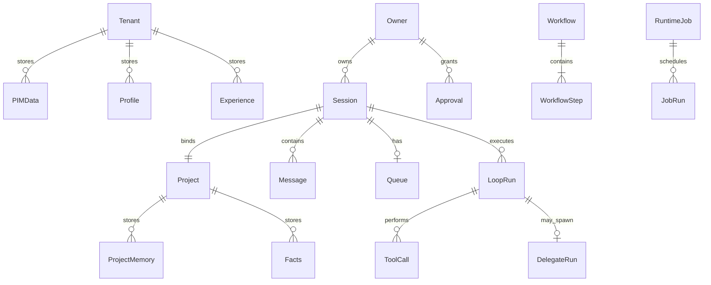

# Butler v4 — 建模文档

> **版本**：2026-06-12（分析包）  
> **SSOT 原文**：[`../v4-theoretical-baseline.md`](../v4-theoretical-baseline.md) v3.1.1 第一章–第二章；子理论 [`v4-memory-theory.md`](../v4-memory-theory.md)、[`v4-dev-engine-theory.md`](../v4-dev-engine-theory.md) 第一章  
> **读者**：高级模型 / 架构审阅者 — 用于概念一致性、边界合理性、扩展性分析  
> **实现对照**：[`../v4-architecture.md`](../v4-architecture.md)

---

## 0. 文档目的与范围

本文档提取 Butler v4 **概念层与领域模型**，不包含完整证明（见 [`formal-theory-2026-06.md`](formal-theory-2026-06.md)）与模块级实现（见 [`blueprint-2026-06.md`](blueprint-2026-06.md)）。

**建模方法论**（项目自述）：概念建模 → 七层细化 → 形式化建模 → 三角色评审 → 定理证明 → 工程验证 → 能力边界声明。

---

## 1. 系统身份与边界

### 1.1 产品定义

Butler v4 是**微信原生个人 AI 管家**：以微信为 Owner **唯一产品界面**，融合三大能力支柱（PIM、开发、项目管理），在单 Owner、单进程、文件存储约束下运行。

### 1.2 系统边界（建模假设）

| 维度 | 建模选择 | 排除 |
|------|----------|------|
| 用户 | 单 Owner（`is_gateway_owner`） | 多租户 SaaS、ACL |
| 通道 | WeChat iLink 异步 push | Web UI、IDE 插件为第二产品面 |
| 进程 | 单进程 | 分布式一致性、MQ  broker |
| LLM | 黑盒概率预言机 \(\mathcal{O}_{\text{LLM}}\) | 不建模 transformer 内部 |
| 存储 | 文件 + 派生 SQLite | 跨记录事务、SQL 会话库替换 transcript |
| 运维 | CLI 可存在 | CLI 非 Owner 产品通道（公理 A2 二分） |

### 1.3 输入/输出域

**输入**：微信文本/图片/语音/文件；60+ 斜杠命令（项目、对话、记忆、开发、生活五类）。

**输出**：微信回复、补充消息、提醒推送、工作流通知、委派报告、PIM 操作确认。

---

## 2. 核心概念模型 — 五元组

### 2.1 形式化系统定义

\[
\text{Butler} = (\mathcal{G}, \mathcal{L}, \Pi, \mathcal{M}, \mathcal{A})
\]

| 符号 | 名称 | 概念职责 | 工程层 |
|------|------|----------|--------|
| \(\mathcal{G}\) | Gateway | 通道：入站/出站/队列/命令 | L1 WeChat 界面层 |
| \(\mathcal{L}\) | Loop | 编排：LLM 循环、工具、上下文 | L2 管家智能层 |
| \(\Pi\) | Pillars | 业务价值：PIM + Dev + PM | L3–L5 |
| \(\mathcal{M}\) | Memory | 横切：分层记忆与检索 | L6（记忆部分） |
| \(\mathcal{A}\) | Authority | 横切：权限、门控、审批 | L6（安全部分） |

**分层决策**：Gateway/Loop 为**基础设施**；PIM/Dev/PM 为**业务能力**；Memory/Authority 为**横切关注点**。较旧「六元组平列」更清晰反映依赖方向。

### 2.2 三支柱 \(\Pi\)

\[
\Pi = \Pi_I \cup \Pi_D \cup \Pi_P
\]

| 支柱 | 符号 | 概念能力 | 典型工具/机制 |
|------|------|----------|---------------|
| PIM | \(\Pi_I\) | 租户级个人数据 | ~26 工具：备忘、通讯录、记账、习惯、提醒 |
| Dev | \(\Pi_D\) | 代码变更与验证 | `delegate_task`、内置 DevEngine、编码知识层 |
| PM | \(\Pi_P\) | 多项目与工作流 | 项目切换、Workflow DAG、Runtime Jobs、项目待办 |

### 2.3 存储双域

| 域 | 路径概念 | 数据类 | 隔离原则 |
|----|----------|--------|----------|
| **Tenant** | `~/.butler/tenants/{tenant_id}/` | PIM、Profile、Experience | 跨项目共享 |
| **Project** | `{workspace}/.butler/` | Facts、ProjectMemory、transcript、配置 | 项目间隔离 |

**建模约束**：Tenant ∩ Project 在文件路径层面不相交；跨域推理通过 Facade/管家角色，非直接路径穿越。

---

## 3. 三元张力 — 根本矛盾模型

### 3.1 张力三角

```
            全能管家承诺
           ╱            ╲
          ╱   三元张力    ╲
    单通道约束 ──────── LLM 能力上界
```

\[
\underbrace{\text{PIM}+\text{Dev}+\text{PM}}_{\text{全能}} \times \underbrace{\text{WeChat 单通道}}_{\text{M2}} \times \underbrace{|H|\to\infty}_{\text{会话累积}}
\;\Rightarrow\;
\underbrace{W<\infty}_{\text{窗口}} \times \underbrace{\epsilon_{\text{LLM}}>0}_{\text{能力有界}} \times \underbrace{\text{single-process}}_{\text{资源}}
\]

### 3.2 六条具体矛盾（M1–M6）

| ID | 矛盾 | 概念表述 | 架构缓解方向 |
|----|------|----------|--------------|
| **M1** | 全能 vs 安全边界 | PIM(private) ∩ Project(shared) = ∅，但需跨域推理 | 双域 + 角色/工具隔离 + 记忆 scope |
| **M2** | 单通道 vs 多模态 | 文本长度、无实时双向流、富交互受限 | 斜杠命令、渐进披露报告、补充消息 |
| **M3** | 持久 vs 上下文有限 | tokens(𝒦) ≫ W | 检索注入、压缩、fact 锚点、prune |
| **M4** | 广度 vs 深度 | 管家 breadth → 专家 depth | delegate / DevEngine 模式切换 |
| **M5** | 自治 vs 控制 | 定时/workflow 自动 vs 不可逆需确认 | readonly 自动；mutating 审批 |
| **M6** | 扩展 vs 简洁 | 不能变成通用插件平台 | MCP/Runtime/Registry 三受控扩展口 + 硬上限 |

---

## 4. 设计公理与原则（概念层）

### 4.1 七条公理 A1–A7

| 公理 | 名称 | 概念含义 |
|------|------|----------|
| **A1** | Owner 唯一性 | 单 Owner 信任模型，非多租户 ACL |
| **A2** | WeChat 即产品 | Owner 唯一产品界面；运维 CLI 不构成第二产品面 |
| **A3** | 管家通过引擎动手 | butler/lead 不直接持项目写工具；变更经 delegate 或 DevEngine（role=dev 路径） |
| **A4** | 权限单调递减 | 委派链上工具集严格不增；PIM 不传子 Agent |
| **A5** | Tenant/Project 双域 | 物理路径隔离 |
| **A6** | 记忆分层不可旁路 | scope 路由写入；注入仅改 API 输入副本 |
| **A7** | 能力可插拔 | MCP / Runtime / Registry，共享安全管线 |

### 4.2 六条设计原则 P1–P6

| 原则 | 含义 |
|------|------|
| **P1** | 架构保证优于 LLM 承诺 |
| **P2** | 显式记忆优于模型隐式记忆 |
| **P3** | 容错优于完美（多阶段管线、failover、outbox） |
| **P4** | 封闭优于开放（枚举、工具集 frozenset、MCP 上限） |
| **P5** | 静态优于动态（权限格、配置保证） |
| **P6** | 诚实边界优于虚假承诺 |

### 4.3 子理论对 A3 的修正（DevEngine）

开发引擎子理论将 A3 操作化为 **A3''**：

\[
\text{butler/lead} \xrightarrow{\text{mode\_switch}} \text{DevEngine（内置，完整安全管线）}
\]

管家不是「永不动手」，而是**不直接持有项目写工具**；开发能力通过内置引擎或委派，均在权限/审批/记忆管线下。

---

## 5. 七层概念模型

```text
L7  观测演化     LangFuse、eval、B9 基准、反馈回路
L6  记忆与安全   MemoryFacade、Perm、HumanGate、InjectionGuard
L5  项目管理     ProjectRegistry、Workflow、Runtime、Todos
L4  开发引擎     DevEngine、Delegate、编码知识层
L3  PIM          TenantStore、Contacts/Memo/Expense/Habits/Reminder
L2  管家智能     AgentLoop、ContextPipeline、IntentRouter、ToolDispatch
L1  WeChat 界面  Adapter、Queue、Outbox、CommandRouter、MediaInbound
```

### 5.1 L1 — 通道模型 \(\mathcal{C}\)

**入站管线概念阶段**：Arrive → Classify → Admit → Queue/Dispatch

**队列三桶**：\(Q = Q^{now} \cup Q^{next} \cup Q^{later}\)

**四种模式**（决策树四叶）：

| 模式 | 概念语义 |
|------|----------|
| followup | 忙则等，逐条 drain |
| collect | 忙则等，合并 drain |
| interrupt | 不等，打断当前 Loop |
| steer | 不等，注入运行中 Loop |

**出站类型**：Reply、Supplementary、Reminder、Completion — 统一经 Adapter 出口。

### 5.2 L2 — 会话与 Loop 概念状态

**会话状态向量**：

\[
s = (H, \sigma, i, W, P, R, K, \mathcal{I}_s)
\]

- \(H\)：消息历史（transcript SSOT）
- \(\sigma\)：运行状态（idle/running/…）
- \(i\)：迭代计数
- \(W\)：上下文预算
- \(P\)：当前项目绑定
- \(R \in \{\text{butler}, \text{lead}, \text{dev}, \ldots\}\)
- \(K\)：记忆快照
- \(\mathcal{I}_s\)：PIM 租户快照

**LoopStatus 概念事件**：tool 成功、waiting、stuck、完成、截断续写、interrupt、error、iteration 上限。

### 5.3 L3 — PIM 概念模型 \(\mathcal{I}\)

模块：contacts、expenses、memos、habits、reminders

**有界性概念**：每模块 active 记录数硬上限（contacts 500、expenses 5000、memos 200、habits 30、reminders 100 等）。

**封闭枚举**：category/priority/status 等闭集，非法值归默认。

### 5.4 L4 — 开发引擎概念

**DevEngine FSM**：PLAN → LOCATE → EDIT → VERIFY → (FIX)* → DONE | STUCK | REVIEW

**与委派关系**：

- **广度路径**：butler → `delegate_task` → dev 子 Agent（隔离历史、深度≤2）
- **深度路径**：DevEngine 内置模式（共享记忆/审批/trace）

**编码知识层概念**（七元素）：规格 → 定理激活 → 经验检索 → 合成/生成 → 双重验证 → 入库/反馈

### 5.5 L5 — 项目管理概念

- **ProjectRegistry**：多 workspace，本地路径 / Git URL
- **Workflow DAG**：节点需前置完成 + 可选 `requires_approval`
- **Runtime Jobs**：readonly 自动 / mutating 需 Owner 批准 + TTL

### 5.6 L6 — 记忆概念模型 \(\mathcal{M}\)

**四层记忆**（概念）：

| 层 | 符号 | 域 | 写入特点 |
|----|------|-----|----------|
| Profile | \(\mathcal{K}_P\) | Tenant | Owner 画像 |
| Experience | \(\mathcal{K}_E\) | Tenant | 程序性/最佳实践（Skill 沉积演进中） |
| Facts | \(\mathcal{K}_F\) | Project | 结构化事实 |
| ProjectMemory | \(\mathcal{K}_J\) | Project | MEMORY.md 等 |

**检索概念**：Hybrid = FTS ∪ Vector → rerank(decay, access)

**注入概念**：Inject(H, Hits) → H'，**不修改** transcript SSOT。

**管家记忆 vs 通用 AI 记忆**（设计定位）：不追求「自主记一切」，追求**可靠、可审计、可控**。

### 5.7 L7 — 观测演化概念

**训练类比三回路**：

| 回路 | Butler 概念 |
|------|-------------|
| 前向 | Loop / DevEngine / Memory 执行 |
| 损失 | pytest（结构 SSOT）+ LangFuse（趋势 SSOT） |
| 反向 | eval_feedback / eval_actions → 参数与经验演化 |

**与 DA6 区分**：DA6 是单次 Dev 步骤 trace；L7 是跨 turn/会话/项目质量时间序列。

---

## 6. 角色与工具集概念模型

### 6.1 角色

| 角色 | 概念定位 | PIM | 写项目文件 | delegate |
|------|----------|-----|------------|----------|
| butler | 全能管家 | ✅ | ❌（经引擎/委派） | ✅ |
| lead | 项目 Lead | ❌ | ❌ | ✅ |
| dev | 开发子 Agent | ❌ | ✅（受限集） | ❌ |

### 6.2 权限格概念

\[
(\mathcal{T}, \subseteq),\quad \text{Owner} \supseteq \text{Butler} \supseteq \text{Child Agent}
\]

\[
\mathcal{T}_{\text{PIM}} \cap \mathcal{T}_{\text{child}} = \emptyset
\]

**信息流等级**：auto vs gated — 不存在 gated→auto 除非 Owner 确认。

---

## 7. LLM 与路由概念模型

### 7.1 概率预言机

\[
\mathcal{O}_{\text{LLM}}: \text{Messages} \times \text{Tools} \to \text{Distribution}(\text{Response})
\]

### 7.2 意图路由

\[
\epsilon_{\text{route}} = 1 - P(t^* \mid m, \text{sys}, \mathcal{T}),\quad \frac{\partial \epsilon_{\text{route}}}{\partial |\mathcal{T}|} > 0
\]

**缓解概念三层**：系统提示消歧表 → 核心工具 pinning → 角色-工具集隔离。

---

## 8. 扩展点概念模型 \(\mathcal{E}\)

\[
\mathcal{E} = \mathcal{E}_{\text{MCP}} \cup \mathcal{E}_{\text{Runtime}} \cup \mathcal{E}_{\text{Registry}}
\]

**概念上限**：MCP servers/tools 硬顶；扩展工具必须走同一 dispatch/permission/hook/approval 管线，不可旁路。

**明确不做（概念边界）**：全量 MCP Host、LangGraph 替代 Loop、浏览器自动化平台、多实例 MQ、入站 WAL、每项目独立 Bot。

---

## 9. 实体关系图（概念 ER）



---

## 10. 当前建模相关开放问题（供高级模型审阅）

| 主题 | 问题 | 登记 |
|------|------|------|
| OT2 收敛 | 硬反馈+经验生命周期是否收敛？ | G1-04，有条件目标 |
| CA4 strict | advisory vs 生产硬阻断 | G2-08，保持现状 |
| Experience vs Skill | v4-skill-memory-theory v2 草案 vs v1.2 契约层 | memory-roadmap |
| T02/T07 checker | 编码定理 checker stub 弱化结构保证 | 闭环优化规划 FP-1/FP-2 |
| 中文 token | T1 坚实度 L4，依赖裕度与 reactive | FINDING-1 已缓解 |
| 跨域推理 | M1 产品需求 vs 双域隔离的形式化强度 | 概念层未单独定理化 |

---

## 11. 符号速查

见 [`formal-theory-2026-06.md`](formal-theory-2026-06.md) 附录符号表；父文档 [`v4-theoretical-baseline.md`](../v4-theoretical-baseline.md) 附录 B 为权威全集。

---

## 变更记录

| 日期 | 说明 |
|------|------|
| 2026-06-12 | 初版：从 v3.1.1 理论基线与子理论第一章提取概念模型 |
