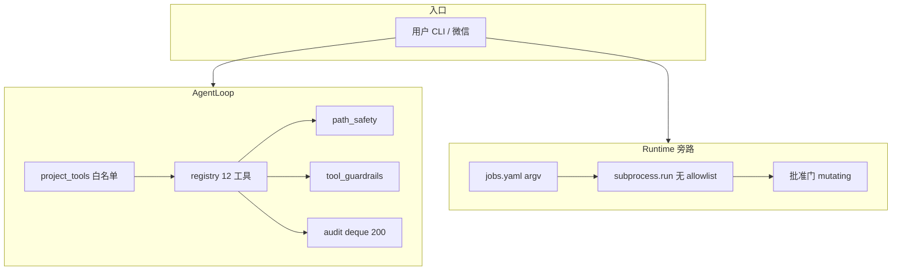

# 开发操作能力方案（Dev Ops Tools）

> 版本：2026-05-22 | 状态：P0/P1 已实现（见 `butler/tools/git_tools.py`）  
> 目标：在保留 Butler 沙箱的前提下，补齐接近 Cursor 的**受控开发闭环**（读代码 → 改 → 跑测试 → 看 git → 可选提交）

---

## 1. 背景与问题

### 1.1 产品定位冲突

| 维度 | Cursor Agent | Butler v4（当前） |
|------|--------------|-------------------|
| 信任模型 | 用户本机 IDE，高信任 | 微信网关 + 多项目，**低信任默认可远程触发** |
| Shell | 近似完整 shell | argv 白名单，`shell=False`，默认**关闭** |
| Git | 内置 | **无 Agent 工具**；prompt 仍引用 `git_status` |
| 执行通道 | 单一（IDE） | **双通道**：AgentLoop 工具 vs Runtime `jobs.yaml` |

Hermes 提炼原则（`hermes-extraction-map.md`）明确**不移植** 50+ 工具 / MCP / 浏览器；本方案在 v4 边界内**增量扩展**，不引入 Hermes 单体。

### 1.2 核心矛盾（必须解决）

1. **Prompt–Registry 漂移**：`agent_profiles.py` 教模型用 `edit_file`、`run_shell`、`git_status`，注册表实际是 `patch`、`terminal`，且**无 git**。
2. **Guardrails 失效**：`tool_guardrails.py` 的幂等/变更工具集使用旧名，`terminal` 失败不计入 shell 类失败模式。
3. **双通道不透明**：开发同学不知道「改代码用 delegate + patch」还是「`/运行` + bash 脚本」。
4. **灵文 Lead 只读**：正确；但 **dev_agent 委派后** 仍缺 git / pytest 的一等工具。

### 1.3 非目标（本阶段不做）

- 不受限 shell（`|`、`;`、`bash -c`）
- `git push` / `git pull` / `fetch`（网络 + 远程破坏面）
- 通用 HTTP 下载 Agent 工具
- MCP / 浏览器 / OS 级沙箱
- 后台常驻终端（>120s 挂起）

---

## 2. 现状架构



### 2.1 已有工具（v4 注册表）

| 工具 | toolset | 安全要点 |
|------|---------|----------|
| read_file / write_file / patch / list_directory | file | workspace + 敏感路径 + 原子写 |
| search_files | search | rg + 路径复核 |
| terminal | shell | `BUTLER_ENABLE_TERMINAL=1` + 命令白名单 |
| delegate_task / run_workflow | delegation | 深度 ≤2 |
| skills_* / butler_* | skills / memory | 读 Skill / 分层记忆 |

### 2.2 Terminal 约束（`path_safety.py`）

- 基础白名单：`cat echo false head ls pwd sleep tail true`
- 扩展：`BUTLER_TERMINAL_ALLOWLIST_EXTRA=python3,bash`
- 禁止：管道、重定向、元字符、`python -c`、`$VAR`、绝对路径二进制

### 2.3 Runtime 旁路

- `butler/runtime/runner.py`：按 `jobs.yaml` 执行 `["bash", "script.sh"]`
- 变更类 job 需 `BUTLER_RUNTIME_ENABLED` + 审批
- **适合**：novel-factory 批量检查、定时任务；**不适合**：交互式「改一行测一下」

### 2.4 v1 可复用资产

`archive/butler-v1/butler/tools/git_tools.py`：async `git_status/diff/log/add/commit/branch`，需改为：

- 同步 handler（匹配 v4 `dispatch_tool`）
- `path_safety` 校验 `cwd`
- 环境门控 + 写操作分离

---

## 3. 目标能力矩阵

| 能力 | P0 | P1 | P2 |
|------|----|----|-----|
| Prompt/Guardrails 与注册表一致 | ✅ | | |
| Terminal 配置档 `dev`/`pilot` | ✅ | | |
| Git 只读（status/diff/log/branch list） | | ✅ | |
| Git 写入（add/commit/branch 改） | | ✅ opt-in | |
| patch 多匹配友好错误 | | ✅ | |
| 工具审计 JSONL 落盘 | | | ✅ |
| Agent→Runtime 桥接 | | | ✅ |
| 受控下载 | | | ✅ |

---

## 4. 方案设计

### 4.1 原则

1. **默认安全**：新能力均 `opt-in`（env），与 `BUTLER_ENABLE_TERMINAL` 一致。
2. **SSOT 在注册表**：prompt 只写真实工具名；`project.yaml` 别名保留兼容。
3. **Git 与 Terminal 分工**：
   - 结构化 git 操作用 **git_* 工具**（可审计、可禁写）
   - 一次性脚本/测试用 **terminal**（白名单 `pytest` 等）
4. **Lead 不变**：Lead 线程仍无 write/terminal/git 写；只读 git 是否开放可配置（默认 Lead 无 git）。

### 4.2 Git 工具模块（`butler/tools/git_tools.py`）

#### 4.2.1 环境门控

| 变量 | 默认 | 作用 |
|------|------|------|
| `BUTLER_ENABLE_GIT` | `0` | 启用只读 git 工具 |
| `BUTLER_ENABLE_GIT_WRITE` | `0` | 启用 `git_add`、`git_commit`、`git_branch` 的 create/switch/delete |

**逻辑**：写工具在运行时检查 `BUTLER_ENABLE_GIT_WRITE=1`；只读工具检查 `BUTLER_ENABLE_GIT=1`。未启用时返回明确 JSON 错误（与 terminal 相同模式）。

#### 4.2.2 工具列表

| 工具 | 类型 | git 子命令 | 说明 |
|------|------|------------|------|
| `git_status` | 只读 | `status --short --branch` | 工作区概览 |
| `git_diff` | 只读 | `diff` / `--cached` / `--stat` | 支持 staged、file、ref |
| `git_log` | 只读 | `log -n` | oneline 默认 |
| `git_branch` | 混合 | `branch` / `checkout` | **list** 只读；create/switch/delete 需 GIT_WRITE |
| `git_add` | 写 | `add` | 需 GIT_WRITE；路径参数经 workspace 校验 |
| `git_commit` | 写 | `commit -m` | 需 GIT_WRITE；**不** auto-add |

#### 4.2.3 显式禁止（所有 git 工具）

- `push`、`pull`、`fetch`、`clone`、`submodule`
- `reset --hard`、`clean -fdx`、`checkout .`
- 任意 `-c` 配置注入

实现方式：每个 handler 只构造固定 argv 列表，**不接受**自由形式 git 参数。

#### 4.2.4 工作目录

- 参数 `workdir` 可选；默认 `tool_safe_root()` / 项目 workspace
- 经 `check_tool_path(workdir)`，必须在 workspace 内
- 执行：`subprocess.run(["git", ...], cwd=resolved, timeout=30, env=safe_subprocess_env())`

#### 4.2.5 输出

- 统一 JSON：`{exit_code, stdout, stderr, truncated?}`
- stdout 上限 30_000 字符（与 v1 一致）
- `exit_code != 0` 时 guardrails 记为失败

### 4.3 Terminal 配置档（`path_safety.py` 扩展）

| `BUTLER_TERMINAL_PROFILE` | 追加命令 | 场景 |
|---------------------------|----------|------|
| （空） | 仅 `EXTRA` + 基础集 | 默认 |
| `pilot` | `python3`, `bash` | 灵文 novel-factory |
| `dev` | `python3`, `bash`, `pytest`, `git`, `rg`, `pip`, `pip3`, `npm`, `npx`, `make` | 本地 WFXM 开发 |

**合并规则**：`allowed = BASE ∪ PROFILE ∪ EXTRA`（去重）。

说明：`dev` 档含 `git` 是为「`git` 作为 argv[0] 跑子命令」的兜底；**优先**用 `git_*` 工具。`pip/npm` 在 dev 档开启，生产网关应使用 `pilot` 或空 profile。

### 4.4 P0：对齐与护栏

| 项 | 改动 |
|----|------|
| `agent_profiles.py` | `patch` / `terminal`；工作流示例用 `git_status` 仅当 GIT 启用 |
| `tool_guardrails.py` | 幂等集含 `search_files`、`git_status`…；变更集含 `terminal`、`git_add`…；`classify_tool_failure` 识别 `terminal` |
| `project.yaml` 文档 | 推荐同时列 canonical 名与别名 |
| `.env.example` | 新 env 块 + dev 推荐组合 |

### 4.5 角色与 project.yaml 工具可见性

| 角色 | 文件写 | terminal | git 只读 | git 写 |
|------|--------|----------|----------|--------|
| lead | ❌ | ❌ | ❌（默认） | ❌ |
| butler | 委派 | ❌（默认） | ❌ | ❌ |
| dev / content / review | project 列表 ∩ 注册表 | 若列表含 `terminal` 且 env 开 | 若列表含 `git_*` 且 GIT=1 | GIT_WRITE=1 |

**灵文1号 `project.yaml` 建议追加**（P1）：

```yaml
tools:
  - read_file
  - write_file
  - patch          # 或 edit_file
  - search_files   # 或 search_code
  - terminal       # 或 run_shell
  - list_directory
  - git_status
  - git_diff
  - git_log
  - skills_list
  - skill_view
```

### 4.6 patch 增强（P1 轻量）

当 `old_string` 出现 **0 次**：保持现有错误。  
当 **>1 次**：返回 `error` + `matches: [{line, excerpt}, ...]`（最多 3 处），引导模型缩小 `old_string` 或加上下文。

### 4.7 与 Runtime 的边界（文档约定）

| 场景 | 推荐通道 |
|------|----------|
| 交互式改代码 + 单测 | delegate → dev_agent → patch + terminal(pytest) + git_* |
| 流水线批量检查 | `/运行 novel-factory-…` 或 systemd due |
| 发版前全量 reindex | 宿主 shell `butler-memory-reindex.sh` |

P2「Agent 请求运行 job」：`run_runtime_job` 工具，参数 `job_id`，内部调 `runtime/service`（只读 job 无需审批）。

### 4.8 观测与审计

| 项 | P0/P1 | P2 |
|----|-------|-----|
| 内存 audit 200 条 | 已有 | |
| `/诊断` 工具摘要 | 已有 | |
| `BUTLER_TOOL_AUDIT_JSONL` | | 追加 `~/.butler/audit/tools.jsonl` |

---

## 5. 环境变量汇总

```bash
# Terminal
BUTLER_ENABLE_TERMINAL=1
BUTLER_TERMINAL_PROFILE=dev          # 空 | pilot | dev
BUTLER_TERMINAL_ALLOWLIST_EXTRA=     # 在 profile 之上追加

# Git
BUTLER_ENABLE_GIT=1                  # 只读 git 工具
BUTLER_ENABLE_GIT_WRITE=0          # add / commit / branch 变更

# Workspace（网关生产推荐）
BUTLER_TOOL_SAFE_ROOT=/path/to/repo
```

**WFXM 本地开发推荐**（`.env.local` 示例）：

```bash
BUTLER_ENABLE_TERMINAL=1
BUTLER_TERMINAL_PROFILE=dev
BUTLER_ENABLE_GIT=1
BUTLER_ENABLE_GIT_WRITE=1          # 仅本机；生产微信建议 0
BUTLER_TOOL_SAFE_ROOT=/home/.../WFXM
```

---

## 6. 验收标准

### P0

- [x] `agent_profiles` 与 `tool_guardrails` 无过时工具名
- [x] `pytest tests/test_tools_registry.py` 通过
- [x] dev_agent prompt 中工作流可执行（不引用缺失工具）

### P1

- [x] `BUTLER_ENABLE_GIT=1` 时 `git_status`/`git_diff` 在 workspace 内可用
- [x] `BUTLER_ENABLE_GIT_WRITE=0` 时 `git_commit` 返回明确拒绝
- [x] `BUTLER_TERMINAL_PROFILE=dev` 允许 `pytest` 而不允许 `curl`
- [x] patch 多匹配返回行号提示
- [x] 新增 `tests/test_git_tools.py` 全绿

### 真机（可选）

- [ ] 委派 dev：改文件 → `git_status` → `terminal` 跑 pytest →（本机）`git_commit`

---

## 7. 实施顺序

1. 本文档入仓（设计 SSOT）
2. P0：`agent_profiles`、`tool_guardrails`、`.env.example`
3. P1：`git_tools.py`、`terminal profile`、`patch` 增强、`registry` 注册
4. 测试 + `project.yaml` 示例 + `docs/guides/dev-tools-ops.md` 运维摘要
5. 提交（不 push 除非用户要求；用户上次曾要 push，这次未说——仅 commit）

---

## 8. 参考

- `butler/tools/registry.py` — 注册与 dispatch
- `butler/tools/path_safety.py` — 沙箱
- `archive/butler-v1/butler/tools/git_tools.py` — v1 参考
- `docs/architecture/hermes-extraction-map.md` — 不移植边界
- `docs/guides/runtime-ops.md` — Runtime 旁路
