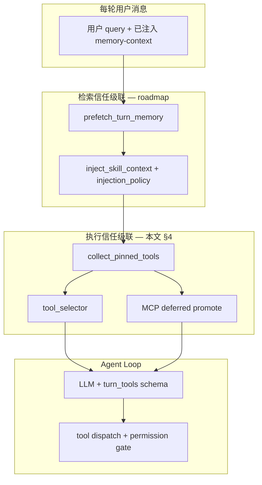

# 执行面工程详设（Skill · Builtin Tool · MCP）

> 版本：2026-06-10 | 个人管家 · 微信主场景  
> **性质**：L3 详细设计 + 运维契约 — **只描述实现与演进**；**不改** L6 MA/MT（[`v4-memory-theory.md`](v4-memory-theory.md)）。  
> **策略 SSOT**：记忆检索/执行信任级联见 [`memory-roadmap.md`](memory-roadmap.md#检索信任级联)。  
> **路径 SSOT**：扩展放哪、谁覆盖谁见 [`extension-registry-paths.md`](extension-registry-paths.md)。  
> **门控 SSOT**：入站 vs 工具链见 [`permission-gate-stack.md`](permission-gate-stack.md)。

---

## 0. 文档边界（理论 vs 工程）

| 层 | 文档 | Skill / Tool / MCP 写什么 |
|----|------|---------------------------|
| L6 理论 | `v4-memory-theory.md` | **不写** 路由/Registry 细节；\(\mathcal{K}\) 仅含 Profile / Experience / Facts / ProjectMemory |
| 父理论 | `v4-theoretical-baseline.md` | \(\mathcal{O}_{\text{LLM}}\)、扩展集 \(\mathcal{E}\)、A7 上限、权限格 T6 / Plan Mode |
| **策略（本文引用）** | `memory-roadmap.md` | 经验优先、Skill 兜底、经验指针 `skill:`/`tool:`/`mcp:` |
| **工程（本文主体）** | 本文 | 注册、注入、选择、deferred、诊断、运维脚本 |
| 运维 | `guides/memory-ops.md` | 种子经验、phase 脚本、指针 authoring |

**产品承诺（不变）**：

- 契约记忆 + 经验：管家负责正确性与可审计性。
- Skill（生态目录）：**不负责**正确性；仅作未验证参考或经验点名加载。
- Builtin Tool：高信任平台能力，受权限/审批门控，不做「Skill 式屏蔽」。
- MCP：低信任扩展，上限 + deferred + approval；非全量 MCP Host（见 roadmap-backlog S11 否决）。

**明确不做（工程详设也不推翻）**：

- Skill 并入 \(\mathcal{K}_E\) 单轨（[`v4-skill-memory-theory.md`](v4-skill-memory-theory.md) v2 **已搁置**）。
- 无门控自动 promote 全量 MCP / 全量 Skill 正文。

---

## 1. 总览：一轮对话里的执行面数据流



| 阶段 | 模块 | 输出 |
|------|------|------|
| 记忆预取 | `session/memory_prefetch.py` | `<memory-context>` 围栏（契约 + 经验） |
| Skill 注入 | `orchestrator.inject_skill_context` + `skills/injection_policy.py` | 可选 `## 相关知识` 段落 |
| 工具 pin | `core/skill_tool_bridge.collect_pinned_tools` | builtin 名集合 + MCP promote 列表 |
| 工具裁剪 | `core/tool_selector.select_tools_for_context` | 当轮 `turn_tools` |
| MCP schema | `mcp/deferred.get_deferred_mcp_definitions` | 已 promote 的 MCP 完整 schema |
| 执行 | `tools/registry` + `mcp/registry_hook` | 结果回注 Loop |

---

## 2. Skill 管理

### 2.1 角色定义

| 属性 | 说明 |
|------|------|
| 存储形态 | Markdown + YAML frontmatter（`name`, `description`, `triggers`, 可选 `preferred_tools`） |
| 运行时路径 | 租户 `tenants/<id>/skills/*.md`；项目 `<workspace>/.butler/skills/*.md`（**同名项目覆盖租户**） |
| 与 git | 项目根 `skills/` 为内容同步源；需 `scripts/sync-*-skills.sh` 落到 `.butler/skills/`（与 Registry `ProjectSource` 路径不同，见 §2.5） |
| 信任 | 低；system 摘要含免责声明（`injection_policy.skill_summary_disclaimer`） |

### 2.2 生命周期

```text
authoring (git / 租户目录 / registry install)
    → SkillManager 扫描 *.md（运行时仅扁平 glob）
    → SkillRouter 索引 metadata（+ 可选 semantic routing）
    → 每轮 inject_skill_context（策略门控）
    → 可选 skill_view / skills_list 工具按需拉正文
```

| 操作 | 入口 | 说明 |
|------|------|------|
| 列目录 | `skills_list` | 元数据列表 |
| 读正文 | `skill_view` | 按名加载全文 |
| 安装 | `registry_install_skill` / `butler registry` | Hub + catalog |
| 租户模板 | `skills/seed_bundled.py` | `docs/templates/skills/` → 租户目录（缺则复制） |
| 项目同步 | `scripts/sync-project-skills.sh` | `projects/<slug>/skills/` → `.butler/skills/` |

### 2.3 注入策略（实现）

配置：`BUTLER_SKILL_INJECTION_MODE`（默认 `fallback`）、`BUTLER_SKILL_FALLBACK_MIN_EXPERIENCE_HITS`。

| 模式 | 行为 |
|------|------|
| `fallback` | 经验命中 ≥ 阈值 → 跳过 Router 全文；经验含 `skill:<名>` → 仅加载点名 Skill |
| `ref_only` | 无 `skill:` 指针则不注入 Router；有指针则只加载点名 |
| `always` | 每轮 Router top-k（旧行为） |

实现：`skills/injection_policy.resolve_skill_injection` → `orchestrator.inject_skill_context`。

### 2.4 `preferred_tools` 与经验指针

| 来源 | 机制 | 模块 |
|------|------|------|
| Skill 正文已注入 | 从 `## 相关知识` 段解析技能名 → Router 查 frontmatter | `skill_tool_bridge.extract_skill_preferred_tools` |
| 经验 `skill:<名>`（正文可未注入） | `get_preferred_tools_for_names` 只读 frontmatter | `skill_tool_bridge.resolve_experience_pinned_tools` |
| 经验 `tool:<builtin>` | 直接 pin | `skills/experience_pointers` |

**frontmatter 解析**：`skills/manager.py` `_preferred_tools_from_fm` → `list_skills` / `get_skill` 携带 `preferred_tools`。

### 2.5 已知路径漂移（待优化 Backlog）

| 问题 | 现状 | 目标 |
|------|------|------|
| Registry `ProjectSource` | `projects/*/skills/` | 与运行时 `.butler/skills/` 双轨 |
| Legacy 全局目录 | `~/.butler/skills/` 仍可能存在 | 迁移到 `tenants/default/skills/` 后废弃 |
| 运行时无子目录 `SKILL.md` | 仅扁平 `*.md` | Registry 目录型 skill 安装后需 flatten 或扩展 glob |
| Hub 未使用 | 多数环境无 `.hub` | 文档化「catalog 搜索 vs 运行时加载」分工 |

### 2.6 Skill 诊断字段（建议 `/诊断` 扩展）

| diagnostics key | 含义 |
|-----------------|------|
| `skill_injection_mode` | 当前模式 |
| `skill_injection_reason` | skip / router_fallback / experience_skill_ref 等 |
| `skill_injection_experience_hits` | 策略用经验命中数 |
| `skill_injection_refs` | 解析到的 `skill:` 名列表 |
| `skill_matches` | 实际注入的技能名 |

---

## 3. Builtin Tool 管理

### 3.1 角色定义

| 属性 | 说明 |
|------|------|
| 注册 | 启动时 `builtin_register.register` → `tools/registry.py` |
| 规模 | ~74 个内置工具（含条件注册：MCP 发现、execute_code、opencode 等） |
| 信任 | 高；selector 可裁剪 schema，但 **core pin** 保证关键工具不被丢 |
| 理论约束 | \(\mathcal{O}_{\text{LLM}}\) 的 Tools 维；权限格 + Plan Mode（不改 MA） |

### 3.2 工具集（toolset）分组

| toolset | 代表 | 备注 |
|---------|------|------|
| `file` / `shell` / `search` | read/write/patch/terminal/search_files | 工程基础 |
| `delegation` | delegate_task, run_workflow | 子代理 / 工作流 |
| `memory` | butler_recall, butler_remember, search_transcript | 契约记忆 API |
| `mcp` | mcp_tool_search, load_mcp_tools | 仅 `BUTLER_MCP_DEFERRED_TOOLS=1` |
| `mcp_self_service` | mcp_install, mcp_catalog_search | opt-in |
| PIM 族 | memo/contacts/expense/habits/reminder | tenant 级 |

完整列表以 `builtin_register.py` + 运行时 `get_tool_definitions()` 为准。

### 3.3 当轮工具选择

```text
loop.tools（全量注册）
    → _phase_enrich_user_text
    → collect_pinned_tools(user_content)  // Skill + 经验指针
    → select_tools_for_context(..., skill_preferred_tools=...)
    → turn_tools（当轮 schema 子集）
```

| 机制 | 配置 | 行为 |
|------|------|------|
| 开关 | `BUTLER_TOOL_SELECTOR` | 超阈值才裁剪 |
| 阈值 | `BUTLER_TOOL_SELECTOR_THRESHOLD` | 默认 12 |
| Core pin | `tool_selector._CORE_TOOLS` | 13 个始终保留 |
| Skill/经验 pin | `skill_preferred_tools` 并集 | 额外保留 |
| 语义加分 | `BUTLER_TOOL_SEMANTIC_SELECT` | embedding 排序 |
| BM25 | `BUTLER_TOOL_RECALL_BM25` | 大工具集备选路径 |

### 3.4 项目级白名单

`project.yaml` → `allowed_tool_names_for_project`（见 `permission-gate-stack`）。与 selector 正交：先白名单，再裁剪。

### 3.5 Tool 诊断字段（建议统一）

| diagnostics key | 含义 |
|-----------------|------|
| `tool_selector_input` / `output` / `dropped` | 裁剪前后数量 |
| `experience_pinned_tools` | 经验+Skill pin 数量 |
| `experience_mcp_promoted` | 当轮 MCP promote 数 |
| `experience_mcp_rejected` | promote 前校验失败（`mcp_disabled` / `tool_not_found` 等） |
| `experience_mcp_same_turn` | `BUTLER_MCP_DEFERRED_SAME_TURN=1` 时同轮并入 schema 数 |

---

## 4. MCP 管理

### 4.1 角色定义

| 属性 | 说明 |
|------|------|
| 配置 SSOT | 合并顺序见 `extension-registry-paths` §3 |
| 运行时名 | `mcp_<server>_<tool>`（`mcp/naming.py`） |
| 信任 | 低；mutating 走 approval；Plan Mode 阻断写操作类 |
| 理论上限 | A7 / P-E2：server 与 tool 计数上限（硬编码） |
| 产品边界 | 薄客户端 + deferred；**非** LobeHub 全量 Host |

### 4.2 两种暴露模式

| 模式 | 条件 | LLM 可见 |
|------|------|----------|
| **Eager** | `BUTLER_MCP_DEFERRED_TOOLS=0` + `BUTLER_MCP_ENABLED=1` | 连接后全量 MCP schema 进 `loop.tools` |
| **Deferred（推荐）** | `BUTLER_MCP_DEFERRED_TOOLS=1` | 仅 catalog 工具 + **session promote** 后的完整 schema |

Deferred 核心 API：

| API | 作用 |
|-----|------|
| `mcp_tool_search` | 关键词搜 catalog；`promote=true` 可批量 promote |
| `load_mcp_tools` | 按注册名 promote |
| `get_deferred_mcp_definitions` | 返回已 promote 工具的 OpenAI schema |
| `promote_tools` | 会话级 `_promoted` 集合（按 session_key） |

### 4.3 与经验指针联动

| 经验指针 | 解析 | 执行 |
|----------|------|------|
| `mcp:<registered_name>` | `experience_pointers.resolve_mcp_refs_to_registered` | deferred 开启时 `promote_tools` |
| `mcp:<server>/<tool>` | `build_registered_name` | 同上 |

**语义**：与 `load_mcp_tools` 一致 — promote 后 **下一轮** LLM 才可见完整 schema（当轮 `turn_tools` 已快照）。

**无经验 `mcp:` 指针**：不自动 promote（与 Skill 跳过全文同构）。

### 4.4 安装与运维

| 操作 | 入口 |
|------|------|
| 添加 server | `butler mcp add`、微信 `/mcp`、`.butler/mcp.yaml` |
| Catalog | `butler/registry/catalog/mcp/servers.yaml` |
| 自助 | `mcp_catalog_search` / `mcp_install`（`BUTLER_MCP_SELF_SERVICE`） |
| 诊断 | `format_mcp_merge_diagnostic_lines`、`registry_hook` 连接状态 |

### 4.5 MCP Backlog

| 项 | 说明 |
|----|------|
| 未配置时降级文案 | 经验含 `mcp:` 但无 `mcp.yaml` → 诊断明确提示 |
| promote 与 turn_tools 同轮 | 可选：promote 后刷新 MCP defs（当前刻意下一轮） |
| 经验指针与 catalog 校验 | promote 前检查 `get_tool_ref` 是否存在 |
| SSOT lock | `mcp.lock.json` / `mcp-ssot.yaml` 与项目层合并文档化 |

---

## 5. 经验指针 Authoring（执行面运维契约）

与 \(\mathcal{K}_E\) 写入正交：指针写在 `tags` 或 `content`，不改变 MA 公理。

| 指针 | 检索层 | 执行层 |
|------|--------|--------|
| `skill:<kebab-name>` | 可加载该 Skill 正文 | pin `preferred_tools` |
| `tool:<builtin_name>` | — | `tool_selector` pin |
| `mcp:<registered>` 或 `mcp:<server>/<tool>` | — | deferred promote |

**种子数据**：`data/seed_owner_experiences.json` + `scripts/butler-memory-seed-owner-experiences.sh`（幂等 `seed:id:*`）。

**反模式**：

- 用 Skill 正文代替经验写流程（应沉淀为短经验 + 指针）。
- 对未启用 MCP 的环境写 `mcp:` 指针（无效果且误导）。
- benchmark 写入生产 `experience.db`（phase-a 已改为隔离 tmp；见 §7）。

---

## 6. 三面对照表

| 维度 | Skill | Builtin Tool | MCP |
|------|-------|--------------|-----|
| 信任 | 低（生态） | 高（平台） | 低（第三方） |
| 存储 | `.md` 文件 | 代码注册 | `mcp.yaml` + 进程连接 |
| 注入 LLM | 正文段落（策略门控） | JSON schema | schema（eager 或 promote 后） |
| 与经验关系 | 兜底或 `skill:` 点名 | `tool:` pin | `mcp:` promote |
| 爆炸控制 | 不负责生态规模；Router top-k + fallback 跳过 | selector 阈值 + core pin | server/tool 上限 + deferred |
| 安全 | 免责声明 | permissions + approval + Plan Mode | 同上 + MCP classification |
| 主要模块 | `skills/*`, `orchestrator` | `tools/registry`, `tool_selector` | `mcp/*`, `registry_hook` |

---

## 7. 运维与守门

| 脚本 / 测试 | 作用 |
|-------------|------|
| `butler-memory-phase-a.sh` | reindex 生产；**MB1–MB7 隔离 tmp**（不写 bench filler） |
| `butler-memory-seed-owner-experiences.sh` | purge `bench/cap` filler + 种子指针 |
| `butler-memory-phase-c.sh` | IndexSync + pytest 守门 |
| `test_skill_injection_policy.py` | 检索级联 |
| `test_experience_execution_cascade.py` | 执行 pin / MCP promote |
| `test_orchestration_improvements.py` | preferred_tools、MCP self-service |
| `test_premise_extension_points.py` | MCP 上限 P-E2 |

---

## 8. 演进 Backlog（工程优先级建议）

> 立项放 `docs/plans/active/` 或 theory-implementation-gap-register；**不**改 MA/MT。

### P1 — 路径与 SSOT 统一

- [x] **S1** preflight `skills_sync_stale`：`project_skills_sync_issues` 检测 git `skills/` 与 `.butler/skills/` 漂移。
- [x] **S2** `butler doctor` + `/诊断` 对遗留 `~/.butler/skills/` 告警（`check_legacy_global_skills`）。
- [ ] **S3** Registry 安装产物与运行时 glob 对齐（directory skill flatten 规范）。

### P1 — 可观测

- [x] **O1** `/诊断` 聚合执行面：`butler/ops/execution_surface_diagnostics.py` → `health_report` + `butler doctor` 遗留 Skill 路径。
- [x] **O2** runtime_metrics 计数：`execution_fallback_skip`、`execution_ref_only_load`、`execution_pointer_pin`。

### P2 — 行为优化

- [x] **E1** `BUTLER_MCP_DEFERRED_SAME_TURN`：经验 `mcp:` promote 后可选同轮刷新 `turn_tools`（默认 off）。
- [x] **E2** promote 前 `get_tool_ref` 校验；失败写 `experience_mcp_rejected` diagnostics。
- [x] **E3** `extract_injected_skill_names` 解析 `### \`name\`` header，点名查 `preferred_tools`。

### P2 — Authoring 工具

- [x] **A1** `butler memory seed` CLI 子命令（包装 `owner_experience_seed`）。
- [x] **A2** `butler skills lint`：有 triggers 缺 `preferred_tools` 时 warn（不阻断）。
- [x] **A3** 微信运维话术 C1–C6：[`memory-ops.md`](../guides/memory-ops.md) §经验指针 / 级联验证。

### 否决（勿纳入本详设）

- Skill 单轨并入 \(\mathcal{K}_E\)（v2 草案已搁置）。
- 全量 MCP Host / 无上限工具 schema 常开。
- 绕过 MA7 / T6 的自动 mutating 执行。

---

## 9. 交叉引用

| 主题 | 文档 |
|------|------|
| 当前架构总览 | [`v4-architecture.md`](v4-architecture.md) §编排质量增强 |
| 记忆信任策略 | [`memory-roadmap.md`](memory-roadmap.md) |
| 记忆运维 | [`guides/memory-ops.md`](../guides/memory-ops.md) |
| 配置项 | [`config/reference.md`](../config/reference.md) |
| MCP 能力边界 | [`plans/comparisons/butler-mcp-capability-2026-05.md`](../plans/comparisons/butler-mcp-capability-2026-05.md) |
| 产品否决 | [`plans/decisions/roadmap-backlog-and-boundaries-2026-05.md`](../plans/decisions/roadmap-backlog-and-boundaries-2026-05.md) |

---

## 10. 修订记录

| 日期 | 变更 |
|------|------|
| 2026-06-10 | 初稿：执行面三组件、信任级联接线、Backlog、诊断字段 |
| 2026-06-10 | P1 落地：execution_surface_diagnostics、preflight sync、doctor 遗留路径、`butler memory seed` |
| 2026-06-10 | P2 落地：MCP promote 校验/同轮、skill header 解析、runtime_metrics、skills lint、memory-ops C1–C6 |
