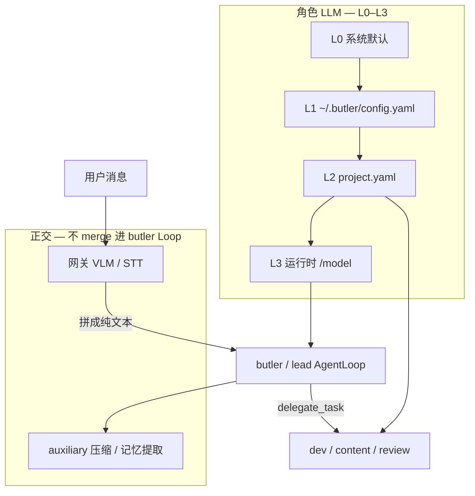

# 分层模型配置：设计 vs 实现对照

> **状态**：M2+M3 已实施（2026-05-21）；对照表 + 完善方案  
> **关联**：[`design.md` §3](../design/design.md#三分层模型配置) · [`v4-architecture.md`](v4-architecture.md) · [`wechat-inbound-media.md`](wechat-inbound-media.md)

---

## 1. 为什么要单独写这份文档

2026-05-21 微信识图验收时，开发代理按 `project.yaml` 的 `dev_agent` 查「多模态」，结论偏了：**厂长主对话与委派 Agent 用的不是同一条模型解析路径**；微信识图又在 **网关第 4 层**，不进 `project.yaml`。

本文固定 **「设计承诺 / 代码事实 / 待补项」**，避免再混淆。

---

## 2. 四层模型栈（建议心智模型）

设计稿原写「三级」；实现上应把 **网关入站辅助** 与 **侧任务 auxiliary** 单独列出，不与「角色 LLM」混在同一 YAML 节点：

```text
L0 系统默认     env 里各 Provider 的 key + MINIMAX_MODEL 等
L1 管家层       ~/.butler/config.yaml → models.{butler,dev_agent,...}
L2 项目层       projects/<P>/project.yaml → models.<role>
L3 运行时       /model、task spawn 的 set_runtime_model_override（进程内）
── 正交层（不按 role 合并进 Agent Loop）──
G  网关入站     BUTLER_WECHAT_* + MiniMax coding_plan/vlm（识图）
A  侧任务       config.yaml → auxiliary.{compression,post_session,...}
```



---

## 3. 对照表：设计 vs 实现

| # | 能力点 | 设计稿（`design.md` §3） | 代码事实（2026-05-21） | 差距 |
|---|--------|--------------------------|------------------------|------|
| 1 | 合并顺序 | 系统 → 管家 → 项目 → 运行时 | `resolve_effective_model` / `get_model_config` 均 L0→L3（含 L2） | **已对齐** |
| 2 | **厂长 / Lead** 主对话 | 应能继承项目层 | `_model_credentials` → `resolve_effective_model(..., project=current)`；`lead` 别名→`butler` | **已实施 M2** |
| 3 | **委派 Agent** | dev/content/review 用项目配置 | `get_project_agent_kwargs()` → `resolve_effective_model(r, project=…)` | **已对齐设计** |
| 4 | `project.yaml` 的 `butler` 键 | 可配 | **读**路径会 merge；`/model save butler` 只写 global YAML | 读写不对称见 §3.1 |
| 5 | `/model` 查看 | 各层有效配置 | `format_effective_models` + 来源标签 | **已实施 M3** |
| 6 | `/model` 写入 | 管家 → `config.yaml`；项目 → `project.yaml` | `save` 持久化；无 `save` 为 runtime 临时 | **已实施 M3** |
| 7 | **auxiliary** | 压缩等用便宜模型 | `auxiliary_client` 读 `config.yaml` 的 `auxiliary.*` | **已实现**（与角色栈正交） |
| 8 | **微信识图** | 辅助模型、不进主 Loop 工具轮 | `minimax_vlm` + `inbound_media`，env 配置 | **已实现**；勿配进 `project.yaml` 的 M2.7 |
| 9 | **工作流逐步** | `workflows/*.yaml` 的 `steps[].model` | `workflow_step_spawn_model_config` | ✅（builtin `novel-factory` review 步已示例） |
| 10 | Provider 凭证 | 各 provider 一套 key | `ButlerSettings.providers` + env | **已实现** |

### 3.1 按「消费方」的有效配置路径

| 消费方 | 解析入口 | L0 | L1 管家 YAML | L2 项目 YAML | L3 runtime | 备注 |
|--------|----------|:--:|:------------:|:------------:|:----------:|------|
| 莎丽 / Lead `AgentLoop` | `_model_credentials("butler")` | ✓ | ✓ | **✓** | ✓ | 微信/CLI 主对话；`lead`→`butler` |
| `delegate_task` → dev/content/review | `get_project_agent_kwargs` | ✓ | ✓ | ✓ | ✓ | 有当前项目时 |
| 无项目时委派 | `get_project_agent_kwargs` | ✓ | ✓ | — | ✓ | 退回全局 |
| 上下文压缩 / post_session | `resolve_auxiliary_config` | — | `auxiliary.*` | — | — | 独立栈 |
| 微信入站识图 | `describe_image` | — | — | — | — | `MINIMAX_BASE_URL` + VLM |
| DAG `task_orchestrator` spawn | `model_config` 字段 | 可覆盖 | 可覆盖 | — | ✓ | 单次任务级 |

### 3.2 与微信识图验收的对应关系

| 用户现象 | 根因层 | 正确排查 |
|----------|--------|----------|
| 「莎丽看不到图」 | G 未跑或失败 | 网关日志 `WeChat vision ok/failed`；`BUTLER_WECHAT_INBOUND_MEDIA`；VLM Host 与 `MINIMAX_BASE_URL` 一致 |
| dev 报告「project 无 vision」 | 查错层 | M2.7 无需 vision；应在 **G 层** 识图后注入文本 |
| 改 `project.yaml` dev 无效（对莎丽） | 查错角色 | 莎丽用 `models.butler`；委派用 `dev_agent` 等 |
| `/model save butler` 未写入 project | 写路径 | butler 持久化到 `~/.butler/config.yaml`；项目 butler 需手改 `project.yaml` |

---

## 4. 代码锚点（便于评审 / 实现）

| 模块 | 路径 |
|------|------|
| 管家层合并 | `butler/config.py` — `ButlerSettings.get_model_config` |
| 项目层合并 | `butler/project.py` — `Project.resolve_model` |
| 管家/委派凭证 | `butler/orchestrator.py` — `_model_credentials` / `get_project_agent_kwargs`（均走 `resolve_effective_model`） |
| 运行时覆盖 | `butler/config.py` — `set_runtime_model_override` |
| `/model` | `butler/model_resolve.py` — **单一解析 + /model** |
| `butler/gateway/message_handler.py`、`butler/main.py` |
| 侧任务 | `butler/transport/auxiliary_client.py` |
| 微信识图 | `butler/gateway/minimax_vlm.py`、`inbound_media.py` |

---

## 5. 设计应如何完善（建议定稿）

### 5.1 原则

1. **单一解析函数**：所有「角色 LLM」都走 `resolve_effective_model(role, *, project, session)`，避免 `_model_credentials` 与 `get_project_agent_kwargs` 两套逻辑。  
2. **正交层不入 role 表**：网关 VLM、auxiliary、未来 OCR 不进 `project.yaml` 的 `dev_agent`，用 `gateway` / `auxiliary` 配置段。  
3. **可见即可配**：`/model` 无参数时展示 **合并后的有效配置**（标注来源：global / project / runtime）。  
4. **写入即持久化**：运行时覆盖分 **临时**（仅本会话）与 **保存**（写 YAML）。

### 5.2 配置面结构（建议 YAML）

**`~/.butler/config.yaml`**

```yaml
default_provider: minimax
models:
  butler: { provider: minimax, model: MiniMax-M2.7 }
  dev_agent: { provider: deepseek, model: deepseek-chat }
auxiliary:
  compression: { provider: deepseek, model: deepseek-chat }
  post_session: { provider: deepseek, model: deepseek-chat }
gateway:   # 新增段（可选，与 env 二选一或 env 覆盖）
  inbound_media:
    vision:
      provider: minimax
      api_host: ""   # 默认跟 MINIMAX_BASE_URL
      endpoint: coding_plan/vlm
    speech:
      prefer_ilink_text: true
      stt_provider: local
```

**`projects/<P>/project.yaml`**

```yaml
models:
  butler: { provider: qwen, model: qwen-max }   # 仅在该项目激活时覆盖莎丽
  dev_agent: { provider: minimax, model: MiniMax-M2.7 }
```

不在 `project.yaml` 为 M2.7 增加 `vision_agent` 除非未来主模型真支持 multimodal chat。

### 5.3 实施分期

| 阶段 | 交付 | 验收 |
|------|------|------|
| **M1 文档** | 本文 + `design.md` §3 修订 + `wechat-inbound-media` 交叉引用 | 团队不再用 project Agent 查识图 |
| **M2 行为对齐** | `butler/model_resolve.py` + `_model_credentials` | ✅ 2026-05-21 |
| **M3 `/model` 增强** | `handle_model_command`：列表 / 临时 / save / reset | ✅ 2026-05-21 |
| **M4 可观测** | `/诊断` → `format_model_diagnostic_lines`（角色 + auxiliary + gateway） | ✅ 2026-05-21 真机通过 |
| **M5** | workflow step `model:` → `AgentSpawnConfig.model_config`（可选覆盖；默认跟项目/MiniMax） | ✅ 2026-05-21 |

**不建议首期做**：给 MiniMax-M2.7 配 multimodal message；用 subprocess 调 MCP 识图（已有 HTTP VLM）。

### 5.4 `/model` 命令行为（建议）

| 命令 | 行为 |
|------|------|
| `/model` | 列出四角色 **effective**（provider/model + 来源标签） |
| `/model butler minimax/MiniMax-M2.7` | 默认：**会话临时** override |
| `/model save butler minimax/MiniMax-M2.7` | 写入 `~/.butler/config.yaml` 并清该 role runtime |
| `/model save dev deepseek/deepseek-chat` | 写入**当前项目** `project.yaml` |
| `/model reset butler` | 清除 runtime；不改 YAML |

微信与 CLI 共用 `message_handler` / `main` 同一套解析（避免双实现）。

### 5.6 工作流逐步模型（M5）

在 `.butler/workflows/<name>.yaml` 或 `project.yaml` 内联 `steps` 中，单步可选：

```yaml
steps:
  - id: read-state
    role: content
    model: deepseek/deepseek-chat
    # 或 model: { provider: deepseek, model: deepseek-chat }
    task: 只读摘要 …
```

- 有 `model`：该步 spawn 时通过 `AgentSpawnConfig.model_config` 临时覆盖该 **role**（仅该 DAG 节点执行期间）。  
- 无 `model`：沿用 `resolve_effective_model(role, project=…)` 项目/管家合并结果。  
- 内置 `novel-factory-status` **默认**与项目一致（MiniMax）；仅当 step 显式写 `model:` 时才用 DeepSeek 等。

### 5.5 与入站媒体的边界

| 能力 | 配置位置 | 进入 orchestrator 的方式 |
|------|----------|---------------------------|
| 识图 | `gateway.inbound_media.vision` 或 env | 前置拼进 **user 文本** |
| iLink 语音转写 | 无配置 | `voice_item.text` → 格式化 |
| silk STT | `gateway...speech` 或 `BUTLER_WECHAT_STT_*` | 前置拼进 user 文本 |
| 莎丽推理 | `models.butler` 合并栈 | 正常 `AgentLoop` |

厂长 **永远** 收到的是纯文本；「看图」是网关代劳，不是 M2.7 原生 vision。

---

## 6. 修订记录

| 日期 | 变更 |
|------|------|
| 2026-05-21 | 初稿：四层栈、设计/实现对照、M1–M5 完善路线、`/model` 与微信识图边界 |
| 2026-05-21 | M5：workflow step `model` 字段与 builtin novel-factory-status deepseek 只读步 |
| 2026-06-09 | 维护收口：`get_model_config` 统一走 `resolve_effective_model`；§3.1 butler L2 ✓；`embedding`/`llm_fallback`/`remote_compact` 配置面见 [`model-config-maintainability-2026-06.md`](../plans/active/model-config-maintainability-2026-06.md) |
