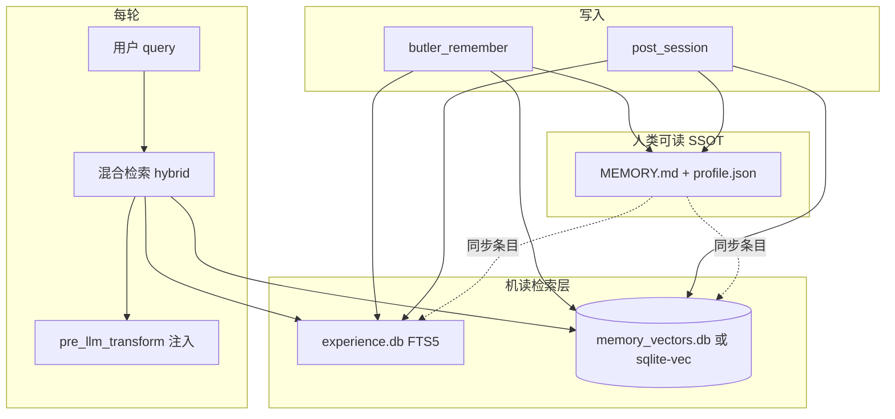

# 记忆模块路线图（含向量语义）

> 版本：2026-05-21 | 个人管家 · 单租户 · 微信主场景  
> 当前实现：`butler/memory/` + `session_lifecycle` + `post_session`（FTS5/BM25，**无 embedding 向量库**）

---

## 1. Hermes 里「记忆」实际分两层

对照 `reference/hermes-agent`（本地只读标本）：

| 层级 | Hermes 做法 | 是否向量语义 |
|------|-------------|--------------|
| **内置** | `MEMORY.md` + `USER.md`，有界文本，会话初注入快照；`memory` 工具 add/replace/remove | **否**（与 Butler `profile.json` 同类） |
| **外部 Memory Provider** | `MemoryManager` 统一：`prefetch` 每轮召回、`sync` 每轮写入、`session end` 提炼；可选 Honcho / Mem0 / Supermemory / OpenViking / RetainDB 等 | **是**（各插件自建 embedding + 语义检索，常 **混合 BM25+向量+重排**） |

要点（来自 `agent/memory_manager.py`、`website/docs/user-guide/features/memory-providers.md`）：

1. **每轮 prefetch**：`prefetch_all(query)` 在用户消息进 LLM 前合并各 provider 召回（非阻塞 `queue_prefetch` 可选）。
2. **上下文围栏**：`<memory-context>` + 清洗，避免模型把召回当成用户新输入。
3. **内置与外部并存**：外部只做「增强召回」，不替代 MEMORY/USER 的可读快照。
4. **实验验证在插件层**：Honcho `honcho_search`、Supermemory `search_mode: hybrid`、RetainDB「Vector + BM25 + Reranking」——说明 Hermes 主仓不把向量写进 core，而是 **可插拔语义层**。

Butler 已对齐 **内置层 + prefetch/sync/post_session**（见 `butler/session_lifecycle.py`、`memory_plugin.py`）；**尚未**做本地向量语义索引。

---

## 2. Butler 现状 vs 设计文档

| 能力 | 当前 v4 | 设计稿（`docs/design/design.md` §11/§13） | v1 存档 |
|------|---------|----------------------------------------|---------|
| Owner 画像 | `profile.json` | ProfileStore | 有 |
| 跨项目经验 | `experience.db` + **FTS5** | ExperienceStore FTS | 有 |
| 项目 MEMORY | `MEMORY.md` + Pending | MarkdownMemory | 有 |
| 项目语义索引 | **未接入** | `SemanticMemoryIndex` + `knowledge.db` | `archive/.../memory_store.py`（**FTS5+三元组，无 embedding**） |
| 每轮召回 | FTS + 全文注入 + 截断 | `get_relevant_context(query)` | 部分 |
| 向量 / 混合检索 | **无** | 文稿写「BM25 语义」实为 FTS | 无 |

结论：你要的 **向量语义记忆** 不能靠把 FTS 改名为 semantic；需要 **新增 embedding 管线**（可参考 Hermes 插件，而非仅 v1 `memory_store`）。

---

## 3. 建议目标架构（Butler 版，不依赖 Hermes 运行时）

原则（沿用 Hermes 实验结论，但 **本地化**）：

- **Markdown/JSON 仍为 SSOT**（微信可读、`/记忆待审` 不变）。
- **向量索引是衍生层**：条目变更时异步/同步 re-embed（可失败降级到 FTS）。
- **召回默认 hybrid**：向量 top-K ∪ FTS top-K → 去重 → 截断 → 注入（对齐 Supermemory/RetainDB 的 hybrid 思路）。
- **conversation 类别永不进向量**（与现网一致）。

---

## 4. 分阶段待办（纳入项目待改进）

### P0 — 方案与接口（1–2 天，无强制外网） ✅ 2026-05-21

- [x] `butler/memory/semantic_index.py`：`upsert`、`delete`、`search`、`hybrid_search`
- [x] `butler/memory/embedding.py`：`local` hashing embedder；`openai`/`minimax` 占位回退
- [x] 索引范围：**experience 非 conversation**（项目 MEMORY bullet 待 P1）
- [x] 文档与 `memory-guide.md` 交叉引用

### P1 — 最小可用（个人管家） — 部分已落地

- [x] 本地 hashing embedding（`BUTLER_SEMANTIC_MEMORY=1`）
- [x] `prefetch_turn_memory` / `butler_recall` hybrid（`SYNC=0` 默认仍 FTS-only）
- [x] 写入：`owner_experience` + post_session experience → upsert 向量
- [x] `/诊断` 向量条数 + model
- [x] 测试 `tests/test_semantic_memory.py`
- [x] 本地 `butler memory-reindex` / `scripts/butler-memory-reindex.sh`
- [ ] `butler_remember` → project_notes 向量索引（reindex 已覆盖 MEMORY 条目）
- [ ] Pending 批准/删除时 invalidate 向量
- [ ] `openai` / `minimax` 真 embedding API

### P2 — 对齐 Hermes 体验

- [ ] **queue_prefetch**（上轮结束后后台 embed+索引，下轮更快）— 参考 `MemoryProvider.queue_prefetch`
- [ ] 注入围栏文案与 Butler 中文场景统一（参考 `sanitize_context` / `<memory-context>` 语义）
- [ ] 可选：恢复 v1 **三元组** 只作展示/图谱，不与向量混为一谈

### P3 — 不做或暂缓

- 不接 Honcho/Mem0 等 **外部** 云记忆为默认（与「个人管家、数据在 `~/.butler`」冲突，仅作可选插件调研）
- 不做全库 360 章正文向量（正文仍 `read_file` / 工厂脚本）

---

## 5. 环境变量（规划，P1 落地时写入 `.env.example`）

| 变量 | 用途 |
|------|------|
| `BUTLER_SEMANTIC_MEMORY` | `1` 启用向量层；`0` 仅 FTS（默认可先 `0`） |
| `BUTLER_EMBEDDING_PROVIDER` | `local` / `openai` / `minimax` |
| `BUTLER_EMBEDDING_MODEL` | 模型 id |
| `BUTLER_VECTOR_HYBRID_WEIGHT` | 向量 vs FTS 融合权重（或 RRF 参数） |
| `BUTLER_EMBEDDING_BATCH_SIZE` | 批量 reindex |

---

## 6. 与自检「待改进」合并后的优先级

| 优先级 | 项 |
|--------|-----|
| **P0** | **向量语义记忆（本路线图 P0→P1）** — 参考 Hermes Memory Provider 的 prefetch+hybrid，Butler 本地化实现 |
| P1 | CLI `/new` 双次 post_session | ✅ 2026-05-21 |
| P1 | `/诊断` 无会话时也展示静态记忆分层 |
| P2 | `facts.json` / auto_extract 接入或文档标明废弃 |
| P2 | 召回质量 fixture 测试（与向量 P1 测试合并） |
| P3 | CLI `/记忆待审` |

---

## 7. 参考文件（Hermes）

| 文件 | 借鉴点 |
|------|--------|
| `reference/hermes-agent/agent/memory_manager.py` | `prefetch_all` / `sync_all` / 单外部 provider |
| `reference/hermes-agent/agent/memory_provider.py` | Provider 接口契约 |
| `reference/hermes-agent/plugins/memory/supermemory/__init__.py` | hybrid search、session ingest、围栏 |
| `reference/hermes-agent/plugins/memory/retaindb/README.md` | Vector + BM25 + Reranking |
| `reference/hermes-agent/website/docs/user-guide/features/memory.md` | 内置 MEMORY/USER 边界 |
| `archive/butler-v1/butler/storage/memory_store.py` | FTS5 + triplets（**非向量**，仅结构参考） |

---

## 8. 验收标准（P1 完成时）

1. 用户 paraphrase 询问（未出现原词）仍能 `butler_recall` 或 prefetch 命中已写入经验。
2. `BUTLER_SEMANTIC_MEMORY=0` 时行为与当前 **96 条** 记忆测试一致（无回归）。
3. 微信 `/诊断` 可看到向量层统计；`MEMORY.md` 仍为审批与人工阅读入口。
