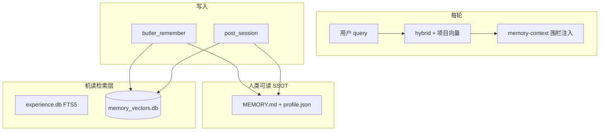

# 记忆模块路线图（含向量语义）

> 版本：2026-05-22 | 个人管家 · 单租户 · 微信主场景  
> 当前实现：`butler/memory/` + `session_lifecycle` + `post_session`（FTS5 + 可选本地向量 hybrid）

---

## 1. Hermes 里「记忆」实际分两层

对照 `reference/hermes-agent`（本地只读标本）：

| 层级 | Hermes 做法 | 是否向量语义 |
|------|-------------|--------------|
| **内置** | `MEMORY.md` + `USER.md`，有界文本，会话初注入快照；`memory` 工具 add/replace/remove | **否**（与 Butler `profile.json` 同类） |
| **外部 Memory Provider** | `MemoryManager` 统一：`prefetch` 每轮召回、`sync` 每轮写入、`session end` 提炼；可选 Honcho / Mem0 / Supermemory 等 | **是**（各插件 embedding + 混合检索） |

Butler 已对齐 **内置层 + prefetch/sync/post_session**；**P0/P1 向量层**已本地化（`memory_vectors.db`，默认 hashing，无云存储）。

---

## 2. Butler 现状 vs 设计文档

| 能力 | 当前 v4（2026-05-22） | 设计稿（`docs/design/design.md` §11/§13） |
|------|----------------------|----------------------------------------|
| Owner 画像 | `profile.json` | ProfileStore ✅ |
| 跨项目经验 | `experience.db` + **FTS5**；可选向量 hybrid | ExperienceStore ✅ |
| 项目 MEMORY | `MEMORY.md` + Pending + 微信/CLI 待审命令 | MarkdownMemory ✅ |
| 项目语义索引 | `memory_vectors.db`；`butler_remember` / 批准 / reindex 同步 | SemanticMemoryIndex ✅ |
| 每轮召回 | experience hybrid + **项目 MEMORY query 向量预取** + 围栏注入 | get_relevant_context ✅ 部分 |
| 向量 / 混合检索 | `BUTLER_SEMANTIC_MEMORY=1` 启用；`=0` 仅 FTS | 规划中 BM25+向量 ✅ P1 |
| queue_prefetch | `BUTLER_QUEUE_PREFETCH=1` 上轮结束后后台 warm 缓存 | Hermes 可选 ✅ P2 |
| 机读 facts | `facts.json` 切换项目/reindex 刷新；预取 + `butler_recall` scope=project | knowledge.db 未接 |

---

## 3. 目标架构（Butler 版）

原则：

- **Markdown/JSON 仍为 SSOT**（微信可读、`/记忆待审` 不变）。
- **向量索引是衍生层**；失败降级 FTS。
- **conversation 永不进向量**。

---

## 4. 分阶段待办

### P0 — 方案与接口 ✅ 2026-05-21

- [x] `semantic_index.py`、`embedding.py`（local + openai/minimax 回退）
- [x] 文档与 `memory-guide.md`

### P1 — 最小可用 ✅ 2026-05-22

- [x] hashing hybrid、`prefetch` / `butler_recall`
- [x] `butler_remember` / Pending 批准 → 向量
- [x] `memory-reindex`、`/诊断` 无会话分层
- [x] CLI `/new` 双次 post_session 修复

### P2 — 对齐 Hermes 体验（本轮）

- [x] **项目 MEMORY query 对齐预取**（`search_project_memory_vectors` + `BUTLER_PREFETCH_PROJECT_HITS`）
- [x] **记忆围栏**（`<memory-context>` + 中文说明，防误读为用户指令）
- [x] **queue_prefetch**（`BUTLER_QUEUE_PREFETCH=1`，上轮结束后后台 warm，同 query 命中缓存）
- [x] **CLI `/记忆待审` / `/批准记忆`**（复用 gateway `memory_commands`）
- [x] **`facts.json` / auto_extract** 切换项目 + reindex 刷新；预取 + recall scope=project
- [x] 召回质量 fixture 测试（`tests/fixtures/memory_recall/cases.json`）
- [ ] 可选：v1 三元组仅展示用

### P3 — 不做或暂缓

- 不接 Honcho/Mem0 等为默认
- 不做全书正文向量
- Owner 画像向量索引（可选，低优先）

---

## 5. 环境变量

| 变量 | 用途 |
|------|------|
| `BUTLER_SEMANTIC_MEMORY` | `1` 启用向量；`0` 仅 FTS |
| `BUTLER_EMBEDDING_PROVIDER` | `local` / `openai` / `minimax` |
| `BUTLER_EMBEDDING_MODEL` | 模型 id |
| `BUTLER_VECTOR_HYBRID_WEIGHT` | hybrid 向量权重 |
| `BUTLER_PREFETCH_PROJECT_HITS` | 项目 MEMORY 向量预取条数（默认 5） |
| `BUTLER_QUEUE_PREFETCH` | `1` 启用上轮结束后后台 warm |
| `BUTLER_PREFETCH_CACHE_TTL` | warm 缓存秒数（默认 90） |
| `BUTLER_PREFETCH_FACTS_MAX_CHARS` | facts 预取块上限（默认 400） |

按角色收紧预取（代码内置，无需 env）：`lead` 偏 Architecture/Decisions/Notes；`content` 偏 Notes/Patterns；`dev` 含 API。query 命中后按 section 过滤；fallback 块长度 lead 800 / content 900 / dev 1200 字符。

---

## 6. 合并待改进清单

| 优先级 | 项 | 状态 |
|--------|-----|------|
| P0→P1 | 向量语义记忆本地化 | ✅ |
| P1 | `/诊断` 无会话静态分层 | ✅ |
| P1 | CLI `/new` 双次提炼 | ✅ |
| P2 | 项目 MEMORY query 预取 | ✅ |
| P2 | 记忆围栏 | ✅ |
| P2 | queue_prefetch | ✅（需 env 开启） |
| P2 | CLI 记忆待审 | ✅ |
| P2 | facts.json 预取 + recall | ✅ |
| P2 | 召回 fixture 测试 | ✅ |
| P2 | Pending 拒绝 + 向量清理 | ✅ |
| P2 | MEMORY remove/replace 向量同步 | ✅ |
| P2 | 项目预取关键词 fallback | ✅ |
| P2 | /诊断 预取缓存命中 | ✅ |
| P2 | post_session → 项目 MEMORY 向量同步 | ✅ |
| P3 | 外部云记忆默认接入 | 不做 |

---

## 7. 验收标准（P1，已满足）

1. paraphrase 可经 `butler_recall` 或 prefetch 命中已写入经验/项目记忆。
2. `BUTLER_SEMANTIC_MEMORY=0` 无回归。
3. `/诊断` 可见向量统计；`MEMORY.md` 仍为审批入口。

**灵文1号试点微信验收（2026-05-21）**：M1 `/诊断`（4 MEMORY / 4 向量）、M2 paraphrase → 2026-05-22 **通过**。记录见 `projects/LingWen1/docs/pilot-log.md`、`memory-guide.md`。

---

## 8. 参考文件

见历史版本 §7；Hermes `memory_manager.py`、`plugins/memory/supermemory` 仍作只读对照。
