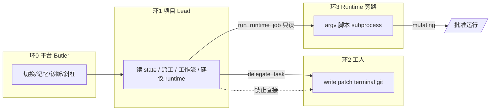

# 项目层微信化规划（单项目打磨 → 多项目）

> **状态**：规划稿（2026-05-22）  
> **目标**：在微信上完成项目的**开发、测试、运行**；当前以 **灵文1号** 打磨单项目闭环，成熟后再扩展多项目。  
> **关联**：[`project-lead-decision.md`](project-lead-decision.md)、[`dev-ops-tools-design.md`](dev-ops-tools-design.md)、[`project-runtime-automation.md`](project-runtime-automation.md)

---

## 1. 产品目标与边界

### 1.1 目标陈述

| 层级 | 用户看到什么 | 系统做什么 |
|------|--------------|------------|
| **平台** | 一个微信 Bot（莎丽） | 鉴权、记忆、切换、斜杠命令、安全沙箱 |
| **项目** | `/切换 灵文1号` 后进入「厂长模式」 | Lead 统筹：读状态、派工、触发短工作流 / runtime 只读任务 |
| **执行** | 「交给开发代理改…」「运行一致性检查」 | 工人改代码；runtime 跑脚本；**不是** Lead 亲自改盘 |

### 1.2 当前基线（代码事实）

- 项目 SSOT：`projects/<目录>/project.yaml`，由 `ProjectManager` 扫描 `BUTLER_PROJECTS_DIR`。
- 新建：`butler create <名> --type software` → 空目录 + 默认 tools 列表（**仅 CLI**，微信尚无「新建项目」）。
- 灵文1号：属 **迁入型** 项目（目录 `LingWen1`，显示名 `灵文1号`），含 `novel-factory/`、`runtime/jobs.yaml`、Lead Skill。
- 对话引擎：`BUTLER_LEAD_PROJECTS` / 默认 `灵文1号` → `gateway_loop_role=lead`（`butler/project_lead.py`）。
- 三条执行通道并存（见 §4）。

### 1.3 分期策略

```text
P0  单项目（灵文1号）  → 完结态/新书态话术 + 开发测试运行闭环验收
P1  项目接入规范      → 来源分类、导入/体检、project.yaml 模板
P2  能力包与边界硬化  → archetype、工具/通道矩阵、微信命令
P3  多项目            → 已有 chat 级绑定 + DemoPilot；补全发现/隔离/默认项
```

---

## 2. 项目来源分类（回答「不同情况怎么规划」）

四种**来源原型（Provenance）**，接入时走同一套「注册流水线」，但**配置包**不同。

| 原型 | 示例 | 特征 | Butler 侧重点 |
|------|------|------|----------------|
| **A. 原生新建** | `butler create 我的App` | 空仓库或最小骨架 | 默认 `software-dev` 能力包；无 domain Skill |
| **B. Git 导入** | `git clone` 后登记 | 已有代码树、可能有 CI/README | **导入体检** + 生成/合并 `project.yaml`；不自动改上游 |
| **C. 迁入/快照** | 灵文1号、novel-factory 完结态 | 大目录、领域脚本、历史 state | **领域能力包**（如 `novel-factory`）+ Lead Skill；区分完结/活跃 |
| **D. 外挂运行时** | 本机已跑 Claude Code/Cursor | Butler **不替代** 该 IDE/Agent | 只读绑定路径 + 可选「同步状态」；改代码仍走 Butler 委派或人工 |

### 2.1 原生新建（A）

**适用**：微信里说「新建一个软件项目」。

**规划**：

1. 在 `projects/<slug>/` 创建目录（slug 建议 ASCII，**显示名**放 `project.yaml.name` 中文）。
2. 写入 `project.yaml`：`type: software`、`tools` 默认开发集、`workflows: []`。
3. 初始化 `.butler/memory/MEMORY.md` 空模板。
4. `memory-reindex`；可选 `BUTLER_DEFAULT_PROJECT` 不自动改。

**缺口**：微信 `/项目 新建` 未实现 → P1。

### 2.2 Git 导入（B）

**适用**：从 GitHub 拉下来的现成仓库。

**规划流水线**：

```text
clone/fetch（人工或脚本）
  → butler project inspect <dir>   # 拟新增：检测语言、测试命令、危险路径
  → butler project register        # 生成 project.yaml，不覆盖已有 README
  → 可选：登记 runtime/jobs.yaml（若发现 Makefile/pytest 脚本）
  → reindex
  → 微信 /切换 + /诊断
```

**规则**：

- Butler **不**自动 `git pull` / `push`（与 dev-ops 非目标一致）。
- `workspace` 必须在 `BUTLER_TOOL_SAFE_ROOT` 之下或显式批准路径。
- 默认 **不**启用 Lead，除非 `project.yaml` 声明 `lead: true` 并配 Skill。

### 2.3 迁入型（C）— 灵文1号当前态

**适用**：从别处理论/生产环境拷贝过来的完整工作区。

**规划**：

| 维度 | 灵文1号做法 |
|------|-------------|
| 领域真相源 | `novel-factory/workflow_state.json` + 脚本树 |
| 运营态 | **PHASE_COMPLETE** → Lead 话术走「维护/巡检/新书」分支，不走「推进 STEP_n」 |
| 配置 | `type: content`、`workflows: novel-factory*`、`runtime/jobs.yaml`、`lingwen-project-lead` Skill |
| 记忆 | 项目 MEMORY + 向量；**禁止**整份 state 入库 |

**缺口**：完结态 vs 新书态在 Skill 里仅一句提示 → P0 需扩写（见 §6）。

### 2.4 外挂运行时（D）

**适用**：用户说「我已在 Claude Code 里开着这个项目」。

**规划原则**：

- Butler 定位为 **协调与通知**，不抢 IDE 会话。
- 允许：绑定同一 `workspace` 路径到 `project.yaml`；Lead **只读**扫描 README、git status（经委派 dev）、runtime 跑测试。
- 禁止：假设 Butler 能控制 Claude Code 进程；不在 prompt 里要求「替 CC 继续改」。

**可选远期**：只读 MCP/文件监视同步摘要 → **非 P0**。

---

## 3. 项目如何接入系统（统一注册模型）

### 3.1 最小接入契约（必须具备）

|  artifact | 作用 |
|-----------|------|
| `project.yaml` | 名称、type、tools、workflows、models、tenant |
| 可解析的 `workspace` 目录 | 工具 path_safety 的根 |
| 目录在 `BUTLER_PROJECTS_DIR` 下 | `ProjectManager` 能扫描到 |

### 3.2 推荐接入契约（具备更好微信体验）

| artifact | 作用 |
|-----------|------|
| `.butler/memory/MEMORY.md` | 项目记忆 SSOT |
| `skills/<project>-*.md` 或租户 skills | Lead/管家领域提示 |
| `runtime/jobs.yaml` | 测试/巡检/构建的**可重复**入口（微信 `/运行`） |
| `docs/pilot-setup.md` | 给人和 Agent 的「运营态说明」 |

### 3.3 注册流水线（建议固化为命令）

| 步骤 | CLI（已有/拟增） | 微信（拟增） |
|------|------------------|--------------|
| 发现 | `butler projects` | `/项目` 列表 |
| 体检 | `butler project preflight`（拟增） | `/项目 体检` |
| 注册 | 手写或 `butler project register` | `/项目 绑定 <路径>`（仅 Owner） |
| 激活 | `butler create` / 复制模板 | `/项目 新建` |
| 切换 | — | `/切换 <名>`（已有） |
| 向量 | `memory-reindex --project` | 运维脚本 / Lead 建议 |

### 3.4 `project.yaml` 拟增字段（P1/P2）

```yaml
# 示例：扩展字段（规划，非全部已实现）
name: 灵文1号
type: content                    # software | content | novel-factory | library
archetype: novel-factory-complete  # 能力包 ID，见 §4.2
provenance: migrated               # native | git-import | migrated | attached
lead: true                         # 是否使用 Lead Loop（或沿用 BUTLER_LEAD_PROJECTS）
workspace: projects/LingWen1
lifecycle: complete                # active | complete | archived — 影响 Lead 话术模板
runtime:
  jobs_file: runtime/jobs.yaml
tools: [...]
workflows: [...]
```

**说明**：`workspace` 字段目前多用于展示；实际 workspace 以 `project.yaml` 所在目录为准（`Project.from_yaml`）。

---

## 4. 能力边界与划分（必须做）

### 4.1 三环 + 一条旁路



| 环 | 谁 | 工具/通道 | 硬规则 |
|----|-----|-----------|--------|
| **0 平台** | 莎丽（非 Lead 项目） | 全平台工具 + 跨项目记忆 | 不持项目写权限 |
| **1 Lead** | 厂长 | 只读文件 + `delegate_task` + `run_workflow` + `run_runtime_job`（只读 job） | **禁止** write/patch/terminal（`project_tools.py` 已强制） |
| **2 工人** | dev/content/review | `project.yaml` tools 白名单 | **禁止**再 `delegate_task`；路径限 workspace |
| **3 Runtime** | 系统定时/微信 `/运行` | `jobs.yaml` → shell | mutating 须批准 + `enabled`；与 Agent 工具审计分离 |

**微信网关生产默认值**（已实践）：`terminal=0`、`git_write=0`；开发走 **委派到 dev**，不在 Lead 线程开 shell。

### 4.2 能力包（Archetype）— 避免每个项目手写 YAML

| 能力包 ID | 适用来源 | 默认 tools | 默认 workflows | 默认 runtime jobs | Lead |
|-----------|----------|------------|----------------|-------------------|------|
| `software-dev` | A/B 新建/导入软件 | read/write/patch/terminal/git_* | 空或 `ci-smoke` | 可选 `test`、`lint` | 可选 |
| `novel-factory-active` | C 活跃创作 | 同 software + 只读 factory | `novel-factory-status` | consistency、preflight | **是** |
| `novel-factory-complete` | C 完结（灵文现况） | 同上 | `novel-factory-status` | factory-status、preflight、consistency | **是** |
| `minimal-readonly` | D 外挂/旁观 | read/list/search | 空 | 空 | 否 |

灵文1号应显式标 `archetype: novel-factory-complete` + `lifecycle: complete`（规划字段，落地时写入 `project.yaml` 或 `pilot-setup.md` 引用）。

### 4.3 项目级限制（建议保持/强化）

| 限制项 | 机制 | 说明 |
|--------|------|------|
| 文件系统 | `path_safety` + `BUTLER_TOOL_SAFE_ROOT` | 项目 workspace 须在安全根下 |
| 工具列表 | `project.yaml` → `allowed_tool_names_for_project` | Lead 再子集裁剪 |
| 网络 git | 无 `git push/pull` 工具 | 降低远程破坏面 |
| Shell | argv 白名单 + 默认关闭 | 微信生产关 `BUTLER_ENABLE_TERMINAL` |
| 长脚本 | Runtime `timeout_seconds` + 批准门 | 与对话超时分离 |
| 记忆 | 分层：Owner / Experience / Project | 决策 Pending；禁止 state JSON 入库 |

### 4.4 「开发 / 测试 / 运行」在微信上的映射

| 用户意图 | 推荐通道 | 示例 |
|----------|----------|------|
| **开发**（改代码/docs） | Lead → `delegate_task` → dev/content | 「委派开发代理：只读检查…」「写 docs/…」 |
| **测试**（pytest/脚本） | ① dev 跑 `terminal`（网关开启时）② runtime job `test` ③ 本地 CI | 规划 job：`test-unit` readonly |
| **运行**（巡检/发布/一致性） | runtime readonly job；改盘 `/批准运行` | `/运行 factory-status-daily`、`consistency-weekly` |

避免让 Lead **亲手** `terminal` 跑测试；统一为「派 dev」或「登记 runtime job」。

---

## 5. 灵文1号：单项目打磨清单（P0）

在扩多项目前，建议把 **灵文1号** 做成「项目层样板」。

### 5.1 运营态双剧本（解决 state=COMPLETE 错位）

| 剧本 | 主公意图 | Lead 主路径 |
|------|----------|-------------|
| **维护态**（当前） | 看厂/巡检/预检 | 读 state → `/运行` / `run_runtime_job` → 摘要报告 |
| **新书态**（未来） | 新开一本小说 | 指引 `run_workflow.sh init` + 明确 **不** 自动 25 步；记忆记「新项目立项」 |

落点：`lingwen-project-lead` Skill + `pilot-setup.md` 各一节。

### 5.2 微信验收补项（项目层）

| 项 | 目的 |
|----|------|
| M5 facts 预取 | 项目层「懂仓库结构」 |
| Lead `run_runtime_job` → `publish-preflight` | 「测试/运行」不只 factory-status |
| 委派 dev：pytest 或 `npm test`（只读/短命令） | 「测试」闭环 |
| 可选 mutating 沙箱 | `/批准运行` 走一遍即关 |

### 5.3 工程项（可选）

- `scripts/butler-lingwen-lead-smoke.sh`：Lead 工具集 + workflow-state 只读断言。
- `project.yaml` 增加规划字段 `lifecycle: complete`（文档化即可，解析可后做）。

---

## 6. 多项目（P3 预览，本期不展开）

**已有**：`get_project_name_for_chat`、DemoPilot、`runtime due --all-projects`、每项目独立 session。

**待打磨**：

| 项 | 说明 |
|----|------|
| 默认项目 | `BUTLER_DEFAULT_PROJECT` vs 每 chat 绑定 |
| Lead 项目列表 | 扩展 `BUTLER_LEAD_PROJECTS`，不必硬编码仅灵文 |
| 隔离审计 | `/诊断` 标明当前项目；防止串记忆（已按项目隔离 MEMORY） |
| 能力包选择 | 新建/导入时选 archetype，而非复制灵文整包 |

---

## 7. 建议实施顺序

| 顺序 | 交付 | 预估 |
|------|------|------|
| 1 | 灵文 Skill 维护态/新书态 + M5–M7 微信验收 | 小 |
| 2 | 文档：`project.yaml` 扩展字段草案 + 接入检查表 | 小 |
| 3 | `butler project preflight`（目录检测、缺 project.yaml 提示） | 中 |
| 4 | 能力包模板目录 `docs/templates/project-archetypes/` | 中 |
| 5 | 微信 `/项目 新建` `/项目 体检`（Owner only） | 中 |
| 6 | Git 导入登记流程 + 示例 repo 试点 | 大 |
| 7 | 多项目 Lead 配置化 + 第二项目端到端 | 大 |

---

## 8. 决策记录（待主公确认）

| # | 问题 | 建议 |
|---|------|------|
| D1 | 项目目录名 vs 显示名 | **分离**：目录 ASCII slug，中文放 `name`（灵文已实践） |
| D2 | Claude Code 类外挂 | 只做 **D 型只读绑定**，不做进程控制 |
| D3 | 测试默认通道 | 微信：**runtime readonly job** 优先于开 Lead terminal |
| D4 | 灵文完结后是否改 state | **不改**历史 state；用 `lifecycle: complete` 驱动话术 |
| D5 | 新建项目是否默认 Lead | **否**；仅 `novel-factory*` / 显式 `lead: true` |

---

## 9. 相关文档

- [`projects/README.md`](../../projects/README.md)
- [`projects/LingWen1/docs/pilot-setup.md`](../../projects/LingWen1/docs/pilot-setup.md)
- [`projects/LingWen1/docs/project-lead-scope.md`](../../projects/LingWen1/docs/project-lead-scope.md)
- [`guides/wechat-daily-smoke-checklist.md`](../guides/wechat-daily-smoke-checklist.md)
