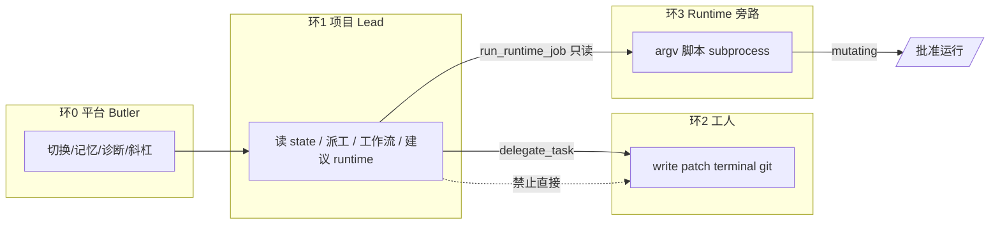

# 项目层微信化规划（单项目打磨 → 多项目）

> **状态**：**已落地归档**（2026-05-22）；新接入见 [`guides/project-onboarding.md`](../guides/project-onboarding.md)。整理见 [`plans/consolidation-2026-05.md`](../plans/archive/consolidation-2026-05.md)。  
> **目标**：在微信上完成项目的**开发、测试、运行**；当前以 **灵文1号** 打磨单项目闭环，成熟后再扩展多项目。  
> **关联**：[`project-lead-decision.md`](project-lead-decision.md)、[`dev-ops-tools-design.md`](dev-ops-tools-design.md)、[`project-runtime-automation.md`](project-runtime-automation.md)

---

## 1. 产品目标与边界

### 1.1 目标陈述

| 层级 | 用户看到什么 | 系统做什么 |
|------|--------------|------------|
| **平台** | 一个微信 Bot（莎丽） | 鉴权、记忆、切换、斜杠命令、安全沙箱 |
| **项目** | `/切换 灵文1号` 后进入「厂长模式」 | Lead 统筹：读状态、派工、触发短工作流 / runtime 只读任务 |
| **执行** | 「交给开发代理改…」「运行一致性检查」 | 工人改代码；runtime 跑脚本；**不是** Lead 亲自改盘 |

### 1.2 当前基线（代码事实）

- 项目 SSOT：`projects/<目录>/project.yaml`，由 `ProjectManager` 扫描 `BUTLER_PROJECTS_DIR`。
- 新建：`butler create` / 微信 Owner **`/项目 新建`** → 空目录 + 默认 tools；`butler project preflight` / **`/项目 体检`** 已落地。
- 灵文1号：属 **迁入型** 项目（目录 `LingWen1`，显示名 `灵文1号`），含 `novel-factory/`、`runtime/jobs.yaml`、Lead Skill。
- 对话引擎：`BUTLER_LEAD_PROJECTS` / 默认 `灵文1号` → `gateway_loop_role=lead`（`butler/project_lead.py`）。
- 三条执行通道并存（见 §4）。

### 1.3 分期策略

```text
P0  单项目（灵文1号）  → 完结态/新书态话术 + 开发测试运行闭环验收
P1  项目接入规范      → 统一登记、preflight、project.yaml 模板（不按有/无源码分档）
P2  能力包与边界硬化  → archetype、工具/通道矩阵、微信命令
P3  多项目            → 已有 chat 级绑定 + DemoPilot；补全发现/隔离/默认项
```

---

## 2. 三层模型：项目 ≠ 执行通道 ≠ 主机工具

**已采纳（2026-05-22）**：Butler 自有项目**不按「有/无源码」分档**；Claude Code 等**不占** `projects/` 槽位。

### 2.1 总览

```text
┌─────────────────────────────────────────────────────────┐
│ 平台（莎丽）  微信 / CLI / 记忆 / 切换 / 安全沙箱          │
└───────────────────────────┬─────────────────────────────┘
                            │
        ┌───────────────────┼───────────────────┐
        ▼                   ▼                   ▼
   【项目层】           【执行通道】         【主机工具 / CLI】
 projects/<id>/      在当前项目内干活      环境已装、非 project.yaml
 project.yaml
 代码 + 文档 + 记忆
```

| 层 | 是什么 | 用户怎么感知 |
|----|--------|--------------|
| **项目** | `BUTLER_PROJECTS_DIR` 下已登记目录 + `project.yaml` | `/切换 灵文1号` |
| **执行通道** | Butler 内：委派、工作流、runtime jobs | 「交给开发代理」「/运行 一致性」 |
| **主机工具** | Claude Code CLI、Cursor、本机未登记目录 | 本机软件；Butler **不**为其建项目类型 |

### 2.2 项目层：统一工作区模型

凡登记进 Butler 的，**默认同时**可有：可执行树（仓库/脚本）、文档（`docs/`）、记忆（`.butler/memory/`）。  
**不按**「有没有源码」切主类——灵文1号、`butler create`、Git 登记进来都是同一物种。

项目差异用**领域与运营态**表达（与现有 `project.yaml` 对齐）：

| 维度 | 字段（已有/拟增） | 例子 |
|------|-------------------|------|
| 领域粗分 | `type` | `content`、`software` |
| 能力包 | `workflows` + 可选 `pack` | `novel-factory`、`novel-factory-status` |
| 运营态 | `status` 或 `lifecycle` | 灵文完结 → `complete`；新书 → `active` |
| 是否厂长 | `lead` / `BUTLER_LEAD_PROJECTS` | 灵文1号 |
| 工具白名单 | `tools` | 按项目裁剪；见 §4 |

**接入来源**（新建 / Git clone / 拷贝迁入）只影响 **preflight 检查清单**，不作为用户可见的「项目种类」：

| 接入方式 | 登记后仍是项目 | preflight 额外项 |
|----------|----------------|------------------|
| `butler create` | ✅ | 空树、补 MEMORY 模板 |
| Git / 拷贝迁入 | ✅ | 检测测试命令、危险路径、是否已有 `project.yaml` |
| 未登记的本机目录 | ❌ 先 `register` | 生成/合并 `project.yaml`，不自动 `git pull` |

### 2.3 执行通道（与项目类型正交）

微信「开发 / 测试 / 运行」= 在**当前项目**上选通道（详见 §4），不是切换「无源码项目」：

| 通道 | 机制 | 典型用途 |
|------|------|----------|
| **委派** | Lead/莎丽 → `delegate_task` → dev/content/review | 改代码、写 docs |
| **工作流** | `run_workflow` / `/工作流` | novel-factory-status 等短流程 |
| **Runtime** | `runtime/jobs.yaml` → `/运行` | pytest、一致性、factory-status |

主路径与 [`design.md`](../design/design.md) 一致：**进程内 AgentLoop**，不依赖 Claude Code 子进程。

### 2.4 主机工具 / CLI（Claude Code 归此层）

| 东西 | 归类 | Butler 策略 |
|------|------|-------------|
| **Claude Code**（环境安装） | 主机级 CLI / 外部执行器 | **不**注册为项目；不 `/切换` 到「CC 项目」 |
| **Cursor / 本机 IDE** | 同上 | Butler 不控 IDE 进程；可选只读扫同一 workspace |
| **受控调用**（远期） | `terminal` 白名单或 `executors:` 配置 | 例如允许 `claude -p …`；审计与沙箱仍走平台规则 |

主公在本机用 CC 改仓库时：Butler 侧仍是**已登记项目**（若路径一致），协调方式为只读状态 + 委派 dev 或 runtime，而非新增项目类。

### 2.5 可选：纯知识仓（非主类）

若极少数目录**永远不跑脚本**，可登记为项目但 **收紧 `tools`**（去掉 terminal/git/patch），不是与灵文并列的顶层「无源码类」。  
产品默认不强调此档；preflight 可提示「未发现可执行入口，是否禁用 dev/runtime」。

### 2.6 登记流水线

```text
选定目录 → preflight（type/pack/lifecycle 建议 + 工具模板）
  → 写入 project.yaml → memory-reindex → /切换
```

---

## 3. 项目如何接入系统（统一注册模型）

### 3.1 最小接入契约（必须具备）

|  artifact | 作用 |
|-----------|------|
| `project.yaml` | 名称、type、tools、workflows、models、tenant |
| 可解析的 `workspace` 目录 | 工具 path_safety 的根 |
| 目录在 `BUTLER_PROJECTS_DIR` 下 | `ProjectManager` 能扫描到 |

### 3.2 推荐接入契约（具备更好微信体验）

| artifact | 作用 |
|-----------|------|
| `.butler/memory/MEMORY.md` | 项目记忆 SSOT |
| `skills/<project>-*.md` 或租户 skills | Lead/管家领域提示 |
| `runtime/jobs.yaml` | 测试/巡检/构建的**可重复**入口（微信 `/运行`） |
| `docs/pilot-setup.md` | 给人和 Agent 的「运营态说明」 |

### 3.3 注册流水线（建议固化为命令）

| 步骤 | CLI（已有/拟增） | 微信（拟增） |
|------|------------------|--------------|
| 发现 | `butler projects` | `/项目` 列表 |
| 体检 | `butler project preflight` ✅ | `/项目 体检`（拟增） |
| 注册 | 手写或 `butler project register` | `/项目 绑定 <路径>`（仅 Owner） |
| 激活 | `butler create` / 复制模板 | `/项目 新建` |
| 切换 | — | `/切换 <名>`（已有） |
| 向量 | `memory-reindex --project` | 运维脚本 / Lead 建议 |

### 3.4 `project.yaml` 拟增字段（P1/P2）

```yaml
# 示例：扩展字段（规划，非全部已实现）
name: 灵文1号
type: content
status: active                     # active | complete | archived
pack: novel-factory                # 可选；与 workflows 一致即可
lead: true                         # 或沿用 BUTLER_LEAD_PROJECTS
# onboarding: import               # 仅运维/preflight，不对主公暴露
workspace: projects/LingWen1
runtime:
  jobs_file: runtime/jobs.yaml
tools: [...]                       # 由 type + pack + lifecycle 选模板，可再裁剪
workflows: [...]
```

**说明**：`workspace` 字段目前多用于展示；实际 workspace 以 `project.yaml` 所在目录为准（`Project.from_yaml`）。

---

## 4. 能力边界与划分（必须做）

### 4.1 三环 + 一条旁路



| 环 | 谁 | 工具/通道 | 硬规则 |
|----|-----|-----------|--------|
| **0 平台** | 莎丽（非 Lead 项目） | 全平台工具 + 跨项目记忆 | 不持项目写权限 |
| **1 Lead** | 厂长 | 只读文件 + `delegate_task` + `run_workflow` + `run_runtime_job`（只读 job） | **禁止** write/patch/terminal（`project_tools.py` 已强制） |
| **2 工人** | dev/content/review | `project.yaml` tools 白名单 | **禁止**再 `delegate_task`；路径限 workspace |
| **3 Runtime** | 系统定时/微信 `/运行` | `jobs.yaml` → shell | mutating 须批准 + `enabled`；与 Agent 工具审计分离 |

**微信网关生产默认值**（已实践）：`terminal=0`、`git_write=0`；开发走 **委派到 dev**，不在 Lead 线程开 shell。

### 4.2 能力模板 — 由 `type` + `pack` + `lifecycle` 派生

| 模板 ID | 条件 | 默认 tools | workflows / runtime | Lead |
|---------|------|------------|---------------------|------|
| `software-default` | `type: software` | read/write/patch/terminal/git_* | 可选 CI smoke job | 若 `lead: true` |
| `novel-factory` | `pack: novel-factory` | 同上（工人可改盘） | `novel-factory-status` + jobs.yaml | **是** |
| `knowledge-light` | 显式收紧 tools | read/search + memory only | 短工作流 | 通常否 |

灵文1号：`type: content` + `pack: novel-factory` + `lifecycle: complete` → 模板 `novel-factory`，话术走维护/巡检（§5）。

### 4.3 项目级限制（建议保持/强化）

| 限制项 | 机制 | 说明 |
|--------|------|------|
| 文件系统 | `path_safety` + `BUTLER_TOOL_SAFE_ROOT` | 项目 workspace 须在安全根下 |
| 工具列表 | `project.yaml` → `allowed_tool_names_for_project` | Lead 再子集裁剪 |
| 网络 git | 无 `git push/pull` 工具 | 降低远程破坏面 |
| Shell | argv 白名单 + 默认关闭 | 微信生产关 `BUTLER_ENABLE_TERMINAL` |
| 长脚本 | Runtime `timeout_seconds` + 批准门 | 与对话超时分离 |
| 记忆 | 分层：Owner / Experience / Project | 决策 Pending；禁止 state JSON 入库 |

### 4.4 「开发 / 测试 / 运行」在微信上的映射

| 用户意图 | 推荐通道 | 示例 |
|----------|----------|------|
| **开发**（改代码/docs） | Lead → `delegate_task` → dev/content | 「委派开发代理：只读检查…」「写 docs/…」 |
| **测试**（pytest/脚本） | ① dev 跑 `terminal`（网关开启时）② runtime job `test` ③ 本地 CI | 规划 job：`test-unit` readonly |
| **运行**（巡检/发布/一致性） | runtime readonly job；改盘 `/批准运行` | `/运行 factory-status-daily`、`consistency-weekly` |

避免让 Lead **亲手** `terminal` 跑测试；统一为「派 dev」或「登记 runtime job」。

---

## 5. 灵文1号：单项目打磨清单（P0）

在扩多项目前，建议把 **灵文1号** 做成「项目层样板」。

### 5.1 运营态双剧本（解决 state=COMPLETE 错位）

| 剧本 | 主公意图 | Lead 主路径 |
|------|----------|-------------|
| **维护态**（当前） | 看厂/巡检/预检 | 读 state → `/运行` / `run_runtime_job` → 摘要报告 |
| **新书态**（未来） | 新开一本小说 | 指引 `run_workflow.sh init` + 明确 **不** 自动 25 步；记忆记「新项目立项」 |

落点：`lingwen-project-lead` Skill + `pilot-setup.md` 各一节。

### 5.2 微信验收补项（项目层）

| 项 | 目的 |
|----|------|
| M5 facts 预取 | 项目层「懂仓库结构」 |
| Lead `run_runtime_job` → `publish-preflight` | 「测试/运行」不只 factory-status |
| 委派 dev：pytest 或 `npm test`（只读/短命令） | 「测试」闭环 |
| 可选 mutating 沙箱 | `/批准运行` 走一遍即关 |

### 5.3 工程项（可选）

- `scripts/butler-lingwen-lead-smoke.sh`：Lead 工具集 + workflow-state 只读断言（已纳入 `butler-pre-release-smoke.sh` 第 7 步）。
- `project.yaml` 增加规划字段 `lifecycle: complete`（文档化即可，解析可后做）。

---

## 6. 多项目（P3 预览，本期不展开）

**已有**：`get_project_name_for_chat`、DemoPilot、`runtime due --all-projects`、每项目独立 session。

**待打磨**：

| 项 | 说明 |
|----|------|
| 默认项目 | `BUTLER_DEFAULT_PROJECT` vs 每 chat 绑定 |
| Lead 项目列表 | 扩展 `BUTLER_LEAD_PROJECTS`，不必硬编码仅灵文 |
| 隔离审计 | `/诊断` 标明当前项目；防止串记忆（已按项目隔离 MEMORY） |
| 能力包选择 | 新建/导入时选 `type`+`pack` 模板，而非复制灵文整包 |

---

## 7. 建议实施顺序

| 顺序 | 交付 | 预估 |
|------|------|------|
| 1 | 灵文 Skill 维护态/新书态 + M5–M7 微信验收 | 小 |
| 2 | 文档：`project.yaml` 扩展字段草案 + 接入检查表 | 小 |
| 3 | `butler project preflight` ✅ | — |
| 4 | 能力包模板目录 `docs/templates/project-archetypes/` ✅ | — |
| 5 | 微信 `/项目 新建` `/项目 体检`（Owner only） | 中 |
| 6 | Git 导入登记流程 + 示例 repo 试点 | 大 |
| 7 | 多项目 Lead 配置化 + 第二项目端到端 | 大 |

---

## 8. 决策记录

| # | 问题 | 结论 |
|---|------|------|
| D1 | 项目目录名 vs 显示名 | **分离**：目录 ASCII slug，中文放 `name`（灵文已实践） |
| D2 | Claude Code / Cursor | **主机工具层**，非项目类型；不控 IDE/CC 进程；可选 terminal 白名单 |
| D3 | 项目是否按有/无源码分档 | **否**；登记项目统一为代码+文档工作区 |
| D4 | 项目分类主维 | **`type` + `pack` + `lifecycle` + `lead`** |
| D5 | 接入来源是否用户可见类 | **否**；仅 preflight / `onboarding` 运维字段 |
| D6 | 测试默认通道 | 微信：**runtime readonly job** 优先于开 Lead terminal |
| D7 | 灵文完结后是否改 state | **不改**历史 state；用 `lifecycle: complete` 驱动话术 |
| D8 | 新建项目是否默认 Lead | **否**；仅 `novel-factory*` / 显式 `lead: true` |

---

## 9. 相关文档

- [`projects/README.md`](../../projects/README.md)
- [`projects/LingWen1/docs/pilot-setup.md`](../../projects/LingWen1/docs/pilot-setup.md)
- [`projects/LingWen1/docs/project-lead-scope.md`](../../projects/LingWen1/docs/project-lead-scope.md)
- [`guides/project-onboarding.md`](../guides/project-onboarding.md)
- [`guides/wechat-daily-smoke-checklist.md`](../guides/wechat-daily-smoke-checklist.md)
