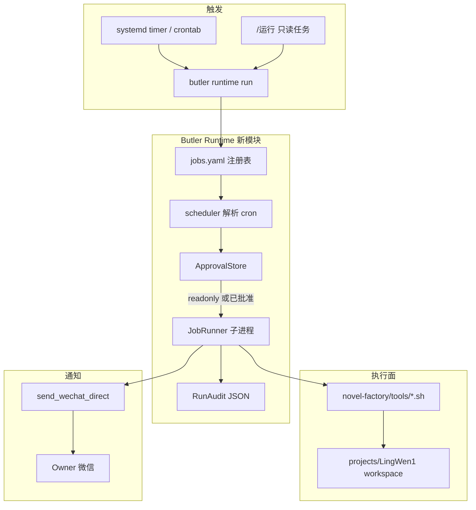

# 项目运行时自动化（阶段 3）设计方案

> **状态**：**3a–3c 已实现**（2026-05-21）— CLI、`/定时` `/运行` `/批准运行`、systemd timer（`install-butler-runtime-timer.sh`）；mutating 默认 `enabled: false`  
> **前置**：项目 Lead 阶段 1–2 已验收（[`project-lead-decision.md`](project-lead-decision.md)）  
> **试点配置**：[`projects/LingWen1/runtime/jobs.yaml`](../../projects/LingWen1/runtime/jobs.yaml)（计划）

---

## 1. 要解决什么

| 痛点（阶段 2 之后仍存在） | 阶段 3 目标 |
|---------------------------|-------------|
| 一致性扫描、状态汇报要**人工记得做** | **定时 / 手动触发** 跑既定脚本 |
| 长脚本占用微信对话或必须在线 | **进程外执行**，结果 **推送微信** |
| 写盘类脚本误触风险大 | **只读默认可自动跑**；**改盘必须批准** |
| 25 步 `run_workflow.sh` 与 Butler 两套体系 | **不替代** 工厂主流程；只包装 **已验收子脚本** |

**不是**：全平台 7×24 无人值守跑完 novel-factory 25 步（仍超出范围，且灵文当前为完结态快照）。

---

## 2. 设计原则

1. **脚本为真相**：执行 `projects/<名>/novel-factory/tools/...` 已有 shell/Python，Butler 只做 **编排、审计、通知**。
2. **只读先行**：第一批 job 仅 `mode: readonly`，不写仓库。
3. **批准闸门**：`mode: mutating` 的 job 调度时只生成 **待批准** 记录，微信确认后才执行。
4. **单租户试点**：通知发到 Owner 微信（`.env` 配置），不广播。
5. **与 Lead 分工**：Lead 管对话决策；Runtime 管 **cron + 脚本 + 推送**（见 [`project-lead-decision.md`](project-lead-decision.md) §2 矩阵）。
6. **可观测**：每次运行落盘 `~/.butler/runtime/runs/<job_id>/<timestamp>.json` + 日志。

---

## 3. 架构总览



**推荐首期不用常驻 daemon**：用 **systemd user timer** 或 crontab 调用 CLI，降低运维面。

---

## 4. 与 Lead / 莎丽的关系

| 场景 | 谁处理 |
|------|--------|
| 「今天一致性怎么样」 | Lead：`read_file` 报告或建议 `/运行 consistency-weekly` |
| 每周一 9:00 自动扫 | Runtime：cron → `butler runtime run consistency-weekly` |
| 「批准跑发布检查」 | 微信：`/批准运行 publish-preflight` → Runtime 执行 |
| 临时写 docs | 仍走 Lead `delegate_task` content |

莎丽/Lead **不嵌入** cron 线程；推送消息文案可带「回复 /批准运行 &lt;id&gt;」。

---

## 5. Job 注册表（`jobs.yaml`）

**路径（入 git）**：`projects/LingWen1/runtime/jobs.yaml`  
**执行 cwd**：`projects/LingWen1/`（= project workspace 根）

### 5.1 字段说明

| 字段 | 必填 | 说明 |
|------|------|------|
| `id` | ✅ | 唯一标识，如 `consistency-weekly` |
| `description` | ✅ | 人类可读说明 |
| `schedule` | 定时必填 | 标准 cron 五段（分 时 日 月 周） |
| `command` | ✅ | 相对 workspace 的命令 argv，如 `["bash","novel-factory/tools/consistency/run_consistency_check.sh"]` |
| `mode` | ✅ | `readonly` \| `mutating` |
| `enabled` | | 默认 `true` |
| `timeout_seconds` | | 默认 `600` |
| `notify` | | `wechat: true`，失败/成功均可选 |
| `approval` | mutating | `required: true`，`expires_hours: 48` |

### 5.2 灵文试点首批 Job（建议）

| id | mode | schedule | command 概要 | 说明 |
|----|------|----------|--------------|------|
| `consistency-weekly` | readonly | `0 9 * * 1` | `run_consistency_check.sh` | 周一生成报告，推送摘要 + 报告路径 |
| `factory-status-daily` | readonly | `0 8 * * *` | 内置：读 `workflow_state.json` 摘要 | 不跑 shell，Python 只读 |
| `workflow-report` | readonly | — | `run_workflow.sh status` | 仅 **手动** / 按需定时关闭 |
| `publish-preflight` | mutating | — | `run_publish.sh`（若确认安全） | **默认 disabled**；启用后须批准 |

> `fix_naming` / `fix_content_integrity` 等 **禁止** 进入自动 job（改盘）。

### 5.3 示例 YAML

```yaml
version: 1
project: 灵文1号
defaults:
  timeout_seconds: 900
  notify_wechat: true
jobs:
  - id: consistency-weekly
    description: 一致性检查（只读报告）
    schedule: "0 9 * * 1"
    mode: readonly
    command:
      - bash
      - novel-factory/tools/consistency/run_consistency_check.sh
    notify:
      on_success: true
      on_failure: true
      max_summary_chars: 1500

  - id: factory-status-daily
    description: 流水线 state 日报
    schedule: "0 8 * * *"
    mode: readonly
    handler: builtin:workflow_state_digest

  - id: publish-preflight
    description: 发布前检查（需批准）
    enabled: false
    mode: mutating
    approval:
      required: true
      expires_hours: 48
    command:
      - bash
      - novel-factory/tools/publish/run_publish.sh
```

---

## 6. 核心模块（代码落点）

| 模块 | 路径 | 职责 |
|------|------|------|
| 配置加载 | `butler/runtime/loader.py` | 读 `projects/*/runtime/jobs.yaml` |
| 调度解析 | `butler/runtime/schedule.py` | cron 匹配「是否该跑」；`next_run` |
| 执行器 | `butler/runtime/runner.py` | `subprocess` + timeout + cwd=workspace；捕获 stdout/stderr |
| 内置 handler | `butler/runtime/builtin_handlers.py` | `workflow_state_digest` 等只读 |
| 批准存储 | `butler/runtime/approval.py` | `~/.butler/runtime/approvals/<job_id>.json` |
| 运行审计 | `butler/runtime/audit.py` | 每次 run 写 JSON + 退出码 |
| 通知 | `butler/runtime/notify.py` | 封装 `send_wechat_direct` |
| CLI | `butler/main.py` | `runtime list \| run \| due \| approve` |
| 微信命令 | `butler/gateway/runtime_commands.py` | `/运行` `/批准运行` `/定时` |
| 包装脚本 | `scripts/butler-runtime-run.sh` | cron 入口：`run --due --project 灵文1号` |
| systemd | `scripts/systemd/butler-runtime-lingwen.timer` | 可选，每 15 分钟扫 due |

---

## 7. 执行流程

### 7.1 只读 Job（自动）

1. Timer 触发：`butler runtime run --due --project 灵文1号`
2. 对每个 `enabled` 且 cron 到点的 job：检查 **无并发**（同 id 锁文件）
3. `JobRunner` 在 workspace 下执行 command
4. 写 audit；`notify.py` 发微信摘要（末 30 行 stdout 或报告 mtime+路径）
5. **不** 修改 approval 状态

### 7.2 改盘 Job（须批准）

1. cron 到点 → 仅发微信：「`publish-preflight` 待批准，24h 内回复 `/批准运行 publish-preflight`」
2. 用户批准 → 写入 `approved_until` → 立即或下次 `run <id>` 执行
3. 执行后通知结果；过期批准自动作废

### 7.3 手动触发

```bash
cd ~/projects/WFXM
PYTHONPATH=. python3 -m butler.main runtime run consistency-weekly --project 灵文1号
```

微信（Lead 会话或任意项目会话）：

- `/定时` — 列出 jobs、下次运行时间、最近 exit code  
- `/运行 consistency-weekly` — 立刻跑只读 job（mutating 仍要批准）  
- `/批准运行 publish-preflight` — 批准并执行  

---

## 8. 环境与安全

| 变量 | 用途 |
|------|------|
| `BUTLER_RUNTIME_ENABLED` | `1` 总开关 |
| `BUTLER_RUNTIME_NOTIFY_WECHAT` | `1` 推送 |
| `BUTLER_OWNER_WECHAT_ID` | 推送目标 chat_id |
| `BUTLER_RUNTIME_MAX_CONCURRENT` | 默认 `1`（同项目） |
| `BUTLER_PROJECTS_DIR` | 已有 |

**安全**

- command **禁止** shell 元字符拼接；仅 argv 列表（`subprocess` 无 `shell=True`）
- job 定义 **不得** 含 `..` 跳出 workspace
- mutating job 默认 `enabled: false`，启用需改 yaml + 文档评审
- 失败重试：同一 job 同日最多自动重试 1 次（可配置）

**回滚**

- 停 timer：`systemctl --user disable butler-runtime-lingwen.timer`
- `BUTLER_RUNTIME_ENABLED=0`

---

## 9. 分阶段实施计划

| 子阶段 | 交付 | 验收 | 风险 |
|--------|------|------|------|
| **3a** | `runner` + `audit` + CLI `runtime run <id>` + 只读 consistency 手动跑 + 微信推送 | 命令行跑通；微信收到摘要 | 低 |
| **3b** | `jobs.yaml` + `run --due` + `factory-status-daily` builtin + systemd timer | 到点自动推送；gateway 不重启也生效 | 低 |
| **3c** | `approval` + `/批准运行` + mutating job 模板（默认 off） | 未批准不执行；批准后仅一次 | 中 |
| **3d** | Lead Skill 补充「何时建议 /运行」；`/诊断` 显示最近 runtime run | 对话与自动化不打架 | 低 |

**建议工期（实现时）**：3a+3b 为 MVP（可运营）；3c 按需开启 mutating。

---

## 10. 验收标准（阶段 3 整体）

- [ ] `consistency-weekly` 定时成功后，Owner 微信收到 **非空摘要** 与报告路径  
- [ ] 故意让脚本失败时，微信收到 **失败告警** 与 audit 路径  
- [ ] `publish-preflight`（或等价 mutating）在 **未批准** 时不改仓库  
- [ ] `/批准运行` 后执行一次，audit 记录 exit code  
- [ ] 网关对话轮次 **不被** runtime 阻塞（独立进程）  
- [ ] `butler runtime list` 显示 next_run / last_status  

---

## 11. 明确不做（首期）

- 25 步 `run_workflow.sh` 全自动无人值守  
- 多项目并行调度中心 UI  
- 运行时改 `MEMORY.md` / 向量（仍走 Lead/post_session）  
- 替代 systemd 的 Butler 内置常驻 scheduler daemon（可二期再评估）

---

## 12. 文档索引

| 文档 | 说明 |
|------|------|
| 本文 | 阶段 3 总设计 |
| [`project-lead-decision.md`](project-lead-decision.md) | 产品主句与阶段 0–2 |
| [`projects/LingWen1/docs/project-lead-scope.md`](../../projects/LingWen1/docs/project-lead-scope.md) | 厂长五条能力 |
| [`projects/LingWen1/runtime/jobs.yaml`](../../projects/LingWen1/runtime/jobs.yaml) | 试点 job 清单（实施时创建） |

---

## 13. 修订记录

| 日期 | 变更 |
|------|------|
| 2026-05-21 | 初稿：架构、job 表、模块落点、3a–3d 分期 |
