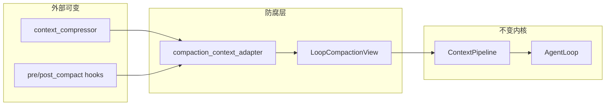

# 上下文与记忆压缩（v4 专篇）

> **状态**：2026-06-15 首版 | **实现 SSOT**：`butler/core/context_*.py`、`butler/session/memory_prefetch.py`  
> **理论 SSOT**：[`v4-memory-theory.md`](v4-memory-theory.md) §2.6 M10、§6 S_f  
> **总览入口**：[`v4-architecture.md`](v4-architecture.md) §上下文经济学

Butler 里常被统称为「记忆压缩」的能力，实际分 **三层**。本文单独细化操作、配置与观测，避免与长期记忆写入（MEMORY.md / experience）混谈。

---

## 1. 三层概念

| 层 | 压什么 | 是否 LLM 摘要 | 主模块 |
|----|--------|---------------|--------|
| **A. 会话上下文压缩** | AgentLoop `messages`（工具输出、历史轮次） | 是（辅助模型） | `context_compressor` → `context_pipeline` |
| **B. 记忆注入裁剪** | 每轮 `<memory-context>` 预取内容 | 否（检索 + 字符上限） | `session/memory_prefetch.py` |
| **C. 长期记忆维护** | Profile / Experience / Facts 存量 | 否（容量有界 + post-session） | `butler_memory`、`fact_extraction` |

**A 与 B 的交界**：压缩后通过 `post_compact_cleanup` 重注入 **Facts 锚点 + prefetch_turn_memory**，把「被摘要掉」的会话决策捞回上下文。

---

## 3. 压缩边界防腐层（ACL）

外部压缩产物（`compress_messages` 的 `summary`、PostCompact hook 的 `additionalContext`）在写入 `ContextPipeline` / Loop 前，经 **CompactionContextAdapter** 归一为不变契约 **`LoopCompactionView`**。



| 入口 | 文件 | 行为 |
|------|------|------|
| 管线压缩 | `context_pipeline.compress_context` | `summary` → ACL → `compression_summary` |
| 专用压缩轮 | `compaction_task.run_compaction_turn` | hook contexts → ACL → `compaction_hook_context` |
| 降级 | 适配异常 | 空/兜底文案 + `compaction_acl_degraded`（不抛到 Loop） |

**ADR**：[`compaction-acl-adr-2026-07.md`](../plans/decisions/compaction-acl-adr-2026-07.md)  
**契约 schema**：`schemas/compaction/loop_compaction_view.v1.json`（`bash scripts/check-schema-drift.sh`）

---

## 4. 会话压缩管线（层 A）

```text
每轮 API 前（context_pipeline）:
  preemptive_compact     → 估算 token，compact / truncate / overflow_fail
  hygiene_preflight      → 85% token 或 400 条消息预检
  tool_prune_policy      → 按工具名分级 micro 剪枝
  compress_messages      → 头尾保护 + 中间段 LLM 摘要
  fact_extraction        → 压缩前抽结构化事实（M10）
  Pre/PostCompact hooks  → Shell + In-Process
  post_compact_cleanup   → MEMORY / tasks / Skill / AGENTS·DESIGN / Facts 锚点

工具迭代中:
  mid_turn_compact       → BUTLER_MID_TURN_COMPACT（单轮多 tool）
  explicit compaction_turn → BUTLER_COMPACTION_EXPLICIT_TURN

API 413 / 溢出:
  reactive_compact       → 丢旧轮再压
```

### 4.1 五阶段摘要（`context_compressor.py`）

1. 工具输出剪枝（无 LLM）
2. Skill rescue（`BUTLER_COMPACT_SKILL_PRESERVE`）
3. 头尾保护（system + 最近 N turn，`turn_compaction.py`）
4. 中间段辅助模型摘要（`auxiliary_client` 或 `BUTLER_REMOTE_COMPACT`）
5. 摘要块前缀 `[CONTEXT COMPACTION — REFERENCE ONLY]`

### 4.2 压缩相位（`compaction_phase.py`）

| 相位 | 典型触发 |
|------|----------|
| `pre_turn` | 网关 hygiene、显式 compaction turn |
| `mid_turn` | 单轮内多轮 tool 后 |
| `reactive` | 413 / overflow |
| `standalone` | 专用压缩轮 |

---

## 5. 记忆注入裁剪（层 B）

每轮 `inject_turn_memory` / `prefetch_turn_memory` 受字符与条数上限约束（见 `docs/config/reference.md` §prefetch）：

| 变量 | 默认 | 作用 |
|------|------|------|
| `BUTLER_PREFETCH_MAX_CHARS` | 4000 | 单层预取字符上限 |
| `BUTLER_PREFETCH_TOTAL_MAX_CHARS` | 12000 | 合计上限 |
| `BUTLER_PREFETCH_EXPERIENCE_HITS` | 5 | experience 条数 |
| `BUTLER_PREFETCH_FACTS_MAX_CHARS` | 2000 | 项目 facts 片段 |

检索结果经 `<memory-context>` 围栏注入，**不 mutate 历史 messages**（MT4）。

---

## 6. 配置决策树

```text
需要关掉所有压缩？
  └─ BUTLER_DISABLE_COMPACT=1 或 BUTLER_DISABLE_AUTO_COMPACT=1

只想关 LLM 摘要、保留工具剪枝？
  └─ BUTLER_DISABLE_AUTO_COMPACT=1

长会话 Gateway 预检太激进/太钝？
  └─ hygiene 阈值在 context_pipeline.hygiene_compress_if_needed（默认 ratio=0.85）
  └─ BUTLER_CONTEXT_COMPACT_RESERVE、BUTLER_CONTEXT_COMPACT_MAX_FAILURES

压缩后决策丢失？
  └─ 确认 BUTLER_FACT_EXTRACTION=1（默认开）
  └─ 查 ~/.butler/session_facts/<session>.json
  └─ /诊断 → 事实锚点 / S_f

预取记忆太长挤占上下文？
  └─ 下调 BUTLER_PREFETCH_*_MAX_CHARS / *_HITS

实验特性（默认关）：
  └─ BUTLER_INLINE_TOOL_COMPRESS=1
  └─ BUTLER_REMOTE_COMPACT=1
```

完整变量表：`docs/config/reference.md`（检索 `COMPACT`、`PREFETCH`、`FACT_EXTRACTION`）。

---

## 7. 观测与验收

### 7.1 微信 `/诊断`

| 字段 | 含义 |
|------|------|
| `压缩:` | `compaction_status.py` 推导的状态 + token 前后；含 hook 上下文字数与 **ACL降级** |
| `compaction_view_version` | 诊断 JSON：`LoopCompactionView.schema_version` |
| `事实锚点:` | 本轮压缩后 store→anchor 条数与 S_f |
| `记忆度量 S_f:` | 会话累计划线（`memory_metrics`） |
| `Context Pipeline:` | 全局 compaction 计数 |
| `Transcript:` | `session_transcript` compact 事件 |

### 7.2 日志关键字

- `Context compressed: N→M msgs`
- `Gateway hygiene compressed`
- `Extracted N new facts`

### 7.3 本地压测

```bash
bash scripts/butler-context-compaction-smoke.sh
bash scripts/check-schema-drift.sh
bash scripts/butler-compaction-audit-sample.sh
PYTHONPATH=. pytest tests/core/test_compaction_context_adapter.py tests/core/test_context_pipeline_acl.py -q
PYTHONPATH=. pytest tests/test_memory_metrics_benchmark.py::TestMemoryBenchmark::test_mb6_fact_compaction -q
```

长会话真机剧本：`docs/guides/context-compaction-smoke-checklist.md`。

### 7.4 指标（L2）

| 指标 | 公式 | 接线 |
|------|------|------|
| **S_f** | anchor 条数 / store 条数 | `record_fact_anchor_metrics` + `/诊断` |
| **P_r / R_r** | 预取精度/召回 | `memory_prefetch._emit_prefetch_metrics`（框架已有） |
| **S_w** | 写入后再召回 | `facade._remember` + write probe |

---

## 8. 已知边界

1. **PII 压缩残留**（G2-01）：`PII_EXCLUSION_RULE` 已注入摘要 prompt；残余为诚实边界。
2. **摘要丢细节**：靠 Facts + post_compact 锚点缓解，非无损。
3. **微信不可见摘要正文**：`/压缩报告` 与 `/诊断` 可见；长摘要仍以 checkpoint 节选为准。
4. **Delegate 回传**：AgentReport 全链路独立；跨轮压缩摘要不走 delegate 卡片。

---

## 9. Backlog（证明期）

| 优先级 | 项 |
|--------|-----|
| P3 | P_r 近似（预取关键词是否出现在模型回复） | **done**（`prefetch_retrieval_metrics.py`） |
| P4 | 微信 `/压缩报告` 或 `/诊断` 子页展示最近摘要节选 | **done**（`info_commands` + ACL 行） |
| P5 | 压缩前后 diff 抽样审计工具 | **done**（`butler-compaction-audit-sample.sh`） |

---

## 10. 相关文件索引

| 路径 | 职责 |
|------|------|
| `butler/contracts/compaction_ports.py` | `LoopCompactionView` 不变契约 |
| `butler/core/compaction_context_adapter.py` | 外部形态 → ACL 适配 |
| `butler/core/context_compressor.py` | LLM 摘要五阶段 |
| `butler/core/context_pipeline.py` | Loop 压缩入口 + hygiene |
| `butler/core/hygiene_preflight.py` | 网关 85% 预检 |
| `butler/core/preemptive_compact.py` | LLM 前估算 |
| `butler/core/reactive_compact.py` | 413 应急 |
| `butler/core/fact_extraction.py` | M10 事实提取 + S_f 记录 |
| `butler/core/post_compact_cleanup.py` | 压缩后锚点 |
| `butler/core/compaction_status.py` | `/诊断` 压缩状态文案 |
| `butler/session/memory_prefetch.py` | 记忆预取与裁剪 |
| `butler/memory/memory_metrics.py` | L2 度量收集 |
