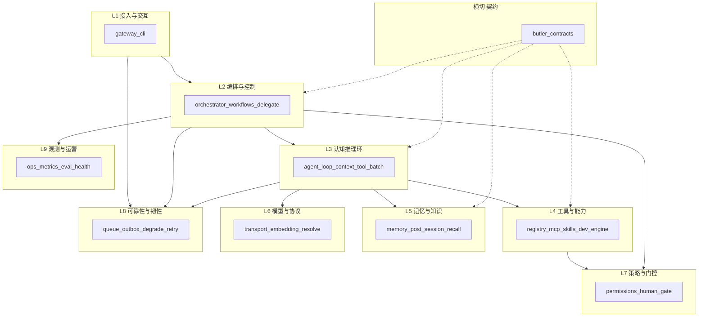

# Butler v4 九层参考模型

> **状态**：2026-07-07  
> **用途**：分模块选型、依赖守门、迭代排期时的**逻辑分层**（非部署拓扑）。  
> **实现 SSOT**：模块清单与数据流见 [`v4-architecture.md`](v4-architecture.md)。  
> **契约 SSOT**：[`butler/contracts/README.md`](../../butler/contracts/README.md)。  
> **产品边界**：多实例 MQ / 全量 MCP Host 等否决项见 [`roadmap-backlog-and-boundaries-2026-05.md`](../plans/decisions/roadmap-backlog-and-boundaries-2026-05.md) §1。

---

## 1. 为何需要九层

Butler v4 是**单进程微信管家 + 自建 Agent Loop**。常见八层划分（架构 / 推理 / 高可用 / 记忆 / 工具 / 模型 / 接入 / 工程化）在本仓库中会出现：

| 问题 | 本模型处理 |
|------|------------|
| 「高可用」暗示多活/容灾 | 改为 **L8 可靠性与韧性**（队列、outbox、降级、failover） |
| 「推理」与「编排」「模型」交叉 | 拆 **L2 编排**、**L3 认知环**、**L6 模型协议** |
| 「架构层」过宽 | 拆 **L2** + 横切 **契约层**（`butler/contracts/`） |
| 权限/观测散落在各目录 | 独立 **L7 策略**、**L9 观测** |
| 「工程化」含 CI 与 DevEngine | **仓级工程化**（scripts/tests）与 **L9 运营** 分列 |

若对外沟通需压缩为 **8 层**：可将 L7 并入 L4、L9 并入 L8；**组件选型**场景建议保留九层。

---

## 2. 总览



**主路径（Owner 微信一轮）**：

```
微信/CLI (L1) → Orchestrator 装配 (L2) → Agent Loop (L3)
  → Transport 调模型 (L6) → Tool Registry 执行 (L4)
  → 记忆预取/写回 (L5) → 策略校验 (L7) → 出站/报告 (L1/L9)
```

---

## 3. 各层定义与代码映射

### L1 — 接入与交互层

| 项 | 说明 |
|----|------|
| **职责** | Owner/运维入口；平台协议适配；入站队列与出站 UX（typing、progress、completion、斜杠命令） |
| **主要路径** | `butler/gateway/`（`message_handler`、`message_queue`、`outbound_bridge`、`completion_notify`、`platforms/wechat_ilink`）、`butler/cli/`、`butler/main.py` |
| **可替换组件** | 微信 iLink 适配器、CLI 交互方式；第二 Channel 须先变更 roadmap 产品边界 |
| **不做** | 业务编排逻辑、LLM 协议细节 |

### L2 — 编排与控制层

| 项 | 说明 |
|----|------|
| **职责** | 会话级编排：Loop 工厂、prompt 组装、Skill 路由；DAG / workflow / delegate 生命周期；多 Agent 并行 |
| **主要路径** | `butler/orchestrator/`、`butler/task_orchestrator.py`、`butler/workflows/`、`butler/runtime/delegate_job.py`、`butler/gateway/session_registry.py`（与 L1 交界）、`butler/human_gate.py`（workflow 续跑） |
| **可替换组件** | 编排策略、workflow 引擎语义（保持 L3 Loop 接口稳定） |
| **边界** | **不**直接发起 HTTP LLM 调用（交给 L3 + L6） |

#### L2 产品域（子域，非独立第十层）

多项目、角色与租户能力挂在 L2，与 L7 分工：**L2 定「谁在用 / 在哪个项目」；L7 定「能做什么」**。

| 项 | 说明 |
|----|------|
| **职责** | Agent 角色（butler/lead/dev/review）、多项目 workspace 切换、项目级工具投影、租户隔离 |
| **主要路径** | `butler/agent_profiles.py`、`butler/orchestrator/`（`project_manager`、prompt 按项目）、`butler/tenant.py`、项目 `project.yaml` / `.butler/` |
| **与 L4** | `delegate_task` 按 role/category 选子 Agent；DevEngine 插件按项目 workspace 隔离 |
| **与 L7** | Lead 禁写工具、workflow 步骤权限、`permissions.yaml` 规则 — 策略在 L7，身份上下文在 L2 |
| **选型注意** | 换「多项目模型」或「角色体系」时改 L2 + L7，勿动 L3 Loop 内核 |

### L3 — 认知推理环

| 项 | 说明 |
|----|------|
| **职责** | 单 Loop 内 think-act-observe：`prepare_messages → LLM → tool_batch`；上下文压缩、hygiene、推理 trace、plan graph |
| **主要路径** | `butler/core/agent_loop*.py`、`context_pipeline*`、`llm_retry*`、`tool_batch*`、`tool_dispatch*`、`reasoning_trace*`、`post_compact_cleanup*`、`streaming_tools`、`parallel_tools`、`execution_context.py` |
| **守门** | `core/` / `tools/` **不得**直 import `gateway.*`（ENG-7）；经 `execution_context` 或 contracts 取 session |
| **可替换组件** | 压缩策略、tool envelope、并行调度策略 |

### L4 — 工具与能力层

| 项 | 说明 |
|----|------|
| **职责** | 工具注册与分发、MCP、Skill 工具桥、工作流步骤能力、DevEngine 插件、可选扩展 |
| **主要路径** | `butler/tools/`、`butler/mcp/`、`butler/skills/`、`butler/dev_engine/`、`butler/workflows/`（执行侧）、`butler/extensions/` |
| **可替换组件** | MCP server 集合、`[vectors]` extra、builtin 工具组合 |
| **边界** | 终端/MCP **审批规则**在 L7；本层负责调用与结果形态 |

### L5 — 记忆与知识层

记忆层按你提出的 **分类 / 存储 / 策略** 三维组织；在 Butler 中还需显式区分 **三类状态**，避免换检索组件时与会话上下文混淆。专篇：[`v4-context-memory-compaction.md`](v4-context-memory-compaction.md)。

#### 三类状态（选型切口）

| 子类 | 代表数据 | 主要路径 | 选型影响 |
|------|----------|----------|----------|
| **会话态** | `transcript.jsonl`、compact/spill 指针、`session_tool_index`、hydration 事实块 | `core/session_transcript.py`、`session_tool_index.py`、`session_hydration.py`；L3 `tool_result_storage` 与 transcript 联动 | 与 L3 压缩/spill 强绑定；**一般不整体替换**为外部 DB |
| **长期记忆** | `MEMORY.md`、项目 markdown pending、experience、coding_experiences、owner 写待审 | `memory/butler_memory.py`、`memory/facade*`、`post_session.py`、`memory/experience_*` | 召回路由、多项目 scope（方向 H）；可换合并策略，**不替换 SSOT 文件格式**除非立项 |
| **派生索引** | `semantic_index`（SQLite FTS+向量）、`observations.db`、可选 Chroma 实验 | `memory/semantic_index*`、`observer_queue` / `observation_store.py` | 可换 Embedding（L6）、FTS/混合策略；写入与 SSOT **非事务** → `butler memory-reindex` |

**与 L3 边界**：`context_pipeline` 压缩的是**会话态**进入 API 的消息；L5 prefetch 注入的是**长期记忆 + 索引命中**，二者经 `memory_bridge` / `session/memory_prefetch` 在 L2 装配。

#### 分类 / 存储 / 策略（三维）

| 维度 | Butler 现状 | 策略要点 |
|------|-------------|----------|
| **分类** | ButlerMemory、ProjectMemory、experience、coding_experiences、observation | 多项目 scope：[`multi-project-memory-scope-2026-06.md`](../plans/decisions/multi-project-memory-scope-2026-06.md) |
| **存储（SSOT）** | `transcript.jsonl`、`MEMORY.md` / 项目 markdown | **事实源**；崩溃可恢复 |
| **派生索引** | `semantic_index`（SQLite FTS+向量）、`observations.db` | 非事务一致 → `butler memory-reindex` |
| **实验** | `memory/vector_store.py`（ChromaDB） | **非生产**；见方向 H |

| 项 | 说明 |
|----|------|
| **主要路径** | `butler/memory/`、`butler/post_session.py`、`butler/session/memory_prefetch*`、`butler/core/memory_source_surface.py` |
| **Backlog（方向 H）** | `coding_experiences` 纳入 `butler_recall`；Observation Store 辅助检索评估 |

### L6 — 模型与协议层

| 项 | 说明 |
|----|------|
| **职责** | LLM Provider 抽象（OpenAI 兼容 / Anthropic）、流式、路由与 failover 配置；Embedding provider 配置 |
| **主要路径** | `butler/transport/`、`butler/model_resolve*.py`、orchestrator 内模型模板；`memory/embedding.py`（实现，配置归属本层） |
| **可替换组件** | 新厂商 Transport、Embedding 后端、语义路由 / PIM |
| **边界** | **不**依赖微信或 gateway 类型 |

### L7 — 策略与门控层

| 项 | 说明 |
|----|------|
| **职责** | 工具与 workflow 步骤权限；终端/MCP 审批；工作区路径安全；Owner 信任面 |
| **主要路径** | `butler/permissions/`、`butler/human_gate.py`、`butler/tools/path_safety*`、`terminal_approval`、`gateway/commands/permission_commands`、`ops/owner_trust_surface.py` |
| **可替换组件** | 审批 UX（微信卡片 vs CLI）、RBAC 规则源（`permissions.yaml`） |
| **Backlog** | workflow + MCP/terminal 审批统一经 `permissions` + contracts `OwnerGate` |

### L8 — 可靠性与韧性层

| 项 | 说明 |
|----|------|
| **职责** | 单进程内可恢复、可降级、可排队：**非**多实例高可用 |
| **主要路径** | `gateway/message_queue`、`durable_outbox`、`ops/degradation_registry*`、`core/llm_retry`（failover）、`core/best_effort`、`ops/retry_buckets`、`core/delegate_semaphore` |
| **产品边界** | 不做入站 WAL、不做 Redis/MQ 多实例（roadmap §1） |

### L9 — 观测与运营层

| 项 | 说明 |
|----|------|
| **职责** | `/诊断`、`butler doctor`、runtime_metrics、eval/B9、G1-04 运营打卡、LangFuse（opt-in）、Owner 可见报告 |
| **主要路径** | `butler/ops/`、`butler/eval_integration/`、`butler/report/`、gateway 诊断聚合、`ops/health_report*` |
| **与 L8 区别** | L8 保**运行**；L9 保**可发现、可度量、可结案** |
| **窗内任务** | G1-04 每周 `butler-ops-cadence.sh --weekly`；07-31 `butler-g1-04-closure-check.sh` |

### 横切 — 契约层

| 项 | 说明 |
|----|------|
| **职责** | 层间稳定 Protocol/Port；破环竖切入口（P3-I 函数内 lazy **1901** / budget **1910**） |
| **路径** | `butler/contracts/` |
| **原则** | 新组件先落 Port，再换实现；见 [`contracts/README.md`](../../butler/contracts/README.md) |

### 仓级工程化（非运行时层）

| 项 | 说明 |
|----|------|
| **职责** | CI 门禁、pytest、deploy profiles、env 文档卫生 |
| **路径** | `scripts/`、`tests/`、`.github/workflows/`、`docs/config/` |
| **与 L9** | `butler eval`、B9 脚本属运营质量，不在 Owner 热路径依赖栈顶 |

---

## 4. 依赖矩阵（允许方向）

行：**可依赖** 列（✓ = 允许向下/侧向调用；— = 禁止或仅经 contracts/execution_context）。

| 调用方 ↓ / 被调方 → | L1 | L2 | L3 | L4 | L5 | L6 | L7 | L8 | L9 | 契约 |
|---------------------|----|----|----|----|----|----|----|----|-----|------|
| L1 接入 | — | ✓ | — | — | — | — | ✓ | ✓ | ✓读 | ✓ |
| L2 编排 | — | 内部 | ✓ | ✓ | ✓ | — | ✓ | ✓ | ✓读 | ✓ |
| L3 认知环 | — | — | 内部 | ✓ | ✓ | ✓ | ✓ | ✓ | ✓读 | ✓ |
| L4 工具 | — | — | — | 内部 | ✓ | — | ✓ | ✓ | ✓读 | ✓ |
| L5 记忆 | — | — | — | — | 内部 | ✓读 | — | ✓ | ✓读 | ✓ |
| L6 模型 | — | — | — | — | — | 内部 | — | ✓ | ✓读 | — |
| L7 策略 | — | — | — | — | — | — | 内部 | — | ✓读 | ✓ |
| L8 韧性 | — | — | — | — | — | — | — | 内部 | ✓读 | — |
| L9 观测 | 读 | 读 | 读 | 读 | 读 | 读 | 读 | 读 | 内部 | 读 |

**硬禁止（与 v4-architecture §依赖分层一致）**：

- L3/L4/L6 **不得** import `butler.gateway.*`（AST 守门 ENG-7）。
- L5 **不得**将 ChromaDB `vector_store` 升为主存储。
- L9 **不得**反向成为 L3 热路径硬依赖（指标采集宜 best-effort）。

---

## 5. 与原八层划分对照

| 原划分 | 本模型 |
|--------|--------|
| 架构层 | L2 编排 + 横切契约 |
| 推理层 | L3 认知推理环 |
| 高可用层 | **L8 可靠性与韧性**（改名） |
| 记忆层 | L5（含分类 / 存储 / 策略三维） |
| 工具层 | L4 + 部分 L7 |
| 模型层 | L6 |
| 接入层 | L1 |
| 工程化层 | 仓级 scripts/tests + L9 运营 + L4 `dev_engine` |

### 对外八层压缩映射

| 对外八层 | 对内九层 | 说明 |
|----------|----------|------|
| 接入层 | L1 | 微信/CLI/出站 |
| 架构/编排层 | L2 + 契约 | 含产品域子域 |
| 推理层 | L3 | 单 Loop 认知环 |
| 工具层 | L4 + L7 | 能力与策略合并对外表述 |
| 记忆层 | L5 | 含三类状态 |
| 模型层 | L6 | Transport + Embedding 配置 |
| 可靠性层（原高可用） | L8 + L9 | 运行韧性 + 观测运营 |
| 工程化层 | 仓级 | scripts/tests/CI，非热路径 |

**对内研发与组件选型：仍推荐九层。**

---

## 6. 组件选型附录（可替换 / 禁止）

换组件前查本表 + [`roadmap-backlog-and-boundaries-2026-05.md`](../plans/decisions/roadmap-backlog-and-boundaries-2026-05.md) §1。

| 层 | 可替换示例 | 禁止或须书面变更边界 |
|----|------------|----------------------|
| **L1** | 微信适配实现细节、CLI 交互、出站卡片文案 | 第二 Channel（当前仅 iLink）；Hermes 子进程网关 |
| **L2** | workflow 步骤语义、DAG 调度策略、prompt 模板组织 | 绕过 Butler 的独立 Agent Host；LangGraph 重塑主 Loop |
| **L3** | 压缩/heuristic、tool envelope、并行批策略、流式预取 | `core` 直引 `gateway.*`（ENG-7） |
| **L4** | MCP server 集合、optional builtin、`[vectors]` extra、DevEngine 插件 | 全量 MCP Host；`dev_engine` 误归入纯 CI |
| **L5** | Embedding 后端（经 L6）、混合召回、子 query 合并、Observation 辅助检索 | ChromaDB **生产主存储**；用 Redis/Postgres 替代 transcript SSOT |
| **L6** | 新厂商 Transport、failover 链、PIM/semantic 路由 | Transport 依赖 gateway 类型 |
| **L7** | 审批 UX、规则文件格式、`permissions.yaml` 扩展 | 跳过门控的静默提权 |
| **L8** | 队列 mode/cap、outbox 策略、降级注册表项、重试 bucket | Redis/MQ **多实例**；入站 WAL |
| **L9** | eval preset、诊断阈值、LangFuse（opt-in） | 观测回调阻塞 L3 主路径 |
| **契约** | 新增 Port、替换 registry 实现 | contracts  import 具体 gateway 实现 |
| **仓级** | 门禁脚本、pytest 分层、deploy profile | — |

**破环竖切（代码）**：优先扩展 [`butler/contracts/`](../../butler/contracts/README.md)；`CYCLE_KEEP` 已清零（2026-07-07 P2f）。

---

## 7. 分模块迭代顺序（2026-07）

| 优先级 | 层 | 工作项 | 文档/门禁 |
|--------|-----|--------|-----------|
| P0 窗内 | L9 | G1-04 每周打卡 → 07-31 结案 | `butler-ops-cadence.sh`、`butler-g1-04-closure-check.sh` |
| P1 文档 | 全层 | 本文 + v4-architecture 互链 | **done** 2026-07-07 |
| P2 契约 | 横切 | 破环：`completion_notify↔outbound_bridge`、`tool_audit↔registry` | **done** 2026-07-07 |
| P2b 契约 | 横切/L3/L9 | `ToolDispatchPort`、`HealthDiagnosticPort` | **done** 2026-07-07 |
| P2c 破环 | L4/L9 | `report_types`、`b9_task_fixtures` | **done** 2026-07-07 |
| P2d 破环 | L1/L9 | `completion_notify→report` 直引；`delegate.task_kind` | **done** 2026-07-07 |
| P2e 破环 | L5/runtime | memory consolidation 直引；delegate 类型拆分 | **done** 2026-07-07 |
| P2f 破环 | L1/L4 | `repo_paths`；`delegate_orchestrator`；`CYCLE_KEEP` 清零 | **done** 2026-07-07 |
| P3 记忆 | L5 | 方向 H Phase 1–4：统一召回 + prefetch coding + doctor 可观测 | **done** 2026-07-07 |
| P4 策略 | L7 | workflow/MCP/terminal 审批收敛 | **done** 2026-07-07（ApprovalStore + WorkflowGateStore + terminal 统一） |
| P5 工程 | 仓级 | P2-F-ops：`*_ops.py` mypy strict（248/390，见 `scripts/p5_ops_strict_modules.txt`） | **进行中** 2026-07-07 wave1 |

---

## 8. 相关文档

| 文档 | 关系 |
|------|------|
| [`v4-architecture.md`](v4-architecture.md) | 模块级实现清单与数据流 |
| [`memory-roadmap.md`](memory-roadmap.md) | L5 能力路线图 |
| [`execution-surface-design.md`](execution-surface-design.md) | L4 Skill/Tool/MCP 执行面 |
| [`permission-gate-stack.md`](permission-gate-stack.md) | L7 门控栈 |
| [`project-optimization-directions-2026-06.md`](../plans/active/project-optimization-directions-2026-06.md) | 优化方向与层映射 |
| [`theory-implementation-gap-register-2026-06.md`](../plans/decisions/theory-implementation-gap-register-2026-06.md) | G1-04 等理论—实现差距 |
