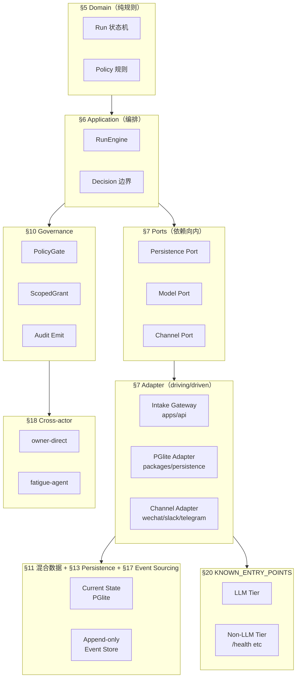
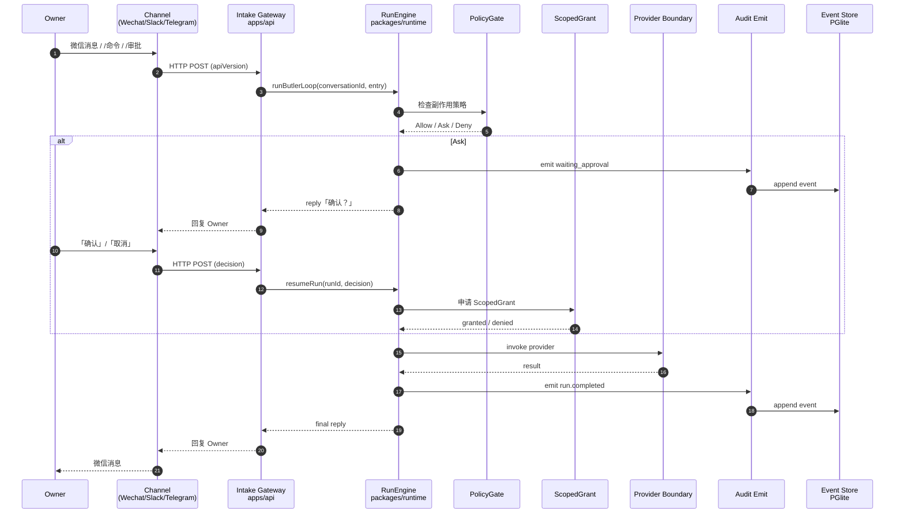
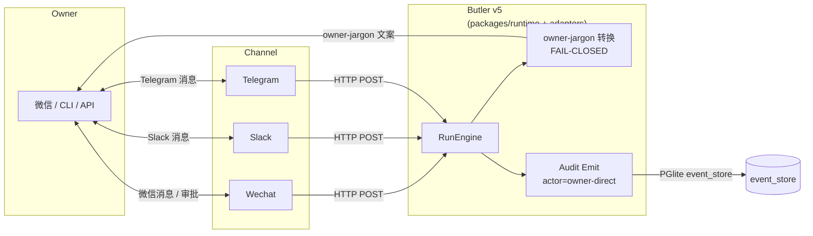
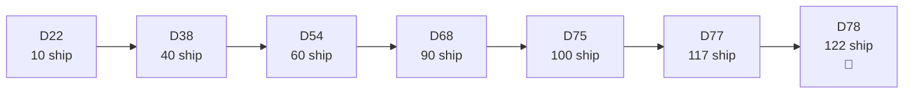

# v5 当前状态 — 视觉架构图（D78 新增）

> **生成日期**: 2026-09-21 | **cycle**: D78 T2 | **关系**:
> - 文字版 → [`v5-production-architecture-2026-08.md`](v5-production-architecture-2026-08.md)（权威源）
> - 目标架构 → [`../../butler-v5/DESIGN.md`](../../butler-v5/DESIGN.md)
> - D-series 路线 → [`../ROADMAP.md`](../ROADMAP.md)

本文件仅补**视觉化**层（3 张 Mermaid 图），不复制文字内容。

---

## 图 1: D-series 架构边界（六边形 + D-series §）

**图 1 说明**：D-series §3-§20 段落映射到六边形分层；§20 KNOWN_ENTRY_POINTS 分 LLM/Non-LLM 2-tier（D77 T5 lesson）。

---

## 图 2: butler-v5 数据流（sequenceDiagram）

**图 2 说明**：真实运行链路（acceptance harness 验证：4 files / 11 pass）；approval 路径走 `ActiveMainRunConflict` 降级（D49 multi-tool chain undo closure）。

---

## 图 3: Owner↔Butler↔Channel 三角

**图 3 说明**：三角关系；channel 错误 → FAIL-CLOSED（D63 T4 + D71 T3 Telegram/Slack allowlist）；owner-jargon 文案 → owner（D70/D73 持续治理）。

---

## 图 4: D-series cycle 节奏（bar）

**图 4 说明**：cycle 17→24 累计 100→122 ship；每 cycle 平均 5-7 ship（D77 首次 7-ship；D78 5-ship）。

---

## 跨文件指针

| 主题 | 读这里 |
|------|--------|
| 文字生产架构 | [`v5-production-architecture-2026-08.md`](v5-production-architecture-2026-08.md) |
| 目标架构 §1-§20 | [`../../butler-v5/DESIGN.md`](../../butler-v5/DESIGN.md) |
| §20 KNOWN_ENTRY_POINTS | [`../../butler-v5/DESIGN.md` §20](../../butler-v5/DESIGN.md) |
| D-series 累计 | [`../ROADMAP.md`](../ROADMAP.md) |
| Owner FAQ | [`../FAQ.md`](../FAQ.md) |

---

**End of diagrams** | D78 T2 | 3 + 1 张图（架构边界 + 数据流 + 三角 + cycle 节奏）
