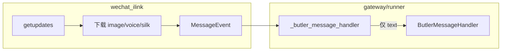

# 微信入站图片 / 语音理解（设计稿）

> **状态**：已实施 P1+P2（2026-05-20）— 识图 MiniMax VLM；语音 iLink 转写 + 本地 STT 备选  
> **场景**：Butler 原生微信网关（iLink）；Owner 个人助手，非多租户  
> **前置**：媒体下载已在 `wechat_ilink.py` 落地；`runner.py` 对纯媒体仍回复占位句

---

## 1. 要解决什么

| 现状 | 目标 |
|------|------|
| 图片/语音已下载到本地缓存路径，但 LLM 只收到「请用文字说明需求」 | 把 **可理解的文字** 注入 `handle_message`，厂长/管家能 **按图/按语音内容** 回答 |
| 语音若 iLink 已带 `voice_item.text` 则部分可用 | **优先用平台转写**；无转写时再 **STT** |
| 无统一配置与降级 | 可关、可换 Provider、失败时 **短提示 + 不阻塞网关** |

**不做（首期）**：入站 **视频** 自动摘要、Outbound 发图能力（已有）、把媒体写入 MEMORY/向量。

---

## 2. 现状（代码事实）



| 环节 | 行为 |
|------|------|
| `_collect_media` | 图片 → `.jpg` 缓存；语音 → `.silk`（若 `voice_item.text` 已有则 **不下载** 文件） |
| `_extract_text` | 文本项 + **`voice_item.text`（iLink 自带转写）** |
| `_butler_message_handler` | `build_inbound_user_text(event)`：MiniMax VLM 识图 + 语音格式化/STT |

结论：**半条链路已通**（语音带 text 时其实已是文字消息）；缺口在 **纯图片** 与 **无转写的 silk**。

---

## 3. 目标用户体验

### 3.1 图片

用户发送：**[图片]** 或 **图片 + 一句 caption**

Bot 侧等价用户消息示例：

```text
[微信图片]
（用户附图说明：帮看下这个报错截图）

--- 图片识别 ---
（OCR/视觉摘要：界面显示 xxx 错误码 …）
```

- 有 caption：caption 保留，识别结果作补充。  
- 识别失败：`--- 图片识别 ---\n（识别失败：未配置 vision / 超时）`，仍允许模型请用户用文字补充。

### 3.2 语音

| 来源 | 注入格式 |
|------|----------|
| iLink `voice_item.text` | `[微信语音转写]\n{text}`（已有 text，**不重复 STT**） |
| 仅 `.silk` 文件 | STT 后 `[微信语音转写]\n{...}`；失败则提示「请打字或重发」 |

### 3.3 与 Lead / 工具的关系

- 入站理解在 **网关层** 完成，走 **辅助模型**（便宜、短），**不**占用厂长主模型一轮工具循环。  
- 理解结果 **仅当轮 user 消息** 使用，默认 **不** 写入 `experience`（与 `BUTLER_SYNC_CONVERSATION_MEMORY=0` 一致）。

---

## 4. 架构（建议实现）

### 4.1 新模块

| 路径 | 职责 |
|------|------|
| `butler/gateway/inbound_media.py` | `build_inbound_user_text(event) -> str`：拼装最终送入 orchestrator 的文本 |
| `butler/gateway/media_providers/`（可选子包） | `vision.py` / `speech.py`：Provider 适配 |

**唯一入口**：在 `runner._butler_message_handler` 中，将

```python
text = (event.text or "").strip()
if not text and event.media_urls:
    text = "（收到媒体消息…）"
```

替换为：

```python
text = build_inbound_user_text(event)
```

### 4.2 处理顺序

```text
1. base_text = event.text.strip()
2. 若存在 image/* 路径 → vision.describe(path, hint=base_text)
3. 若存在 audio/silk：
     a. 若 base_text 非空且像转写 → 格式化为 [微信语音转写]
     b. 否则对 silk 做 STT
4. 合并为单条 user 字符串（带分隔标题，便于模型解析）
5. 超长截断（BUTLER_WECHAT_MEDIA_MAX_CHARS，默认 3000）
```

### 4.3 图片：Vision / OCR 策略

| 优先级 | Provider | 条件 | 说明 |
|--------|----------|------|------|
| 1 | **OpenAI 兼容 Vision** | `OPENAI_API_KEY` 或 `BUTLER_WECHAT_VISION_*` | `gpt-4o-mini` / `gpt-4o`；消息体 `image_url: data:image/jpeg;base64,...` |
| 2 | **MiniMax Token Plan `understand_image`** | `MINIMAX_API_KEY`（Token Plan） | 与 Coding Plan MCP 同能力；网关内 **HTTP 直调**（需对齐官方 REST，或 subprocess 调 `uvx minimax-coding-plan-mcp` **不推荐**） |
| 3 | **本地 OCR（可选二期）** | `BUTLER_WECHAT_OCR=local` + `tesseract` | 仅 OCR，无场景理解；适合纯截图文字 |

**推荐首期**：只做 **OpenAI 兼容 Vision**（项目里常已有 `OPENAI_API_KEY` 或可走 DeepSeek 等 **不支持** 则仅 OpenAI）。MiniMax 主对话模型（M2.7）**不支持** 图文混排，不宜硬塞主模型。

**Prompt 模板（vision）**：

```text
你是微信助手的前置视觉模块。请用中文简要说明图片内容；
若像截图/文档则优先提取可见文字（OCR）；150字以内。
用户附带说明：{caption}
```

### 4.4 语音：STT 策略

| 优先级 | 来源 | 条件 |
|--------|------|------|
| 1 | **iLink 自带** `voice_item.text` | 已在 `_extract_text`；仅加前缀格式化 |
| 2 | **OpenAI Whisper API** | `OPENAI_API_KEY`；上传 `wav`/`mp3` |
| 3 | **本地 faster-whisper** | 可选依赖 `butler-system[voice]`；需 **silk→wav** |

**silk 转码（首期建议）**：

```bash
# 依赖系统 ffmpeg（预检写入 butler-gateway-preflight）
ffmpeg -y -i voice.silk -ar 16000 -ac 1 voice.wav
```

- 无 `ffmpeg`：记录 warn，返回「语音转写不可用，请用文字说明」。  
- **不** 首期引入 `pilk` 等纯 Python 解码（减少依赖面）。

**MiniMax T2A 文档主要为合成；STT 若后续有官方 API 再加 Provider 插槽。**

---

## 5. 配置（`.env`）

| 变量 | 默认 | 说明 |
|------|------|------|
| `BUTLER_WECHAT_INBOUND_MEDIA` | `1` | 总开关 |
| `BUTLER_WECHAT_MEDIA_MAX_CHARS` | `3000` | 注入 orchestrator 上限 |
| `BUTLER_WECHAT_VISION_PROVIDER` | `openai` | `openai` \| `off` |
| `BUTLER_WECHAT_VISION_MODEL` | `gpt-4o-mini` | Vision 模型 |
| `BUTLER_WECHAT_VISION_TIMEOUT` | `45` | 秒 |
| `BUTLER_WECHAT_STT_PROVIDER` | `openai` | `openai` \| `local` \| `off` |
| `BUTLER_WECHAT_STT_MODEL` | `whisper-1` | OpenAI STT |
| `BUTLER_WECHAT_STT_TIMEOUT` | `60` | 秒 |
| `BUTLER_WECHAT_VISION_FALLBACK` | `openai,ocr` | 识图失败链；含 `ocr` 时需 **`pip install -e ".[wechat-ocr]"`** 与系统 **tesseract**（`chi_sim` 语言包） |

**OCR 可选依赖**：`pip install -e ".[wechat-ocr]"`（`pytesseract` + `pillow`）。Preflight 在 fallback 含 `ocr` 时会提示缺失。

**与主 LLM 分离**：Vision/STT 在 **网关正交层**（env / 未来 `config.yaml` 的 `gateway` 段），**不**通过 `project.yaml` 的 `dev_agent` 配多模态。角色模型分层见 [`layered-model-config.md`](layered-model-config.md)。

---

## 6. 安全与隐私

- 媒体文件已在 `~/.butler/wechat/media/`（现有缓存）；理解后 **不** 额外外发除 Provider API 外的路径。  
- Vision/STT 请求 **仅 Owner allowlist** 入站（沿用现有 DM 策略）。  
- 日志：只记 `media=1 vision_ok=1 chars=123`，**不** 打 base64 / 全文转写。  
- Provider 失败 **不抛到用户可见栈**，降级为短中文提示。

---

## 7. 分阶段实施

| 阶段 | 交付 | 验收 |
|------|------|------|
| **P1** | `inbound_media.build_inbound_user_text` + OpenAI Vision + 语音格式化（含已有 text） | 发图 → 管家能描述；发语音（带 iLink 转写）→ 能回复内容 |
| **P2** | silk + ffmpeg + OpenAI Whisper | 无转写语音 → 转文字后进对话 |
| **P3** | MiniMax understand_image HTTP（若有稳定 REST）/ 本地 OCR 可选 | 无 OpenAI 时仍可识图 |
| **P4** | `/诊断` 显示上次 vision/stt Provider 与耗时 | ✅ 2026-05-22 `media_telemetry` |

**建议工期**：P1+P2 为微信主场景 MVP（约 1–2 人日）；P3 按需。

---

## 8. 测试

| 类型 | 内容 |
|------|------|
| 单元 | `build_inbound_user_text`：mock vision/stt；纯 text 不变；失败降级 |
| 集成 | 复用 `tests/test_wechat_ilink_media.py` 缓存路径 + mock HTTP |
| 真机 | `wechat-daily-smoke-checklist` 增加：发截图 + 发语音（见下） |

**真机话术（草案）**：

1. 发送一张含文字的截图 +「读一下图里文字」→ 回复应提及图中关键字。  
2. 发送短语音「今天星期几」→ 回复应理解语义（转写或 STT）。

---

## 9. 文档与运维

- 实现后更新 [`guides/wechat-gateway-ops.md`](../guides/wechat-gateway-ops.md)「后续完善项」为已实施条目。  
- Preflight 增加：`ffmpeg`（若 STT P2）、`OPENAI_API_KEY`（若启用 vision/stt）。

---

## 10. 修订记录

| 日期 | 变更 |
|------|------|
| 2026-05-21 | 初稿：现状、目标 UX、Provider 策略、分期与配置 |
| 2026-05-20 | 实现 P1+P2：`inbound_media` + MiniMax VLM；语音 iLink + 本地 faster-whisper |
