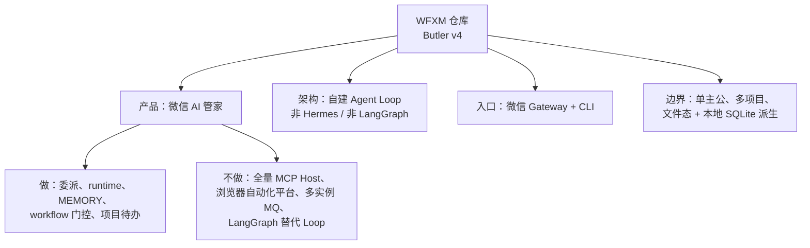
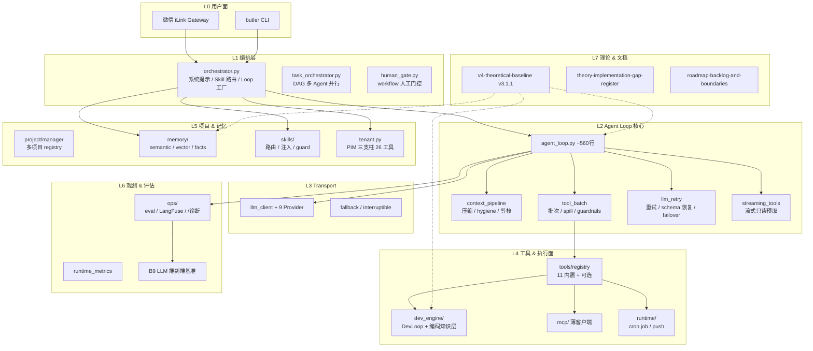
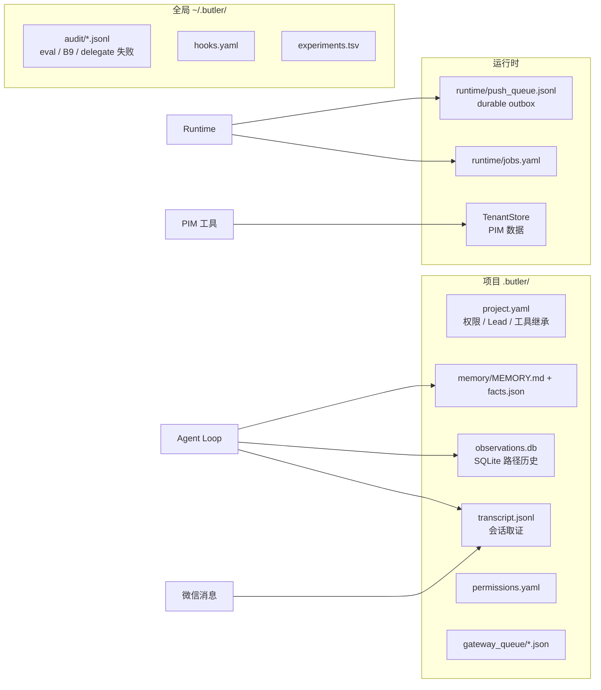
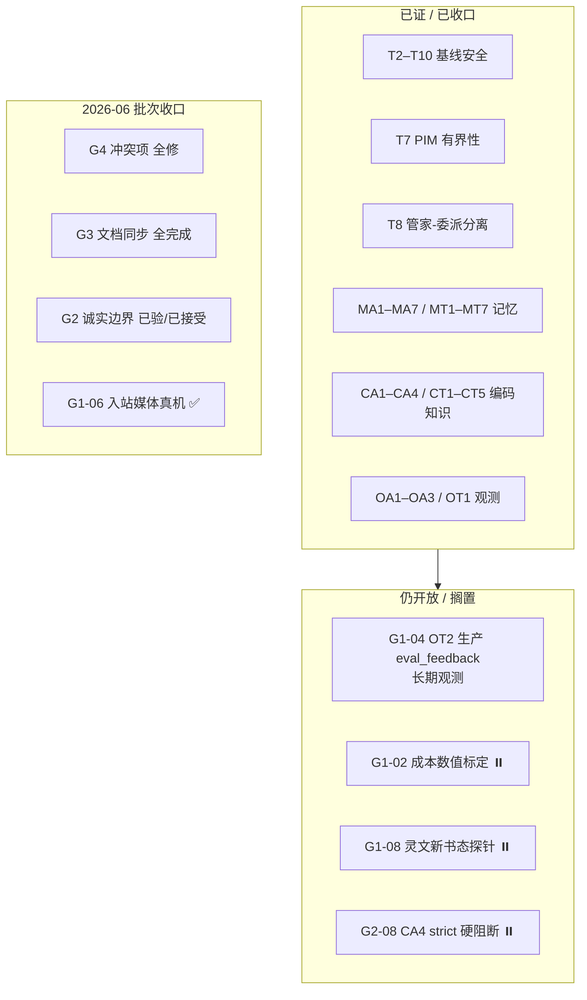
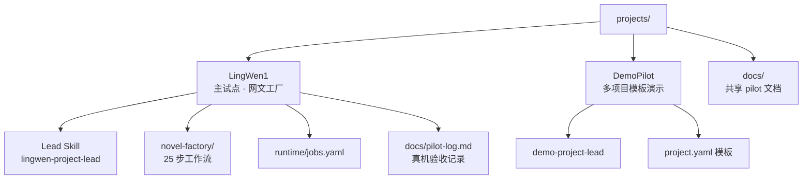

# Butler v4（WFXM）项目知识图谱

> **生成**：2026-06-12  
> **用途**：整体掌握项目现状，规划后续完善方向  
> **事实来源**：代码 + [`../architecture/v4-architecture.md`](../architecture/v4-architecture.md) + 决策文档（非 `docs/history/`）  
> **维护**：架构或主线收口变更时，同步更新本页与 [`capabilities-index-2026-05.md`](./capabilities-index-2026-05.md)

---

## 1. 项目定位（中心节点）



**一句话**：Butler v4 是以**微信为唯一产品入口**的个人 AI 管家，核心是自建的 Agent Loop + 模块化工具/记忆/委派体系，理论驱动（10 定理 + 子理论），工程上已大规模落地，当前重心从「对标收口」转向「运营闭环 + 编码质量（B9）」。

---

## 2. 架构分层知识图谱



### 2.1 请求主路径（简图）

```text
用户 ─→ CLI / 微信（Gateway）
         │
         ▼
   Butler Orchestrator          ← 分层配置、记忆注入、Skill 路由
         │
         ▼
   Butler Agent Loop (自建)     ← agent_loop.py（~560 行）
         │
         ├─→ context_pipeline   ← 压缩 / hygiene / 分级剪枝 / post-compact 锚点
         ├─→ llm_retry          ← LLM 重试、schema 恢复、failover、流式预取
         ├─→ tool_batch         ← 工具批次（spill、prefetch、guardrails）
         ├─→ Transport Layer    ← chat_completions / anthropic
         ├─→ Tool Registry      ← 11 内置 + 可选工具
         ├─→ Task Orchestrator  ← DAG 多 Agent 编排
         └─→ Report Pipeline    ← 结构化报告 + 渐进披露
```

---

## 3. 核心模块实体关系

| 域 | 关键路径 | 职责 | 状态 |
|---|---|---|---|
| **Loop** | `butler/core/agent_loop.py` + 子模块 ~2100 行 | 主循环、上下文、工具批、委派 | ✅ 已落地 |
| **Gateway** | `gateway/message_handler.py`, `message_queue.py`, `outbound_bridge.py` | 微信入站/出站、队列 mode、补充回复 | ✅ 已落地 |
| **Transport** | `butler/transport/*` | 9 厂商 LLM 协议、流式、failover | ✅ 已落地 |
| **工具** | `butler/tools/registry.py`, `builtin_register.py` | 11 内置 + 按 env 可选 | ✅ 已落地 |
| **委派** | `delegate_task`, `task_orchestrator`, `cache_safe_delegate` | 子 Agent、DAG、深度限制 | ✅ 已落地 |
| **记忆** | `memory/vector_store`, `semantic_index`, `fact_extraction` | 双轨 MEMORY + 向量 + fact | ✅ 已落地子集 |
| **PIM** | `tenant.py` + 26 工具 | 联系人/备忘/习惯/提醒/账单 | ✅ 已落地 |
| **DevEngine** | `dev_engine/dev_loop.py`, `coding_knowledge.py` | 4 阶段编码 + 定理/经验库 | ✅ 已落地 |
| **Runtime** | `runtime/task_store`, `builtin_handlers` | cron job、推送、只读/需批准 mutating | ✅ 已落地 |
| **观测** | `ops/eval_*`, `langfuse_tracer`, `eval_diagnostics` | per-turn 评分、硬反馈、B9 看板 | ✅ 已落地 |
| **B9 质量环** | `b9_*`, `llm_delegate_benchmark` | LIVE 委派基准、周循环、生产晋升 | ✅ 活跃演进中 |
| **MCP** | `mcp/manager`, `mcp_self_service` | 薄客户端、opt-in | ✅ 可选 |
| **Workflow** | `workflows/builtin/*.yaml`, `human_gate` | YAML DAG + 微信确认 | ✅ 已落地 |

### 3.1 11 内置工具（始终注册）

| 工具 | 说明 |
|------|------|
| `read_file` / `write_file` / `patch` / `delete_file` | 文件读写与编辑 |
| `terminal` | 受限 argv（须 `BUTLER_ENABLE_TERMINAL=1`） |
| `search_files` / `list_directory` | 搜索与目录 |
| `skills_list` / `skill_view` | Skill 索引与按需加载 |
| `delegate_task` | 委派子 Agent |
| `run_workflow` | DAG 工作流触发 |

可选工具见 [`../architecture/v4-architecture.md`](../architecture/v4-architecture.md) §工具系统。

---

## 4. 数据与持久化图谱



**设计原则**：

- `transcript.jsonl` 是会话 SSOT
- SQLite 仅作派生索引（observations、tail model），**不替换** JSONL 会话库
- 出站可靠性：`durable outbox` + `push_queue.jsonl` 重试（非外部 broker）

---

## 5. 理论—实现映射（成熟度）



| 子理论 | 代码锚点 | 测试守门 | 成熟度 |
|--------|----------|----------|--------|
| 记忆 MA/MT | `memory/*`, `memory_benchmark.py` | 47 tests | T2 生产 |
| 编码 CA/CT | `coding_knowledge.py`, `verify.py` | 99+ tests | CD7 T2；CD0/6/8 T1 |
| DevEngine | `dev_loop.py`, `process_task` | 91+ tests | 管道完整 |
| 观测 L7 | `eval_turn`, `eval_actions`, LangFuse | B1–B8 回归门 | OT1 ✅；OT2 观测中 |
| B9 委派质量 | `llm_delegate_benchmark`, `b9_delegate_gate` | Tier-1 发版门 | **活跃优化** |

**差距登记册 SSOT**：[`../plans/decisions/theory-implementation-gap-register-2026-06.md`](../plans/decisions/theory-implementation-gap-register-2026-06.md)

---

## 6. 能力状态矩阵（规划决策用）

### 6.1 已收口主线（勿再从对照报告复活待办）

| 主线 | 文档 | 守门 |
|------|------|------|
| CC 线束 P0–P4 | [`cc-butler-gap-analysis`](../plans/active/cc-butler-gap-analysis-2026-05.md) | `test_cc_p3_p4_features` |
| 四/五报告 PR | `four/five-reports-capabilities` | 各路线图 §9 |
| 外部 Agent PR-X1–X6 | `external-agent-reports-improvement-roadmap` §10 | `test_external_agent_*` |
| 外部对标 A/B/C | `phase-abc-external-reference` | phase tests |
| 闭环优化 Phase 0–9 | [`post-consolidation-roadmap`](../plans/active/post-consolidation-roadmap-2026-05.md) | gap register + 真机 |

### 6.2 明确不做（roadmap-backlog §1 否决）

- Hermes 单体 Loop / 多平台网关
- LangGraph **替换** agent_loop
- 浏览器 CDP 自动化平台、RAGFlow 全栈
- MCP Host 全家桶、多实例 MQ、入站 WAL
- 每项目独立微信 Bot、7×24 无人值守跑完全厂
- workflow 暂停后自动续跑（维持显式 `/workflow`）
- SQL 消息库替换 `transcript.jsonl`

完整 18+11 项见 [`roadmap-backlog-and-boundaries`](../plans/decisions/roadmap-backlog-and-boundaries-2026-05.md) §1。

### 6.3 可选 Backlog（可单独立项，未承诺排期）

| 优先级建议 | 项 | 来源 |
|-----------|-----|------|
| 低 | PIM Fernet 加密 (`D7`) | 诚实边界 §4 |
| 低 | 识图 P3（MiniMax VLM / 本地 OCR） | 媒体入站 |
| 低 | `terminal` 主机白名单 | ADR 远期 |
| 中 | Observation Store 迁移/诊断命令 | roadmap-backlog §3.2.1 |
| 中 | OpenAPI 声明式 HTTP 工具 | Dify 对标 |
| 中 | OpenCode 暂缓项（LSP、worktree 会话等） | comparison report |
| 按需 | CA4 strict=1 生产硬阻断 | G2-08，待理论分析 |
| 按需 | 全量 RAG ingest 管线 | 已有 search；ingest 另立项 |
| 按需 | 微信真·流式编辑回复 | 依赖 iLink 能力 |

### 6.4 搁置项（产品决策，非 bug）

| ID | 项 | 说明 |
|----|-----|------|
| G1-02 / A5 | 成本模型 vs 账单对照 | 个人助手阶段不做数值标定 |
| G1-08 / B1 | 灵文「新书态」微信探针 | 维护态已验，开新书再验 |

### 6.5 深化边界（已有子集 — 勿报「未实现」）

常见误判与 Butler 替代见 [`roadmap-backlog-and-boundaries`](../plans/decisions/roadmap-backlog-and-boundaries-2026-05.md) §2，例如：

- 轻量 RAG / chunking / semantic_index → **已落地子集**（非 RAGFlow 全栈）
- 薄 MCP + deferred → **已落地**（非 npm 级 MCP Host）
- `query_decompose` 启发式多路召回 → **已落地**（非 LLM 子 query 分解平台）

---

## 7. 运营轨道与推荐完善方向

```mermaid
graph LR
    subgraph Done["✅ 已完成"]
        P09["Phase 0–9 收口"]
        TM["末批真机 A2/G2-02"]
        B9O["B9 O9 基准框架"]
    end

    subgraph Active["🔥 当前活跃"]
        B9W["B9 周循环<br/>LIVE + prod_delta"]
        B9P["生产失败 → B9L_prod 晋升"]
        SWE["SWE-bench 子集 LIVE"]
        OT2["OT2 eval_feedback 观测"]
    end

    subgraph Next["📋 建议后续方向"]
        N1["反向传播闭环<br/>eval → prompt/经验自动回流"]
        N2["B9 Tier-1 通过率提升<br/>oracle curriculum + 经验库"]
        N3["FP-1/2 定理 checker 强化<br/>T02/T07 非 stub"]
        N4["多项目样板复制<br/>DemoPilot → 外部 repo"]
        N5["Observation Store 运维工具"]
    end

    Done --> Active --> Next
```



### 7.1 按价值排序的完善建议

| 序 | 方向 | 理由 | 入口 |
|----|------|------|------|
| **1** | **B9 委派质量持续提升** | 唯一衡量「LLM 真编码能力」的生产指标；已有完整 harness | `scripts/butler-b9-weekly-learning.sh`, [`evaluation-guide.md`](./evaluation-guide.md) |
| **2** | **OT2 闭环观测** | 硬反馈已接；`eval_feedback.jsonl` 窗内积累 | G1-04, `g1_04_observation_window_status` |
| **3** | **经验库 ↔ B9 修学循环** | 闭环规划指出的「梯度未回传」 | `b9_lessons`, `coding_experiences.json` |
| **4** | **定理 checker 硬化** | T02/T07 stub 削弱结构保证 | 根目录 `butler_闭环优化规划_2026-06-09.plan.md` FP-1/FP-2 |
| **5** | **灵文维护态运营** | 单项目样板已收口，日常 smoke + Lead job | `projects/LingWen1/docs/pilot-log.md` |
| **6** | **按需 Backlog** | 加密/OCR/terminal 白名单 — 非 blocking | post-consolidation D7–D9 |

### 7.2 post-consolidation 轨道摘要

| 轨道 | 主题 | 状态 |
|------|------|------|
| A | 运营巩固（推送、媒体、发版节奏） | 真机 ✅；A5 搁置 |
| B | 灵文单项目样板 | B4 ✅；B1 新书态搁置 |
| C | 多项目与接入 | C1–C4 ✅ |
| D | 理论驱动增强（PIM/PII/成本/Token） | D1–D6b ✅；D7–D9 低优先级 |
| D2 | 记忆理论度量 | D2-1–D2-6 ✅ |
| D3 | 编码知识层 | D3-1–D3-11 ✅ |
| O | 观测演化闭环（LangFuse/eval/B9） | O0–O9 ✅ |
| E | 明确不做 | 见 §6.2 |

---

## 8. B9 质量环（当前最活跃工程线）

| 组件 | 路径 / 脚本 | 说明 |
|------|-------------|------|
| 基准入口 | `butler/dev_engine/llm_delegate_benchmark.py` | oracle CI + LIVE delegate |
| LIVE 固定集 | `b9_live_fixed_tasks.py` + `b9_prod_shaped_tasks.py` | 19 项（含 prod-shaped） |
| Tier 门控 | `b9_tiers.py` | Tier-1 发版门；Tier-2 stretch 不阻塞 |
| 委派门控 | `b9_delegate_gate.py` | benchmark 下须 verify 绿 |
| 修学循环 | `b9_lessons.py`, `b9_oracle_curriculum.py` | 失败 upsert / 成功 renew 经验 |
| 生产晋升 | `delegate_failure_b9_promote.py`, `b9_prod_promoted_registry.py` | 审计行 → `B9L_prod_*` |
| 周指标 | `b9_prod_weekly.py` | `prod_delegate_snapshots.jsonl` |
| 发版门 | `scripts/butler-b9-release-gate.sh` | 进 pre-release smoke |
| 周循环 | `scripts/butler-b9-weekly-learning.sh` | Tier-1 LIVE + Tier-2 probe |

详见 [`evaluation-guide.md`](./evaluation-guide.md) §B9 与 [`../architecture/v4-architecture.md`](../architecture/v4-architecture.md) §B9。

---

## 9. 试点项目图谱



---

## 10. 文档体系与 SSOT 索引

### 10.1 文档分层（L0–L5）

| 层级 | 典型路径 | 用途 |
|------|----------|------|
| L0 | `AGENTS.md`, `.cursor/rules/` | Agent 入口 |
| L1 | `docs/architecture/`, `docs/config/` | 实现事实来源 |
| L2 | `docs/plans/decisions/` | 否决 / Backlog / 理论差距 |
| L3 | `docs/guides/`, `docs/ops/` | 能力速查 / 运维 |
| L4 | `docs/plans/*-comparison*`, `*-roadmap*` | 对照归档（正文旧表非待办） |
| L5 | `docs/history/` | **勿作实现依据** |

### 10.2 我想… → 读这里

| 我想… | 读这里 |
|--------|--------|
| 改 Loop/Gateway | [`../architecture/v4-architecture.md`](../architecture/v4-architecture.md) |
| 查 env 默认值 | [`../config/reference.md`](../config/reference.md) + [`.env.example`](../../.env.example) |
| 否决 / Backlog 决策 | [`../plans/decisions/roadmap-backlog-and-boundaries-2026-05.md`](../plans/decisions/roadmap-backlog-and-boundaries-2026-05.md) |
| 理论 vs 实现差距 | [`../plans/decisions/theory-implementation-gap-register-2026-06.md`](../plans/decisions/theory-implementation-gap-register-2026-06.md) |
| 运营与 Phase 规划 | [`../plans/active/post-consolidation-roadmap-2026-05.md`](../plans/active/post-consolidation-roadmap-2026-05.md) |
| 能力总览 | [`capabilities-index-2026-05.md`](./capabilities-index-2026-05.md) |
| 发版 / B9 门控 | [`release-runbook-2026-05.md`](./release-runbook-2026-05.md) |
| 评估与 B9 | [`evaluation-guide.md`](./evaluation-guide.md) |
| **本知识图谱** | 本文 |

### 10.3 新需求决策流（30 秒）

```text
新需求
  ├─ 命中 roadmap-backlog §1 否决？ ──是──► 拒绝或改产品边界
  ├─ 命中 §2 深化边界？ ──是──► 说明已有子集 + 缺口
  ├─ 属 §3 可选 Backlog？ ──是──► 单独立项 + 验收标准
  └─ 否则 ──► 在现有 Loop/Gateway/工具上扩展（见 v4-architecture）
```

---

## 11. 测试与质量守门

改 `butler/core` 或 `butler/gateway` 后建议跑（摘自 `AGENTS.md`）：

```bash
# CC / 指标 / spill
PYTHONPATH=. pytest tests/test_cc_p3_p4_features.py tests/test_runtime_metrics.py \
  tests/test_tool_result_storage.py -q

# gateway / 队列 / workflow
PYTHONPATH=. pytest tests/test_message_queue.py tests/test_gateway_queue_command.py \
  tests/test_p2_workflow_permissions.py tests/test_gateway_handler.py -q

# 编排质量
PYTHONPATH=. pytest tests/test_orchestration_improvements.py -q

# 记忆 / 编码知识 / 工程桥接
PYTHONPATH=. pytest tests/test_premise_memory_theory.py tests/test_memory_metrics_benchmark.py -q
PYTHONPATH=. pytest tests/test_premise_coding_knowledge.py -q
PYTHONPATH=. pytest tests/test_engineering_bridge.py -q

# 五报告
./scripts/butler-five-reports-gate.sh

# 发版
bash scripts/butler-pre-release-smoke.sh   # 含 B9 oracle Tier-1
```

**规模参考**：post-consolidation 记载 ~5040 tests 全绿（2026-06-09 基线）。

---

## 12. 总结：项目当前站位

| 维度 | 结论 |
|------|------|
| **平台成熟度** | v4 架构全面落地；对标主线（CC/四报告/五报告/外部 Agent）已收口 |
| **理论对齐** | G4/G3 全收口；G1 仅 OT2 观测开放；G2 边界已诚实接受 |
| **产品形态** | 微信管家 + 多项目 + Lead 委派 + runtime，非 IDE 替代、非 SaaS |
| **当前瓶颈** | 从「结构保证」转向「LLM 委派质量 + eval 闭环回流」 |
| **最活跃工程线** | B9 基准 / 周循环 / 生产晋升 / SWE 子集 |
| **规划原则** | 新需求先走 roadmap-backlog 决策流（§1 否决 → §2 边界 → §3 Backlog） |

---

## 变更记录

| 日期 | 说明 |
|------|------|
| 2026-06-12 | 初版：由 Agent 会话分析整理，供规划与 onboarding 使用 |
