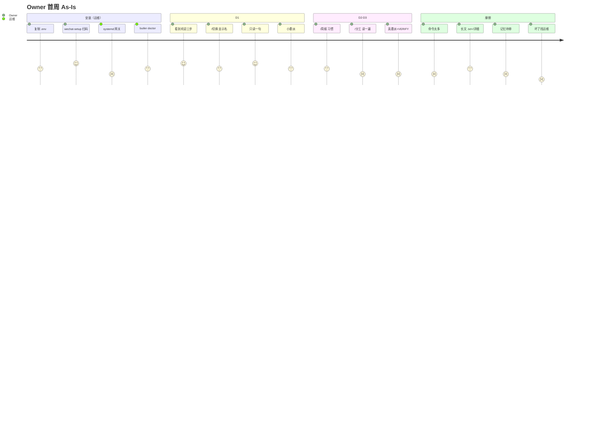
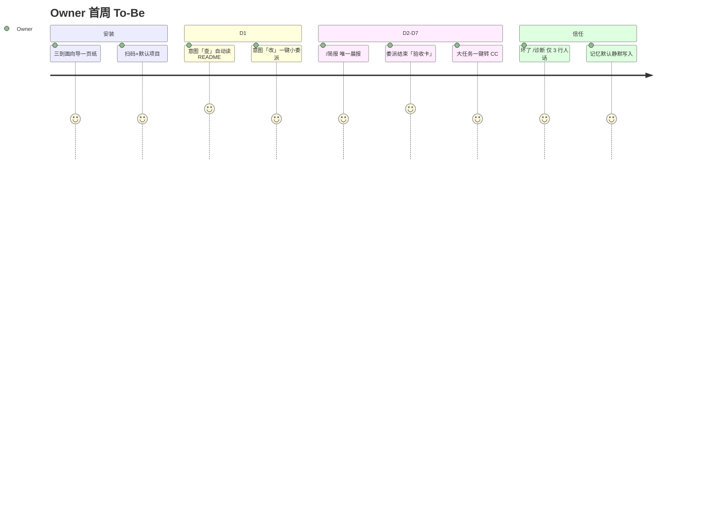

# Owner 首周 & Dev 委派 — 旅程地图与改版建议

> **状态**：产品稿（2026-06-26）  
> **来源**：Owner 产品评估挑刺（会话 2026-06-26）  
> **读者**：产品 / 网关 Owner 面 / 委派链开发  
> **关联**：[`owner-first-week-2026-06.md`](../../guides/owner-first-week-2026-06.md) · [`wechat-core-scenario.md`](../../guides/wechat-core-scenario.md) · [`dev-capability-ceiling-vs-cc-cli-2026-06.md`](../decisions/dev-capability-ceiling-vs-cc-cli-2026-06.md) · [`roadmap-backlog` §3.8](../decisions/roadmap-backlog-and-boundaries-2026-05.md#38-产品体验-p4--旅程收敛2026-06)

---

## 0. 一句话定位（改版后对外叙事）

**Butler 是「一个人管多个项目的微信私人参谋」**：查得清、派得动、记得住、乱不动；正经大改码交给本机 CC，Butler 负责派工、验收摘要与跨项目记忆。

**不是**：微信里的 Cursor、零配置 SaaS、团队协作文档、生活助理 App。

---

## 1. 目标用户与首周「啊哈时刻」

### 1.1 目标用户（写死，避免叙事漂移）

| 画像 | 是/否 | 说明 |
|------|-------|------|
| 技术 Owner，自建网关，单微信入口 | ✅ 核心 | `BUTLER_OWNER_WECHAT_ID` + singleton gateway |
| 同时管 2+ 代码/内容项目 | ✅ 差异化 | 多项目记忆 + `/切换` |
| 愿意本机开 CC 做大 refactor | ✅ 互补 | `/分工` / `/cc-bridge` |
| 非技术同事、小团队多 Seat | ❌ 非目标 | 无 SaaS、无 Web 控制台 |
| 零运维「装 App 即用」 | ❌ 非目标 | 需 API Key + wechat-setup + systemd |

### 1.2 首周啊哈时刻（可验收）

| 优先级 | 时刻 | 用户原话 | 验收信号 |
|--------|------|----------|----------|
| **P0** | D1 只读成立 | 「我不用开电脑也知道项目 README 在说什么」 | 七步剧本步骤 3 通过 |
| **P0** | D3 小委派闭环 | 「它真改了一个文件，且告诉我测没测过」 | dev 委派 + VERIFY 一行绿/红 |
| **P1** | D2 日报习惯 | 「早上 `/简报` 30 秒知道要不要管」 | 首周连续 3 天发 `/简报` |
| **P2** | D7 记忆跨会话 | 「新对话后仍知道这是啥项目」 | 步骤 7 项目记忆 |
| **非** | 全库 refactor 在微信完成 | — | 应路由 CC，不算失败 |

---

## 2. Owner 首周旅程地图

### 2.1 现状旅程（As-Is）



| 阶段 | 触点 | 情绪 | 主要痛点 |
|------|------|------|----------|
| T0 安装 | `.env`、扫码、systemd | 焦虑 | 548 项 env；运维与 Owner 角色混淆 |
| T1 绑定 | 欢迎语、`/切换` | 试探 | 显示名 ≠ 文件夹名；需先懂 `project.yaml` |
| T2 只读 | 自然语言读文件 | 惊喜 | 若模型不委派还好；若误改文件则信任崩塌 |
| T3 委派 | 「交给开发代理」 | 等待 | 无心跳时像卡死；摘要不说明测试结论 |
| T4 纠错 | `/反馈`、`/诊断` | 挫败 | `/诊断` 含 OT2/G1-04 工程术语 |
| T5 日常 | `/简报`、记忆待审、门控 | 负担 | 三类中断抢注意力 |
| T6 故障 | 无回复 | 恐慌 | 无备用入口，只能找 log |

### 2.2 目标旅程（To-Be）



**To-Be 原则**：少概念、多下一步；工程能力进 `/高级`，不进首屏。

---

## 3. Dev 委派链旅程地图

### 3.1 链路拆解（As-Is）

```text
Owner 微信指令
    │
    ▼
Lead（管家 Orchestrator）— 是否 delegate_task？（常漏：直接 read_file/patch）
    │
    ▼
delegate_task(role=dev|content|review, depth≤2)
    │
    ├─► 子 Loop：read → patch → terminal(白名单) → VERIFY
    │       VERIFY ← project.yaml dev.test_command（未配则 LLM 猜）
    │
    ├─► 进度心跳（DELEGATE_PROGRESS_NOTIFY，gateway 推荐开）
    │
    ▼
微信摘要（headline + 文件统计）+ 可选 .txt 附件
    │
    ▼
Owner：/详细 · /详细 变更 · /反馈 · /委派质量
```

### 3.2 委派链痛点矩阵

| 环节 | 现状 | 用户感受 | 根因 |
|------|------|----------|------|
| 路由 | Lead 有时直改文件 | 「不是说好委派吗？」 | 管家层仍有 write 工具 |
| 范围 | 用户口语模糊 | 改多了/改错了 | 无结构化任务卡 |
| 执行 | 白名单 terminal | npm/git 常要批准 | 产品边界（刻意） |
| 验证 | VERIFY 依赖 yaml | 「测没测过」不清楚 | 项目未配 `test_command` |
| 回传 | 摘要 + 附件 | 手机难读 diff | 微信渠道限制 |
| 纠错 | `/反馈` | 不知道管不管用 | OT2 观测 ≠ 用户可见闭环 |
| 大任务 | 启发式建议 CC | 仍要手动开 CC | P3-04 仅提示，无一键转交 |

### 3.3 目标委派链（To-Be）

```text
Owner：自然语言 或 /改 <范围> <目标>
    │
    ▼
Lead：生成「任务卡」确认（范围·角色·是否跑测试）— 可关
    │
    ▼
delegate_task（dev）+ 范围锁（path glob，可选）
    │
    ▼
执行中：心跳 + 里程碑（已读 N 文件 / 已 patch / 正在 pytest）
    │
    ▼
结束：「验收卡」固定四行
      ✅/❌ 测试  ✅/❌ lint  📁 变更列表  📎 /详细
    │
    ├─ 失败 → 建议「缩小范围」或「/转交CC」
    └─ 成功 → 可选写入 L3 经验（静默）
```

### 3.4 与 CC 的分工（产品化，非文档化）

| 任务类型 | 主路径 | Butler 交付 | CC 交付 |
|----------|--------|-------------|---------|
| 只读/摘要 | Butler 直说 | 读后摘要 | — |
| 小范围改 + 单测 | Butler dev 委派 | 验收卡 | — |
| 全库 refactor / 多文件架构 | **转交 CC** | 任务包 + 回传报告入记忆 | 本机执行 |
| 长环修复（>3 轮 patch） | 建议转交 | 中止委派 + 上下文导出 | 续做 |

**改版要点**：`/转交CC`（或自然语言「交给本机 CC」）应生成 **可复制任务包**（范围、相关文件、当前结论），而不是只发一段 `/分工` 说明。

---

## 4. 五意图信息架构（收敛 80+ 命令）

将现有 slash 命令映射到 **5 个 Owner 意图**；其余保留在 `/高级` 与专题 `/帮助 <主题>`。

| 意图 | 用户心智 | 首屏命令/说法 | 收纳的旧命令 |
|------|----------|---------------|--------------|
| **查** | 我现在什么情况 | `/状态` `/简报` `/今日`；自然语言读文件 | `/总览` `/inbox` `/诊断`（简版） |
| **改** | 动代码/内容 | `/改 <路径> <目标>` · 「交给开发代理…」 | `/运行` `/测试` |
| **批** | 批流程、确认、停 | `/确认` `/停止` `/工作流` | 门控 `/批准*` 仅在拦截时出现 |
| **记** | 记忆与纠正 | 「刚才不对」`/反馈` | `/记忆待审` 降为后台；高信任可静默 |
| **管** | 项目与设置 | `/切换` `/项目` `/分工` `/转交CC` | `/模型` → `/帮助 管理` |

**首屏 `/帮助` 改版目标**（替换 `owner_surface._OWNER_HELP_DEFAULT` 文案）：

```text
Butler — 五个说法就够

查  /状态  /简报  — 什么状况、今天要干嘛
改  交给开发代理… 或 /运行  — 小改动与测试
批  /确认  /停止  — 流程与中断
记  刚才不对…  /反馈  — 纠正我
管  /切换  /项目  /分工  — 项目与和 CC 配合

详细命令：/帮助 高级
```

---

## 5. PROD-P4 改版 backlog（带验收）

> 立项登记：[`roadmap-backlog` §3.8](../decisions/roadmap-backlog-and-boundaries-2026-05.md#38-产品体验-p4--旅程收敛2026-06)

### P4-01 · 五意图 `/帮助` 首屏

| 字段 | 内容 |
|------|------|
| 范围 | `owner_surface.py` 默认帮助、`handler_helpers` 欢迎语、gateway sim 断言 |
| 不做 | 删除旧命令别名 |
| 验收 | `butler-owner-ux-p3-wechat-sim.sh` 增 case；`/帮助` 首屏含五意图关键字 |
| 优先级 | **P4-A**（1 周） |

### P4-02 · 委派结束「验收卡」

| 字段 | 内容 |
|------|------|
| 范围 | `report.py` / completion_notify；dev 委派完成微信尾注 |
| 格式 | 固定四行：测试 / lint / 变更文件数 / `/详细` 提示 |
| 依赖 | `project.yaml` `dev.test_command`；无配置时显式「未配置测试」 |
| 验收 | `butler-wechat-dev-delegate-sim.sh --track lingwen` 断言验收卡字段 |
| 优先级 | **P4-A**（2 周） |

### P4-03 · `/改` 结构化委派入口

| 字段 | 内容 |
|------|------|
| 范围 | 新 slash：`/改 <路径或范围> <目标>` → 标准化 delegate 话术 |
| 不做 | 替代自然语言 |
| 验收 | handler sim：`/改 docs/foo.md 加一段说明` 触发 dev 委派 |
| 优先级 | **P4-B**（2–3 周） |

### P4-04 · `/转交CC` 任务包

| 字段 | 内容 |
|------|------|
| 范围 | 基于 `task_route_hints` + `cc_bridge`；导出 markdown 任务包（范围、文件、现状） |
| 边界 | 不立项 CC 嵌 Loop（延续 dev-cc-bridge-optional） |
| 验收 | sim：`/转交CC 重构 auth 模块` 返回可复制任务包 + cc-bridge 提示 |
| 优先级 | **P4-B**（3–4 周） |

### P4-05 · `/诊断` Owner 三行人话

| 字段 | 内容 |
|------|------|
| 范围 | Owner 默认 `/诊断` 隐藏 OT2/G1-04 块；`/诊断 详细` 保留 |
| 三行 | 网关 · 项目 · 待办（有则指向 `/简报`） |
| 验收 | `butler-owner-ux-p3-wechat-sim.sh`；Owner sim 无 `G1-04` 字样 |
| 优先级 | **P4-A**（1 周） |

### P4-06 · 记忆待审降摩擦（高信任模式）

| 字段 | 内容 |
|------|------|
| 范围 | `BUTLER_MEMORY_AUTO_APPROVE` 或按 fact 类型分级 |
| 默认 | 维持待审；gateway profile **推荐** 仅 `correction` 自动入库 |
| 验收 | pytest memory gate + 文档 reference |
| 优先级 | **P4-C**（Backlog） |

### P4-07 · 软件项目 onboarding 镜像

| 字段 | 内容 |
|------|------|
| 范围 | 平行 `wechat-core-scenario`：DemoPilot 七步剧本 + owner-first-week D1–D3 示例 |
| 验收 | `butler-wechat-owner-sim.sh --track demopilot` 守门 |
| 优先级 | **P4-B**（2 周） |

### P4-08 · Owner PMF 指标（替代纯 OT2 对内观测）

| 字段 | 内容 |
|------|------|
| 指标 | 首周 `/简报` 天数；D3 委派验收卡成功率；`/反馈` 后同会话重试率 |
| 落盘 | `~/.butler/metrics/owner_pmf_*.jsonl`（opt-in） |
| 验收 | `butler-owner-pmf-report.sh` 周报 |
| 优先级 | **P4-C**（与 G1-04 窗满后并行） |

---

## 6. 首周 playbook 改版（文档层，P4-07 同步）

### 6.1 D1–D7 重写节奏

| 天 | 唯一目标 | 用户动作 | 成功标准 |
|----|----------|----------|----------|
| D0 | 能对话 | 运维完成网关；Owner 发 `/状态` | 健康灯绿 |
| D1 | **查** | `/切换` + 「读 README 摘要」 | 摘要与文件一致 |
| D2 | **查+管** | `/简报` + `/分工` 扫一眼 | 知道今天要不要管 |
| D3 | **改** | `/改 docs/ 写 smoke 文件` 或剧本步骤 4 | 验收卡出现 |
| D4 | **改** | dev 委派 + 限定单文件 | 测试行 ✅ 或明确未配置 |
| D5 | **记** | `/新对话` + 问项目用途 | 答出项目记忆 |
| D6 | **批** | 可选 `/工作流` 一步 | 收到「下一步：确认」 |
| D7 | **管** | 试 `/转交CC` 或读任务包 | 知道大改码怎么交接 |

### 6.2 每日 30 秒（改版）

```text
1. /简报
2. 有「待你确认」→ 点消息里的下一步（批）
3. 无待办 → 不用记其它命令
```

记忆待审、门控细节移入 `/简报` 内链，**不再占每日清单独立一行**。

---

## 7. Dev 委派运营检查清单（Owner 无感版）

运维/开发者按月核对，不暴露给 Owner：

```bash
bash scripts/butler-dev-flywheel-monthly.sh
bash scripts/butler-wechat-dev-delegate-sim.sh --track lingwen
bash scripts/butler-wechat-dev-delegate-sim.sh --track demopilot   # P4-07 后
```

| 检查项 | 通过标准 |
|--------|----------|
| project.yaml `dev.test_command` | 试点项目必填 |
| 验收卡 | dev 委派尾注含测试结论 |
| Lead 越权 | 只读任务不 delegate 率 < 阈值（现有 LEAD_READONLY_GATE） |
| 真机 1 条/月 | pilot-log 记账 |

---

## 8. 明确不做（延续边界）

| 项 | 原因 |
|----|------|
| 微信内完整 diff 阅读器 | 渠道限制；用验收卡 + `/详细 变更` |
| 取消 terminal 白名单 | dev-capability-ceiling ADR |
| 多 Owner / 团队 Seat | roadmap §1.3 |
| 安装向导 GUI | 非当前形态；最多 CLI `butler onboard` 一页纸 |
| 日常生活命令进首屏 | 与核心叙事抢入口 |

---

## 9. 建议执行顺序

```text
第 1 批（P4-A，2 周）  P4-01 五意图帮助 · P4-05 诊断三行 · P4-02 验收卡
第 2 批（P4-B，1 月）  P4-03 /改 · P4-07 DemoPilot 剧本 · P4-04 转交CC
第 3 批（P4-C）        P4-06 记忆静默 · P4-08 PMF 指标
```

---

## 10. 变更记录

| 日期 | 说明 |
|------|------|
| 2026-06-26 | **P4-B** `/改` 展开委派 · `/转交CC` 任务包 · DemoPilot sim track ✅ |
