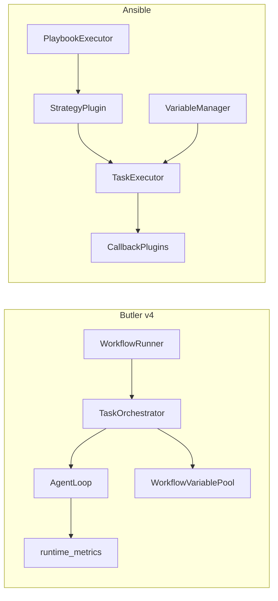

# Butler v4 与 Ansible 对照分析报告

> **日期**：2026-05-25  
> **对照代码**：`reference/ansible`（Ansible Core，`lib/ansible/`）  
> **Butler 事实来源**：[`docs/architecture/v4-architecture.md`](../architecture/v4-architecture.md)  
> **合并路线图**：[`external-agent-reports-improvement-roadmap-2026-05.md`](external-agent-reports-improvement-roadmap-2026-05.md) **主线 O**、PR-X1/X6（ANS-P0–P3 见该文档 §5）  
> **相关规划**：[`reference-learning-plan-2026-05.md`](reference-learning-plan-2026-05.md)（外部对标已收口，零依赖）、[`cc-butler-gap-analysis-2026-05.md`](cc-butler-gap-analysis-2026-05.md)、[`dify-butler-comparison-2026-05.md`](dify-butler-comparison-2026-05.md)  
> **原则**：只借鉴编排与可观测**设计**；零新增 pip 依赖；不引入多进程 Worker 池、Jinja 全生态、远程 Module 执行模型

---

## 1. 执行摘要

Ansible 是 **声明式基础设施编排**（Playbook → Strategy → TaskExecutor → 主机）；Butler v4 是 **微信管家 + 自建 Agent Loop + Workflow DAG**。二者执行对象不同（主机 vs 会话/子 Agent），但共享四类编排纪律：

1. **结构化失败处理**（block/rescue/always、optional、continue）
2. **可调度的并行语义**（serial、linear/free、max_parallel）
3. **变量与结果的可追溯合并**（precedence、facts 快照）
4. **可插拔观测**（callback 协议、verbosity）

**结论**：

- Butler 在 **DAG 执行、同层并行、Loop 内 parallel_tools、runtime_metrics、permissions、human_gate、message_queue** 上已具备 Ansible 思想的现代实现。
- **差距集中在 workflow 层**：无 rescue/always、无 `until` 条件重试、无 handler 延后副作用、无 role/import 复用、变量无 precedence 链。
- **明确不做**：fork Worker 池、全量 Jinja/lookup、大规模 dynamic inventory、Ansible Module 远程执行、Galaxy 级 Collection 分发（已有 MCP catalog + skill marketplace 薄层）。

**若只选一项落地**：`rescue_steps` + `optional` 依赖（P0），对 `dev-qa-loop` / `ui-dev-qa-loop` 收益最大。

---

## 2. 定位与架构对照

| 维度 | Butler v4 | Ansible |
|------|-----------|---------|
| 产品形态 | 微信管家 + CLI，多项目委派 | IT 自动化 / 配置管理 |
| 编排单元 | `WorkflowDef` → `TaskNode` DAG | Play → Block → Task |
| 执行对象 | `session_key` + Agent role | Inventory Host |
| 调度 | 拓扑分层 + `asyncio.gather` | Strategy 插件（linear / free） |
| 扩展 | `tools/registry` + MCP + Hooks | 10+ 类 `PluginLoader` |
| 变量 | `WorkflowVariablePool` + `{{ ref }}` | `VariableManager` 优先级链 + facts |
| 失败 | `max_retries`、依赖 skip | block/rescue/always、`retries`+`until` |
| 观测 | `runtime_metrics` + transcript + `/诊断` | Callback + Display verbosity |



---

## 3. Ansible 核心机制索引（reference 路径）

| 领域 | 核心模式 | 关键路径 |
|------|----------|----------|
| 插件系统 | 类型化 `PluginLoader` + FQCN + runtime 路由 | `lib/ansible/plugins/loader.py` |
| 执行引擎 | `PlaybookExecutor` → `TaskQueueManager` → Strategy | `lib/ansible/executor/` |
| 调度策略 | linear（lockstep）/ free（per-host） | `lib/ansible/plugins/strategy/linear.py`, `free.py` |
| Playbook 模型 | Play / Block / Task / Handler / Role | `lib/ansible/playbook/` |
| 变量 | `VariableManager.get_vars` 优先级链 | `lib/ansible/vars/manager.py` |
| 结果管道 | UTR → WireTaskResult → Callback | `lib/ansible/executor/task_result.py`, `plugins/callback/` |
| 错误重试 | `retries` + `until`；rescue 状态机 | `lib/ansible/executor/task_executor.py`, `play_iterator.py` |
| Inventory | 插件链 `verify_file` → `parse` | `lib/ansible/inventory/manager.py` |
| Display | 单例 + verbosity 0–5 | `lib/ansible/utils/display.py` |
| Collection | FQCN + `meta/runtime.yml` redirect | `lib/ansible/utils/collection_loader/` |
| 上下文 | `PlayContext` + `TaskContext` | `lib/ansible/playbook/play_context.py`, `_internal/_task.py` |

---

## 4. 分领域对照与提炼建议

### 4.1 插件系统

| | Ansible | Butler |
|---|---------|--------|
| 机制 | `PluginLoader` 统一发现/加载 action、callback、strategy 等 | `tools/registry.register()` 静态注册；MCP 经 `mcp/registry_hook.py` |
| 已有 | 工具分发、toolset、MCP 薄接入 | |
| 可借鉴 | manifest **redirect / tombstone**（对标 Collection `plugin_routing`） | 与 `registry/catalog_integrity.py` 对齐 |
| 不建议 | 完整多类型 PluginLoader + 子进程 | 与单进程微信网关冲突 |

**建议（P2）**：MCP/Skill manifest 增加 runtime 式路由元数据。

---

### 4.2 执行引擎与调度策略

| | Ansible | Butler |
|---|---------|--------|
| linear | 全 host 同步推进 | DAG **按层** `asyncio.gather`（`task_orchestrator.execute_graph`） |
| free | 各 host 独立 | `parallel_tools` 按工具/路径冲突决定 Loop 内并行 |
| 可借鉴 | **`serial` / `max_parallel`** 限制同层并发 | `WorkflowStepDef` 或层配置 |
| 可借鉴 | **`on_failure: continue`**（ignore_errors） | `TaskNode.optional` |
| 可借鉴 | 显式 **`execution: free|lockstep`** 策略声明 | workflow YAML |

**Butler 代码锚点**：`butler/task_orchestrator.py` L404–430（同层 gather）。

**建议（P1）**：`max_parallel` + `optional` 依赖，零依赖。

---

### 4.3 Block / Rescue / Always

| | Ansible | Butler |
|---|---------|--------|
| 结构 | `Block.block` / `rescue` / `always` | 仅 DAG + `max_retries` |
| 状态机 | `PlayIterator` → `RESCUE` | 失败即 skip 下游或整图失败 |
| 可借鉴 | **`rescue_steps`**：失败后跑诊断/回滚子 Agent | `workflows/schema.py` |
| 可借鉴 | **`always_steps`**：无论成败执行清理/通知 | `WorkflowRunner` 末尾 |

**Butler 代码锚点**：`butler/task_orchestrator.py` `_run_with_retry`（仅固定次数重试）。

**建议（P0）**：`rescue_steps` + 与 `human_gate` 配合。

---

### 4.4 重试：`retries` + `until`

| | Ansible | Butler |
|---|---------|--------|
| 机制 | `until` 条件表达式决定停止重试 | `max_retries` 固定次数 |
| Loop | — | `tool_error_policy`（retry/replan/stop）未接 workflow |
| 可借鉴 | 轻量 **`until`**（JSON path / schema 断言） | 接 `output_schema` |
| 可借鉴 | **`v2_runner_retry`** 级事件 | `runtime_metrics` + transcript |

**建议（P2）**：`WorkflowStepDef.until: dict`，无 Jinja。

---

### 4.5 变量与 Facts

| | Ansible | Butler |
|---|---------|--------|
| 合并 | 可配置 `VARIABLE_PRECEDENCE` 链 | `WorkflowVariablePool` 扁平 map |
| 注册 | `register` + facts 缓存 | `set_step_output` + `{{ step.key }}` |
| 可借鉴 | **precedence 文档化**：extra > step.output > project defaults | `workflows/variables.py` |
| 可借鉴 | 失败步 **facts 快照**（`ansible_failed_*`） | `.butler/workflow_run.json` |
| 不建议 | 完整 Jinja + lookup 插件链 | token/复杂度 |

**Butler 代码锚点**：`butler/workflows/variables.py`（Dify VariablePool 子集注释）。

**建议（P2）**：precedence + 失败上下文文件。

---

### 4.6 Handler / Notify

| | Ansible | Butler |
|---|---------|--------|
| 语义 | notify 后 play 末批量执行 handler | `outbound_bridge.notify_workflow_step` **即时**推送 |
| 可借鉴 | **`handlers:`** 段：DAG 成功后统一触发 | 接 `completion_notify`、`experiments/ledger` |

**建议（P2）**：`WorkflowDef.handlers` + `WorkflowRunner` 成功回调。

---

### 4.7 结果管道与 Callback

| | Ansible | Butler |
|---|---------|--------|
| 管道 | UTR → FinalQueue → `CallbackBase.v2_*` | metrics + transcript + shell hooks |
| 可借鉴 | **`WorkflowCallback` 协议**（step_ok/fail/retry） | `hooks/` 或 `ops/` |
| 可借鉴 | **`BUTLER_DIAG_VERBOSITY`** 统一 `/诊断` 详略 | 对标 `Display.v/vv/vvv` |

**Butler 已有**：`runtime_metrics`、`record_workflow_step`、`pipeline_steps` 耗时。

**建议（P1）**：Callback 协议 + verbosity。

---

### 4.8 Inventory（动态发现）

| | Ansible | Butler |
|---|---------|--------|
| 机制 | inventory 插件链式 `verify_file` → `parse` | `project_manager` + `project.yaml` 静态 |
| 可借鉴 | **`.butler/discovery.yaml`** + glob 规则 | monorepo 多项目 |
| 不建议 | 云 inventory / script inventory | 非管家场景 |

**建议（P3）**：本地发现规则文件即可。

---

### 4.9 权限与上下文（PlayContext）

| | Ansible | Butler |
|---|---------|--------|
| 叠加 | `PlayContext.set_task_and_variable_override` | `execution_context`（orchestrator / session / workflow_step） |
| 权限 | become / connection | `permissions.yaml` + `human_gate` |
| 已有 | 步骤级 `tools:` 白名单 + `use_workflow_step` | |
| 可借鉴 | **`optional: true`** 依赖（ignore_unreachable） | 失败不 cancel 无依赖兄弟分支 |

---

### 4.10 Role 组合

| | Ansible | Butler |
|---|---------|--------|
| 复用 | `Role` 打包 tasks/vars | `workflows/builtin/*.yaml` 模板 |
| 可借鉴 | **`import_workflow: name`** + `vars:` | `parse_workflow_data` 展开 includes |

**建议（P2）**：本地 YAML include，零网络。

---

### 4.11 Display / 日志分级

| | Ansible | Butler |
|---|---------|--------|
| 机制 | `Display` 单例 + verbosity 0–5 | `logging` + `/诊断` 拼装 |
| 可借鉴 | 全局 verbosity → transcript/metrics 粒度 | |
| 不建议（当前） | 子进程 display 代理 | asyncio 单进程暂不需要 |

---

## 5. Butler 已对齐 Ansible 的部分

| Ansible 模式 | Butler 实现 |
|--------------|-------------|
| DAG / 依赖 | `TaskOrchestrator.execute_graph` + `depends_on` |
| 并行批 | 同层 `asyncio.gather` + `parallel_tools` |
| 步骤重试 | `_run_with_retry` + `max_retries` |
| 人工确认 | `human_gate` + `requires_approval` |
| 变量注册 | `WorkflowVariablePool.set_step_output` |
| 失败分类 | `tool_error_policy`（Loop 内） |
| 指标快照 | `butler/ops/runtime_metrics.py` |
| 审计链 | `session_transcript` + tool audit deque |
| 权限声明 | `butler/permissions.py` |
| 队列节流 | `butler/gateway/message_queue.py` |

---

## 6. 明确不做（产品边界）

与 [`AGENTS.md`](../../AGENTS.md)、[`five-reports-not-done-2026-05.md`](five-reports-not-done-2026-05.md) 一致：

| 项 | 原因 |
|----|------|
| 多进程 `WorkerProcess` + fork | 单进程微信 Gateway |
| 全量 Jinja2 + lookup/filter 生态 | token 与维护成本 |
| 按主机大规模 dynamic inventory | 非管家场景 |
| Ansible Module 远程执行 | 已有 `terminal` + execpolicy 子集 |
| Galaxy 级 Collection 分发 | 已有 MCP catalog + skill marketplace |

---

## 7. 优先级路线图（ANS-P0–P3）

命名 **ANS-P***，与 CC 线束 P0–P4、外部对标 P0–P2 **无关**。

| 优先级 | 项 | Ansible 来源 | Butler 落点 | 收益 |
|--------|-----|--------------|-------------|------|
| **ANS-P0** | 工作流 **rescue 步骤** | block/rescue | `workflows/schema.py` + `task_orchestrator` | 长流程可恢复 |
| **ANS-P0** | **`optional` 依赖** | ignore_errors | `TaskNode.optional` | 并行分支不被单点拖死 |
| **ANS-P1** | **`max_parallel` / serial** | serial | Workflow 层配置 | 控成本与 API 限流 |
| **ANS-P1** | **WorkflowCallback 协议** | callback v2_* | `hooks/` 或 `ops/` | 可观测扩展 |
| **ANS-P1** | 失败步 **facts 快照** | ansible_failed_* | `.butler/workflow_run.json` | rescue/诊断上下文 |
| **ANS-P2** | **`until` 轻量断言** | until | `output_schema` | 减少无效 retry |
| **ANS-P2** | **`handlers:` 延后任务** | handlers | `WorkflowRunner` | 副作用解耦 |
| **ANS-P2** | **`import_workflow`** | role include | `parse_workflow_data` | YAML 复用 |
| **ANS-P2** | 变量 **precedence** | VariableManager | `WorkflowVariablePool` | 减少覆盖歧义 |
| **ANS-P2** | manifest **redirect** | collection routing | `registry/catalog_integrity` | 兼容旧名 |
| **ANS-P3** | **discovery 规则** | inventory plugins | `project_manager` | monorepo 省心 |

---

## 8. 与现有规划的关系

| 规划 | 关系 |
|------|------|
| [`cc-butler-gap-analysis-2026-05.md`](cc-butler-gap-analysis-2026-05.md) | Ansible **不替代**流式工具、cache-safe delegate；互补在 **workflow 编排** |
| [`reference-learning-plan-2026-05.md`](reference-learning-plan-2026-05.md) | 继续 **零 pip 依赖** |
| [`dify-butler-comparison-2026-05.md`](dify-butler-comparison-2026-05.md) | VariablePool / HITL 已部分落地；Ansible 补 **rescue/serial/handler** |
| [`five-reports-not-done-2026-05.md`](five-reports-not-done-2026-05.md) | 固定多角色图（S8）可用轻量 `import_workflow`，不必 LangGraph |

---

## 9. 验收建议（落地后）

```bash
cd /home/ailearn/projects/WFXM
# workflow / DAG 改动
PYTHONPATH=. pytest tests/test_p2_workflow_permissions.py \
  tests/test_message_queue.py -q
# 若新增 schema 字段
PYTHONPATH=. pytest tests/test_workflow_*.py -q  # 按新增测试文件调整
```

---

## 10. 变更记录

| 日期 | 说明 |
|------|------|
| 2026-05-25 | 初版：基于 `reference/ansible` 与 Butler v4 代码对照 |
