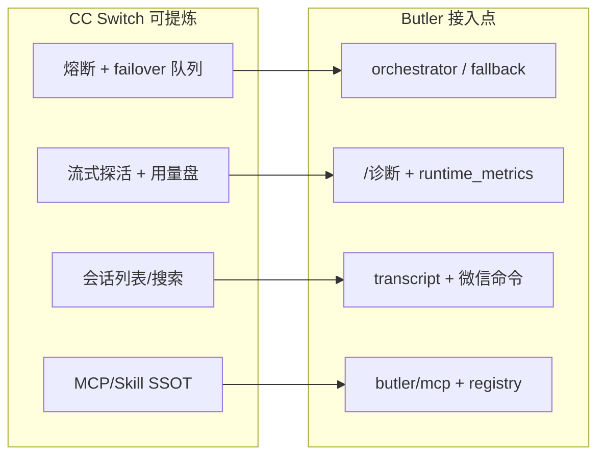

# CC Switch ↔ Butler v4 对标分析报告

> **状态**：活跃参考（2026-05-25）  
> **对照源**：`reference/cc-switch`（Tauri 2 桌面应用，[README_ZH](https://github.com/farion1231/cc-switch) 同仓库路径）  
> **Butler 基线**：[`v4-architecture.md`](../architecture/v4-architecture.md)、[`cc-butler-gap-analysis-2026-05.md`](cc-butler-gap-analysis-2026-05.md)  
> **产品边界**：[`four-reports-out-of-scope-2026-05.md`](four-reports-out-of-scope-2026-05.md)、[`project-layer-wechat-plan.md`](../architecture/project-layer-wechat-plan.md)  
> **合并路线图**：[`five-reports-improvement-roadmap-2026-05.md`](five-reports-improvement-roadmap-2026-05.md) **主线 G**（规划中）

---

## 1. 执行摘要

**CC Switch** 与 **Butler v4** 处于不同产品层：

| 项目 | 定位 |
|------|------|
| CC Switch | 桌面 **配置与运维控制台**：Claude Code / Codex / Gemini CLI / OpenCode / OpenClaw / Hermes 的供应商、MCP、Skills、Prompts、本地代理、用量、会话浏览 |
| Butler v4 | **微信管家 + 自建 Agent Loop 运行时**：长会话、多项目记忆、委派、入站队列、权限 |

**可提炼方向**（运维/配置/可靠性层，非 Loop 语义）：

1. 供应商 **熔断 + 有序 failover 队列**、流式探活、用量/cache 统计  
2. **会话列表 / 搜索 / 恢复**（对齐 transcript + 微信命令）  
3. **MCP / Skill / Prompt SSOT**（Butler 运行时消费，不写五套 CLI live 文件）  
4. 配置 **原子写 + 自动备份**、「通用配置片段」  

**不必从 CC Switch 重复借鉴**：上下文经济学、read-before-edit、tool spill、队列 steer 等已在 **Claude Code 源码对照**（`cc-butler-gap-analysis`）中落地；CC Switch 不提供 Agent Loop 实现。

**明确不做**：复刻 Tauri 桌面、系统托盘、五 CLI live 配置双向同步、内置本地 HTTP 代理全家桶（除非产品改边界）。

---

## 2. 架构对照

### 2.1 CC Switch（reference 实测）

```
React + TS (Components / Hooks / TanStack Query)
        │ Tauri IPC
Rust (Commands → Services → DAO → SQLite)
        │ 原子写入 + live 文件双向同步
~/.cc-switch/cc-switch.db  （SSOT）
~/.cc-switch/settings.json （设备级 UI）
```

**核心模块**（README / `src-tauri`）：

| 模块 | 路径/职责 |
|------|-----------|
| ProviderService | 供应商 CRUD、切换、回填、排序 |
| McpService | MCP SSOT → 各应用 live 同步 |
| ProxyService | 本地代理、格式转换、故障转移 |
| ProviderRouter | 熔断器 + failover 队列选路 |
| SessionManager | 多 Provider 会话扫描（含 Hermes SQLite+JSONL） |
| StreamCheck | 流式 API 首 chunk 健康检查 |
| UsageStats | 请求日志、定价、cache hit rate |
| SkillService | SSOT `~/.cc-switch/skills/`、symlink/copy |
| PromptService | DB 存 Prompt，启用写入 CLAUDE.md 等 |
| DeepLink | `ccswitch://` 导入 provider/mcp/prompt/skill |

### 2.2 Butler v4（当前实现）

```
微信 Gateway → Orchestrator → Agent Loop (butler/core/)
    ├─ context_pipeline / tool_batch / llm_retry
    ├─ transport (fallback chain, 多厂商)
    ├─ session_transcript.jsonl + transcript_index
    ├─ mcp/（可选薄客户端）
    └─ registry/skills（marketplace 等）
```

详见 [`v4-architecture.md`](../architecture/v4-architecture.md)。

### 2.3 维度矩阵

| 维度 | CC Switch | Butler v4 | 差距性质 |
|------|-----------|-----------|----------|
| Agent 循环 | 无（管理 CLI 配置） | `agent_loop.py` 自建 | **不同层** |
| 供应商切换 | UI + 托盘 + SQLite | `/model`、`project.yaml`、失败后 `fallback` 链 | **中**（缺熔断/队列/探活） |
| 本地代理 | 一等公民（转换/thinking 优化） | 直连 `LLMClient` | **大**（产品可选） |
| MCP | 四应用统一面板 + live 同步 | `BUTLER_MCP_ENABLED` 会话级 | **中** |
| Skills | GitHub/ZIP、SSOT、多应用同步 | 项目内 + marketplace | **中** |
| 会话历史 | 扫描 + 搜索 + 复制恢复命令 | `transcript.jsonl` + 索引，无列表 UX | **中** |
| 用量/成本 | 仪表盘 + 定价 + cache 命中率 | `runtime_metrics` 进程内指标 | **中** |
| 配置安全 | 原子写、备份轮换、WebDAV | YAML 直写为主 | **小–中** |
| 入口 | 桌面 | 微信远程 | **刻意不同** |

---

## 3. CC Switch 分模块可提炼项

### 3.1 供应商与可靠性（高相关）

**CC Switch 证据**

- `src-tauri/src/proxy/provider_router.rs`：按应用读取 failover 队列；`CircuitBreaker` 过滤不可用供应商。  
- `src-tauri/src/proxy/circuit_breaker.rs`：Closed / Open / HalfOpen，失败阈值、错误率、超时恢复。  
- `src-tauri/src/proxy/failover_switch.rs`：切换去重、托盘/UI 事件。  
- `src-tauri/src/services/stream_check.rs`：流式探活，Operational / Degraded / Failed。  
- `src-tauri/src/proxy/thinking_optimizer.rs`：按模型改写 thinking / beta 头。  
- `src-tauri/src/services/usage_stats.rs`：请求聚合、`cache_hit_rate`、`real_total_tokens`。

**Butler 现状**

- `butler/transport/fallback.py`：`build_fallback_chain`，在 `llm_retry` 单次失败时 `try_activate_fallback()`。  
- **无** 供应商级熔断、无主动探活队列、无账单级 usage 盘。  
- `butler/ops/runtime_metrics.py`：counter/histogram，偏运维非成本。

**建议落地**

| 优先级 | 能力 | Butler 接入点 |
|--------|------|----------------|
| **P0** | 熔断 + 有序 failover 队列 | `orchestrator` / 新 `ProviderHealthRegistry`；`project.yaml` 或全局 `failover: [p1,p2]` |
| **P1** | 流式探活 | 启动或 `/诊断` 触发；结果写入 health + 微信简报 |
| **P1** | 用量与 cache 命中率 | 从 `NormalizedResponse.usage` 落盘；`/诊断` 展示日 cost、cache_read 占比 |
| **P2** | Thinking/协议整形 | `anthropic_transport` / `chat_completions` 按模型注入（按需） |

**说明**：CC Switch 为 **预防性路由**；Butler 当前为 **反应性 fallback**，二者互补。

---

### 3.2 MCP / Skills / Prompts（中相关）

**CC Switch**

- `services/mcp.rs`：DB SSOT；按应用启用/禁用同步 live；禁用则从 live **移除**。  
- `services/skill.rs`：SSOT 目录；symlink/copy；GitHub/ZIP；卸载备份。  
- `services/prompt.rs`：启用才写 `CLAUDE.md` / `AGENTS.md` 等。  
- `deeplink/`：`ccswitch://` 一键导入。

**Butler**

- `butler/mcp/`：可选薄客户端，session 挂载。  
- `butler/registry/skill_sources/marketplace.py` 等：项目/marketplace 向。  
- Prompt：`orchestrator` + `design_md_sections` + `MEMORY.md`，无独立版本库。

**建议落地**

| 优先级 | 能力 | 说明 |
|--------|------|------|
| **P1** | MCP 注册表 SSOT | `.butler/mcp.yaml` + 索引；`butler mcp sync`；可选微信「安装 mcp」 |
| **P2** | Skill 安装管线 | SSOT → 软链/复制到项目 `.butler/skills/` |
| **P2** | Prompt 预设库 | 项目 `prompts/*.md`，启用时合并 system（不写 CLI live 文件） |
| **P3** | `butler://` 深链 | 运维向导入预设/MCP |

**边界**：不做「五 CLI live 文件双向写」；只做 Butler 运行时消费的 SSOT。

---

### 3.3 会话管理（中高相关）

**CC Switch**

- `session-manager.md`（PRD）：列表、搜索、复制恢复命令、终端恢复（v1 macOS）。  
- `session_manager/providers/hermes.rs`：SQLite `sessions` 与 JSONL **合并**，ID 冲突 SQLite 优先；容错列探测。  
- 本地索引；大 transcript 按需加载。

**Butler**

- `butler/core/session_transcript.py`：append-only `transcript.jsonl`。  
- `butler/core/transcript_index.py`：大文件 tail 索引。  
- `butler/gateway/session_registry.py`：多 session Loop LRU。  
- **无** 跨会话浏览/搜索的产品能力。

**建议落地**

| 优先级 | 能力 | 说明 |
|--------|------|------|
| **P0** | 会话列表 CLI | `butler sessions list --search` |
| **P1** | 微信 `/会话` | 最近 N 条：session_key、项目、最后活跃、token 概览 |
| **P1** | 恢复语义 | 绑定 `session_key` + 可选 `transcript_fork`（非复制 CLI 命令） |
| **P2** | 跨源只读导入 | 扫描 `~/.claude/projects` 等，迁移/诊断用 |

---

### 3.4 配置安全与同步（中相关）

**CC Switch**

- 原子写：临时文件 + rename。  
- `database/backup.rs`：轮换备份；WebDAV 同步时跳过/保留表策略。  
- 「通用配置片段」：换供应商保留插件等非 key 字段。

**Butler**

- `save_butler_config` / `project.yaml` 直写；无统一原子写与自动备份。

**建议落地**

| 优先级 | 能力 |
|--------|------|
| **P1** | 配置写入统一 `atomic_write` |
| **P2** | `~/.butler/backups/` 保留最近 N 份 |
| **P2** | `common_fragment`：切换 provider 时合并 tools/hooks 段 |

---

### 3.5 其它（按需）

| CC Switch 能力 | Butler 等价/建议 | 优先级 |
|----------------|------------------|--------|
| Speedtest 端点延迟 | 选 provider 时排序 base_url | P3 |
| 50+ 供应商预设 | `docs/config/provider-presets.yaml` + 微信套用 | P2 |
| 系统托盘热切换 | 微信 `/model`、快捷切换供应商 | 已有基础 |
| WebDAV 云同步 | 多机同步 `~/.butler` 非敏感数据 | P3（注意密钥） |

---

## 4. Butler 已强、不必从 CC Switch 照搬

以下已在 **Claude Code 源码对照**（[`cc-butler-gap-analysis-2026-05.md`](cc-butler-gap-analysis-2026-05.md)）中跟踪或已落地：

- 三层上下文压缩、tool spill、按工具分级剪枝、post-compact 锚点  
- read-before-edit + mtime、`transition_reason`  
- 入站 `message_queue`、`/steer`、Stop hook block、turn token budget  
- 流式只读工具、cache-safe delegate、队列 drain 出站  
- P3/P4：per-message tool budget、reactive compact、permissions.yaml、transcript JSONL 等  

CC Switch **不提供** 上述 Loop 语义；其代理层是 HTTP 中转，不是 `agent_loop`。

**Butler 相对 CC Switch 的产品优势**（保持）：

- 多项目 + Lead + `project.yaml` 工具白名单  
- 微信网关、owner gate、媒体 STT/VLM、`outbound_bridge`  
- TaskOrchestrator DAG、`delegate_task`、分层 MEMORY  

---

## 5. 明确不做（避免产品漂移）

除 [`four-reports-out-of-scope-2026-05.md`](four-reports-out-of-scope-2026-05.md) 外，CC Switch 特有项：

| # | 不做项 | 原因 |
|---|--------|------|
| 1 | 完整 Tauri 桌面 + 系统托盘 | 入口是微信，非本地 GUI |
| 2 | 五 CLI 工具 live 配置双向同步 | 非 CLI 配置管理器定位 |
| 3 | 内置本地 HTTP 代理服务器（默认） | 当前直连 transport；若要做需单独立项 |
| 4 | 中转商商业集成 / 赞助商链路 | 与 Butler 产品无关 |
| 5 | 控制 IDE / Claude 子进程替代 Loop | v4 已明确（见 `AGENTS.md`） |

---

## 6. 建议落地路线图



| 阶段 | 内容 | 预期收益 |
|------|------|----------|
| **一** | Provider 熔断 + 有序 failover；`sessions list` + 微信 `/会话` | 稳定性；主公找回长对话 |
| **二** | 流式探活；usage/cache 进 `/诊断`；配置原子写+备份 | 可观测、防配置损坏 |
| **三** | MCP/Skill SSOT CLI；`butler://`；provider 预设库 | 多项目运维降本 |

**开工二选一（实现时）**：

1. **稳定性优先** → 熔断 + failover 队列  
2. **体验优先** → transcript 会话列表 + 微信 `/会话`  

---

## 7. 与仓库其它文档的关系

| 文档 | 关系 |
|------|------|
| [`cc-butler-gap-analysis-2026-05.md`](cc-butler-gap-analysis-2026-05.md) | **Loop 层** ↔ Claude Code 源码；本文 **不重复** P0–P4 线束项 |
| [`docs/plans/README.md`](README.md) | 本文使用「阶段一/二/三」避免与 CC 线束 P0–P4、仓库整理 P3 混名 |
| [`config/reference.md`](../config/reference.md) | 新增 `BUTLER_*` 时同步 |
| [`CONTRIBUTING.md`](../../CONTRIBUTING.md) | 微信线束验收 |

**后续**：若开始实现，建议将 §6 阶段项拆为独立 implementation 文档或并入 [`post-consolidation-roadmap-2026-05.md`](post-consolidation-roadmap-2026-05.md) 轨道说明。

---

## 8. 核验记录（2026-05-25）

| 核对项 | 方法 |
|--------|------|
| CC Switch 目录存在 | `reference/cc-switch/`（gitignore 对照区） |
| 模块路径 | `src-tauri/src/proxy/*.rs`、`services/*.rs`、`session_manager/` |
| Butler fallback | `butler/transport/fallback.py`、`butler/core/llm_retry.py` |
| Butler transcript | `butler/core/session_transcript.py`、`transcript_index.py` |
| 无仓库内 cc-switch 旧文档 | `docs/` 下 grep 无先行报告（本文为首版） |

---

*报告版本：2026-05-25 · 作者：Agent 对标分析会话*
