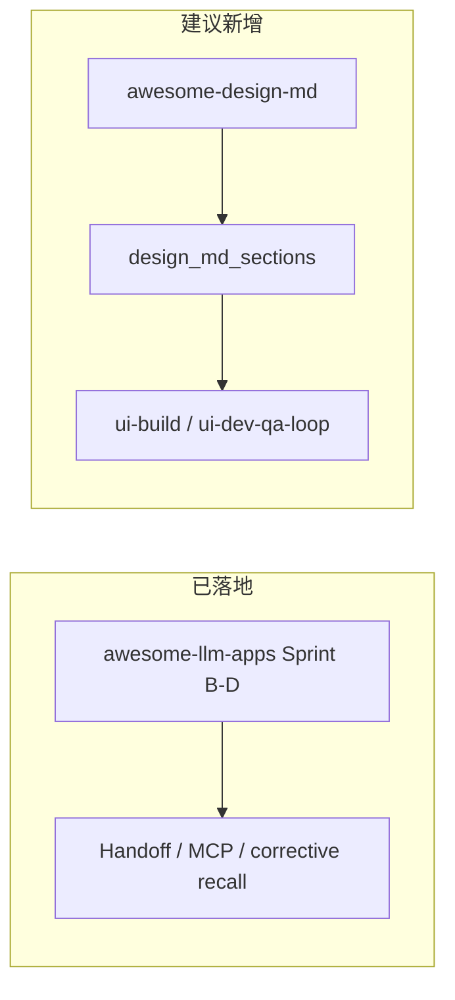

# Butler v4 ↔ awesome-design-md 对照分析报告

> **状态**：分析完成（2026-05-25）；**主线 C 已落地**（PR5，见 [`four-reports-improvement-roadmap-2026-05.md`](../roadmaps/four-reports-improvement-roadmap-2026-05.md) §9）  
> **本地参考**：`reference/awesome-design-md/`（gitignore，外部标本，非 Butler 产品代码）  
> **原则**：只借鉴设计上下文与工程模式，零新增运行时依赖；不将 73 套预设打入主仓库  
> **易混淆**：本报告 ≠ [`awesome-llm-apps-butler-comparison-report-2026-05.md`](awesome-llm-apps-butler-comparison-report-2026-05.md)（后者对应 Sprint B–C 的 MCP/corrective recall）

---

## 1. 执行摘要

**awesome-design-md**（VoltAgent）是约 **73** 套从真实网站提炼的 `DESIGN.md` 标本库，遵循 Google Stitch 的「纯文本设计系统」思路：无 Figma、无 JSON schema、无专用运行时。

**Butler v4** 是微信/CLI 多项目 AI 管家，已有 `AGENTS.md` 分段钉选、Skill 路由、Handoff、规划模式、证据优先 review、压缩后锚点等；**2026-05 起**已支持项目级 `DESIGN.md` 上下文管线（`design_md_sections`、`ui-build`、`design_preset`），详见 [`../guides/four-reports-capabilities-2026-05.md`](../../guides/four-reports-capabilities-2026-05.md)。

**结论**：awesome-design-md 的价值在于 **AGENTS.md + DESIGN.md 职责分离**、**YAML token + 命名组件 + Do's/Don'ts** 三层约束，以及可按品牌选用的 preset。应在现有 Loop / Skill / 委派 / 工作流上增加 **DESIGN 上下文管线**，而不是复制标本库或做 UI 生成平台。

**优先提炼（P0）**：项目级 `DESIGN.md` 约定、任务话术、Handoff/QA 视觉验收项。  
**次优先（P1）**：`design_md_sections`、 `project.yaml` 的 `design_preset`、设计 Skill、`ui-build` 委派类别。  
**可选（P2）**：`ui-dev-qa-loop`、RAG 切块、post-compact 钉选 DESIGN 节。  
**不做（P3）**：73 套内置、Stitch 商业流水线、Playwright 视觉农场、替代 Loop 的「设计 Agent 运行时」。

---

## 2. 两个项目的本质差异

| 维度 | Butler v4（WFXM） | awesome-design-md |
|------|-------------------|-------------------|
| 定位 | 微信/CLI **多项目 AI 管家**：Loop、委派、记忆、网关、工作流 | **73 套** `DESIGN.md` 视觉规范标本（Stitch 格式） |
| 核心产物 | 可运行 Agent 运行时 + 工具链 | 纯 Markdown 设计系统（无运行时、无 pip） |
| 读者 | `AGENTS.md`、MEMORY、Skill、Handoff | **`DESIGN.md`**（给实现 UI 的 Agent） |
| 典型任务 | 改代码、跑测试、委派 dev/review、微信汇报 | 「按 Linear/Stripe 风格做落地页」 |
| 本地体量 | `butler/` 产品代码 | `design-md/` 约 **2.7MB**、**~38k 行**（单文件常见 450–550 行） |

### 2.1 与 awesome-llm-apps 的区分

| 项目 | 路径 | Butler 已落地 |
|------|------|---------------|
| awesome-llm-apps | `reference/awesome-llm-apps/` | Sprint B–D：Handoff、MCP profiles、corrective recall、web_fetch 等 |
| **awesome-design-md** | `reference/awesome-design-md/` | **无**；本报告为首次对照 |

二者正交：前者补 **工具链/路由/记忆**；后者补 **视觉上下文**。

---

## 3. awesome-design-md 结构速览

### 3.1 核心理念（README）

| 文件 | 谁读 | 定义什么 |
|------|------|----------|
| `AGENTS.md` | 编码 Agent | 如何构建项目 |
| `DESIGN.md` | 设计/前端 Agent | 项目应长什么样、什么气质 |

用法：将某站点 `DESIGN.md` 复制到项目根目录，指示 Agent「按此实现页面」。

### 3.2 单套标本内容（Stitch 扩展格式）

1. **YAML frontmatter（机器可读）**
   - `colors.*`：语义色 + hex + 功能角色
   - `typography.*`：完整层级（字号/字重/行高/字距）
   - `rounded` / `spacing`：设计 token
   - `components.*`：如 `button-primary`、`feature-card` 及 pressed/hover 变体

2. **Markdown 正文**
   - Overview、Colors、Typography、Layout、Elevation、Components
   - **Do's and Don'ts**（审查清单）
   - **Responsive Behavior**（断点、触控目标）
   - **Iteration Guide**（含 `npx @google/design.md lint DESIGN.md`）
   - **Known Gaps**（未覆盖场景）

3. **上游 README 声称的附属物**
   - `preview.html` / `preview-dark.html`：色板与组件目视目录  
   - **本地克隆核对（2026-05-25）**：`find` 结果为 **0**，当前 reference 仅含 `DESIGN.md` + `README.md`。

### 3.3 与 Butler 环境相关的标本示例

| 品牌目录 |  relevance |
|----------|------------|
| `design-md/minimax/` | 与 DemoPilot 等 MiniMax 模型配置一致 |
| `design-md/cursor/` | 与 Cursor/开发工具审美接近 |
| `design-md/vercel/`、`linear.app/`、`stripe/` | 常见 SaaS/开发者产品参考 |
| `design-md/opencode.ai/` | 与 OpenCode 对标文档同域 |

---

## 4. Butler 现状：可衔接能力与缺口

### 4.1 已有能力（可复用模式）

| Butler 能力 | 路径 | 与 DESIGN.md 的关系 |
|-------------|------|---------------------|
| AGENTS.md 段落钉选 | `butler/core/agents_md_sections.py` | **可平移**为 `design_md_sections` |
| Skill 路由注入 | `butler/skills/router.py`、`orchestrator.inject_skill_context` | triggers：`landing`/`UI`/`tailwind`/`设计` |
| 规划模式 | `butler/plan_mode.py`、`butler/prompts/butler_plan_mode.md` | `mode_classifier` 已将 plan 与 explore/design 关联 |
| Handoff / NEXUS | `butler/core/handoff.py`、`delegate_categories.yaml` | 验收可扩展为 token/断点核对 |
| 证据优先 review | `butler/workflows/builtin/dev-qa-loop.yaml` | QA 可对照 Do's/Don'ts |
| 压缩后锚点 | `butler/core/post_compact_cleanup.py` | 可钉选 DESIGN 关键节 |
| web_fetch | `butler/tools/web_fetch.py`（`BUTLER_ENABLE_WEB_FETCH=1`） | 辅助核对线上站点，不替代 token 文件 |
| post_edit_format | `butler/core/post_edit_format.py` | `.css` prettier，与 UI 弱相关 |

### 4.2 明确缺口

- 无 `DESIGN.md` 读取、分段注入、`project.yaml` 的 `design_preset`。
- Agent 画像仅有 dev / content / review（`butler/agent_profiles.py`），无 UI 实现专用 prompt 纪律。
- Handoff 默认验收偏代码（pytest、read_file），不含视觉一致性。
- 产品边界（`AGENTS.md`）为微信管家 + 多项目开发，**非** Stitch 式 UI 平台——宜做上下文增强，非运行时复制。

---

## 5. 可提炼项（按优先级）

### P0 — 零代码 / 文档与工作方式

1. **双文件约定**：有前端/UI 的项目根目录放置 `DESIGN.md`（可从 `reference/awesome-design-md/design-md/<品牌>/` 复制）。
2. **任务话术**：引用 `Iteration Guide` / `Agent Prompt Guide`——一次只改一个 `components.*` token；禁止整文件 500 行灌入对话。
3. **Handoff / QA 文案**：在 `nexus-sprint`、`dev-qa-loop` 的 review 步骤增加视觉验收（主色、canvas、Do's/Don'ts、断点）。
4. **索引区分**：规划索引中单独列出本报告，避免与 awesome-llm-apps Sprint 混淆。

### P1 — 小模块（推荐实现）

| 建议 | 实现思路 | 落点 |
|------|----------|------|
| DESIGN.md 分段抽取 | 仿 `extract_agents_md_sections`；默认节：`Do's and Don'ts`、`Responsive Behavior`、frontmatter 摘要 | 新模块 `butler/core/design_md_sections.py`；`BUTLER_POST_COMPACT_DESIGN_SECTIONS` |
| `project.yaml` 预设 | `design_preset: minimax` → `reference/.../minimax/DESIGN.md` 或 `.butler/design/DESIGN.md` | `orchestrator.build_system_prompt` / 项目加载 |
| Skill `design-system` | triggers + 「须 read_file DESIGN.md；按 components token 迭代」 | `.butler/skills/` |
| 委派类别 `ui-build` | `prompt_append` 引用 `{colors.*}` / `{typography.*}`；Handoff 含视觉验收 | `delegate_categories.yaml` |
| 规划模式补充 | UI 任务先输出 preset + token 表 + 禁止项 | `butler/prompts/butler_plan_mode.md` |
| Token 预算 | 注入约 2–3k 字：colors/typography/spacing + Do's/Don'ts；正文 Components 按需 read | 委派 context / compress 策略 |

### P2 — 工作流与质量闭环

1. **`ui-dev-qa-loop.yaml`**：implement 前 read DESIGN；qa 按 Do's/Don'ts 逐条 PASS/FAIL 并引用 token 名。
2. **Review Agent 扩展**：无 DESIGN.md 不得声称「符合品牌」；PASS 须列出已核对规则。
3. **RAG**：`search_project_knowledge` 切块索引项目 `DESIGN.md`（`BUTLER_CORPUS_ROUTING=1` 时）。
4. **Stitch lint（可选）**：`npx @google/design.md lint` 仅 CI/本地，默认不进微信 Loop。

### P3 — 明确不做

| 项 | 原因 |
|----|------|
| 73 套 DESIGN.md 打入主仓库 | 体积、品牌身份、与 `reference/` gitignore 策略冲突 |
| getdesign.md 商业生成流水线 | 与 Butler 产品边界无关 |
| 依赖本地 `preview.html` | 当前 reference 无此文件；微信无法展示色板 |
| 独立「设计 Agent 运行时」 | 违背 v4 单 Loop；profile + skill + DESIGN 上下文即可 |
| Playwright 视觉回归 | `AGENTS.md` 已界定不做浏览器农场 |

---

## 6. 与现有对标路线的关系



- **正交**：CC 线束、Firecrawl、agency-agents 不冲突；design-md 为**项目级上下文**。
- **复用**：`agents_md_sections` → `design_md_sections`；`inject_skill_context` → 设计 skill；`handoff` → 视觉验收。

---

## 7. 推荐落地路径

### 第 1 周（零代码）

- 在需要 UI 的项目根目录添加 `DESIGN.md`（如从 `minimax` 或 `cursor` 复制）。
- 任务中写明：遵守 `DESIGN.md` 的 Do's and Don'ts；按 Iteration Guide 单组件迭代。

### 第 2 周（小 PR）

1. `butler/core/design_md_sections.py` + `BUTLER_POST_COMPACT_DESIGN_SECTIONS`
2. `project.yaml` 可选字段 `design_preset`
3. 内置或项目 Skill `design-system` + `delegate_categories` 增加 `ui-build`
4. 同步 `docs/config/reference.md`（若新增 env）

### 第 3 周（可选）

- `butler/workflows/builtin/ui-dev-qa-loop.yaml`
- review prompt 扩展 + corpus 切块

---

## 8. 验收建议（落地后）

```bash
# 现有回归（改 core/orchestrator 时）
PYTHONPATH=. pytest tests/test_cc_p3_p4_features.py tests/test_runtime_metrics.py -q

# 若新增 design_md_sections / project preset
PYTHONPATH=. pytest tests/test_design_md_sections.py -q
```

手工：在带 `DESIGN.md` 的项目中委派 `ui-build`，确认 context 含 Do's/Don'ts 摘要且未超 token 预算；review 对违反禁止项返回 FAIL。

---

## 9. 核对记录

| 核对项 | 结果（2026-05-25） |
|--------|-------------------|
| `reference/awesome-design-md` 存在 | ✅ |
| DESIGN.md 数量 | 73 目录，合计 ~38421 行 |
| `preview.html` | ❌ 本地 0 个 |
| Butler `DESIGN.md` 代码引用 | ❌ 无 |
| `docs/` 既有 awesome-design 报告 | ❌ 无（本文件为首份） |
| 与 awesome-llm-apps Sprint 关系 | 正交，不重复落地 |

---

*报告生成：2026-05-25 · 基于 `reference/awesome-design-md` 与 Butler v4 代码/文档核对*
