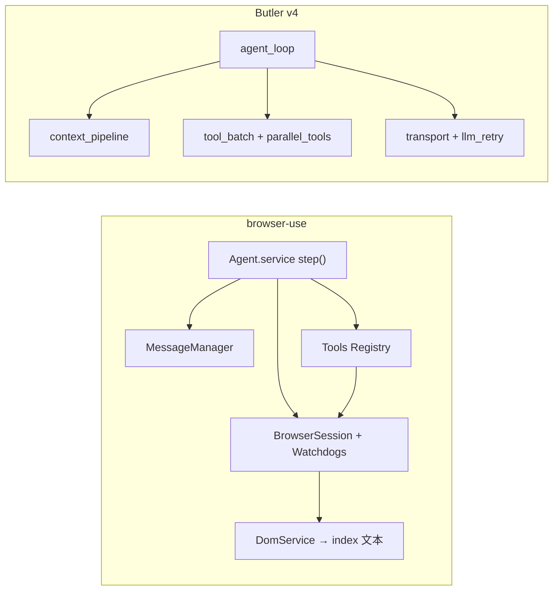

# Butler v4 ↔ browser-use 对照分析报告

> **状态**：分析完成（2026-05-25）；**主线 B 已落地**（Loop 减熵，见路线图 §9）；CDP/截图见 [`four-reports-out-of-scope-2026-05.md`](../decisions/four-reports-out-of-scope-2026-05.md)  
> **对照源**：`reference/browser-use`（browser-use v0.12.8）  
> **产品边界**：[`../architecture/v4-architecture.md`](../../architecture/v4-architecture.md)、[`AGENTS.md`](../../../AGENTS.md)  
> **相关规划**：CC 线束 [`cc-butler-gap-analysis-2026-05.md`](../active/cc-butler-gap-analysis-2026-05.md)、外部对标 [`reference-learning-plan-2026-05.md`](../archive/reference-learning-plan-2026-05.md)

---

## 1. 执行摘要

| 维度 | Butler v4 | browser-use |
|------|-------------|---------------|
| **主场景** | 微信管家 + 多项目编码 Agent | 网页自动化 Agent（CDP） |
| **每步世界状态** | messages + tool results + MEMORY | Browser state（DOM index + 可选截图） |
| **Loop 形态** | 薄编排 `agent_loop.py` + 子模块 | 单体 `agent/service.py`（~4000 行） |
| **Web 能力** | 可选 `web_fetch`（静态 HTML，默认关） | 完整 CDP + DOM 序列化 + 域安全 |

**结论**：browser-use 的核心价值在**浏览器专用**（DOM 索引、截图、域安全、多动作一步）。Butler 的 Loop 骨架、压缩、guardrails、failover 已较强，**不宜在 `butler/core` 内嵌 CDP**；应选择性吸收**循环检测、上下文策略、工具注册、成本与预算**上的细节。

**推荐落地优先级**：Phase A（软 nudge + 预算预警 + compaction 提示）→ Phase B（inject-once spill + 破坏性工具后截断批）→ Phase C（动态 tool 子集 + schema/cost）→ Phase D（产品选做：加强 web_fetch 或 MCP 浏览器）。

---

## 2. 架构对照

### 2.1 数据流（概念）



### 2.2 关键路径对照

| 层级 | browser-use | Butler v4 |
|------|-------------|-----------|
| Agent 主循环 | `browser_use/agent/service.py` | `butler/core/agent_loop.py` |
| 历史/压缩 | `agent/message_manager/service.py` | `context_pipeline.py`、`context_compressor.py`、`post_compact_cleanup.py` |
| 工具注册 | `tools/registry/service.py` | `butler/tools/registry.py` |
| 浏览器/DOM | `browser/`、`dom/serializer/` | 无（可选 `web_fetch`） |
| LLM | `llm/base.py`、`llm/schema.py` | `butler/transport/`、`llm_retry.py`、`schema_recovery.py` |
| 循环检测 | `agent/views.py` `ActionLoopDetector` | `tool_guardrails.py`、`permission_doom_loop` |
| 成本 | `tokens/service.py` | `butler/ops/runtime_metrics.py` |
| Skills | Cloud API + `skills/*/SKILL.md` | orchestrator Skill 路由 |
| MCP | Server + Client 双向 | `BUTLER_MCP_ENABLED` 可选薄客户端 |

### 2.3 browser-use Agent 单步流水线

`run()` → 初始化 browser → `while n_steps <= max_steps` → `step()`：

1. **Phase 0**：captcha 等预处理  
2. **`_prepare_context`**：拉 browser state（含 screenshot）  
3. **`_get_next_action`**：LLM 结构化输出 `AgentOutput`（thinking/memory/next_goal/action[]）  
4. **`_execute_actions`**：`multi_act()` 顺序执行  
5. **`_post_process`**：历史回写、loop nudge、预算提示  

LLM 看到的是**带数字 index 的可交互元素列表**，动作形如 `click(index=5)`，backend 通过 `selector_map` 映射回 DOM 节点。

---

## 3. browser-use 子系统要点

### 3.1 Browser / DOM

| 组件 | 路径 | 职责 |
|------|------|------|
| 会话 | `browser_use/browser/session.py` | CDP、Tab、EventBus、`get_browser_state_summary()` |
| DOM Watchdog | `browser/watchdogs/dom_watchdog.py` | 响应 state 请求、缓存 selector_map |
| DOM 服务 | `dom/service.py` | AX tree + DOM snapshot + iframe |
| 序列化 | `dom/serializer/serializer.py` | 简化树、paint order、bbox、交互 index |
| 可点击检测 | `dom/serializer/clickable_elements.py` | AX/标签/JS listener 启发式 |
| Markdown | `dom/markdown_extractor.py` | 页面 markdown 供 extract |

### 3.2 Tools / Registry

- 内置动作：`tools/service.py`（navigate/click/input/scroll/extract/done/write_file 等）
- `@registry.action` 装饰器 + Pydantic param model
- **`create_action_model(page_url)`**：按 URL `domains` 动态生成 action union，缩小 schema
- **Special 注入**：`browser_session`、`file_system`、`page_extraction_llm`、`sensitive_data` 等对 LLM 不可见

### 3.3 安全

| 机制 | 路径 | 说明 |
|------|------|------|
| URL 白名单 | `browser/profile.py`、`watchdogs/security_watchdog.py` | `allowed_domains`；违规 → `about:blank` |
| IP 阻断 | `security_watchdog.py` | 非标准 IPv4 编码防 bypass |
| 敏感数据 | `utils.py` + message_manager + registry | `<secret>key</secret>` 占位；按 URL 域注入；日志 redact |

### 3.4 循环 / 预算 / 多动作

| 机制 | 说明 |
|------|------|
| `ActionLoopDetector` | 20 步 rolling hash；page fingerprint（url+dom hash+element count）；**软 nudge**，不硬阻断 |
| `_inject_budget_warning` | ≥75% `max_steps` 注入收尾提示 |
| `multi_act()` | 默认每步最多 5 动作；`terminates_sequence`；URL/focus 变化后截断队列 |
| 末步/失败 | 动态切换 `DoneAgentOutput` schema |

### 3.5 其它

- **结构化提取**：`tools/extraction/schema_utils.py` + `extract` 动作 + 专用 `page_extraction_llm`
- **Agent 工作区 FS**：`filesystem/file_system.py`（任务沙箱，非用户全盘）
- **MCP**：`mcp/server.py`（暴露 agent）、`mcp/controller.py`（消费外部 MCP）
- **Skills**：Cloud API（需 `BROWSER_USE_API_KEY`）+ Claude Code `SKILL.md` + `skill_cli/` daemon
- **Judge**：`agent/judge.py` 任务完成后独立 LLM + 截图评轨迹

---

## 4. 不建议整包移植的能力

与微信编码管家**产品边界**和**威胁模型**不匹配：

| 类别 | 原因 |
|------|------|
| 整套 CDP / DOM 索引点击 / 每步截图 | Butler 主路径是代码工具，不是 Web UI |
| SecurityWatchdog（allowed_domains、IP 阻断） | 威胁面是仓库路径、terminal、出站消息 |
| multi_act 的 URL/focus 守卫 | 无页面导航语义；用 read_state / tool_batch 不同机制 |
| Paint order / clickable / iframe DOM | 纯 Web UI |
| Cloud Skills API、skill_cli daemon | 依赖远程浏览器 + cookies |
| Captcha / 代理 / Cloud Browser | 无浏览器会话 |
| Judge + 截图轨迹 | 实现形态不同；概念可单独借鉴无截图 judge |
| MCP Server 暴露完整 Browser Agent | Butler MCP 为可选薄客户端，非 Host 级 |
| demo_mode / GIF / cloud_events | 产品形态不同 |

**明确不做（除非产品改边界）**：在 `butler/core` 内嵌 CDP、每步截图、browser-use Cloud Skills。

**已有轻量替代**：`butler/tools/web_fetch.py`（`BUTLER_ENABLE_WEB_FETCH`）；真需交互网页时优先考虑 **MCP 浏览器** 或独立子进程。

---

## 5. 值得提炼的优化点（按优先级）

### P0 — 低成本，直接增强现有 Loop

#### 5.1 软循环检测 + 停滞指纹（对标 `ActionLoopDetector`）

**browser-use**：归一化 action hash + page fingerprint；5/8/12 档 escalates **nudge**，不 block。

```157:161:reference/browser-use/browser_use/agent/views.py
class ActionLoopDetector(BaseModel):
	"""Tracks action repetition and page stagnation to detect behavioral loops.
	This is a soft detection system — it generates context messages for the LLM
	but never blocks actions."""
```

**Butler 现状**：`tool_guardrails.py` 硬 guardrails（失败重复、无进展只读、`doom_loop` ask/block）；`LoopTransitionReason` 可观测。

**建议**：

- 增加**软 nudge 层**（仅注入短提示），与 `doom_loop` 硬阻断并存
- 对 `grep`/`read_file` 等做**参数归一化 hash**（借鉴 `_normalize_action_for_hash`）
- 编码场景 fingerprint：`project_id` + 最近 N 次 tool hash + 可选 `git status` 摘要哈希（替代 DOM）

**改动面**：`butler/tool_guardrails.py`、`butler/core/agent_loop.py`  
**复杂度**：低

---

#### 5.2 迭代/步数预算预警（对标 75% budget warning）

**browser-use**：接近 `max_steps` 时注入「先落盘再 done」。

**Butler 现状**：`turn_token_budget.py`（`+500k`、`/budget`）偏用户主动扩预算。

**建议**：`iteration / max_iterations >= 0.75`（或 token 估算达阈值）时注入收尾提示；微信可同步一句「本轮接近上限」。

**改动面**：`agent_loop.py`、`turn_token_budget.py`、可选 gateway  
**复杂度**：低

---

#### 5.3 大结果「只注入一轮」（对标 `include_extracted_content_only_once`）

**browser-use**：`ActionResult` 可将 extract 标为仅下一步可见。

**Butler 现状**：`tool_result_storage` spill + `tool_prune_policy` 语义接近。

**建议**：对 `web_fetch`、超长 `grep`、未来 MCP 结果，spill 元数据加 `inject_once`：首轮完整/指针，后续仅指针+一行摘要。

**改动面**：`tool_result_storage.py`、`tool_prune_policy.py`  
**复杂度**：低–中

---

#### 5.4 压缩摘要：未完成标 IN-PROGRESS

**browser-use**：message compaction 强调勿将未完成步骤标为 done。

**Butler 现状**：`post_compact_cleanup` 已重注入 MEMORY/任务锚点。

**建议**：在 compaction 提示词中显式约束，减少压缩后误结束任务。

**改动面**：`context_compressor.py` 或 compaction prompt  
**复杂度**：低

---

### P1 — 中等收益，与 CC 线束/权限对齐

#### 5.5 按上下文动态缩小工具列表

**browser-use**：`create_action_model(page_url)` 按 domains 过滤 action union。

**Butler 现状**：`.butler/permissions.yaml`、workflow 步骤权限、`delegate_policy`。

**建议**：orchestrator/registry 支持按项目、plan mode、workflow step **`exclude_tools`**，API 前 schema 只暴露子集。

**改动面**：`tools/registry.py`、`permissions.py`  
**复杂度**：中

---

#### 5.6 Special 参数注入约定统一

**browser-use**：动作声明 `browser_session` 等，registry 自动注入。

**建议**：统一 Butler 工具可请求的隐式依赖（`project_root`、`session_key`、`auxiliary_client`），减少各工具散落 `os.getenv`。

**改动面**：`tools/registry.py`、`execution_context.py`  
**复杂度**：中

---

#### 5.7 破坏性工具后截断同批后续动作

**browser-use**：URL/focus 变化或 `terminates_sequence` 后丢弃 multi_act 队列剩余项。

**Butler 映射**：`patch`/`write_file`/`git_commit` 后，同批 `streaming_tools` 预取应作废或重跑；与 `read_state` 双保险。

**改动面**：`tool_batch.py`、`parallel_tools.py`  
**复杂度**：中

---

#### 5.8 SchemaOptimizer（结构化输出）

**browser-use**：`llm/schema.py` flatten `$ref`、`additionalProperties: false`、OpenAI strict。

**建议**：与 `schema_recovery.py` 互补，减少 schema 400。

**改动面**：`transport/` 或 `schema_recovery.py`  
**复杂度**：低–中

---

#### 5.9 TokenCost / 按模型定价

**browser-use**：`tokens/service.py` LiteLLM 定价缓存，run 级 cost。

**建议**：`runtime_metrics` 增 model × usage → 估算费用，对齐 `docs/ops/diagnostic-thresholds.md`。

**改动面**：`butler/ops/runtime_metrics.py`  
**复杂度**：中

---

### P2 — 可选能力包（产品决策后）

| 能力 | 建议 |
|------|------|
| 静态网页 | 加强 `web_fetch` markdown（借鉴 `markdown_extractor`），仍不必上 CDP |
| 结构化抽取 | 辅助模型 + Pydantic，不必 page markdown 管线 |
| 敏感信息 | 借鉴日志 redact、**按 project_id** 作用域，非网页域名填表 |
| MCP | 参考 `MCPToolWrapper` 动态注册，不复制 browser MCP server |
| 事后 Judge | 无截图轻量 judge（测试是否绿 / ground_truth） |

---

## 6. Top 15 可学习模式（速查）

| # | 模式 | browser-use 路径 | 移植复杂度 | Butler 映射 |
|---|------|-------------------|------------|-------------|
| 1 | EventBus + Watchdog | `browser/session.py`, `watchdogs/*` | 高 | 理念可借鉴 gateway 事件，非 CDP |
| 2 | DOM 索引 + selector_map | `dom/serializer/serializer.py` | 高 | path/line，非 DOM index |
| 3 | AX + Snapshot 融合 | `dom/service.py` | 高 | 领域无关 |
| 4 | Paint order / bbox 去噪 | `dom/serializer/paint_order.py` | 中 | 思想→ tool result prune |
| 5 | 动态 Action Union | `tools/registry/service.py` | 中 | 动态 tool 子集 |
| 6 | Special Param 注入 | `tools/registry/service.py` | 低–中 | execution_context 统一 |
| 7 | Multi-Act + 页面守卫 | `agent/service.py` `multi_act()` | 低–中 | 破坏性工具后截断批 |
| 8 | 软 Loop Detection | `agent/views.py` | **低** | 软 nudge + hash 归一化 |
| 9 | Message Compaction | `message_manager/service.py` | **低** | 已有 pipeline；补 IN-PROGRESS |
| 10 | Budget Warning 75% | `agent/service.py` | **低** | turn_token_budget 预警 |
| 11 | Sensitive Data 域隔离 | `utils.py`, registry | 中 | project scoped secret + redact |
| 12 | SchemaOptimizer | `llm/schema.py` | 低 | schema_recovery 互补 |
| 13 | Fallback LLM 整 run | `agent/service.py` | 低 | 已有 failover |
| 14 | TokenCost | `tokens/service.py` | 低–中 | runtime_metrics 成本维 |
| 15 | Judge 轨迹 | `agent/judge.py` | 中 | 可选无截图 judge |

**Honorable mentions**：`read_state` / extract 只出现一次；`terminates_sequence`；`flash_mode`；`page_extraction_llm` 专用便宜模型；CLI skill daemon。

---

## 7. 与 Butler 已有能力重叠（避免重复造轮）

| browser-use | Butler v4（已实现） |
|-------------|---------------------|
| LLM retry / schema 恢复 | `llm_retry.py`、`schema_recovery.py` |
| 上下文压缩 | `context_pipeline`、`reactive_compact`、`post_compact_cleanup` |
| Tool guardrails | `tool_guardrails.py`、`doom_loop` |
| 大结果 spill | `tool_result_storage.py` |
| 流式只读预执行 | `streaming_tools.py` |
| Failover | transport `fallback` + orchestrator |
| 读后再改 | `read_state.py` |
| 并行工具批 | `parallel_tools.py` |
| Loop 可观测 | `LoopTransitionReason`、`runtime_metrics` |
| MCP（可选） | `BUTLER_MCP_ENABLED` 规划 |
| Skills | orchestrator Skill 路由 |

---

## 8. 推荐落地路线图

| 阶段 | 内容 | 预期收益 | 预估工时 |
|------|------|----------|----------|
| **Phase A** | 软 loop nudge + 75% 迭代预警 + compaction IN-PROGRESS | 少卡死、少误报完成 | 1–2 天 |
| **Phase B** | `inject_once` spill + patch 后截断 streaming 批 | 降 token、少 stale read | 3–5 天 |
| **Phase C** | 动态 tool 子集 + special 注入统一 + SchemaOptimizer + TokenCost | 更安全、更少 schema 失败、可观测成本 | ~1 周 |
| **Phase D** | 加强 web_fetch markdown；或 MCP 浏览器子能力 | 真需网页交互时 | 产品选做 |

### 验收建议（改代码后）

```bash
cd /path/to/WFXM
PYTHONPATH=. pytest tests/test_cc_p3_p4_features.py tests/test_runtime_metrics.py \
  tests/test_tool_result_storage.py -q
# 若改 guardrails / loop
PYTHONPATH=. pytest tests/ -k "guardrail or doom_loop or tool_batch" -q
```

---

## 9. 关键代码锚点（便于跳转）

**Multi-act 守卫**（`reference/browser-use/browser_use/agent/service.py` ~2710）：

- `terminates_sequence` 后跳过剩余动作  
- `post_action_url != pre_action_url` 或 focus 变化后截断队列  

**Butler 流式只读**（`butler/core/streaming_tools.py`）：

- `STREAMING_TOOL_NAMES`、`on_tool_call_ready` 参数 JSON 完整即 dispatch  

**Butler 硬 guardrails**（`butler/tool_guardrails.py`）：

- `IDEMPOTENT_TOOLS` / `MUTATING_TOOLS`、`GuardrailDecision` allow/warn/block/halt  

---

## 10. 文档维护

| 若落地项涉及 | 请同步 |
|-------------|--------|
| CC 线束能力 | `cc-butler-gap-analysis-2026-05.md`、`v4-architecture.md` |
| 新 `BUTLER_*` | `docs/config/reference.md`、`.env.example` |
| 阈值 | `docs/ops/diagnostic-thresholds.md` |

---

*报告生成：2026-05-25，基于 `reference/browser-use` 源码阅读与 Butler v4 架构文档/代码核对。*
