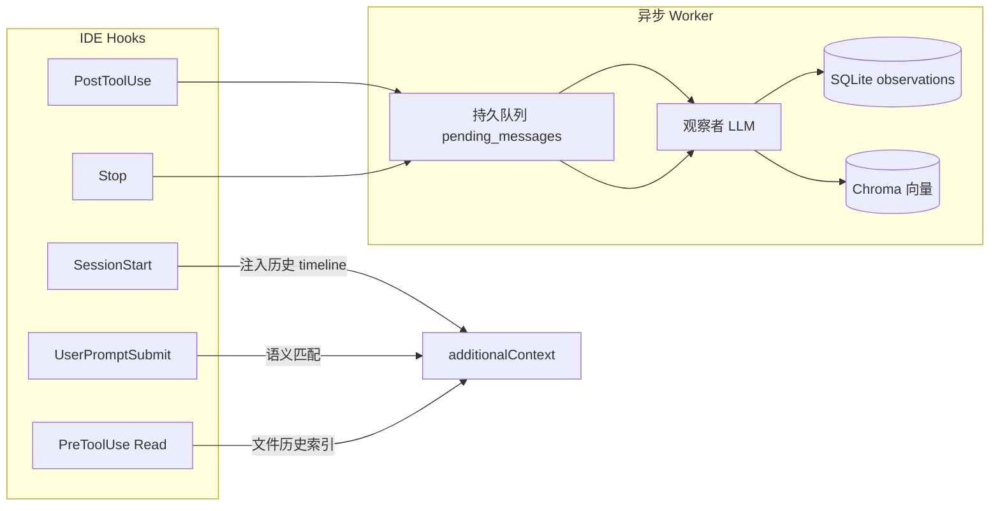
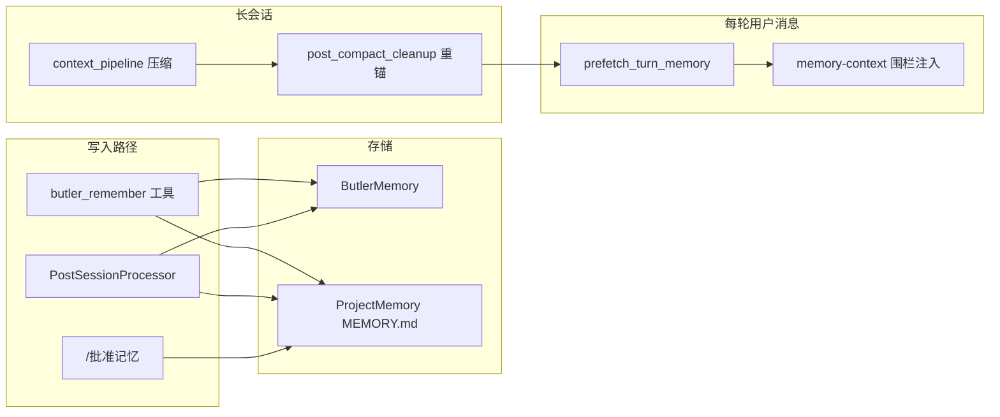

# claude-mem ↔ Butler v4 对照分析报告

> **日期**：2026-05-25  
> **对照源**：`reference/claude-mem`（本地 gitignore，不嵌入运行时）  
> **Butler 基线**：[`v4-architecture.md`](../../architecture/v4-architecture.md)、[`four-reports-improvement-roadmap-2026-05.md`](../roadmaps/four-reports-improvement-roadmap-2026-05.md)（四报告 A 线检索已落地）、[`four-reports-out-of-scope-2026-05.md`](../decisions/four-reports-out-of-scope-2026-05.md)  
> **原则**：只借鉴记忆工程方法论，不引入 Bun Worker、Chroma MCP、uv Python 栈、IDE 插件 Host  
> **文档类型**：对照分析报告（正文 P0/P2 表为历史提炼，**非待办**）  
> **状态**：**主线 F 子集已落地**（PR-F1–F6、P5–P10；见五报告路线图 §9）  
> **合并路线图**：[`five-reports-improvement-roadmap-2026-05.md`](../roadmaps/five-reports-improvement-roadmap-2026-05.md) **主线 F**  
> **决策入口**：[`roadmap-backlog-and-boundaries-2026-05.md`](../decisions/roadmap-backlog-and-boundaries-2026-05.md)  
> **并行主线**：CC 线束见 [`cc-butler-gap-analysis-2026-05.md`](../active/cc-butler-gap-analysis-2026-05.md)

---

## 1. 执行摘要

| 维度 | claude-mem | Butler v4 |
|------|------------|-----------|
| 主场景 | Claude Code / Cursor / OpenCode 等 IDE 插件 | 微信远程管家 + 多项目自建 Agent Loop |
| 记忆哲学 | **观察者 LLM** 压缩每次工具调用 → 结构化 observation | **分层 Markdown + SQLite** + 会话后 LLM 批量提炼 |
| 注入时机 | SessionStart / UserPromptSubmit / PreToolUse(Read) / Stop | 每轮 prefetch + 压缩后 re-anchor |
| 人类可编辑 | 弱（viewer + `<private>` 标签） | 强（`MEMORY.md` + `/批准记忆` Pending 门控） |
| 检索 API | MCP 三层：search → timeline → get_observations | `butler_recall` + hybrid prefetch + CLI verbose |
| 向量层 | Chroma per-project + SQLite FTS 混合 | 本地 `semantic_index` + experience FTS5 |

**结论**：

- **Butler 不必变成 claude-mem 的 IDE 插件形态**，但应吸收其**记忆工程方法论**：渐进披露、工具级捕获、结构化 observation、文件上下文门控。
- **Butler 已对齐**：跨会话持久化、hybrid RAG、会话后提炼、查询对齐 prefetch、压缩后 re-anchor、人工 Pending 门控、启发式 sub-query。
- **最大缺口**：工具级 observation 管道、三层 recall API、PreRead 文件上下文、`<private>` 隐私协议。
- **快速见效（P0）**：`<private>` 标签 + 三层 recall 工具（复用现有 `semantic_index`，无需新基础设施）。
- **质量跃迁（P1）**：观察者队列（PostToolUse 异步压缩 + 结构化 observation 表）。

---

## 2. 定位差异：两套产品哲学

**claude-mem** 的核心理论：**「Hook 驱动的观察者分离 + 结构化 observation 存储 + 渐进披露检索」**。

- 主 Agent 专注执行任务；独立观察者 LLM 旁观工具调用并写入压缩记忆。
- Hook 非阻塞：PostToolUse 入队，Worker 异步压缩。
- 检索强制三层 workflow，约 10× token 节省。

**Butler v4** 的核心理论：**「微信单写者 + 人类可编辑项目记忆 + 查询对齐注入」**。

- 记忆写入以 `MEMORY.md`（人类可读）和 experience.db（机器检索）为主。
- PostSession 批量 LLM 提炼（每 8 条 / 会话结束），非 per-tool 实时压缩。
- Pending + `/批准记忆` 保证决策类记忆不自动污染正式 corpus。

两者不是替代关系；在 Butler 产品边界内抽取设计，不搬迁 claude-mem 运行时（Bun Worker、Chroma、Viewer UI）。

---

## 3. 架构对照

### 3.1 claude-mem 数据流



**关键模块（reference 路径）**：

| 能力 | 路径 |
|------|------|
| Hook  wiring | `plugin/hooks/hooks.json` |
| 上下文注入 | `src/cli/handlers/context.ts`、`src/utils/context-injection.ts` |
| 工具观察入队 | `src/cli/handlers/observation.ts` |
| 文件读前上下文 | `src/cli/handlers/file-context.ts` |
| 会话摘要 | `src/cli/handlers/summarize.ts` |
| 观察者压缩 | `src/services/worker/agents/ResponseProcessor.ts` |
| 渐进披露检索 | `plugin/skills/mem-search/SKILL.md`、`src/services/worker/SearchManager.ts` |
| 数据库 schema | `src/services/sqlite/schema.sql` |
| 向量同步 | `src/services/sync/ChromaSync.ts` |
| 隐私标签 | `src/utils/tag-stripping.ts` |

### 3.2 Butler v4 数据流



**关键模块（Butler 路径）**：

| 能力 | 路径 |
|------|------|
| 全局 + 项目记忆 | `butler/memory/butler_memory.py`、`project_memory.py` |
| 工具 / 编排 facade | `butler/memory/facade.py` |
| Hybrid 检索 | `butler/memory/semantic_index.py` |
| 每轮 prefetch | `butler/session_lifecycle.py` |
| 会话后提炼 | `butler/post_session.py` |
| 压缩后重锚 | `butler/core/post_compact_cleanup.py` |
| 工具 observation 审计 | `butler/core/session_transcript.py`（JSONL preview，300 字符） |
| 微信记忆命令 | `butler/gateway/memory_commands.py` |
| 子 query 分解 | `butler/memory/query_decompose.py` |

---

## 4. 已对齐能力（避免重复造轮子）

| claude-mem 概念 | Butler 等价 | 模块 |
|-----------------|-------------|------|
| 跨会话持久化 | ✅ 租户级 + 项目级双层 | `butler_memory.py`、`project_memory.py` |
| 语义 + 关键词混合检索 | ✅ RRF 合并 FTS + vector | `semantic_index.py` |
| 会话结束压缩提炼 | ✅ 双通道 memory + skill | `post_session.py` |
| 查询对齐注入（非全量重载） | ✅ `<memory-context>` 围栏 | `session_lifecycle.py` |
| 渐进披露（摘要先行） | ✅ 任务报告 `/详细`；CLI `--verbose` | `report.py`、`search_cli.py` |
| 人工审核写入 | ✅ Pending + `/批准记忆` | `gateway/memory_commands.py` |
| 压缩后记忆恢复 | ✅ re-anchor MEMORY/AGENTS/DESIGN | `post_compact_cleanup.py` |
| 工具失败纠错召回 | ✅ corrective_recall | `corrective_recall.py` |
| 启发式多路召回 | ✅ sub-query 分解 | `query_decompose.py` |
| Markdown 切块索引 | ✅ heading-tree chunk + reindex | `chunking.py`、`reindex.py` |
| 时间衰减 + 访问加权 | ✅ retrieval_ranking | `retrieval_ranking.py` |
| 显式 remember/recall 工具 | ✅ butler_remember / butler_recall | `facade.py` |

---

## 5. 差距与 claude-mem 可提炼优化点

### 5.1 【P0】三层渐进披露检索 API

**claude-mem 做法**（`plugin/skills/mem-search/SKILL.md`）：

1. **search** — 返回 ID + 标题 + 类型 + `~Read` token 估算（~50–100 tok/条）
2. **timeline** — 以 observation 为锚点，取前后 chronology
3. **get_observations** — 仅对筛选后的 ID 批量拉全文（~500–1000 tok/条）

**Butler 差距**：`butler_recall` / prefetch 直接把内容块注入上下文，无「索引 → 筛选 → 按需展开」工具链。

**建议落地**：

```python
# 概念 API（butler_recall mode 或独立工具）
memory_search_index(query, limit=20)   # 仅 id/title/score/est_tokens
memory_timeline(anchor_id, depth=5)     # 时间线上下文
memory_fetch(ids=[...])               # 批量全文
```

- 数据层：扩展 `experience.db` 或新增 `observations` 表
- 检索层：复用 `semantic_index.hybrid_search`，摘要字段格式化
- 注入层：prefetch 默认只注入 index；Agent 需要时再 fetch

**插入点**：`butler/memory/facade.py`、`butler/tools/registry.py`

---

### 5.2 【P0】`<private>` 隐私标签协议

**claude-mem 做法**（`src/utils/tag-stripping.ts`）：

- Hook 层剥离 `<private>...</private>`，整条 prompt 全 private 则跳过整轮存储
- 在数据到达 Worker/DB 之前处理（边缘剥离）

**Butler 差距**：有 injection 检测（`butler_memory.py` `_INJECTION_PATTERNS`），无用户可控隐私边界。

**建议**：

- 用户消息 / 工具结果入库前 strip `<private>`
- 微信场景尤其重要

**插入点**：`butler/gateway/message_handler.py` 入站、`post_session.py` 提炼前

---

### 5.3 【P1】观察者队列：PostToolUse → 异步压缩

**claude-mem 做法**：

- 每次 PostToolUse 把工具 I/O 入队 `pending_messages`
- 观察者 LLM 输出结构化 XML（type/title/facts/narrative/concepts/files）
- `UNIQUE(memory_session_id, content_hash)` 去重
- Chroma 异步向量同步

**Butler 现状**（`session_transcript.record_tool_observation`）：

- 仅 JSONL preview，300 字符截断
- PostSession 批量提炼会丢失中间工具细节

**建议**：

1. tool_batch 完成后入 `pending_observations` 队列（SQLite）
2. 后台 auxiliary LLM 异步压缩（复用 `post_session.py` 模式）
3. 写入带 `content_hash` 去重的 observation 行
4. 开关：`BUTLER_OBSERVER_MEMORY=0`（默认关，成本可控）

**插入点**：`butler/tools/registry.py` → 新模块 `butler/memory/observer_queue.py`

---

### 5.4 【P1】PreRead 文件上下文门控

**claude-mem 做法**（`src/cli/handlers/file-context.ts`）：

- PreToolUse(Read) 拦截：文件 ≥ 1500 bytes 且 mtime 未变
- 注入该文件的 observation 索引（仅 ID + 标题 + 类型，≤15 条）
- 文件 mtime 比最新 observation 新则跳过

**Butler 差距**：有 `BUTLER_READ_BEFORE_EDIT` 和 read_state，无「读之前先给文件历史摘要」。

**建议**：在 `read_file` dispatch 前查 path 相关 observation / MEMORY / 最近 edit，prepend 紧凑 index。

**插入点**：`butler/tools/registry.py` read 路径，或 `butler/hooks/runner.py` PreToolUse

---

### 5.5 【P1】结构化 Session Summary（Stop 钩子）

**claude-mem 做法**（`src/cli/handlers/summarize.ts`）：

- Stop hook 生成固定 schema：`request` / `investigated` / `learned` / `completed` / `next_steps`
- 写入 `session_summaries` 表，Chroma 同步

**Butler 差距**：`PostSessionProcessor` 为自由格式 JSON updates，无跨会话可检索的 session 级摘要实体。

**建议**：会话结束额外写 `kind=session_summary`；SessionStart prefetch 优先注入最近 summary 的 `learned` + `next_steps`。

**插入点**：扩展 `post_session.py` prompt、`session_lifecycle.trigger_session_end`

---

### 5.6 【P2】Observation 类型体系 + Mode 配置

**claude-mem 做法**（`plugin/modes/code.json`）：

| type | bugfix / feature / refactor / change / discovery / decision |
| concepts | how-it-works, gotcha, pattern, trade-off, problem-solution 等 |

检索可按 `obs_type=bugfix,decision` 过滤。

**Butler 差距**：experience 仅自由 `category` 字符串，prefetch 无法按类型加权。

**建议**：轻量 mode 文件 `butler/config/memory_modes/code--zh.json`，观察者 prompt 引用；检索 API 支持 `type` filter。

---

### 5.7 【P2】Token 经济学可见性

**claude-mem 做法**：

- `discovery_tokens`（原始工具消耗）vs `~Read`（读回压缩 observation 估算）
- 引导模型先 search 再 fetch

**Butler 差距**：有 `token_cost_diagnostics`（四报告 E 线），记忆检索路径未暴露 token 估算。

**建议**：`butler memory search --verbose` 和 prefetch diagnostics 增加 `est_inject_tokens` / `est_fetch_tokens`；`/诊断` 可汇总。

**插入点**：`butler/memory/diagnostics.py`

---

### 5.8 【P2】content_hash 去重

**claude-mem**：`UNIQUE(memory_session_id, content_hash)` 防止重复工具批次产生重复 observation。

**Butler**：PostSession 有 `memory_update_is_duplicate`，tool observation 层没有。

**建议**：观察者写入时 SHA256(title + facts + files)，同 session 内跳过重复。

---

### 5.9 【P3 / 实验】Endless Mode 思路

**claude-mem beta**（`docs/public/endless-mode.mdx`）：

- PostToolUse **阻塞等待**观察者，把压缩 observation 注入并清空 tool input
- 上下文从 O(N) 工具输出变为 O(1) 摘要

**Butler**：已有 `tool_output_prune` + spill + compaction，方向类似但非实时。

**建议**：不作为 P0；若长微信会话仍爆 context，可评估 `BUTLER_INLINE_TOOL_COMPRESS=1` 实验开关。

---

### 5.10 【P3】Memory Viewer / Web UI

**claude-mem**：`localhost:37777` viewer + WebSocket 流。

**Butler 产品边界**：完整 viewer 不在规划内；可加强 `/记忆图谱`（triplets）、`/诊断` memory 段、`butler memory search --verbose` timeline 文本输出。

---

## 6. 优先级路线图

| 优先级 | 能力 | 预期收益 | 工作量 | Butler 插入点 |
|--------|------|----------|--------|---------------|
| **P0** | 三层 recall API（index/timeline/fetch） | 降 token、提 recall 精度 | 中 | `facade.py`、`semantic_index.py` |
| **P0** | `<private>` 隐私标签 | 安全 + 用户信任 | 小 | `message_handler.py`、`post_session.py` |
| **P1** | 观察者队列（PostToolUse 异步压缩） | 填补工具级记忆空白 | 大 | 新 `observer_queue.py`、`registry.py` |
| **P1** | PreRead 文件上下文门控 | 减少重复读文件 | 中 | read 工具 / hooks |
| **P1** | Session summary schema | 跨会话 continuity | 小 | `post_session.py` |
| **P2** | Observation type/mode 配置 | 检索可过滤、可解释 | 中 | 新 config + observer prompt |
| **P2** | Token 经济学 diagnostics | 引导 Agent 行为 | 小 | `diagnostics.py`、`/诊断` |
| **P2** | content_hash 去重 | 减 storage 噪音 | 小 | observer 写入层 |
| **P3** | Inline tool compress (Endless 思路) | 超长会话 | 大 | `tool_batch.py` |
| **P3** | 增强 memory CLI timeline | 运维可见性 | 中 | `search_cli.py` |

---

## 7. 明确不做（产品边界对齐）

与 [`four-reports-out-of-scope-2026-05.md`](../decisions/four-reports-out-of-scope-2026-05.md)、[`AGENTS.md`](../../../AGENTS.md) 对齐：

| claude-mem 能力 | 不做原因 | Butler 已有替代 |
|-----------------|----------|-----------------|
| Chroma MCP + uv Python 栈 | 重依赖；四报告零新增重依赖 | `semantic_index.py` + 可选 API embedding |
| Bun Worker 常驻 HTTP 服务 | Butler 进程内 Loop，非 IDE 插件 | 进程内队列 + auxiliary LLM |
| 完整 Web Viewer | 微信产品形态 | `/诊断` + CLI |
| LLM 子 query 分解 | 四报告 #15 明确不做 | `BUTLER_RAG_SUBQUERY` 启发式 |
| 多 IDE hook installer | Butler 走微信网关 | `butler/hooks/` 会话级 |
| Server-beta 云端 generation | 与本地管家定位冲突 | 本地 PostSession |
| Endless Mode 默认启用 | 阻塞主 Loop，成本与复杂度 | tool prune + compaction |

---

## 8. 与 Butler 独特优势的结合方式

claude-mem 提炼不应削弱 Butler 已有强项，应**叠加**：

1. **Pending 门控**：观察者产出的 `decision` 类 observation 仍走 `/批准记忆`，不自动进正式 MEMORY.md
2. **项目隔离**：observation 带 `project` + tenant，prefetch 默认过滤当前项目
3. **委派场景**：子 Loop tool observation 写入 `child_session_key`；主会话 recall 可聚合（类似 claude-mem subagent skip summary）
4. **微信围栏**：保留 `<memory-context>` 围栏；新增 observation index 也用明确 tag，stream scrubber 同步处理（`memory_context_scrubber.py`）

---

## 9. 相关 Butler 模块与配置速查

### 9.1 核心模块

| 路径 | 角色 |
|------|------|
| `butler/memory/butler_memory.py` | 全局 profile + experience |
| `butler/memory/project_memory.py` | MEMORY.md、facts、Pending |
| `butler/memory/facade.py` | remember/recall 工具 |
| `butler/memory/semantic_index.py` | 向量 + hybrid merge |
| `butler/session_lifecycle.py` | prefetch、sync、post-session |
| `butler/post_session.py` | LLM memory/skill 提取 |
| `butler/core/post_compact_cleanup.py` | 压缩后 re-anchor |
| `butler/core/session_transcript.py` | JSONL 审计（含 tool_observation preview） |
| `butler/gateway/memory_commands.py` | `/批准记忆` 等 |

### 9.2 关键 `BUTLER_*` 开关

| 变量 | 默认 | 用途 |
|------|------|------|
| `BUTLER_SEMANTIC_MEMORY` | `0` | 本地向量 + hybrid recall |
| `BUTLER_SYNC_CONVERSATION_MEMORY` | `0` | 每轮写入 experience conversation 行 |
| `BUTLER_TRANSCRIPT_MEMORY` | `0` | 启用 `/记忆提炼` |
| `BUTLER_PREFETCH_MAX_CHARS` | `3000` | 单轮 memory 块上限 |
| `BUTLER_RAG_SUBQUERY` | `1` | 启发式多路召回 |
| `BUTLER_POST_SESSION_BUFFER_MESSAGES` | `8` | 增量提炼阈值 |
| `BUTLER_CORRECTIVE_RECALL` | `1` | 委派失败纠错召回 |

完整列表：[`docs/config/reference.md`](../../config/reference.md)

---

## 10. claude-mem 参考阅读顺序（移植时）

1. `plugin/hooks/hooks.json` — 生命周期契约
2. `src/cli/handlers/*.ts` — Hook 薄适配层
3. `src/services/worker/http/shared.ts` — ingest + privacy
4. `src/services/worker/agents/ResponseProcessor.ts` — 压缩 → 存储
5. `src/services/context/ContextBuilder.ts` — SessionStart 注入组装
6. `plugin/skills/mem-search/SKILL.md` — 渐进披露 UX
7. `src/services/sqlite/schema.sql` — 数据模型
8. `src/services/sync/ChromaSync.ts` — 向量层（Butler 用 semantic_index 替代）

---

## 11. 总结

**claude-mem 最值得学的三件事**：

1. **记忆工程**：写入结构化、读取渐进披露、注入带 token 预算意识
2. **生命周期钩子粒度**：SessionStart / PromptSubmit / PreRead / PostTool / Stop 分工明确
3. **观察者分离**：主 Agent 不被记忆压缩拖慢；异步队列 + 去重保证质量

**Butler 当前最强项**：人类可编辑 `MEMORY.md`、微信门控、hybrid RAG、压缩后 re-anchor。

**最大缺口**：工具级 observation 管道 + 三层 recall API + PreRead 文件上下文。

**推荐起步**：P0 两项（`<private>` + 三层 recall）；质量跃迁再上 P1 观察者队列。

---

## 12. 变更记录

| 日期 | 说明 |
|------|------|
| 2026-05-25 | 初版：基于 `reference/claude-mem` 源码与 Butler v4 记忆栈对照 |
