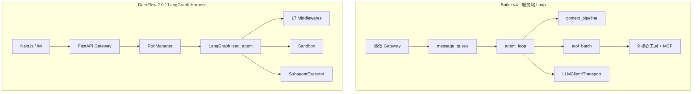

# Butler v4 与 DeerFlow 2.0 对照分析报告

> **日期**：2026-05-25  
> **对照代码**：`reference/deer-flow`（ByteDance DeerFlow 2.0，LangGraph Super Agent Harness）  
> **Butler 事实来源**：[`docs/architecture/v4-architecture.md`](../../architecture/v4-architecture.md)  
> **产品边界**：[`four-reports-out-of-scope-2026-05.md`](../decisions/four-reports-out-of-scope-2026-05.md) · [`five-reports-not-done-2026-05.md`](../decisions/five-reports-not-done-2026-05.md)  
> **原则**：只借鉴设计；不引入 LangGraph 运行时、不替换 Butler Loop；零新增重依赖  
> **文档类型**：对照分析报告（正文 P0/P2 表为历史提炼，**非待办**）  
> **状态**：**主线 L / PR-X2/X4 子集已落地**（见外部 Agent 路线图 §10）  
> **合并路线图**：[`external-agent-reports-improvement-roadmap-2026-05.md`](../roadmaps/external-agent-reports-improvement-roadmap-2026-05.md) **主线 L**、PR-X2/X4  
> **决策入口**：[`roadmap-backlog-and-boundaries-2026-05.md`](../decisions/roadmap-backlog-and-boundaries-2026-05.md)  
> **关联**：CC 线束 [`cc-butler-gap-analysis-2026-05.md`](../active/cc-butler-gap-analysis-2026-05.md) · MCP [`butler-mcp-capability-2026-05.md`](butler-mcp-capability-2026-05.md)

---

## 1. 执行摘要

DeerFlow 2.0（**D**eep **E**xploration and **E**fficient **R**esearch **Flow**）已从 v1 的 Deep Research 框架**彻底重写**为 **Super Agent Harness**：LangGraph + LangChain middleware 链 + Sandbox + Skills + 多通道 IM + Next.js Web UI。Butler v4 是**微信远程管家 + 服务端自建 Agent Loop + 多项目记忆与编码助手**。

**结论**：

- Butler 在**微信网关、上下文经济学（CC P0–P4）、工具 spill、YAML workflow DAG、项目 hybrid RAG、实验 harness** 上已成熟，部分维度**强于** DeerFlow 的通用 harness 默认方案。
- DeerFlow 的最大借鉴价值在 **Harness 工程化细节**（压缩 skill rescue、MCP deferred loading、clarification 中断、provider 安全终止、Deep Research skill 方法论）——而非 LangGraph、OS Sandbox 或 Web UI。
- **不要**为对标 DeerFlow 而引入 LangGraph 或重写 Loop；Butler 的核心优势正是 **Loop 完全自控 + 微信线束 + 上下文纪律**。

**最值得吸收（按优先级）**：

| 优先级 | 方向 | 预估 |
|--------|------|------|
| **P0** | 压缩时保留最近 Skill 读取（skill rescue） | 2–3 天 |
| **P0** | Provider `finish_reason` 安全终止（拒绝后仍带 tool_calls） | 1–2 天 |
| **P0** | MCP deferred `tool_search`（延迟注入 schema） | 3–5 天 |
| **P0** | `ask_clarification` 中断语义（停 turn 追问） | 3–5 天 |
| **P1** | 静态 system + 动态 `<system-reminder>`（prompt cache） | 2–3 天 |
| **P1** | Deep Research 方法论 → Butler Skill | 1–2 天 |
| **P1** | 子 Agent 上下文隔离加强（handoff_only 默认） | 3–5 天 |
| **P1** | 跨会话 Memory debounced LLM 抽取 | ~1 周 |
| **P1** | LoopMiddleware 协议（横切可组合） | 3–5 天 |
| **P2** | MCP Session 持久化池（有状态 MCP） | MCP 深化时 |
| **P2** | RunJournal 式执行追踪 enrich | 与 transcript 演进同步 |

**明确不做**：LangGraph checkpoint、Docker/K8s Sandbox、Next.js Web UI、多 IM 生产化、ACP 桥接 Claude Code、内置 web 搜索提供商套件、LangSmith/Langfuse 默认接入、RAGFlow 级文档 ingest、通宵自治 research loop、全量 MCP Host。

---

## 2. 对照范围说明

| 路径 | 内容 | 与 Butler 关系 |
|------|------|----------------|
| `backend/packages/harness/deerflow/agents/lead_agent/agent.py` | `make_lead_agent`、middleware 组装、`create_agent` | **主对标**（模式参考，不引入 LangGraph） |
| `backend/packages/harness/deerflow/agents/middlewares/` | 17 层横切：sandbox、summarization、memory、clarification、loop detection 等 | **主对标** |
| `backend/packages/harness/deerflow/tools/builtins/tool_search.py` | Deferred MCP tool loading | **P0 提炼** |
| `backend/packages/harness/deerflow/agents/middlewares/summarization_middleware.py` | Skill rescue 压缩 | **P0 提炼** |
| `backend/packages/harness/deerflow/subagents/executor.py` | `SubagentExecutor` 并行子 agent | 与 `delegate_task` / `task_orchestrator` 对照 |
| `backend/packages/harness/deerflow/mcp/` | MCP client、session pool、OAuth | 与 `butler/mcp/` 对照 |
| `backend/packages/harness/deerflow/community/` | Web search/fetch 提供商 | **不引入**；可选 Skill 方法论 |
| `skills/public/deep-research/SKILL.md` | 多阶段 research 方法论 | **P1 Skill 迁移** |
| `backend/app/channels/wechat.py` | 微信 IM 适配 | 与 `butler/gateway/` 对照，不替换 |
| `frontend/` | Next.js workspace UI | **不适用** |
| `config.example.yaml` | 反射式插件配置 | 设计参考 |

官方说明：`reference/deer-flow/README_zh.md`

---

## 3. 架构对比



| 维度 | DeerFlow 2.0 | Butler v4 |
|------|--------------|-----------|
| **产品形态** | Web UI + 多 IM（含微信）+ Docker | 微信 iLink + CLI |
| **Agent 运行时** | LangGraph `create_agent()` + middleware | 自建 `agent_loop.py` + 子模块 |
| **执行环境** | Local / Docker / K8s Sandbox | 项目目录内工具；terminal allowlist |
| **子 Agent** | `task()` → `SubagentExecutor`（≤3 并发，15min） | `delegate_task` + `task_orchestrator` DAG |
| **记忆** | LLM 抽取 → `memory.json`，debounce | `MEMORY.md` + SQLite hybrid RAG |
| **工具面** | web 搜索套件 + MCP + deferred load | 9 核心工具 + 可选薄 MCP |
| **RAG** | 无向量 RAG；靠 web search + skill | `semantic_index` + `chunking` + `query_decompose` |
| **可观测** | RunJournal + LangSmith/Langfuse | `runtime_metrics` + `/诊断` |
| **配置** | `config.yaml`（`use: package:Class`） | `.env` + `project.yaml` + `BUTLER_*` |
| **人工门控** | `ClarificationMiddleware` 中断 | `human_gate.py` + workflow 确认 |

**核心差异一句话**：DeerFlow 是「通用 Super Agent 产品平台」；Butler 是「微信场景下的编码管家」。

---

## 4. Butler 已有、且质量不弱的能力

| 能力 | Butler 实现 | DeerFlow 对应 |
|------|-------------|---------------|
| 上下文压缩 + 锚点重注入 | `context_compressor` + `post_compact_cleanup.py` | `DeerFlowSummarizationMiddleware` |
| 分级工具结果剪枝 | `tool_prune_policy.py` | summarization 内 skill rescue（思路相近） |
| 大结果 spill | `tool_result_storage.py` | sandbox output truncation |
| 委派 + 深度限制 | `delegate_policy.py`（MAX_DEPTH=2） | `SubagentExecutor` |
| DAG 工作流 | `task_orchestrator.py` + YAML workflow | 单 lead graph |
| Skills 按需加载 | `skills_list` / `skill_view` | prompt index + `read_file` SKILL.md |
| 人工门控 | `human_gate.py` | `ClarificationMiddleware`（形态不同） |
| 循环检测 | `tool_guardrails.py` | `LoopDetectionMiddleware` |
| 入站队列 | `message_queue.py`（now/next/later） | IM channel session override |
| 流式预取 | `streaming_tools.py` | SSE StreamBridge |
| 本地 hybrid RAG | `semantic_index.py` + `query_decompose.py` | 无向量 RAG |
| MCP 薄客户端 | `butler/mcp/manager.py` | `MCPSessionPool` + deferred loading |
| Provider 熔断 | `provider_health.py`（`BUTLER_PROVIDER_CIRCUIT`） | `circuit_breaker` in config |

---

## 5. 可从 DeerFlow 提炼的优化点

### 5.1 P0 — 高价值、低侵入、符合 Butler 边界

#### 5.1.1 压缩时保留最近 Skill 读取（Skill Rescue）

**DeerFlow 做法**：`DeerFlowSummarizationMiddleware._partition_with_skill_rescue()` 识别 `read_file` 读 skill 的路径，压缩时保留最近 N 个 skill 相关 tool call/result（默认 5 个 skill、25k tokens 上限）。

**Butler 缺口**：已有 `post_compact_cleanup` 重注入 MEMORY/任务/DESIGN 锚点，但**未在压缩前 rescue 最近 skill 读取消息**。

**落地建议**：

- 模块：`butler/core/context_compressor.py` 或 `context_pipeline.py`
- 识别 `skill_view` / `read_file` 指向 skill 路径
- 开关：`BUTLER_COMPACT_SKILL_PRESERVE=1`

**参考**：`reference/deer-flow/backend/packages/harness/deerflow/agents/middlewares/summarization_middleware.py`

---

#### 5.1.2 MCP 延迟加载（Deferred Tool Search）

**DeerFlow 做法**：`tool_search` + `DeferredToolRegistry`；MCP 工具不一次性全量注入 schema，agent 用 regex 搜索后 promote。

**Butler 缺口**：MCP 启用后工具列表直接挂进 registry（`butler/mcp/manager.py`），工具多时 context 膨胀。

**落地建议**：

- 新增内置工具 `tool_search`（或 `mcp_discover`）
- MCP 注册进 deferred registry，仅暴露 name + 短描述
- 与 `BUTLER_MCP_ENABLED`、`.butler/mcp.yaml` 兼容
- 与五报告 P2「MCP/Skill SSOT」方向一致，可先做 deferred loading 小块

**参考**：`reference/deer-flow/backend/packages/harness/deerflow/tools/builtins/tool_search.py`

---

#### 5.1.3 澄清问题中断语义（Clarification Interrupt）

**DeerFlow 做法**：`ClarificationMiddleware` 拦截 `ask_clarification`，`Command(goto=END)` 中断，等用户回复再继续。

**Butler 缺口**：无等价澄清工具；信息不足时 agent 可能继续猜测执行。

**落地建议**：

- 新增可选工具 `ask_clarification`（question / options / context）
- 在 `tool_batch.py` 或 gateway 层识别后结束当前 turn，经 `outbound_bridge` 发问
- 与 `human_gate` 区分：human_gate 是 workflow 步骤审批；clarification 是 agent 主动追问

**参考**：`reference/deer-flow/backend/packages/harness/deerflow/agents/middlewares/clarification_middleware.py`

---

#### 5.1.4 Provider 安全终止（Safety Finish Reason）

**DeerFlow 做法**：`SafetyFinishReasonMiddleware` 在 tool 执行前拦截 `content_filter` / refusal 类 finish_reason。

**Butler 缺口**：有 `content_sanitize.py` 和 provider circuit，但**无专门的 finish_reason → 终止 guard**。

**落地建议**：

- 模块：`butler/core/llm_retry.py` 或 transport 层
- 命中则返回用户可读说明并结束 turn，不进入 `tool_batch`

**参考**：`reference/deer-flow/backend/packages/harness/deerflow/agents/middlewares/safety_finish_reason_middleware.py`

---

#### 5.1.5 静态 System + 动态 `<system-reminder>`（Prompt Cache）

**DeerFlow 做法**：`DynamicContextMiddleware` 将日期、memory 等以 `<system-reminder>` 注入首条 human message，保持 system 静态以利于 cache。

**Butler 现状**：`cache_safe_delegate.py` 已做委派侧 cache 对齐；主 loop orchestrator 仍可能把动态块混进 system。

**落地建议**：

- 审计 `butler/orchestrator.py` 每轮 system 拼接
- 动态块移到 user 侧 reminder
- 与 `BUTLER_SCHEMA_OPTIMIZE` 策略统一文档化

---

### 5.2 P1 — 中等价值，需设计但仍在边界内

| 项 | DeerFlow 参考 | Butler 落地方向 |
|----|---------------|-----------------|
| **Deep Research Skill** | `skills/public/deep-research/SKILL.md` | 改写为 Butler skill；用 `web_fetch` + `knowledge_search`，不引入 Tavily/Serper |
| **子 Agent 上下文隔离** | `SubagentExecutor` 干净 message 列表 | `delegate_context.py` 加强 handoff_only；workflow 已有概念 |
| **跨会话 Memory 抽取** | `MemoryMiddleware` + debounce queue | 写入 `butler_memory.py` / `project_memory.py`；`BUTLER_MEMORY_AUTO_EXTRACT=0` 默认 |
| **LoopMiddleware 协议** | 17 层 middleware 组装 | 轻量 `before_llm`/`after_tools` 钩子列表，不引入 LangChain |
| **MCP Session 池** | `mcp/session_pool.py` | Playwright 等有状态 MCP 深化时再做 |

---

### 5.3 P2 — 可选、或需单独立项

| 项 | 说明 |
|----|------|
| RunJournal 式执行追踪 | enrich `session_transcript.jsonl`，不必上 LangGraph checkpointer |
| Plan mode + todos | 与现有 `session_todos` 锚点统一 UX |
| Custom Agent + SOUL.md | Butler 用 `agent_profiles` + project.yaml，形态不同 |
| Upload → Markdown | 四报告不做 MinerU/Docling；若做应另立项 |
| Skill 自进化 | agent 写 custom skill + LLM 审核；需安全评审 |
| Harness/App 边界 | 单仓即可；测试边界可参考 DeerFlow `test_harness_boundary` |

---

## 6. 明确不建议从 DeerFlow 引入的项

| DeerFlow 能力 | 不做原因 | Butler 文档依据 |
|---------------|----------|-----------------|
| LangGraph + SQLite/Postgres checkpoint | 与 transcript + 人工门控策略冲突 | 五报告 S9 |
| Docker/K8s Sandbox | 运维与安全面大 | 四报告 #1–2 |
| Next.js Web UI / Chat 前端 | 产品入口是微信 | 五报告 S10 |
| 多 IM 通道 | Butler 微信专用 | v4-architecture |
| ACP 桥接 Claude Code/Codex | 不做 IDE/子进程替代 Loop | AGENTS.md |
| 内置 web 搜索提供商套件 | 重依赖 + 非编码主路径 | 可选 MCP 或 `web_fetch` |
| LangSmith/Langfuse 默认接入 | 零外部 APM 依赖 | 四报告 #18 |
| RAGFlow 级文档 ingest | 重依赖 | 四报告 #3–5 |
| 通宵自治 research loop | 需人在回路 | 四报告 #12 |
| 全量 MCP Host + OAuth 浏览器 | 维护面过大 | 五报告 S11 |

---

## 7. 能力矩阵

```
                    Butler 强    平手    DeerFlow 强
─────────────────────────────────────────────────
微信网关/队列           ████
上下文/token 经济       ████
项目 RAG/hybrid         ████
YAML workflow DAG       ████
实验 harness/账本       ████
委派深度控制            ███
Skills 按需加载         ███        ███
Loop 循环检测           ███        ███
MCP 集成                ██         ████
压缩后锚点              ████       ███
Skill 压缩 rescue       ░░         ████   ← P0 可提炼
MCP deferred load       ░░         ████   ← P0 可提炼
Clarification 中断      ░░         ████   ← P0 可提炼
Safety finish guard     ░░         ████   ← P0 可提炼
Web 研究方法论          ░░         ████   ← P1 Skill 迁移
OS Sandbox              ░░         ████   ← 不做
Web UI                  ░░         ████   ← 不做
多 IM                   ░░         ████   ← 不做
Checkpoint 续跑         ██         ████   ← 不做 LangGraph 版
跨会话 LLM memory       ██         ████   ← P1 可选
```

---

## 8. 推荐落地路线图

| 阶段 | 项 | 预估 | 模块 |
|------|-----|------|------|
| **Phase A** | Skill 压缩 rescue | 小 | `context_compressor` / `context_pipeline` |
| **Phase A** | Safety finish_reason guard | 小 | `llm_retry` / transport |
| **Phase B** | MCP deferred `tool_search` | 中 | `butler/mcp/` + `tools/registry.py` |
| **Phase B** | `ask_clarification` 中断 | 中 | `tool_batch` + `message_handler` |
| **Phase C** | Deep Research skill 移植 | 小 | `.butler/skills/` |
| **Phase C** | LoopMiddleware 协议 | 中 | `butler/core/` 新模块 |
| **Phase D** | post_session memory 抽取 | 大 | `session_lifecycle` + `butler_memory` |

每项应：**零新增重依赖**、补测试、同步 [`docs/config/reference.md`](../../config/reference.md)。

---

## 9. DeerFlow 模块索引（阅读路径）

| 模块 | 路径 | 说明 |
|------|------|------|
| Lead agent 工厂 | `deerflow/agents/lead_agent/agent.py` | `make_lead_agent`、middleware 链 |
| Skill rescue 压缩 | `deerflow/agents/middlewares/summarization_middleware.py` | `_partition_with_skill_rescue` |
| Clarification 中断 | `deerflow/agents/middlewares/clarification_middleware.py` | `ask_clarification` → END |
| Loop 检测 | `deerflow/agents/middlewares/loop_detection_middleware.py` | 重复 tool call breaker |
| Safety 终止 | `deerflow/agents/middlewares/safety_finish_reason_middleware.py` | finish_reason guard |
| Deferred tools | `deerflow/tools/builtins/tool_search.py` | `DeferredToolRegistry` |
| 子 Agent | `deerflow/subagents/executor.py` | `SubagentExecutor` |
| MCP 池 | `deerflow/mcp/session_pool.py` | 有状态 MCP 保活 |
| 运行时 | `deerflow/runtime/runs/worker.py` | `run_agent` + SSE |
| StreamBridge | `deerflow/runtime/stream_bridge/base.py` | SSE 解耦 |
| Deep Research | `skills/public/deep-research/SKILL.md` | 多阶段 research 方法论 |
| 微信通道 | `backend/app/channels/wechat.py` | IM 适配（对照用） |

---

## 10. 总结

DeerFlow 2.0 最值得 Butler 学的不是 LangGraph 或 Sandbox，而是 **Harness 工程化细节**：

1. **压缩时保护 Skill 上下文**（避免「刚读完 skill 就被压掉」）
2. **MCP 延迟发现**（大工具面的 token 治理）
3. **澄清即中断**（微信场景减少胡编乱造）
4. **Provider 安全终止**（拒绝后仍带 tool_calls 的边界）
5. **Deep Research 作为 Skill 方法论**（而非再叠一套搜索基础设施）

Butler 应继续强化已有优势：**微信线束、上下文经济学、项目 RAG、workflow 门控、实验 harness**。DeerFlow 的 Web UI、OS Sandbox、多 IM、LangGraph checkpoint 与当前产品边界不符，不建议引入。

---

## 11. 变更记录

| 日期 | 说明 |
|------|------|
| 2026-05-25 | 初版：基于 `reference/deer-flow` 与 Butler v4 代码/文档对照 |
