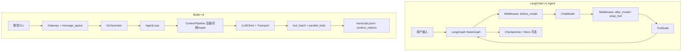

# Butler v4 与 LangChain 对照分析报告

> **日期**：2026-05-25  
> **对照代码**：`reference/langchain`（LangChain 官方 monorepo，含 `libs/langchain_v1`、`libs/core` 等）  
> **Butler 事实来源**：[`docs/architecture/v4-architecture.md`](../../architecture/v4-architecture.md)  
> **原则**：只借鉴设计、零新增 pip 依赖（与 [`reference-learning-plan-2026-05.md`](../archive/reference-learning-plan-2026-05.md) 一致）

---

## 1. 执行摘要

LangChain v1 Agent 建立在 **LangGraph 状态图 + 可组合中间件** 之上；Butler v4 是 **自建 `AgentLoop` + `ContextPipeline` 管线**，面向微信管家与多项目委派。

**结论**：Butler 在「长上下文经济学、委派 DAG、入站队列、权限、待办续跑」上已覆盖 LangChain v1 中间件组合的**大部分能力**，部分维度（如 `task_orchestrator` 真并行、工具结果 spill）**更强**。

**最值得吸收的方向**（不引入 LangChain/LangGraph 运行时）：

1. **压缩切分**：摘要前 AI/Tool 成对安全切分（proactive），减少对 `tool_pair_repair` 的依赖  
2. **触发策略**：多条件 OR 触发 + 优先使用 API `usage_metadata` 上报 token  
3. **工具执行**：工具级自动重试、按工具名调用上限（与 `tool_guardrails` 互补）  
4. **安全与协同**：微信出站 PII 规则脱敏、更细粒度 HITL（单工具 approve/edit/reject）  
5. **工程结构**：轻量 Loop 插件契约（借鉴 `AgentMiddleware`，不必上图运行时）  
6. **规模优化**：工具多时 LLM/规则预选子集（降 schema token）

**明确不做**：用 LangChain+LangGraph 替换 `agent_loop`；默认接 LangSmith；完整 Checkpointer 断点续跑；ShellTool Docker/Codex 沙箱全家桶；vectorstore/RAG 平台化（除非单独立项）。

---

## 2. 对照范围说明

`reference/langchain` 为多库 monorepo，并非单一 Python 包：

| 目录 | 内容 | 与 Butler 关系 |
|------|------|----------------|
| **`libs/langchain_v1`** | v1 Agent：`create_agent` + 中间件栈 | **主对标** |
| **`libs/core`** | `langchain_core`：消息、Runnable、工具、Tracer、Store | 设计参考 |
| **`libs/langchain`** | 旧版集成层 | 次要 |
| **`libs/partners/*`** | 各厂商 ChatModel 适配 | 与 `butler/transport/` 同类 |
| **`libs/text-splitters`** | 文档切块 | 仅在未来 RAG/记忆索引时有价值 |
| **`libs/standard-tests`** | 集成/单元「契约测试」框架 | 测试工程参考 |

**重要**：v1 Agent 依赖 **LangGraph**（`libs/langchain_v1/pyproject.toml`：`langgraph>=1.2.1`），本仓库**未 vendoring** langgraph 源码。LangChain Agent = LangGraph `StateGraph` + 中间件节点；Butler = 显式 while 循环 + 模块管线。

---

## 3. 架构对比

| 维度 | LangChain v1 | Butler v4 |
|------|--------------|-----------|
| 编排 | LangGraph 图 + 中间件节点 | `butler/core/agent_loop.py` 显式循环 |
| 扩展 | `AgentMiddleware` 多钩子可叠加 | 功能落在 `core/*`、`gateway/*` |
| 持久化 | Checkpointer / `BaseStore`（外置） | `session_transcript.jsonl`、`human_gate` 文件 |
| 产品形态 | 通用 SDK | 微信管家 + 多项目 + 委派 DAG |
| 依赖策略 | langchain + langgraph + pydantic | **零新增运行时依赖** |

### 3.1 LangChain v1 中间件清单（`langchain.agents.middleware`）

| 中间件 | 职责 |
|--------|------|
| `SummarizationMiddleware` | 接近 token/消息阈值时 LLM 摘要历史 |
| `ContextEditingMiddleware` | 超阈值清空旧 `ToolMessage`（类 Anthropic context editing） |
| `ModelFallbackMiddleware` / `ModelRetryMiddleware` | 模型失败切换 / 重试 |
| `ToolRetryMiddleware` | 工具失败退避重试 |
| `ToolCallLimitMiddleware` | 按工具/thread/run 限额 |
| `ModelCallLimitMiddleware` | 模型调用次数限额 |
| `HumanInTheLoopMiddleware` | approve/edit/reject/respond |
| `PIIMiddleware` | 检测与红action（含流式 delta） |
| `TodoListMiddleware` | `write_todos` 工具 + 状态 |
| `LLMToolSelectorMiddleware` | 预选相关工具降 token |
| `LLMToolEmulator` | LLM 模拟工具执行（测试） |
| `ShellToolMiddleware` | 持久 shell + 执行策略 |
| `FilesystemFileSearchMiddleware` | Glob/Grep 工具 |

钩子类型：`before_agent` / `before_model` / `after_model` / `wrap_model_call` / `wrap_tool_call`（见 `middleware/types.py`）。

### 3.2 Butler 对应模块（节选）

| 能力域 | Butler 模块 |
|--------|-------------|
| Agent 主循环 | `butler/core/agent_loop.py` |
| 上下文 | `context_pipeline.py`、`context_compressor.py`、`compaction_prompt.py` |
| 工具结果 | `tool_prune_policy.py`、`tool_result_storage.py`、`tool_output_prune.py` |
| 模型 | `llm_retry.py`、`transport/fallback.py` |
| 工具纪律 | `tool_guardrails.py`、`tool_batch.py`、`parallel_tools.py` |
| 人机门控 | `human_gate.py`、`permissions.py` |
| 待办 | `session_todos.py`、`todo_continuation.py` |
| 委派 | `delegate_task`、`task_orchestrator.py`、`cache_safe_delegate.py` |
| 可观测 | `butler/ops/runtime_metrics.py` |

---

## 4. 能力矩阵

### 4.1 上下文与压缩

| LangChain | Butler | 评估 |
|-----------|--------|------|
| `SummarizationMiddleware` | `context_compressor` + `compaction_prompt` + `post_compact_cleanup` | **已覆盖**；Butler 摘要模板（OpenCode 式 Markdown 节）更贴工程任务 |
| 触发：`fraction` / `tokens` / `messages` | `hygiene_preflight`、`preemptive_compact`、env 阈值 | **部分覆盖**；可统一为多条件 OR |
| API `usage_metadata` 触发 | 主要估算 + `reactive_compact`（413） | **可提炼 P0** |
| `_find_safe_cutoff`（摘要前保护 AI/Tool 对） | 压缩后 `tool_pair_repair` | **可提炼 P0**：proactive 切分 |
| `ContextEditingMiddleware` | `tool_prune_policy` + spill | **已覆盖且更强** |
| `clear_at_least` 最少回收 token | 按条数/字符剪枝 | **可提炼 P2** |

参考实现：`libs/langchain_v1/langchain/agents/middleware/summarization.py`（`_find_safe_cutoff`、`_partition_messages`）。

### 4.2 模型与工具执行

| LangChain | Butler | 评估 |
|-----------|--------|------|
| `ModelFallbackMiddleware` | `transport/fallback.py` | **已覆盖** |
| `ModelRetryMiddleware` | `llm_retry.py`、`retry_policy.py` | **已覆盖** |
| `ToolRetryMiddleware` | 无通用工具重试层 | **缺口 P1** |
| `ToolCallLimitMiddleware` | `tool_guardrails` + `max_iterations` | **部分覆盖**；缺 per-tool thread/run |
| `ModelCallLimitMiddleware` | `max_iterations`、`turn_token_budget` | **基本覆盖** |
| `LLMToolSelectorMiddleware` | 全量 tools schema | **缺口 P2** |
| `LLMToolEmulator` | 无 | **缺口 P2（测试）** |
| `ShellToolMiddleware` | `terminal` allowlist | **有意简化** |
| `FilesystemFileSearchMiddleware` | `search_files` | **已覆盖** |

### 4.3 人机协同、安全、结构化输出

| LangChain | Butler | 评估 |
|-----------|--------|------|
| `HumanInTheLoopMiddleware` | `human_gate.py`（workflow）+ `permissions` ask | **粒度更粗**；可借鉴单工具级审批 |
| `PIIMiddleware` | 审计参数脱敏；无出站 PII | **缺口 P1（微信）** |
| Structured output + 校验重试 | `schema_recovery`（schema 剥离） | **部分覆盖** |
| `TodoListMiddleware` | `session_todos` + `todo_continuation` | **已覆盖且更贴产品** |

### 4.4 子 Agent、可观测、生态

| LangChain | Butler | 评估 |
|-----------|--------|------|
| 嵌套 `create_agent` + tool | `delegate_task` + `task_orchestrator` DAG | **Butler 更强** |
| LangGraph checkpoint | `transcript.jsonl`、compaction checkpoint | **理念可参考，不必上图** |
| LangSmith Tracer | `runtime_metrics` + `/诊断` | **零依赖路线已成立** |
| `libs/partners` | `transport/providers.py` | 新厂商可参考 block 翻译 |
| `text-splitters` | 无 | 仅 RAG 索引立项时用 |
| `standard-tests` | 分散 pytest | **可提炼 P2** 契约测试基类 |

---

## 5. 提炼建议（按优先级）

与仓库原则一致：**只借鉴设计，不引入 langchain/langgraph 依赖**。

### P0 — 低成本、直接增效

| # | 建议 | 参考 | 落地位置 |
|---|------|------|----------|
| 1 | 压缩切分：摘要/截断前 **AI/Tool 成对保护** | `SummarizationMiddleware._find_safe_cutoff` | `context_compressor` / `ContextPipeline.compress_context` |
| 2 | 摘要触发：优先 **usage_metadata** 上报 token | `_should_summarize_based_on_reported_tokens` | `context_pipeline`、`hygiene_preflight` |

### P1 — 产品与安全

| # | 建议 | 参考 | 落地位置 |
|---|------|------|----------|
| 3 | **工具级自动重试**（仅网络/超时类；默认不重试 `patch`/`write_file`） | `ToolRetryMiddleware` | `tool_batch` 或新 `tool_retry.py` |
| 4 | **按工具名调用上限**（超限注入 ToolMessage，`continue` 行为） | `ToolCallLimitMiddleware` | 与 `tool_guardrails` 并列 |
| 5 | **微信出站 PII 规则脱敏** | `PIIMiddleware` / `_redaction` | `gateway/outbound_bridge` 或出站前过滤器 |
| 6 | **更细粒度 HITL**（按工具 approve/edit/reject） | `HumanInTheLoopMiddleware` | 扩展 `permissions.yaml` + Gateway |

### P2 — 工程与规模

| # | 建议 | 参考 | 落地位置 |
|---|------|------|----------|
| 7 | **工具预选**（工具数 >10 时缩小 schema） | `LLMToolSelectorMiddleware` | `orchestrator` 或 loop 入口 |
| 8 | **Loop 插件契约**（`before_model` / `wrap_tool_call` 风格，无 LangGraph） | `AgentMiddleware` | `LoopConfig.plugins` + 小模块拆分 `ContextPipeline` |
| 9 | **clear_at_least** 式 token 回收下限 | `ClearToolUsesEdit` | `tool_output_prune` |
| 10 | **契约测试基类**（防删标准测试） | `langchain_tests.base` | `tests/` 可选子包 |
| 11 | **LLM 工具模拟器**（回归/E2E） | `LLMToolEmulator` | 仅 `BUTLER_TOOL_EMULATE=1` 测试路径 |

### 明确不做

- 引入 **LangChain + LangGraph** 替换 `butler/core/agent_loop.py`  
- 默认 **LangSmith** 观测（已有 `runtime_metrics`）  
- 完整 **Checkpointer** 断点续跑（单进程微信网关非刚需，除非多实例立项）  
- 照搬 **ShellToolMiddleware** Docker/Codex 沙箱  
- **vectorstore / indexing** 全家桶（除非单独立项「项目记忆检索」）  

---

## 6. 与现有规划的关系

| 文档 | 关系 |
|------|------|
| [`reference-learning-plan-2026-05.md`](../archive/reference-learning-plan-2026-05.md) | 已收口 Prometheus/OpenClaw/Dify；**未含 LangChain** |
| [`cc-butler-gap-analysis-2026-05.md`](../active/cc-butler-gap-analysis-2026-05.md) | CC 线束仍为 Loop/Gateway 主对标 |
| [`opencode-butler-comparison-report-2026-05.md`](opencode-butler-comparison-report-2026-05.md) | 压缩/prune/待办等与 LangChain 有重叠，Butler 多已落地 |
| [`langflow-butler-comparison-2026-05.md`](langflow-butler-comparison-2026-05.md) | 可视化流水线；与 LangChain Agent 中间件正交 |

**后续可选**：若落地 P0–P1，可增轻量条目「LangChain 设计借鉴（零依赖）」于本报告 §5，**勿**与 CC 线束 P0–P4 混名。

---

## 7. 验收建议（若实施 P0）

- `pytest`：safe cutoff 不拆散 tool_call / tool_result 对；compaction 后 `tool_pair_repair` 调用次数下降  
- `/诊断`：压缩触发原因可区分 `estimated_tokens` vs `usage_metadata`  
- 无 `pyproject.toml` / `requirements.txt` 新增 langchain 依赖  

---

## 8. 参考路径索引

| 主题 | LangChain 路径 |
|------|----------------|
| Agent 工厂 | `libs/langchain_v1/langchain/agents/factory.py` |
| 中间件类型 | `libs/langchain_v1/langchain/agents/middleware/types.py` |
| 摘要 | `libs/langchain_v1/langchain/agents/middleware/summarization.py` |
| 工具结果清理 | `libs/langchain_v1/langchain/agents/middleware/context_editing.py` |
| 工具限额 | `libs/langchain_v1/langchain/agents/middleware/tool_call_limit.py` |
| HITL | `libs/langchain_v1/langchain/agents/middleware/human_in_the_loop.py` |
| Runnable fallback | `libs/core/langchain_core/runnables/fallbacks.py` |
| 标准测试 | `libs/standard-tests/langchain_tests/` |

| 主题 | Butler 路径 |
|------|-------------|
| 主循环 | `butler/core/agent_loop.py` |
| 上下文管线 | `butler/core/context_pipeline.py` |
| 工具对修复 | `butler/core/tool_pair_repair.py` |
| 工具剪枝 | `butler/core/tool_prune_policy.py` |
| 守卫 | `butler/tool_guardrails.py` |
| 人机门控 | `butler/human_gate.py` |

---

*报告由 Agent 对照分析生成；实现状态以代码与 [`v4-architecture.md`](../../architecture/v4-architecture.md) 为准。*
