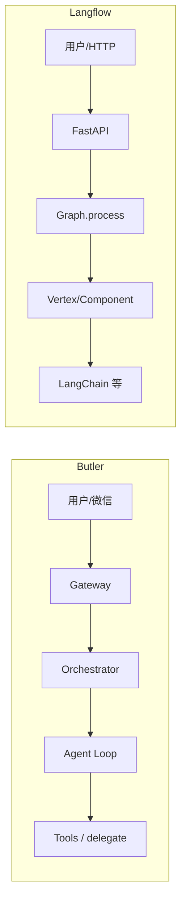

# Butler v4 与 Langflow 对照分析报告

> **日期**：2026-05-25  
> **对照代码**：`reference/langflow`（约 v1.9.3）  
> **Butler 事实来源**：[`docs/architecture/v4-architecture.md`](../../architecture/v4-architecture.md)  
> **原则**：只借鉴设计、零新增 pip 依赖（与 [`reference-learning-plan-2026-05.md`](../archive/reference-learning-plan-2026-05.md) 一致）

---

## 1. 执行摘要

Langflow 是**可视化 AI 流水线运行时**（图 + Component + REST/MCP）；Butler v4 是**微信管家式对话 Agent**（自建 Loop + Gateway）。两者产品形态不同，不宜把 Butler 做成 Flow 平台。

**最值得吸收的方向**（非画布、非 LangChain 核心）：

1. **执行层**：冻结/缓存思想、分层并行纪律、条件分支的显式模型  
2. **组合层**：子流程即工具（对应 Butler 的 workflow YAML）  
3. **工程层**：artifact 版本契约、catalog hash 校验、SSRF 纵深、统一 usage 归一  
4. **可观测层**：标准化 step 事件（不必引入 SSE）

**明确不做**：可视化编辑器、Flow JSON 一等公民、LangChain 执行核心、SQL 消息库替换 transcript、Langflow 式 MCP Composer 子进程、Graph 引擎替换 `agent_loop`。

---

## 2. 定位差异

| 维度 | Butler v4 | Langflow |
|------|-----------|----------|
| 核心单元 | **Turn**：LLM → 工具 → 再 LLM | **Vertex**：图上组件节点 |
| 编排方式 | `agent_loop` + 可选 DAG（`task_orchestrator` / `workflows`） | 拓扑分层 + 环检测 + 按层 `asyncio.gather` |
| 用户界面 | 微信 Gateway + CLI | React 画布 + Playground + REST |
| 状态持久化 | `transcript.jsonl`、项目 `MEMORY.md`、human gate 文件 | SQLAlchemy 消息/Flow、Graph cache、frozen vertex |
| 扩展 | 9 核心工具 + Skill + 可选 MCP Client | 数百 Component + Flow-as-tool + MCP Server/Composer |
| 依赖策略 | 零新增运行时依赖（规划约束） | LangChain、FastAPI、DB、大量第三方 SDK |



---

## 3. 架构分层对照

### 3.1 Langflow

```
frontend ──HTTP──▶ langflow (发行/API)
                      ▼
                  langflow-base (DB、auth、MCP 托管)
                      ▼
                  lfx (图执行、Component、schema)
```

- 文档：`reference/langflow/docs/agents/ARCHITECTURE.md`  
- 依赖单向：`lfx` 不得 import `langflow.*`（仓库内仍有少量已知违规）

### 3.2 Butler

```
CLI/微信 ──▶ gateway/ ──▶ orchestrator ──▶ core/agent_loop
                │              ├ context_pipeline / tool_batch
                │              ├ task_orchestrator / workflows
                └ message_queue, outbound_bridge, human_gate
```

**相似点**：执行与通道/会话分离。  
**差异**：Langflow 用 ServiceManager + AdapterRegistry；Butler 用模块 + 环境变量 + `execution_context`，更贴单进程微信网关。

---

## 4. 分维度详细对比

### 4.1 执行与并行

| 能力 | Langflow | Butler | 可借鉴度 |
|------|----------|--------|----------|
| 批内并行 | 每层 `asyncio.gather` 跑多个 vertex | `parallel_tools`：按工具名/路径冲突决定并行 | 已覆盖工具批 |
| 多 Agent DAG | 子图 / FlowTool | `TaskOrchestrator` + `asyncio.to_thread` | 理念接近，Butler 子 Agent 全控更强 |
| 有环图 | `RunnableVerticesManager` 首轮/后续轮规则 | `tool_loop_detect` 防 doom loop | **不同问题**，不需 cycle vertex |
| 条件分支 | `conditionally_excluded_vertices` | `human_gate` + workflow 步骤确认 | 可学显式排除集合 |
| 冻结/缓存 | `vertex.frozen` + chat cache | spill、streaming 预取、registry TTL | **高价值**：只读工具结果缓存 |

**Langflow 参考**：`src/lfx/src/lfx/graph/graph/runnable_vertices_manager.py`  
**Butler 参考**：`butler/core/parallel_tools.py`

### 4.2 组合与「X-as-Tool」

| 模式 | Langflow | Butler |
|------|----------|--------|
| 子流程即工具 | `FlowTool`（`src/lfx/src/lfx/base/tools/flow_tool.py`） | `delegate_task` + `WorkflowRunner` |
| 单组件即工具 | `component_as_tool` → LangChain StructuredTool | 工具集固定 |
| 对外暴露 | Flow 注册为 MCP tool；`lfx-mcp` | `butler mcp serve` 只读；主路径不依赖 MCP |

**建议**：从 `WorkflowDef` 生成 function schema，Loop 内一键跑 DAG（workflow-as-tool），不引入 LangChain。

### 4.3 Schema、消息与 Token

| 类型 | Langflow | Butler |
|------|----------|--------|
| 线间数据 | `Message` + `ContentBlock` + `Usage` | OpenAI message dict + `transport.Usage` |
| Token 归一 | `schema/token_usage.py` 三策略集中提取 | 分散在 `chat_completions` / `anthropic_transport` / `llm_client` |
| 大结果 | `serialization.py` 截断 | `tool_result_storage` spill |
| 结构化汇报 | Flow 输出 `Data` | `AgentReport` |

**建议**：`butler/transport/usage_normalize.py` 统一三端 usage，服务 `runtime_metrics` 与 `/诊断`。

### 4.4 注册表、目录与校验

| 能力 | Langflow | Butler |
|------|----------|--------|
| 目录 | `component_index.json` + `LFX_DEV` | `registry/catalog/*` + `hub_index_cache` |
| 完整性 | custom component **code hash**（fail-closed） | `url_safety.py`；catalog 校验较弱 |
| 版本契约 | `docs/agents/CONTRACTS.md` | `WorkflowDef` 无统一 schema 版本 |

**Langflow 参考**：`src/lfx/src/lfx/interface/components.py`、`src/lfx/src/lfx/utils/flow_validation.py`  
**Butler 参考**：`butler/registry/`、`butler/registry/url_safety.py`

### 4.5 MCP

| 能力 | Langflow | Butler |
|------|----------|--------|
| 角色 | Host（Flow/Component 暴露为 MCP）+ **Composer** 子进程 | 薄 Client；`butler mcp serve` 对外只读 |
| 命名 | MCP 层 sanitize | `mcp_{server}_{tool}` |

详见 [`butler-mcp-capability-2026-05.md`](butler-mcp-capability-2026-05.md)。**不建议**上 Langflow Composer；可优化单进程连接池。

### 4.6 内存与会话

| 能力 | Langflow | Butler |
|------|----------|--------|
| 后端选择 | `memory/__init__.py` 按调用选 DB 或 stub | `memory/facade` + `MEMORY.md` |
| 消息存储 | SQLModel | `session_transcript.jsonl` |

Butler 不必为对齐 Langflow 引入 DB 消息表。

### 4.7 流式、事件与可观测

| 能力 | Langflow | Butler |
|------|----------|--------|
| 执行事件 | `EventManager` → SSE | `outbound_bridge.notify_workflow_step`、`runtime_metrics` |
| 流式工具 | vertex `will_stream` | `streaming_tools` 只读预执行 |

**建议**：workflow/DAG 固定事件名（`step_start` / `step_end` / `step_failed`），payload 对齐 `AgentReport`。

### 4.8 安全

| 能力 | Langflow | Butler |
|------|----------|--------|
| SSRF | CIDR 黑名单 + allowlist + 禁止 redirect 文档化 | `registry/url_safety.py` 基础检查 |
| Flow 策略 | component hash | `permissions.yaml` + `tool_guardrails` |

**Langflow 参考**：`src/lfx/src/lfx/utils/ssrf_protection.py`  
**建议**：扩展 `url_safety.py`（CIDR 表、`BUTLER_REGISTRY_ALLOWED_HOSTS`、fetch 不跟随重定向）。

### 4.9 测试与 CLI

| 能力 | Langflow | Butler |
|------|----------|--------|
| 本地执行 | `lfx run` + `LocalFlowRunner` | `pytest tests/...` |
| 校验 CLI | 多级 `lfx validate` | 分散子命令 |

**建议**：`butler workflow validate <path>`（结构、role、模型、权限可满足性）。

---

## 5. Butler 已领先或无需对齐

1. **微信入站队列**（`message_queue.py`：now/next/later、去重）— Langflow 无此域  
2. **上下文经济学**（压缩、分级剪枝、spill、reactive 413、cache-safe delegate）  
3. **Owner 门控**（`human_gate`、`permissions.yaml`）  
4. **委派全控**（profile、深度、审计）强于 Flow 黑盒工具  
5. **单进程部署**假设与 Langflow 多服务目标不同  

---

## 6. 可提炼优化项（按优先级）

### P0 — 高收益、改动小

| # | 借鉴点 | 建议落地 | Langflow 参考 |
|---|--------|----------|-----------------|
| 1 | 统一 Token usage | `butler/transport/usage_normalize.py` | `src/lfx/src/lfx/schema/token_usage.py` |
| 2 | SSRF 加强 | 扩展 `registry/url_safety.py` | `src/lfx/src/lfx/utils/ssrf_protection.py` |
| 3 | Catalog 完整性 | bundled catalog 启动 sha256 校验 | `flow_validation.py` + component hash |

### P1 — 中等工作量

| # | 借鉴点 | 建议落地 |
|---|--------|----------|
| 4 | Workflow-as-tool | `WorkflowDef` → function schema + 一键 DAG |
| 5 | 结构化执行事件 | 扩展 `notify_workflow_step` / `LoopTransitionReason` |
| 6 | 只读工具结果缓存 | session 内 `(tool, path, query)` 短 TTL |
| 7 | Workflow schema 版本 | `WorkflowDef.version` + 迁移 |

### P2 — 可选

| # | 借鉴点 | 说明 |
|---|--------|------|
| 8 | DAG 条件边 | step `when` / 上一步 `success`，无画布 |
| 9 | 轻量 MCP 聚合 | 连接调度，非 Composer 子进程 |
| 10 | `butler workflow validate` | 开发/CI |

### 明确不做

- 可视化 Flow 编辑器、Flow JSON 一等公民  
- LangChain 作为执行核心  
- SQL 消息库替换 `transcript.jsonl`  
- Langflow MCP Composer（OAuth、每项目子进程）  
- Graph 引擎替换 `agent_loop`  

---

## 7. 对照总表

| 领域 | Langflow 强项 | Butler 现状 | 建议动作 |
|------|-------------|-------------|----------|
| 图执行/并行 | 分层 gather、cycle 调度 | 工具批并行 + DAG 线程池 | workflow 事件 + 步骤缓存 |
| 工具组合 | FlowTool / component_as_tool | delegate + WorkflowRunner | **Workflow-as-tool** |
| 大输出 | 序列化截断 | spill + read_file | 保持，可补 TTL 缓存 |
| Token | 统一 extract | 分散三 transport | **统一 normalize** |
| 目录/校验 | code hash + index | YAML + URL 安全 | **hash + validate CLI** |
| MCP | Host + Composer | 薄 Client | 保持边界 |
| 安全 | SSRF 完整 | 基础 URL 检查 | **对齐 SSRF** |
| 可观测 | SSE EventManager | runtime_metrics + 微信 | **结构化 step 事件** |
| 产品通道 | HTTP Playground | 微信队列/门控 | **不移植** |

---

## 8. Langflow 关键路径索引

| Concern | 路径（相对 `reference/langflow/`） |
|---------|-----------------------------------|
| 架构边界 | `docs/agents/ARCHITECTURE.md`, `CONTRACTS.md` |
| 图执行 | `src/lfx/src/lfx/graph/graph/base.py` |
| 环调度 | `src/lfx/src/lfx/graph/graph/runnable_vertices_manager.py` |
| 组件目录 | `src/lfx/src/lfx/interface/components.py` |
| Flow 校验 | `src/lfx/src/lfx/utils/flow_validation.py` |
| Flow 即工具 | `src/lfx/src/lfx/base/tools/flow_tool.py` |
| Token | `src/lfx/src/lfx/schema/token_usage.py` |
| SSRF | `src/lfx/src/lfx/utils/ssrf_protection.py` |
| 事件/SSE | `src/lfx/src/lfx/events/event_manager.py` |
| MCP Composer | `src/lfx/src/lfx/services/mcp_composer/service.py` |
| SDK | `src/sdk/src/langflow_sdk/` |

---

## 9. Butler 相关路径索引

| Concern | 路径 |
|---------|------|
| Agent Loop | `butler/core/agent_loop.py` |
| 并行工具 | `butler/core/parallel_tools.py` |
| DAG | `butler/task_orchestrator.py`, `butler/workflows/runner.py` |
| 入站队列 | `butler/gateway/message_queue.py` |
| 人工门控 | `butler/human_gate.py` |
| 运行指标 | `butler/ops/runtime_metrics.py` |
| Registry | `butler/registry/` |
| URL 安全 | `butler/registry/url_safety.py` |
| MCP | `butler/mcp/` |
| 结构化报告 | `butler/report.py` |

---

## 10. 变更记录

| 日期 | 说明 |
|------|------|
| 2026-05-25 | 初版：基于 `reference/langflow` 与 Butler v4 代码对照 |
