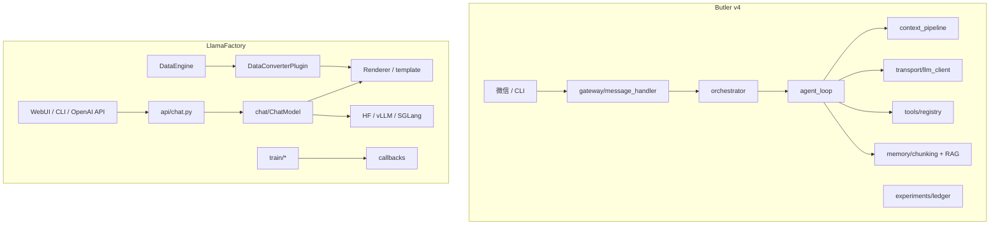

# Butler v4 ↔ LlamaFactory 对照与提炼报告

> **文档类型**：对照分析报告（正文 P0/P2 表为历史提炼，**非待办**）  
> **状态**：分析完成（2026-05-25）；**主线 K / PR-X3 子集已落地**（见外部 Agent 路线图 §10）  
> **合并路线图**：[`external-agent-reports-improvement-roadmap-2026-05.md`](../roadmaps/external-agent-reports-improvement-roadmap-2026-05.md) **主线 K**、PR-X3  
> **决策入口**：[`roadmap-backlog-and-boundaries-2026-05.md`](../decisions/roadmap-backlog-and-boundaries-2026-05.md)  
> **本地对照代码**：`reference/LlamaFactory/`（gitignore，主公维护）  
> **Butler 事实来源**：[`docs/architecture/v4-architecture.md`](../../architecture/v4-architecture.md)、`butler/` 实现  
> **原则**：只借鉴**编排与协议**设计，**零新增重依赖**；不引入 GPU 训练栈、Gradio 训练面板、HF Trainer  
> **边界**：训练平台否决见 [`four-reports-out-of-scope-2026-05.md`](../decisions/four-reports-out-of-scope-2026-05.md) §2 #16

---

## 1. 执行摘要

**LlamaFactory** 解决的是：100+ 大模型的 **微调 / 推理 / 评测** 一体化（CLI、WebUI、OpenAI 兼容 API），核心是 **数据管线 + 模板渲染 + 训练引擎**。

**Butler v4** 是 **微信管家 + 自建 Agent Loop + 多项目编排**，核心是 **Gateway → Loop → 工具/记忆/委派**。

| 维度 | LlamaFactory 更强 | Butler 更强 |
|------|-------------------|-------------|
| 多源对话规范化 | v1 `DataEngine` + `DataConverterPlugin` + canonical `Message` | — |
| 多模型 tool 线格式 | `data/tool_utils.py`（Qwen/Llama3/GLM/MiniMax 等） | — |
| 协议适配 | `api/chat.py` OpenAI ↔ 内部 role | 部分在 `transport/` |
| 插件扩展 | v1 `BasePlugin` 注册表 + 多方法 hub | `loop_plugins` 仅 2 hook |
| 长任务运维 UI | WebUI `Engine`/`Manager`/`Runner` | `runtime/jobs`、微信门控 |
| Agent 运行时 | — | 压缩/队列/委派/观测/human_gate |
| 实验组织（软件研究） | 训练 callback / W&B | `experiments.tsv`（autoresearch 路线已落地） |

**结论**：LlamaFactory 对 Butler **最有价值**的是 **「多源数据 → 规范 IR → 渲染/协议适配 → 可观测长任务」** 编排链；**不应**迁移 LoRA/FSDP/Kernel/WebUI 训练栈。优先补齐 **canonical message IR、tool 线格式适配器、Renderer 解耦、插件注册表**。

---

## 2. LlamaFactory 架构速览

### 2.1 版本分裂（legacy vs v1）

| 方面 | Legacy `src/llamafactory/*`（除 v1） | v1 `src/llamafactory/v1/` |
|------|--------------------------------------|---------------------------|
| 开关 | 默认 | `USE_V1=1`（`cli.py`） |
| CLI | `train`, `api`, `chat`, `webui`, `export` | `sft`, `rm`, `chat`, `merge` |
| 数据 | Template 槽位 + processor + collator | `DataEngine` + `DataConverterPlugin` → `Message` |
| 推理 | `ChatModel` + HF/vLLM/SGLang | `BaseSampler` + `Renderer` + `HuggingFaceEngine` |
| WebUI/API | 完整 | v1 launcher 未接 WebUI |

**阅读建议**：编排模式优先看 **v1**；生产 chat/API/WebUI 仍在 legacy。

### 2.2 顶层入口

| 表面 | 路径 | 角色 |
|------|------|------|
| CLI | `src/llamafactory/cli.py` → `launcher.py` / `v1/launcher.py` | 子命令路由；多卡时 `torchrun` |
| 训练 | `src/train.py` → `train/tuner.py` | pt/sft/dpo/ppo/rm/kto |
| Chat API | `src/api.py` → `api/app.py` + `chat/ChatModel` | OpenAI `/v1/chat/completions` |
| WebUI | `src/webui.py` → `webui/interface.py` | Gradio：Train/Eval/Chat/Export |

### 2.3 v1 数据管线（编排核心）

文档：`docs/zh/data-preparation/data-processing.md`；实现：`v1/core/data_engine.py`。

```text
dataset_info.yaml → load (HF / DataLoaderPlugin)
                 → index (size/weight)
                 → convert (DataConverterPlugin: alpaca/sharegpt/pair)
                 → Sample { messages[], tools?, loss_weight }
                 → Renderer.process_samples()
                 → ModelInput → BatchingPlugin → BatchInput
```

**Canonical schema**（`v1/utils/types.py`）：`Message` = `role` + `content[{type, value}]`，`type` 含 `text` / `tool_call` / `reasoning` / 多模态等。

---

## 3. Butler v4 对照基线

详见 [`v4-architecture.md`](../../architecture/v4-architecture.md)。与本报告相关模块：

| 能力 | 路径 | 说明 |
|------|------|------|
| Agent Loop | `butler/core/agent_loop.py` | 压缩、工具批、委派、流式预取 |
| 上下文管线 | `butler/core/context_pipeline.py` | hygiene、repair、剪枝 |
| Transport | `butler/transport/` | 多厂商 HTTP 协议 |
| Gateway | `butler/gateway/message_handler.py` | 微信入站、队列 |
| 记忆切块 | `butler/memory/chunking.py` | Markdown 标题树切块 |
| 实验账本 | `butler/experiments/ledger.py` | `.butler/experiments.tsv` |
| Loop 插件 | `butler/core/loop_plugins.py` | `before_model` / `wrap_tool_call` |
| 运行指标 | `butler/ops/runtime_metrics.py` | `/诊断` 零依赖指标 |

---

## 4. 概念映射表

| LlamaFactory | Butler 近似 | 差距 |
|--------------|-------------|------|
| `dataset_info.yaml` 多源索引 | `chunking.DEFAULT_INDEX_REL_PATHS` | 缺权重/元数据统一描述 |
| `DataConverterPlugin` | Gateway/transcript 各自 dict | 缺 **canonical Message IR** |
| `Renderer` / `RenderingPlugin` | `orchestrator` 拼 system prompt | 渲染与 Loop **耦合** |
| `tool_utils` 多方言 | `transport` 协议层 | 缺 **tool 文本线格式** 适配层 |
| `api/chat._process_request` | `message_handler` | 可加强 role/tool **入站校验** |
| `BasePlugin` 注册表 | `loop_plugins` | 插件面过窄 |
| `PluginConfig` in YAML | `BUTLER_*` + `project.yaml` | 插件段未结构化 |
| WebUI `Runner` | `runtime/jobs` | 缺 abort/resume/日志 tail 状态机 |
| HF/v1 `TrainerCallback` | `runtime_metrics` | 缺 job 级 observer 链 |
| 训练 packing/collator | `tool_prune` + `turn_token_budget` | 可抽象统一 **ContextPackingPolicy** |

---

## 5. 架构对照图



---

## 6. 提炼建议（按优先级）

### 6.1 P0 — Canonical Message IR + Converter 插件链

**借鉴**：`v1/core/data_engine.py`、`v1/plugins/data_plugins/converter.py`、`v1/utils/types.py`。

**目标**：

1. 新增 `butler/core/message_ir.py`（或等价模块）：轻量 `CanonicalMessage` / `ContentBlock`，不依赖 torch。
2. Converter 注册表：`wechat_inbound` / `openai_messages` / `anthropic_messages` / `mcp_tool_result` → canonical。
3. Gateway **先入 IR 再入队**；`context_pipeline` 只处理 IR，避免双处修补。

**收益**：多通道、委派回传、压缩/剪枝/审计一套逻辑；利于五报告 P2「Thinking/协议整形」。

**验收思路**：`tests/test_message_ir.py` + 现有 `test_gateway_handler.py` 扩展。

---

### 6.2 P0 — 按厂商 Tool 线格式适配器

**借鉴**：`data/tool_utils.py`（`FunctionCall`、`QwenToolUtils`、`Llama3ToolUtils`、`MINIMAX_M2_TOOL_PROMPT` 等）、`api/chat.py` 的 `extract_tool`。

**目标**：

- 新增 `butler/transport/tool_wire.py`：`ToolWireAdapter` ABC + `register_wire(name)`。
- 按 `ProviderProfile` / `model_capabilities` 选择解析/序列化策略。
- 职责边界：仅 tool_calls **文本方言** ↔ 内部 `ToolCall`；不替代 `tools/registry`。

**收益**：减少 `llm_retry` 因 tool JSON/XML 方言导致的空轮；与 `streaming_tools.py` 衔接更稳。

---

### 6.3 P1 — 扩展 Loop 插件为 BasePlugin 风格 Hub

**借鉴**：`v1/utils/plugin.py`、`v1/plugins/trainer_plugins/distributed/hub.py`。

**现状**：`butler/core/loop_plugins.py` 仅 `before_model` / `wrap_tool_call`。

**目标**（零依赖）：

| 插件名 | 方法 | 用途 |
|--------|------|------|
| `gateway` | `normalize_inbound` | 入站 hygiene 扩展 |
| `context` | `before_compact` / `after_compact` | 压缩锚点扩展 |
| `metrics` | `on_turn_end` | 统一 `runtime_metrics` |
| `experiment` | `on_job_finish` | 解析 `METRIC=` → ledger |

保留 `LoopPluginRegistry`，增加类级注册 + 多方法名，避免 `agent_loop` 散落 try/except。

---

### 6.4 P1 — 协议适配：严格消息校验

**借鉴**：`api/chat.py` `_process_request`（system 剥离、u/a 交替、TOOL/FUNCTION 映射）。

**目标**：`validate_and_normalize_messages()` 用于 Gateway 子集或未来 HTTP 入口；非法序列 **早失败** + 明确错误文案。

---

### 6.5 P1 — `project.yaml` 插件段 + Prompt Renderer 解耦

**借鉴**：`v1/config/arg_utils.py` 的 `PluginConfig`（`name` 必填 + 扩展键）；v1 `Renderer` / `RenderingPlugin`。

**目标**：

- `project.yaml` 增加 `plugins:` 段；与 `BUTLER_*` 并存（env 覆盖 yaml）。
- `butler/core/prompt_renderer.py`：`render_system()`、`anchor_sections()`；`orchestrator` 只调用 renderer。
- **不** 引入 OmegaConf；标准库 `yaml` + 浅合并即可。

**文档**：同步 [`docs/config/reference.md`](../../config/reference.md)、`.env.example`（若新增开关）。

---

### 6.6 P2 — Job 级 Observer 回调

**借鉴**：`v1/utils/callbacks/trainer_callback.py`、`train/callbacks.py`。

**目标**：`JobCallback`（`on_start` / `on_log_line` / `on_finish`）接入 `workflows/runner.py` 与 harness；`/诊断` 展示最近 metric 行（对齐 autoresearch grep 章程）。

---

### 6.7 P2 — 多源记忆 `dataset_info.yaml`

**借鉴**：`DataEngine._build_data_index`、`adjust_data_index`。

**目标**：项目 `.butler/dataset_info.yaml`（路径、权重、source）；`memory reindex` 按权重合并；与 `query_decompose.py` 多路召回配合。

---

### 6.8 P2 — ContextPackingPolicy

**借鉴**：legacy `PackedSupervisedDatasetProcessor`、`v1/plugins/trainer_plugins/batching.py`。

**目标**：统一 system 锚点 / 最近 user / tool 摘要 / 旧 read-grep 的 **knapsack 式** token 填充策略；配置进 `project.yaml`，减少散落 `BUTLER_*`。

---

### 6.9 P2 — Runtime Runner 状态机（运维，非 Gradio）

**借鉴**：`webui/engine.py`、`webui/runner.py`、`webui/manager.py`。

**目标**：`butler runtime status` 增强：`running` / `aborted`、stdout 固定路径、tail + `grep METRIC=`；**不做** 默认 LlamaBoard UI。

---

### 6.10 P2 — Async/sync 桥（可选）

**借鉴**：`chat/chat_model.py` 后台 event loop + `run_coroutine_threadsafe`。

**目标**：若统一多 session 流式，可抽出 `AsyncLoopBridge`；属性能优化，非功能必需。

---

## 7. 明确不做（LlamaFactory → Butler）

| LlamaFactory 能力 | 不做原因 | Butler 替代 |
|-------------------|----------|-------------|
| 全量微调 / LoRA / QLoRA / FSDP / DeepSpeed | 产品非训练栈 | `software-research` harness + 账本 |
| Gradio LlamaBoard 训练面板 | 入口是微信 | CLI + `/诊断` |
| HF Trainer、Liger/flash-attn kernels | 重依赖 | — |
| vLLM/SGLang 自托管推理集群 | Butler 走 API transport | `transport/llm_client.py` |
| 多模态 `mm_plugin` | 文本管家为主 | 另立项 |
| Hub 大规模训练数据集管线 | 已有 chunking + semantic_index | `memory reindex` |

与 [`four-reports-out-of-scope-2026-05.md`](../decisions/four-reports-out-of-scope-2026-05.md) 一致：**#16 不让 Butler 变成训练平台**；通宵自治、自动 git reset 等仍以 autoresearch 报告与 out-of-scope 为准。

---

## 8. Butler 已领先、无需向 LlamaFactory 看齐

- 微信入站队列（now/next/later、去重、interrupt）
- 人在回路（`human_gate`、workflow `requires_approval`）
- 委派与 cache-safe delegate
- CC 线束（流式 tool 预取、tool spill、read-before-edit、reactive_compact）
- 软件研究 harness + `experiments.tsv`（autoresearch 提炼已落地）

---

## 9. 建议落地路线图

| 优先级 | 项 | 工作量 | 主要模块 |
|--------|-----|--------|----------|
| P0 | Canonical IR + converters | 中 | `gateway/`, `message_ir.py`, `session_transcript.py` |
| P0 | `tool_wire` 多方言 | 中 | `transport/` |
| P1 | 插件注册表 + job/turn hooks | 小 | `loop_plugins.py`, `runtime_metrics.py` |
| P1 | Renderer + `plugins:` in yaml | 中 | `orchestrator.py`, `config/reference.md` |
| P1 | 入站消息校验 | 小 | `message_handler.py` |
| P2 | `dataset_info.yaml` 多源索引 | 中 | `memory/chunking.py` |
| P2 | `ContextPackingPolicy` | 中 | `context_pipeline`, `tool_prune_policy` |
| P2 | Runtime Runner 状态机 | 小 | `runtime/`, `workflows/runner.py` |

### 9.1 建议验收命令

```bash
cd /path/to/WFXM
PYTHONPATH=. pytest tests/gateway/test_gateway_handler.py tests/gateway/test_message_queue.py -q
PYTHONPATH=. pytest tests/test_cc_p3_p4_features.py tests/ops/test_runtime_metrics.py -q
# P0 落地后追加：
# PYTHONPATH=. pytest tests/test_message_ir.py -q
```

---

## 10. 与其他对标报告的关系

| 报告 | 关系 |
|------|------|
| [`autoresearch-butler-comparison-report-2026-05.md`](autoresearch-butler-comparison-report-2026-05.md) | 实验账本已落地；LF callback 可补强 job 收尾 |
| [`ragflow-butler-comparison-report-2026-05.md`](ragflow-butler-comparison-report-2026-05.md) | 切块/检索已有；LF 索引权重可补多源 |
| [`four-reports-out-of-scope-2026-05.md`](../decisions/four-reports-out-of-scope-2026-05.md) | #16 训练平台边界 |
| [`five-reports-not-done-2026-05.md`](../decisions/five-reports-not-done-2026-05.md) | P2 Thinking/协议整形、ToolsEngine 与 Renderer/tool_wire 同线 |

---

## 11. 关键文件索引（LlamaFactory）

| 领域 | 路径（相对 `reference/LlamaFactory/`） |
|------|----------------------------------------|
| CLI | `src/llamafactory/cli.py`, `launcher.py`, `v1/launcher.py` |
| v1 数据引擎 | `src/llamafactory/v1/core/data_engine.py` |
| v1 插件基类 | `src/llamafactory/v1/utils/plugin.py` |
| 数据转换 | `src/llamafactory/v1/plugins/data_plugins/converter.py` |
| Tool 方言 | `src/llamafactory/data/tool_utils.py` |
| API 适配 | `src/llamafactory/api/chat.py`, `api/protocol.py` |
| 渲染 | `src/llamafactory/v1/core/utils/rendering.py` |
| 配置 | `src/llamafactory/v1/config/arg_parser.py`, `v1/config/arg_utils.py` |
| 回调 | `src/llamafactory/train/callbacks.py`, `v1/utils/callbacks/` |
| WebUI | `src/llamafactory/webui/engine.py`, `runner.py`, `manager.py` |
| Legacy 模板 | `src/llamafactory/data/template.py`, `formatter.py` |

---

## 12. 一句话总结

LlamaFactory 对 Butler 的价值 ≈ **多源对话与多模型协议的标准化流水线 + 可插拔渲染/工具方言 + 长任务可观测**；应优先借鉴 **v1 DataEngine/Converter/Renderer/Plugin** 与 **legacy tool_utils、api/chat**，坚决不引入训练与 Gradio 运维栈。Butler 在微信队列、人在回路、压缩委派上已深；补齐 **IR + tool_wire + Renderer/插件解耦** 可降低多 provider 扩展成本。
