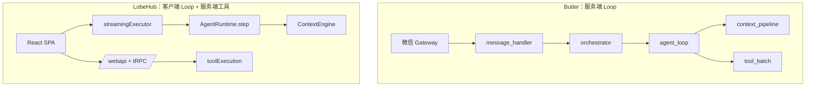

# Butler v4 与 LobeHub 对照分析报告

> **日期**：2026-05-25  
> **对照代码**：`reference/lobehub`（LobeChat / LobeHub v2.2.0 monorepo）  
> **Butler 事实来源**：[`docs/architecture/v4-architecture.md`](../../architecture/v4-architecture.md)  
> **产品边界**：[`four-reports-out-of-scope-2026-05.md`](../decisions/four-reports-out-of-scope-2026-05.md) · CC 线束 [`cc-butler-gap-analysis-2026-05.md`](../active/cc-butler-gap-analysis-2026-05.md)  
> **原则**：只借鉴设计；不引入 LobeHub 运行时、不替换 Butler Loop；零新增重依赖  
> **文档类型**：对照分析报告（正文 P0/P2 表为历史提炼，**非待办**）  
> **状态**：**主线 J 子集已落地**（REG-P4 LobeHub 市场、PR-F3；Loop/UI/MCP Host 见否决 S10–S11）  
> **合并路线图**：[`five-reports-improvement-roadmap-2026-05.md`](../roadmaps/five-reports-improvement-roadmap-2026-05.md) **主线 J**  
> **决策入口**：[`roadmap-backlog-and-boundaries-2026-05.md`](../decisions/roadmap-backlog-and-boundaries-2026-05.md)

---

## 1. 执行摘要

LobeHub 是**全栈 AI Agent 平台**（Next.js + tRPC + Postgres + 浏览器端 Agent Loop + MCP/Skill 生态 + 多 IM 适配器）。Butler v4 是**微信远程管家 + 服务端自建 Agent Loop + 多项目记忆**。

**结论**：

- Butler 在**微信网关、上下文经济学（CC P0–P4）、工具 spill、多项目 MEMORY、入站队列**上已成熟，部分维度**强于** LobeHub 默认内存截断方案。
- LobeHub 的最大借鉴价值在：**可组合上下文管道、结构化用户记忆、工具/manifest 治理、HITL 与工具错误恢复、多 Agent 监督者状态机**——而非客户端 Loop 或 Chat UI。
- Butler **已集成** LobeHub 技能市场（`butler/registry/skill_sources/lobehub.py`，`BUTLER_LOBEHUB_*`），见 [`skill-mcp-registry-2026-05.md`](skill-mcp-registry-2026-05.md)。

**最值得吸收（按优先级）**：

| 优先级 | 方向 | 预估 |
|--------|------|------|
| **P0** | 工具错误分类（retry / replan / stop） | 2–3 天 |
| **P0** | `permissions.yaml` 参数级 security_blacklist | 2 天 |
| **P0** | UTF-16 安全截断（工具 preview / 微信分包） | 0.5 天 |
| **P1** | `ContextPipeline` 步骤化 + 每步耗时诊断 | 3–5 天 |
| **P1** | 用户记忆分层 schema（post_session 结构化） | ~1 周 |
| **P1** | TaskOrchestrator Supervisor 指令协议 | 1–2 周 |
| **P2** | ToolsEngine 思想（manifest + enable + FC 检查） | MCP 深化时 |
| **P2** | LoopOperation / Agent Signal 事件模型 | 与 hooks 演进同步 |
| **P2** | LobeHub 市场 manifest 校验 + 安装前扫描 | 与 REG-P4 深化 |

**明确不做**：浏览器内 Loop、conversation-flow 分支 UI、全量 MCP Host、OTEL 默认接入、多 IM 生产化、Electron/device-gateway、25+ builtin-tool 包膨胀。

---

## 2. 对照范围说明

| 路径 | 内容 | 与 Butler 关系 |
|------|------|----------------|
| `packages/agent-runtime/` | `GeneralChatAgent`、`AgentRuntime`、`InterventionChecker`、GroupOrchestration | **主对标** |
| `packages/context-engine/` | `ContextEngine` pipeline、providers、ToolsEngine | **主对标** |
| `packages/memory-user-memory/` | persona/identity/preference/experience/activity/context | 记忆 schema 参考 |
| `packages/conversation-flow/` | 分支/虚拟列表解析引擎 | **不适用**（无微信分支 UI） |
| `packages/model-runtime/`、`packages/fetch-sse/` | 多厂商 LLM、SSE | 与 `butler/transport/` 同类 |
| `packages/chat-adapter-wechat/` | 微信 SDK adapter | 与 `wechat_ilink.py` 对比，不替换 |
| `src/store/chat/slices/aiChat/` | 客户端 `streamingExecutor` | **不照搬**（产品形态不同） |
| `butler/registry/skill_sources/lobehub.py` | 技能市场适配器 | **已落地** |

官方架构说明：`reference/lobehub/docs/development/basic/architecture.mdx`

---

## 3. 架构对比



| 维度 | LobeHub | Butler v4 |
|------|---------|-----------|
| Agent 循环 | 浏览器 `streamingExecutor` + `AgentRuntime` | 服务端 `agent_loop.py` |
| 上下文 | `ContextEngine`（processor + provider 管道） | `ContextPipeline`（内联 prune→compress→锚点） |
| 工具 | 25+ `builtin-tool-*` + MCP + Skills | 9 核心工具 + 可选 MCP |
| 记忆 | DB 五层 user memory + injector | 分层 memory + 项目 `MEMORY.md` + semantic_index |
| 持久化 | PostgreSQL + Redis + S3 | `.butler/` + `transcript.jsonl` |
| 入口 | Web/Electron + 多 IM | 微信 iLink + CLI |
| 与 LobeHub 关系 | 完整产品 | 技能市场适配器已接 |

### 3.1 LobeHub 核心模块（节选）

| 模块 | 路径 | 职责 |
|------|------|------|
| GeneralChatAgent | `packages/agent-runtime/src/agents/GeneralChatAgent.ts` | 决策：call_llm → tools → finish |
| AgentRuntime | `packages/agent-runtime/src/core/runtime.ts` | 执行引擎 |
| ContextEngine | `packages/context-engine/src/pipeline.ts` | 顺序 processor，记录每步耗时 |
| ToolsEngine | `packages/context-engine/src/engine/tools/ToolsEngine.ts` | manifest 合并、FC 支持检查、enable 过滤 |
| InterventionChecker | `packages/agent-runtime/src/core/InterventionChecker.ts` | security blacklist + HITL policy |
| UserMemoryInjector | `packages/context-engine/src/providers/UserMemoryInjector.ts` | 首条 user 前注入结构化记忆 |
| GroupOrchestrationRuntime | `packages/agent-runtime/src/groupOrchestration/` | Supervisor ↔ Executor 状态机 |
| truncateToolResult | `src/server/utils/truncateToolResult.ts` | 25k 字符截断 + UTF-16 surrogate 安全 |
| errorClassification | `src/server/services/toolExecution/errorClassification.ts` | retry / replan / stop |
| conversation-flow | `packages/conversation-flow/src/parse.ts` | messageMap + displayTree + flatList |

### 3.2 Butler 对应模块（节选）

| 模块 | 路径 | 职责 |
|------|------|------|
| Agent Loop | `butler/core/agent_loop.py` | 主循环、`LoopTransitionReason` |
| ContextPipeline | `butler/core/context_pipeline.py` | 压缩、剪枝、post-compact 锚点、repair |
| tool_result_storage | `butler/core/tool_result_storage.py` | spill 落盘 + 单轮预算 + inject_once |
| permissions | `butler/permissions.py` | `.butler/permissions.yaml` |
| human_gate | `butler/human_gate.py` | workflow 步骤微信确认 |
| TaskOrchestrator | `butler/task_orchestrator.py` | DAG 多 Agent 真并行 |
| LobeHubSource | `butler/registry/skill_sources/lobehub.py` | 技能市场搜索/安装 |
| wechat_ilink | `butler/gateway/platforms/wechat_ilink.py` | 生产微信网关 |

---

## 4. 能力对照矩阵

| 能力域 | Butler 现状 | LobeHub | Butler 相对位置 | 可提炼价值 |
|--------|-------------|---------|-----------------|------------|
| Agent 循环 | 模块化 loop + transition 原因 | GeneralChatAgent + Runtime | 已成熟 | 中：指令级 HITL |
| 上下文压缩 | CC 对齐 P0–P4 | compress + HistorySummary | **已对齐 CC** | 中：管道可组合 |
| 工具结果过大 | spill + 预算 + inject_once | 25k truncate + archive bypass | **更强** | 低：UTF-16 截断 |
| 权限/审批 | permissions + human_gate + owner | InterventionChecker + blacklist | 各有优势 | **高** |
| 记忆 | 多项目 MEMORY + post_session | 五层 user memory | 项目维更强 | **高**：分层 schema |
| 多 Agent | TaskOrchestrator DAG | GroupOrchestration Supervisor | 功能相近 | 中：Supervisor 协议 |
| MCP | 薄客户端 | 完整 MCP store | LobeHub 远强 | 中：manifest 模式 |
| 会话分支/UI | transcript.jsonl | conversation-flow | 无 UI 需求 | **不适用** |
| 微信网关 | 原生 ilink + 队列 | chat-adapter-wechat | Butler 更深 | 低：格式转换 |
| 技能生态 | 多源 + LobeHub 市场 | skill-store | 已部分集成 | 中：manifest 对齐 |
| 可观测 | runtime_metrics + `/诊断` | OTEL + operation slice | 轻量够用 | 中：operation 模型 |

---

## 5. Butler 已领先或不必追的部分

1. **客户端 Agent Loop** — 与微信远程异步场景不符。
2. **conversation-flow 分支/虚拟列表** — 微信文本流无多分支 UI。
3. **全量 MCP Host + OAuth 浏览器生态** — 见 `cc-butler-gap-analysis` 与 `AGENTS.md` 产品边界。
4. **25+ builtin-tool + 富 UI render** — Butler 工具面刻意收敛。
5. **Postgres/Redis/S3 全栈** — Butler 坚持 `.butler/` 本地态、零重依赖。
6. **仅内存截断大工具结果** — Butler spill + transcript 指针更适合长会话。

---

## 6. 提炼建议（详细）

### 6.1 P0 — 工具错误分类 → Loop 恢复策略

**LobeHub**：`errorClassification.ts` 将失败分为 `retry` | `replan` | `stop`，按 HTTP code、错误码、关键词判断。

**Butler 缺口**：工具失败多原样回传模型，缺少统一恢复策略。

**建议**：

- 在 `butler/tools/registry.py` 或 `butler/core/tool_batch.py` 增加 `classify_tool_error(exc) -> ToolErrorKind`
- `retry`：有限次同工具重试（`BUTLER_TOOL_ERROR_RETRY`）
- `replan`：tool message 附加「请换参数/换工具」
- `stop`：映射 `LoopTransitionReason` + 微信友好报错

**改动面**：`tool_batch.py`、`llm_retry.py`（可选）、`runtime_metrics`  
**测试**：扩展 `tests/test_tool_batch.py` 或新建 `test_tool_error_classification.py`

---

### 6.2 P0 — 参数级 security_blacklist

**LobeHub**：`InterventionChecker.checkSecurityBlacklist` **优先于**一切 HITL 策略。

**Butler 现状**：`permissions.py` 以工具名/路径 glob 为主；`human_gate` 面向 workflow。

**建议**：

- `.butler/permissions.yaml` 增加可选 `security_blacklist`（参数模式匹配）
- `registry.dispatch` 前硬阻断
- 与 `terminal_approval`、owner gate 并存

**改动面**：`butler/permissions.py`、`butler/tools/registry.py`  
**测试**：扩展 `tests/test_p2_workflow_permissions.py`

---

### 6.3 P0 — UTF-16 安全截断

**LobeHub**：`truncateToolResult` 在截断点避开 UTF-16 surrogate，防止上游 API hex escape 错误。

**Butler 缺口**：`tool_result_storage.generate_preview` 与 `wechat_ilink._truncate_plain` 按字符切片，未处理 surrogate。

**建议**：抽取 `butler/core/text_truncate.py`（或 `butler/utils/utf16_safe_slice.py`）共用。

**改动面**：`tool_result_storage.py`、`gateway/platforms/wechat_ilink.py`  
**测试**：含 emoji 的长字符串用例

---

### 6.4 P1 — Context 管道可组合化

**LobeHub**：`ContextEngine` 顺序执行 processor，记录 `processorDurations`（`pipeline.ts`）。

**Butler 现状**：`ContextPipeline.prepare_messages_for_api` 内联多步。

**建议（渐进）**：

```python
@dataclass
class ContextStep:
    name: str
    fn: Callable[[list[dict], Any], list[dict]]
```

- 默认步骤链保持现有语义不变
- `diagnostics["context_steps_ms"]` 写入 `/诊断`
- 便于按项目挂载 injector（DESIGN 节、实验模式）而不改 `agent_loop.py`

**改动面**：`butler/core/context_pipeline.py`  
**测试**：`tests/test_context_pipeline.py`

---

### 6.5 P1 — 用户记忆分层 Schema

**LobeHub 类型**：`persona`、`identities`、`preferences`、`experiences`、`activities`、`contexts`（`memory-user-memory`）。

**Butler 现状**：`butler_memory.py` + `project_memory.py` + `post_session.py`，偏 Markdown 自由文本。

**建议**：

- `post_session` 输出可选结构化块（YAML frontmatter 或 `memory_layers.json`）
- `orchestrator` 按 effort 裁剪注入层（高：persona+preference；低：仅 persona）
- **不做** LobeHub DB 表与 XML 序列化

**改动面**：`butler/post_session.py`、`butler/orchestrator.py`、`butler/memory/`  
**测试**：memory/post_session 相关用例

---

### 6.6 P1 — TaskOrchestrator Supervisor 协议

**LobeHub**：`GroupOrchestrationRuntime` — `Supervisor.decide(result) → Executor → loop until finish`。

**建议**：

- DAG 节点增加指令类型：`spawn_delegate`、`wait_human`、`aggregate`、`finish`
- 与 `human_gate`、`completion_notify` 打通
- `/诊断` 展示 supervision 状态

**改动面**：`butler/task_orchestrator.py`、`butler/human_gate.py`（接线）

---

### 6.7 P2 — ToolsEngine 思想（MCP/技能深化时）

- 轻量 `tool_manifest.yaml`（identifier、parameters、intervention_policy）
- `build_tools_for_model(model, enabled_ids)` 统一构建
- 模型不支持 function calling 时跳过 tools（对齐 `ToolsEngine.generateTools`）
- **仍不做** npm/OAuth 全生态

---

### 6.8 P2 — LoopOperation 事件模型

- 枚举：`compressing`、`tool_batch`、`awaiting_human`、`draining_queue`
- 写入 `session_transcript` + `runtime_metrics`
- 对齐 LobeHub `operation` slice，补强现有 `LoopTransitionReason`

---

### 6.9 P2 — LobeHub 市场深化（已集成 REG-P4）

**已落地**：`LobeHubSource`、`BUTLER_LOBEHUB_*`、`butler skills search --source lobehub`。

**可深化**：

- ZIP 安装后 manifest 校验（对齐 LobeHub skill schema）
- 安装前静态扫描（复用 `butler/skills/guard.py`）
- 与微信 `/确认安装` 错误分类统一

---

## 7. 明确不做（与产品边界对齐）

| LobeHub 能力 | 原因 | Butler 替代 |
|--------------|------|-------------|
| 浏览器内 Loop | 产品形态 | 服务端 `agent_loop` |
| conversation-flow 全量 | 无分支 UI | transcript.jsonl |
| 全量 MCP Host / Klavis | 边界文档 | `BUTLER_MCP_ENABLED` 薄客户端 |
| OTEL 默认接入 | four-reports #18 | `runtime_metrics` |
| 多 IM adapter 生产化 | 架构：微信-only | `wechat_ilink` |
| Electron / device-gateway | 超出范围 | — |
| 客户端 tool UI renders | 微信无法承载 | 文本 + `/详细` |
| RAG/向量平台全栈 | four-reports | `semantic_index` |

完整否决清单见 [`four-reports-out-of-scope-2026-05.md`](../decisions/four-reports-out-of-scope-2026-05.md)。

---

## 8. 微信网关专项对照

| 点 | Butler `wechat_ilink.py` | LobeHub `packages/chat-adapter-wechat` |
|----|--------------------------|----------------------------------------|
| 职责 | 生产网关：分包、媒体、队列、completion | SDK：收发、格式转换 |
| 深度 | 与 `message_queue`、`outbound_bridge` 一体 | 需上层应用组装 |

**可借鉴**：`WechatFormatConverter` 对 Markdown/链接的处理；**不宜替换** Butler 原生 iLink。

---

## 9. 推荐落地路线图

| 阶段 | 项 | 预估 | 验收测试 |
|------|-----|------|----------|
| **Sprint A** | 工具错误分类 + UTF-16 截断 | 2–3 天 | `test_tool_batch`、gateway 截断 |
| **Sprint B** | security_blacklist in permissions | 2 天 | `test_p2_workflow_permissions` |
| **Sprint C** | ContextPipeline 步骤化 + diagnostics | 3–5 天 | `test_context_pipeline` |
| **Sprint D** | 记忆分层 schema + post_session | ~1 周 | memory/post_session 测试 |
| **Sprint E** | Supervisor 协议 + TaskOrchestrator | 1–2 周 | task orchestrator 测试 |

**文档同步义务**（若开始实现）：`v4-architecture.md`、`config/reference.md`、本报告状态列、可选 `lobehub-learning-plan-2026-05.md`（实现跟踪用）。

---

## 10. 与现有规划的关系

| 规划文档 | 关系 |
|----------|------|
| [`cc-butler-gap-analysis-2026-05.md`](../active/cc-butler-gap-analysis-2026-05.md) | CC 线束 P0–P4 已落地；LobeHub 项**不重复** CC 压缩/队列项 |
| [`skill-mcp-registry-2026-05.md`](skill-mcp-registry-2026-05.md) | LobeHub 市场 **REG-P4 已落地**；§6.9 为深化 |
| [`butler-mcp-capability-2026-05.md`](butler-mcp-capability-2026-05.md) | §6.7 ToolsEngine 仅在 MCP P3 深化时启用 |
| [`four-reports-out-of-scope-2026-05.md`](../decisions/four-reports-out-of-scope-2026-05.md) | §7 不做项裁决依据 |
| [`reference-learning-plan-2026-05.md`](../archive/reference-learning-plan-2026-05.md) | 外部对标已收口；本报告为 **LobeHub 专项** 增量 |

---

## 11. 高价值阅读路径（`reference/lobehub`）

不必通读全树，建议按任务打开：

1. 上下文管道 → `packages/context-engine/src/pipeline.ts`、`providers/UserMemoryInjector.ts`
2. 工具治理 → `packages/context-engine/src/engine/tools/ToolsEngine.ts`、`src/server/utils/truncateToolResult.ts`
3. HITL → `packages/agent-runtime/src/core/InterventionChecker.ts`
4. 错误恢复 → `src/server/services/toolExecution/errorClassification.ts`
5. 多 Agent → `packages/agent-runtime/src/groupOrchestration/GroupOrchestrationRuntime.ts`
6. 客户端 Loop（仅理解，不移植）→ `src/store/chat/slices/aiChat/actions/streamingExecutor.ts`

---

## 12. 变更记录

| 日期 | 说明 |
|------|------|
| 2026-05-25 | 初版：架构对照、能力矩阵、P0–P2 提炼、路线图、不做清单 |
