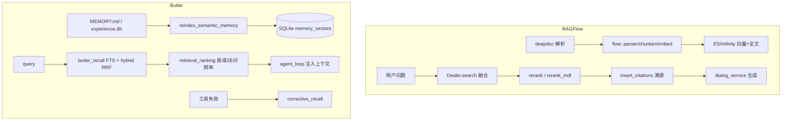

# Butler v4 × RAGFlow 对标报告

> **状态**：分析完成（2026-05-25）；**RF-P0–P2 子集已落地**（fallback/切块/引用/子 query；全栈见 [`four-reports-out-of-scope-2026-05.md`](../decisions/four-reports-out-of-scope-2026-05.md)）  
> **本地对照**：`reference/ragflow`（gitignore，仅阅读）  
> **原则**：只借鉴设计；[`reference-learning-plan-2026-05.md`](../archive/reference-learning-plan-2026-05.md) 零新增 pip 依赖；全量 RAG 管道见 [`../guides/external-reference-deferred-2026-05.md`](../../guides/external-reference-deferred-2026-05.md)  
> **规划索引**：[`README.md`](README.md)

---

## 1. 执行摘要

RAGFlow 是面向企业的 **全栈 RAG 引擎**（深度文档理解 + 混合检索 + 可引用答案 + Agent Canvas）。Butler v4 是 **微信管家 + 自建 Agent Loop + 项目级记忆**，RAG 能力为 **轻量 C8 子集**（`butler/memory/` + `search_project_knowledge`）。

**结论**：不应嵌入 RAGFlow 运行时或 ES/Infinity 栈；应在现有 `semantic_index` / `butler_recall` 上 **增量提炼** 检索质量、切块、诊断与引用机制。

**最值得优先落地的三项**：

1. 空召回 fallback + `/诊断` 检索指标  
2. Markdown 层级切块（衔接 `DESIGN.md` / 长架构文档）  
3. 检索结果结构化（chunk_id、分数分解、字段加权 rerank）

---

## 2. 产品定位对照

| 维度 | RAGFlow | Butler v4 |
|------|---------|-----------|
| 形态 | 全栈 RAG + Web Studio + Docker（MySQL / ES·Infinity / Redis / MinIO） | 微信 Gateway + `agent_loop` + 多项目 |
| 核心资产 | Dataset、可编排 ingest Pipeline、混合检索 + 引用 | `MEMORY.md`、`experience.db`、`memory_vectors.db` |
| Agent | `agent/` Canvas 图编排 + MCP + 沙箱 | `butler/core/agent_loop.py` + `delegate_task` |
| 约束 | 独立 RAG 平台 | 零新依赖；RAG **不与 CC 线束混做** |

**明确不做**：部署 RAGFlow 子服务；默认引入 ES/Infinity/MinIO；Web 知识库 Studio；多租户 Dataset；RAGFlow 代码沙箱与 Confluence/S3 全量同步（除非产品另立项）。

---

## 3. 架构对照



### 3.1 RAGFlow 目录要点

| 目录 | 职责 |
|------|------|
| `api/` | Flask/Quart API、dialog、dataset、chunk |
| `rag/` | 核心 RAG：检索、切块、RAPTOR、GraphRAG |
| `deepdoc/` | PDF/DOCX/OCR、复杂版式 |
| `agent/` | Canvas 编排、组件、沙箱 |
| `rag/flow/` | 可编排 ingest Pipeline |

详见 `reference/ragflow/AGENTS.md`。

### 3.2 Butler 记忆/RAG 落点

| 模块 | 路径 | 说明 |
|------|------|------|
| 向量索引 | `butler/memory/semantic_index.py` | SQLite + hybrid RRF |
| 重排 | `butler/memory/retrieval_ranking.py` | 半衰期 + access_count |
| 语料路由 | `butler/memory/corpus_router.py` | `BUTLER_CORPUS_ROUTING` |
| 纠错召回 | `butler/memory/corrective_recall.py` | `BUTLER_CORRECTIVE_RECALL` |
| 重建索引 | `butler/memory/reindex.py` | experience + MEMORY bullet |
| 项目检索工具 | `butler/tools/knowledge_search.py` | `search_project_knowledge` |
| 诊断 | `butler/ops/rag_diagnostics.py` | `/诊断` RAG 行 |

环境变量：`docs/config/reference.md`（`BUTLER_SEMANTIC_MEMORY`、`BUTLER_VECTOR_HYBRID_WEIGHT` 等）。

---

## 4. Butler 已有能力（避免重复建设）

| 能力 | 状态 | 对标 RAGFlow |
|------|------|--------------|
| 本地向量 + RRF 混合 | ✅ | 对标 `Dealer.search` 融合，无 ES |
| 时间衰减 / 访问频率 | ✅ | RAGFlow 有 PageRank/tag；Butler 用 Ebbinghaus 式 |
| 多语料路由 | ✅ Sprint C | 对标 database routing / 多 collection |
| 工具失败纠错检索 | ✅ Sprint C | 对标 Corrective RAG 子集 |
| 引用溯源（答案-句-chunk） | ❌ | RAGFlow `insert_citations` |
| 层级切块 / 父子 chunk | ❌ | RAGFlow `hierarchy_chunker` |
| 空召回二次放宽 | ❌ | RAGFlow `search` 内 fallback |
| 可选 rerank 模型 | ❌ | RAGFlow `rerank_by_model` |
| 复杂文档 ingest | ❌ | RAGFlow `deepdoc` + `flow/pipeline` |
| GraphRAG / RAPTOR | ❌ | `rag/graphrag`、`rag/raptor.py` |

---

## 5. RAGFlow 可提炼机制（分主题）

### 5.1 文档理解与切块

| RAGFlow | 路径 | 提炼建议 |
|---------|------|----------|
| DeepDoc | `deepdoc/` | **P2 远期**：PDF/扫描；不进微信 Loop 默认路径 |
| 可编排 Pipeline | `rag/flow/pipeline.py` | **P2**：长时 reindex 进度 → `runtime_metrics` + 用户通知 |
| 标题树切块 | `rag/flow/chunker/title_chunker/hierarchy_chunker.py` | **P1**：Markdown 层级切块，零新依赖 |
| 场景模板 | `rag/app/*.py` | **P2**：按 doc 类型选策略（可选） |

与 [`awesome-design-md-butler-comparison-report-2026-05.md`](awesome-design-md-butler-comparison-report-2026-05.md) 中「DESIGN.md 切块索引」直接衔接。

### 5.2 检索与融合

RAGFlow `rag/nlp/search.py`（`Dealer`）核心做法：

1. 全文 + 向量 `FusionExpr`（典型权重 `0.05,0.95`）  
2. 空结果时降低 `min_match`、提高 vector similarity 再搜  
3. rerank 字段加权：`title×2`、`important_kwd×5`、`question_tks×6`  
4. 可选 `rerank_mdl`，候选上限 64  
5. PageRank / tag rank feature  
6. `_prune_deleted_chunks`：DB 已删文档的 stale 向量过滤  

Butler `hybrid_search` 已有 RRF + `rerank_memory_hits`，**缺少** fallback、字段加权、rerank 模型、stale 同步删除。

| 优先级 | 项 | Butler 落点 |
|--------|-----|-------------|
| **P0** | 空召回 fallback | `semantic_index` / `knowledge_search` |
| **P0** | 诊断：mode、候选数、fallback 次数 | `rag_diagnostics.py` |
| **P1** | 索引元数据 + 字段加权 | `semantic_index` schema |
| **P1** | 可选 rerank（复用 `BUTLER_EMBEDDING_PROVIDER`） | 新小模块 + `semantic_config` |
| **P2** | PageRank/标签特征 | 多文档库产品化后再议 |

### 5.3 引用溯源

RAGFlow：`insert_citations` + `fetch_chunk_vectors`（主检索不拉全量向量，引用时再取）。

Butler：检索块整段进 prompt，无 chunk_id / 证据对齐。

| 优先级 | 建议 |
|--------|------|
| **P1** | 返回 `chunk_id`、`source_path`、`score_breakdown` |
| **P1** | 长结果配合 `tool_result_storage` spill + `read_file` |
| **P2** | 辅助模型生成「证据列表」附录 |

### 5.4 高级 RAG（选择性）

| 能力 | RAGFlow 路径 | Butler 建议 |
|------|--------------|-------------|
| RAPTOR | `rag/raptor.py` | P2；算力高 |
| GraphRAG | `rag/graphrag/` | P2；需图存储 |
| 树状查询分解 | `rag/advanced_rag/tree_structured_query_decomposition_retrieval.py` | P1 轻量：多 sub-query → `multi_scope_recall` |
| TOC 检索 | `Dealer.retrieval_by_toc` | P1：长 DESIGN/目录化文档 |
| DeepResearcher | `rag/advanced_rag` | 与 `web_fetch`+委派重叠，慎做 |

**原则**：先 P0/P1 基础检索与切块，再考虑 RAPTOR/GraphRAG。

### 5.5 Agent 与 Memory 模块

RAGFlow Memory 类型（`docs/guides/memory/use_memory.md`）：Raw / Semantic / Episodic / Procedural；可按条 enable/disable。

Butler：owner profile、experience、project `MEMORY.md` + post-compact 锚点；缺 **工作记忆 vs 长期记忆** 显式边界与按条开关。

| 优先级 | 建议 |
|--------|------|
| **P1** | `butler_recall` 返回 `memory_type`；路由可用辅助模型一次分类 |
| **P1** | 任务级 working set 仅注入相关 bullet |

### 5.6 可观测与运维

| RAGFlow | Butler 建议 |
|---------|-------------|
| ingest Redis 进度 trace | P1：`reindex` → `runtime_metrics` |
| `retrieval_test` API | P0：CLI `butler memory search --verbose` |
| Langfuse | P2：检索 trace 进 `LoopResult.diagnostics` |

---

## 6. 与仓库内其它对标的关系

| 文档 | 关系 |
|------|------|
| [`dify-butler-comparison-2026-05.md`](dify-butler-comparison-2026-05.md) | indexing_runner、混合检索、parent-child 与 RAGFlow ingest/检索同构 |
| [`awesome-llm-apps-butler-comparison-report-2026-05.md`](awesome-llm-apps-butler-comparison-report-2026-05.md) | Corrective RAG、database routing — Butler 已部分落地 |
| [`awesome-design-md-butler-comparison-report-2026-05.md`](awesome-design-md-butler-comparison-report-2026-05.md) | DESIGN.md 切块 + RAG — 与 RAGFlow chunker 提炼衔接 |
| [`../guides/external-reference-deferred-2026-05.md`](../../guides/external-reference-deferred-2026-05.md) | **全量 RAG 管道** 仍单列 defer |
| [`../guides/sprint-bcd-agency-awesome-2026-05.md`](../../guides/sprint-bcd-agency-awesome-2026-05.md) | Sprint C 已落地 corrective_recall、corpus_router、rag_diagnostics |

---

## 7. 推荐落地路线图

### RF-P0（1–2 周，零依赖）

| ID | 交付 | 落点 |
|----|------|------|
| RF-P0-1 | 空召回 fallback（放宽相似度 / 扩大 limit / 仅 FTS 一轮） | `semantic_index` / `knowledge_search` |
| RF-P0-2 | MEMORY bullet 删改时同步向量行 | `facade` / `reindex` 增量 |
| RF-P0-3 | `/诊断` 增强：hybrid 权重、向量行数、fallback 统计 | `rag_diagnostics.py` |
| RF-P0-4 | CLI 检索调试 | `butler/main.py` 子命令 |

### RF-P1（2–4 周，仍无 ES）

| ID | 交付 | 落点 |
|----|------|------|
| RF-P1-1 | Markdown 层级切块 + parent `source_id` | `butler/memory/chunking.py` + `reindex` |
| RF-P1-2 | 字段加权打分（title/keywords） | `semantic_index` |
| RF-P1-3 | 辅助模型 sub-query → `multi_scope_recall` | `corpus_router` 或新模块 |
| RF-P1-4 | 召回相关性过滤再注入（升级 corrective） | `corrective_recall` / `knowledge_search` |
| RF-P1-5 | 结构化引用块（chunk_id、路径、分数） | `knowledge_search` 返回 JSON |

### RF-P2（单独立项）

| ID | 交付 | 说明 |
|----|------|------|
| RF-P2-1 | 项目目录 `.md` watch + 增量 reindex | 不做 MinerU/Docling 全家桶 |
| RF-P2-2 | RAPTOR 摘要层 | 超大文档库 |
| RF-P2-3 | GraphRAG | 架构问答明确需求后再做 |

---

## 8. RAGFlow 必读源码索引

| 文件 | 作用 |
|------|------|
| `rag/nlp/search.py` | 混合检索、rerank、`retrieval`、citation、stale prune |
| `rag/flow/pipeline.py` | 可编排 ingest 与 Redis 进度 |
| `rag/flow/chunker/title_chunker/hierarchy_chunker.py` | 标题树切块 |
| `rag/raptor.py` | 层次摘要索引 |
| `rag/graphrag/search.py` | 知识图谱检索 |
| `rag/advanced_rag/tree_structured_query_decomposition_retrieval.py` | 多 query 分解 |
| `api/db/services/dialog_service.py` | 对话 + 检索 + 引用组装 |
| `deepdoc/README.md` | 复杂版式解析（远期） |
| `docs/guides/memory/use_memory.md` | Memory 类型与 Agent 读写 |

---

## 9. 验收建议（实现 RF-P0 后）

```bash
cd /home/ailearn/projects/WFXM
PYTHONPATH=. pytest tests/test_sprint_bcd.py tests/test_runtime_metrics.py -q
# 新增：tests/test_ragflow_p0_retrieval.py（fallback、stale 同步、诊断行）
```

手动：`butler memory search "某项目决策" --verbose`；`/诊断` 含 RAG 新字段。

---

## 10. 变更记录

| 日期 | 说明 |
|------|------|
| 2026-05-25 | 初版：基于 `reference/ragflow` 与 Butler `butler/memory/*` 代码对照 |
