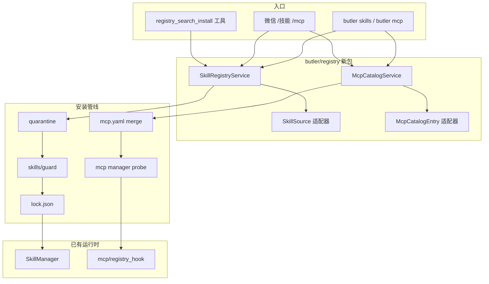

# Skill / MCP 搜索与装配能力设计（Butler v4）

> **状态**：Skill/MCP Registry 主路线已落地（REG-P0～P4、MCP-P0～P2 + 加固，2026-05-25）  
> **参考**：`reference/hermes-agent`（Skills Hub + `hermes mcp`）、`reference/openclaw`（ClawHub + skills-install）、Claude Code 插件市场形态  
> **原则**：零/少新依赖（`httpx` 可选）、不嵌入 Hermes/OpenCode 运行时、微信 Owner 门控

---

## 1. 现状与缺口

### 1.1 Butler 已有

| 域 | 能力 | 模块 |
|----|------|------|
| Skill 运行时 | 本地 `*.md` 索引、`skills_list` / `skill_view`、路由注入 | `butler/skills/manager.py`、`router.py` |
| Skill 安全 | 静态扫描（prompt injection、eval 等） | `butler/skills/guard.py`（`validate_skill_install` 仅校验，无拉取） |
| Skill 运维 | git 源 + `sync-*-project-skills.sh` | 文档 / 脚本 |
| MCP 运行时 | 薄 Client：读 YAML、连接 stdio/HTTP、注入 `mcp_*` 工具 | `butler/mcp/*` |
| MCP 对外 | `butler mcp serve`（Butler 作 Server） | `butler/mcp/server_stdio.py` |

### 1.2 Butler 缺失（用户诉求）

- **搜索**：跨 registry 按名称/描述检索 Skill 与 MCP Server 模板  
- **下载/装配**：一键安装到租户目录 / 写入 `mcp.yaml`，安装后 Loop 可用  
- **溯源与升级**：lockfile、版本、卸载、诊断展示  

### 1.3 参考实现对照

| 能力 | Hermes Agent | OpenClaw | Claude Code 生态 | Butler 拟采用 |
|------|--------------|----------|------------------|---------------|
| Skill 多源搜索 | `tools/skills_hub.py`：`SkillSource` + `unified_search`（official、GitHub、ClawHub、claude-marketplace、LobeHub、URL） | Gateway `skills.search` + ClawHub API | Marketplace `marketplace.json` + 插件目录 | **Hermes 适配器模式** + 可选 ClawHub |
| Skill 安装管线 | fetch → **quarantine** → `skills_guard` scan → confirm → `install_from_quarantine` → `lock.json` | `skills-install.ts`（npm/brew/archive/download）+ 安全扫描 | 用户目录插件安装 | **quarantine + guard + lock**（目录归一化为 `.md`） |
| Skill CLI/聊天 | `hermes skills *`、`/skills` | `openclaw skills` / UI | `/plugin` 类命令 | **`butler skills *` + 微信 `/技能`** |
| MCP 配置 | `~/.hermes/config.yaml` → `mcp_servers`；`hermes mcp add/list/test` + probe | 配置 + 多通道 | `settings.json` mcpServers | **扩展 `mcp.yaml` + `butler mcp add`** |
| MCP 发现 | add 时临时连接 `list_tools` | — | 市场/文档 | **catalog 索引 + install 前 probe** |
| 热重载 | `/reload-mcp` | — | — | **Gateway turn 边界重载 / `/mcp 重载`** |

Hermes 在提炼时 **明确不移植**「完整 Plugin 平台 / skills hub」到 Butler v4（见 `hermes-extraction-map.md`），但产品现需要该能力 — 应以 **Butler 原生模块** 重新实现，复用已落地的 `guard.py` 与 `mcp/config.py`，而非 import Hermes。

---

## 2. 目标与非目标

### 2.1 目标（Must）

1. **SR-1**：Owner/CLI 可 `search` 技能（多 registry，统一结果表）  
2. **SR-2**：Owner 可 `install` / `uninstall` / `upgrade` 技能到 `~/.butler/tenants/<tenant>/skills/`（项目级可选）  
3. **SR-3**：安装前 **隔离区扫描** + `guard` + 审计日志；失败可回滚  
4. **MR-1**：可浏览 **MCP 目录**（内置模板 + 可扩展索引）  
5. **MR-2**：Owner 可 `install` MCP 条目到 `~/.butler/mcp.yaml`（或项目 `.butler/mcp.yaml`），安装后 **probe** 工具列表  
6. **MR-3**：`/诊断` 展示已装配 Skill/MCP 溯源、版本、连接状态  
7. **GR-1**：微信仅 **Owner** 可执行 install/uninstall；普通用户可 search（只读）  

### 2.2 非目标（Won't，首期）

- OpenCode 级 MCP Host（npm 市场 OAuth、动态编译插件）  
- 安装时自动跑 `npm install -g` / `brew`（OpenClaw 有，Butler 微信服务器风险高）  
- LobeHub 全量代理市场（可作为 P2 适配器）  
- Agent 在无确认下自行 install（必须 Owner 或 `BUTLER_REGISTRY_AUTO_INSTALL=1` 显式开启）  
- 替换现有 `SkillManager` 扁平 `name.md` 模型 — **安装器负责归一化**

---

## 3. 总体架构



**模块边界**：新建 `butler/registry/`，不污染 `agent_loop.py`；运行时仍通过现有 `SkillManager` / `load_mcp_servers()` 加载。

---

## 4. Skill Registry 设计

### 4.1 数据模型（对齐 Hermes，简化）

```python
# butler/registry/skill_types.py
@dataclass
class SkillSearchHit:
    name: str
    description: str
    source: str          # bundled | github | clawhub | url | project
    identifier: str      # 源内唯一 ID，如 "anthropics/skills/pdf"
    trust: str           # builtin | trusted | community
    tags: list[str]
    extra: dict          # installs, repo_url, version, ...

@dataclass
class SkillBundle:
    name: str
    files: dict[str, str | bytes]  # rel_path -> content
    source: str
    identifier: str
    trust: str
    metadata: dict

@dataclass
class InstalledSkillRecord:
    name: str
    source: str
    identifier: str
    version: str | None
    installed_at: str
    content_hash: str
    install_path: str   # 相对 skills 根
    scan_verdict: str
```

**Lockfile**：`~/.butler/tenants/<tenant>/skills/.hub/lock.json`（与 Hermes `SKILLS_DIR/.hub/lock.json` 同构，便于迁移）。

### 4.2 SkillSource 适配器（参考 `tools/skills_hub.py`）

| 适配器 | 优先级 | 说明 | 首期 |
|--------|--------|------|------|
| `BundledSource` | P0 | 仓库内 `butler/registry/catalog/skills/*.yaml` 索引 + 可选 tarball 镜像 | ✅ |
| `GitHubSource` | P0 | GitHub Contents API / raw；支持 `owner/repo/path` identifier | ✅ |
| `UrlSource` | P0 | 单文件 SKILL.md 或 zip；SSRF 校验（移植 Hermes `url_safety` 思路） | ✅ |
| `ClawHubSource` | P1 | `reference/openclaw` 的 clawhub API 子集 | 可选 |
| `ClaudeMarketplaceSource` | P2 | 解析 `.claude-plugin/marketplace.json` | 可选 |
| `ProjectSource` | P0 | 只读列出 `projects/*/skills/` 已有项（不算远程安装） | ✅ |

接口（与 Hermes 一致）：

```python
class SkillSource(ABC):
    @property
    def source_id(self) -> str: ...
    def search(self, query: str, *, limit: int = 20) -> list[SkillSearchHit]: ...
    def inspect(self, identifier: str) -> SkillSearchHit | None: ...
    def fetch(self, identifier: str) -> SkillBundle | None: ...
```

`SkillRegistryService.unified_search(query, source_filter="all")` 并行查询（超时 3s/源），合并去重（按 `name+source`）。

### 4.3 安装管线（参考 Hermes `do_install`）

```
fetch(identifier)
  → quarantine_bundle()   # ~/.butler/.../skills/.hub/quarantine/<name>/
  → scan_skill_dir()      # 扩展 guard：目录级、SKILL.md 大小上限
  → normalize_to_butler_md()  # 见 4.4
  → install_path 写入
  → lock.record_install()
  → audit.log
  → SkillManager 缓存失效
```

**信任策略**（`should_allow_install`，移植 Hermes 逻辑）：

| trust | 行为 |
|-------|------|
| builtin / bundled | 允许；warn 即可 |
| trusted（白名单 repo） | 允许；需 `BUTLER_SKILL_TRUSTED_REPOS` |
| community | 默认 **需 Owner 确认**；`scan_verdict != clean` 则拒绝 |

**2026-06 实现（加载路径，非 hub 全链）**：[`butler/skills/guard.py`](../../../butler/skills/guard.py) 的 `evaluate_skill_load_policy` 将 `scan_verdict` × `infer_trust_from_source` 映射为 `inject` / `warn_inject` / `block`；`SkillManager._load_skill_from_path` 在 `block` 时跳过加载；hub/registry 路径默认 `warn_inject` 并在注入标题加 `[hub/社区 — 未验证]`。全链安装管线仍属 H-P2-1 backlog。

微信确认：安装前推送摘要 + 「回复 /确认安装 &lt;id&gt;」或 Owner 在 CLI 执行。

### 4.4 Butler 格式归一化（与现有 `SkillManager` 兼容）

Butler 当前：**扁平** `skills/<name>.md` + YAML frontmatter。  
Hermes / Claude：**目录** `skills/<category>/<name>/SKILL.md`。

**归一化规则**（`butler/registry/skill_normalize.py`）：

1. 若 bundle 仅含 `SKILL.md`（或 `skill.md`）→ 写入 `skills/<name>.md`（合并 frontmatter）  
2. 若含多文件 → 写入 `skills/<name>/` 目录，并生成 **stub** `skills/<name>.md`：

```yaml
---
name: pdf
description: ...
install_type: directory
content_path: pdf/SKILL.md
---
```

3. **REG-P2** ✅ `SkillManager` 识别 `install_type: directory` + `content_path`，从子目录加载正文；registry 安装多文件 bundle 时写入 `skills/<name>/` 并生成 stub `skills/<name>.md`。

### 4.5 CLI / Gateway / 工具

| 命令 | 行为 |
|------|------|
| `butler skills search <q> [--source all\|github\|...]` | 表格输出 |
| `butler skills inspect <identifier>` | 元数据 + 扫描预览 |
| `butler skills install <id> [--name] [--force]` | 走安装管线 |
| `butler skills uninstall <name>` | 仅允许 hub lock 记录的项 |
| `butler skills list --installed` | lockfile 视图 |
| 微信 `/技能 搜索 <q>` | 只读 |
| 微信 `/技能 安装 <id>` | Owner + 确认门 |
| 微信 `/技能 列表` | 已安装 |

**Agent 工具**（可选，P1）：

- `registry_search_skills(query, source?)` — 只读  
- `registry_propose_skill_install(identifier)` — 返回 Owner 须执行的命令，**不直接安装**

### 4.6 配置与环境变量

| 变量 | 默认 | 说明 |
|------|------|------|
| `BUTLER_SKILL_REGISTRY` | `1` | 总开关 |
| `BUTLER_SKILL_REGISTRY_SOURCES` | `bundled,github,url,clawhub` | 启用源列表 |
| `BUTLER_CLAWHUB_ENABLED` | `1` | ClawHub community 源 |
| `BUTLER_CLAWHUB_URL` | `https://clawhub.ai/api/v1` | ClawHub API |
| `BUTLER_REGISTRY_CACHE_TTL` | `3600` | 远程索引缓存秒数 |
| `BUTLER_CLAUDE_MARKETPLACE_ENABLED` | `1` | Claude marketplace 适配器 |
| `BUTLER_CLAUDE_MARKETPLACE_URLS` | 空 | 远程 `marketplace.json` URL（CSV） |
| `GITHUB_TOKEN` | — | 提高 GitHub API 限额 |
| `BUTLER_SKILL_TRUSTED_REPOS` | 空 | `owner/repo` CSV |
| `BUTLER_SKILL_INSTALL_MAX_MB` | `2` | 单技能体积上限 |
| `BUTLER_SKILL_QUARANTINE` | `1` | 隔离区开关 |

---

## 5. MCP Catalog 设计

### 5.1 与现有 `butler/mcp` 关系

- **已有**：`load_mcp_servers()` 读 YAML → `McpManager` 连接 → `registry_hook` 注册工具  
- **新增**：**Catalog**（只读索引 + 模板）与 **Installer**（写 YAML + probe），不替代 Manager

### 5.2 目录数据模型

```yaml
# butler/registry/catalog/mcp/servers.yaml（内置，可扩展）
version: 1
servers:
  - id: github
    title: GitHub MCP
    description: ...
    trust: trusted
    transport: stdio
    command: npx
    args: ["-y", "@modelcontextprotocol/server-github"]
    env_hints:
      - name: GITHUB_PERSONAL_ACCESS_TOKEN
        required: true
    tools_preview: []   # 可选静态列表；安装后以 probe 为准
```

**用户态**：安装后写入 `~/.butler/mcp.yaml`：

```yaml
version: 1
servers:
  github:
    transport: stdio
    command: npx
    args: ["-y", "@modelcontextprotocol/server-github"]
    env:
      GITHUB_PERSONAL_ACCESS_TOKEN: "${GITHUB_PERSONAL_ACCESS_TOKEN}"
```

与现有 schema **完全兼容**（`butler/mcp/config.py` 已支持）。

### 5.3 MCP Catalog 源

| 源 | 说明 | 首期 |
|----|------|------|
| `bundled` | 仓库 `catalog/mcp/*.yaml` | ✅ |
| `user` | 已安装条目（反向 list） | ✅ |
| `custom_url` | P2：拉取远程 index JSON/YAML（`BUTLER_MCP_CATALOG_URLS`，SSRF） | ✅ |

**不做**：动态 `npx` 搜索 npm registry（可 P2 用静态 curated 列表代替）。

### 5.4 安装管线（参考 `hermes mcp add`）

```
catalog.get(id)
  → 合并 transport/env/args
  → 提示缺失 env（写入 ~/.butler/.env 或 Owner 微信配置）
  → merge_into_mcp_yaml(server_id, block)   # 原子写 + backup
  → probe_server(server_id)                 # 临时连接 list_tools
  → 记录 mcp.lock.json（version, probed_at, tool_count）
  → registry_hook 下次 turn 重连（或 mcp reload）
```

**Probe 约束**（沿用现有安全）：

- stdio：`BUTLER_MCP_STDIO_ALLOW_COMMANDS` 必须包含 command  
- http：`validate_http_url` + `hosts_allow`  
- 失败：**不写入 YAML**（已实现：`probe.ok=false` 时回滚，不写 mcp.yaml）

### 5.5 CLI / Gateway

| 命令 | 行为 |
|------|------|
| `butler mcp search <q>` | 搜 catalog |
| `butler mcp inspect <id>` | 详情 + 依赖 env |
| `butler mcp add <id> [--env K=V]` | 安装 + probe |
| `butler mcp remove <id>` | 从 yaml 删除 + disconnect |
| `butler mcp list` | catalog + 已启用 |
| `butler mcp test <id>` | 仅 probe |
| 微信 `/mcp 列表` `/mcp 安装 github` | Owner 门控 |

**与 `butler mcp serve` 区分**：`serve` = Butler 作为 MCP Server；`mcp add` = Butler 作为 MCP Client 装配外部 Server。

### 5.6 热重载

- `butler mcp reload` / 微信 `/mcp 重载`  
- 实现：`registry_hook.disconnect_all(session)` + 清连接池；下一 turn `load_mcp_servers()` 重读 YAML  
- 不在 Agent 迭代中途 reload（避免半连接状态）

---

## 6. 安全与合规

| 风险 | 控制 |
|------|------|
| SSRF（URL/GitHub raw） | 复用 Hermes 思路：`is_safe_url`、禁止私网、重定向上限 |
| 恶意 Skill 内容 | `guard.scan` + 体积上限 + 扩展名白名单（`.md`、`.txt`、`.json`） |
| 路径穿越 | bundle 路径规范化（Hermes `_normalize_bundle_path`） |
| MCP 命令注入 | 已有 `validate_stdio_command`；catalog 仅允许 curated 命令 |
| 供应链 | lockfile + `content_hash`；upgrade 重新 scan |
| 微信滥用 | install/uninstall **Owner only**；审计 `~/.butler/audit/registry.log` |

**依赖**：Skill 远程源建议 **可选** `httpx`（Hermes 已用）；若坚持零依赖 P0 仅 `bundled` + `urllib` GitHub raw（受限）。

---

## 7. 诊断与可观测

扩展 `butler/ops/harness_diagnostics.py`（或 `registry_diagnostics.py`）：

- 已安装 Skill 数、来源分布、最近安装  
- MCP catalog 命中 / 已配置 server 数、上次 probe 结果  
- 失败项：scan 拒绝、probe 超时  

`/诊断` 增加 **Registry** 段。

---

## 8. 分阶段路线图

| 阶段 | 交付 | 测试 |
|------|------|------|
| **REG-P0** | `butler/registry/` 骨架；`BundledSource` + `UrlSource`；skill install 管线 + lock；`butler skills` CLI；guard 目录扫描 | `tests/test_skill_registry.py` |
| **REG-P1** ✅ | `GitHubSource`；`ClawHubSource`；`hub_index_cache`；`skills inspect/upgrade`；微信 `/技能 查看|升级`；`registry_search_skills` 只读工具 | `tests/test_clawhub_registry.py` |
| **MCP-P0** | `catalog/mcp/servers.yaml`；`butler mcp search/add/remove/test`；probe + yaml merge | `tests/test_mcp_catalog.py` |
| **MCP-P1** ✅ | 微信 `/mcp`（列表/查看/测试/重载）；`/诊断` registry+MCP 合并段；`mcp reload|status|inspect`；`mcp_merge` 项目+全局合并 UI | 扩展 `test_mcp_features.py` |
| **REG-P2** ✅ | 目录型 skill（`install_type: directory` + stub）；`ClaudeMarketplaceSource`（`marketplace.json`）；内置 demo marketplace | `tests/test_skill_registry_p2.py` |
| **REG-P3** ✅ | `ProjectSource`（`projects/*/skills` 只读索引 + 可安装到租户） | `tests/test_project_source.py` |
| **MCP-P2** ✅ | 远程 MCP catalog（`BUTLER_MCP_CATALOG_URLS` + TTL 缓存） | `tests/test_mcp_catalog.py` |
| **REG-P4** ✅ | `LobeHubSource`（API token 或 market-cli）；微信 `/确认安装` + pending | `tests/test_lobehub_source.py`, `tests/gateway/test_install_pending.py` |
| **加固** ✅ | MCP probe 失败不写 yaml；`mcp add --workspace` / 微信有项目时写 `.butler/mcp.yaml` | `tests/test_mcp_catalog.py` |

**建议顺序**：REG-P0 → MCP-P0 → REG-P1 → MCP-P1（先打通 Skill 闭环，再 MCP 装配）。

---

## 9. 文件布局（拟新增）

```
butler/registry/
  __init__.py
  skill_types.py
  skill_service.py      # search/install/uninstall
  skill_sources/
    base.py
    bundled.py
    github.py
    url.py
    clawhub.py          # P1
  skill_install.py      # quarantine, normalize, lock
  skill_lock.py
  mcp_catalog.py
  mcp_install.py
  mcp_lock.py
  audit.py
  catalog/
    skills/index.yaml
    mcp/servers.yaml

butler/cli/skills_registry.py   # argparse
butler/cli/mcp_catalog_cli.py   # 或并入 main.py 子命令
```

---

## 10. 与 Hermes 提炼边界（避免重复踩坑）

| Hermes | Butler 做法 |
|--------|-------------|
| `tools/skills_hub.py` 3000+ 行单体 | 拆成 `registry/*`，单文件 &lt; 400 行 |
| 目录式 skill 树 | 归一化为 `.md` + 可选 stub |
| `config.yaml` 混写 | Skill → tenants/skills；MCP → 已有 `mcp.yaml` |
| 50+ MCP 默认启用 | catalog **显式安装** + 项目白名单 |
| Gateway subprocess | **原生** `message_handler` 子命令 |

---

## 11. 决策预设（待主公确认）

| # | 建议 |
|---|------|
| D1 | Skill 安装默认需 Owner 确认（微信回复或 CLI） |
| D2 | 首期 Skill 只落租户全局 `~/.butler/tenants/<tenant>/skills/`；项目覆盖仍用 sync 脚本 |
| D3 | MCP 默认写全局 `~/.butler/mcp.yaml`；`butler mcp add --workspace` 或微信有绑定项目时写 `<workspace>/.butler/mcp.yaml` |
| D4 | 远程 HTTP 用 `httpx` 作为 **可选 extra**：`butler-system[registry]` |
| D5 | 不自动执行 npm/brew；npx 类 MCP 仅在 Owner 明确 `add` 且命令在白名单时写入 yaml |
| D6 | Agent 工具仅 `search` + `propose`，不直接 `install` |

---

## 12. 运维速查（已实现）

### Skill 安装确认（community）

1. `/技能 安装 clawhub:xxx` → 待确认提示  
2. `/确认安装 clawhub:xxx`（Owner）  
3. 或 `/技能 强制安装 <id>` / CLI `butler skills install <id> --yes`  
4. `BUTLER_REGISTRY_AUTO_INSTALL=1` 可跳过确认（慎用）

### LobeHub

- 推荐：`export BUTLER_LOBEHUB_TOKEN=...`  
- 备选：`BUTLER_LOBEHUB_USE_CLI=1`（需本机 `npx`）  
- 搜索：`butler skills search <词> --source lobehub`

### MCP 装配

```bash
# 全局（默认）
butler mcp add github --env GITHUB_PERSONAL_ACCESS_TOKEN=$GITHUB_TOKEN

# 项目层（当前仓库）
butler mcp add github --workspace /path/to/project

# 合并视图
butler mcp status --workspace /path/to/project
```

- `BUTLER_MCP_ENABLED=1` 时安装前 **probe**；失败 **不会** 写入 yaml  
- 微信 `/mcp 安装`：会话已绑定项目时写入该项目 `.butler/mcp.yaml`，否则写全局
- 项目层安装成功后：若 `project.yaml` 有非空 `tools` 白名单且缺 `mcp_*`，自动追加（`BUTLER_MCP_AUTO_PROJECT_TOOLS=1` 默认开）

---

*设计稿版本：2026-05-25*
