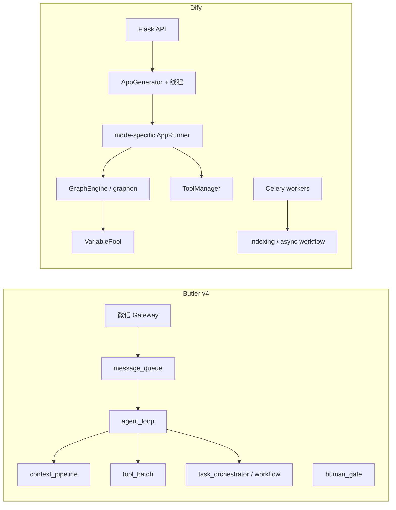

# Butler v4 与 Dify 对照分析报告

> **日期**：2026-05-25  
> **对照代码**：`reference/dify`（LangGenius Dify monorepo，含 `api/`、`web/`、`dify-agent/` 等）  
> **Butler 事实来源**：[`docs/architecture/v4-architecture.md`](../architecture/v4-architecture.md)  
> **相关规划**：[`reference-learning-plan-2026-05.md`](reference-learning-plan-2026-05.md)（Dify P2 已收口）、[`langchain-butler-comparison-2026-05.md`](langchain-butler-comparison-2026-05.md)、[`cc-butler-gap-analysis-2026-05.md`](cc-butler-gap-analysis-2026-05.md)  
> **原则**：只借鉴设计、零新增 pip 依赖（不引入 graphon、Dify API、plugin_daemon、Celery 运行时）

---

## 1. 执行摘要

Dify 是 **LLM 应用平台**（Web Studio + API BaaS + 多租户 + 知识库 + 工具市场）；Butler v4 是 **微信管家 + 自建 Agent Loop + 多项目委派**。二者产品边界不同，对比价值在于 **机制设计**（工作流变量、HITL、工具平面、流式事件、RAG 管道），而非嵌入 Dify 运行时。

**结论**：

- Butler 已从 Dify **DAG 思想、步骤级工具白名单、微信 HITL、`step_outcomes`** 收口（见 reference-learning-plan P2）。
- **最值得继续吸收**（零依赖）：工作流 **节点级 transcript/失败事件**、**步骤间变量传递**（VariablePool 简化版）、**human_gate 超时与暂停快照**、**流式出站事件类型化**、**ToolProvider 分层**。
- **明确不做**：GraphEngine / 可视化编辑器、plugin_daemon、Celery 工人集群、多租户 SaaS、workflow 暂停后自动续跑（维持显式 `/workflow`）。

---

## 2. 定位与架构对照

| 维度 | Butler v4 | Dify |
|------|-----------|------|
| 产品形态 | 微信管家 + CLI，单操作者多项目 | LLM 应用平台（Web Studio + API BaaS） |
| 执行核心 | 单一 `agent_loop` + `tool_batch` | 多模式 Runner + **graphon** `GraphEngine` |
| 部署 | 单进程 Gateway（可选 systemd） | `api` + `worker` + `worker_beat` + `plugin_daemon` + `sandbox` + `dify-agent` |
| 租户 | 多 `project`，非 SaaS 多租户 | `Tenant`（workspace）+ 计费档位 |
| 学习原则 | 只借鉴设计、零依赖 | 全栈平台，不适合整体迁入 |

### 2.1 Dify 顶层目录（阅读索引）

| 路径 | 角色 |
|------|------|
| `api/` | Flask 后端：`core/`、`controllers/`、`services/`、`tasks/` |
| `web/` | 前端：工作流画布、数据集、应用工作室 |
| `docker/` | 生产 compose：api、worker、plugin_daemon、sandbox 等 |
| `dify-agent/` | Workflow Agent v2 节点调用的独立 Agent 服务（Agenton） |
| `packages/`、`sdks/` | JS 包与 HTTP SDK |

工作流运行时核心在 PyPI **`graphon`**（`api/pyproject.toml`），非完全 vendored 在 `reference/dify` 内。

### 2.2 Butler 代码入口（对照用）

| 场景 | 路径 |
|------|------|
| Agent 主循环 | `butler/core/agent_loop.py` |
| 工作流执行 | `butler/workflows/runner.py`、`butler/task_orchestrator.py` |
| 人机门控 | `butler/human_gate.py` |
| 入站队列 | `butler/gateway/message_queue.py` |
| 步骤权限 | `butler/permissions.py`（`workflow_steps`） |
| 运行指标 | `butler/ops/runtime_metrics.py` |
| 可选 MCP | `BUTLER_MCP_ENABLED` + `.butler/mcp.yaml` |

---

## 3. 分维度详细对比

### 3.1 Agent / LLM 执行

**Dify**（`api/models/model.py` → `AppMode`）按应用类型分叉：

| 模式 | Runner | 说明 |
|------|--------|------|
| `chat` / `completion` | `chat/app_runner.py` 等 | 模板 + 可选 RAG + `TokenBufferMemory` |
| `agent-chat` | `agent_chat/app_runner.py` | FunctionCall 或 CoT；工具环至 `max_iteration` |
| `workflow` | `workflow/app_runner.py` | `WorkflowEntry` → `GraphEngine` |
| `advanced-chat` | `advanced_chat/app_runner.py` | 聊天 UX + 同一工作流引擎 + 会话变量 |
| Agent v2 节点 | `dify-agent` HTTP | 工作流内 Agent 走侧车服务 |

**Butler**：统一 `agent_loop` + `context_pipeline`（压缩、hygiene、prune、post-compact）+ `tool_batch` / `parallel_tools` / `streaming_tools`。

| 可提炼点 | Dify 做法 | Butler 现状 | 建议 |
|----------|-----------|-------------|------|
| 模式分叉 vs 统一 Loop | 每模式独立 Runner | 单一 Loop，完全可控 | **保持统一 Loop**；轻量模式用 `LoopConfig` 开关 |
| 流式事件模型 | `AppQueueManager` + 内存队列，SSE 分块 | `outbound_bridge` + 流式 tool | P0：事件类型枚举，对齐 transcript / `/诊断` |
| Agent 侧车 | workflow 内 HTTP `dify-agent` | `delegate_task` 进程内子 Loop | **不必拆服务**；微信延迟更敏感 |
| FC vs CoT | 按模型 feature 选 Runner | transport 统一 tool schema | 补模型 capability 表，减少无效 schema 重试 |

**高信号文件（Dify）**：

- `api/core/app/apps/base_app_queue_manager.py` — 流式队列与 stop/cancel
- `api/core/app/apps/agent_chat/` — FC / CoT 工具环

---

### 3.2 工作流 / DAG

**Dify**（`api/core/workflow/workflow_entry.py` + graphon）：

- `VariablePool`：`(node_id, key)` 变量与 Jinja 模板渲染
- 子图、迭代、并行（`BuiltinNodeTypes.ITERATION` / `LOOP`）
- `PauseStatePersistenceLayer`：暂停后序列化 `GraphRuntimeState` 可恢复
- `ExecutionLimitsLayer`：步数/时间上限
- `workflow-as-tool`：子工作流作为可调用工具

**Butler**：

- `WorkflowDef`（YAML）→ `TaskOrchestrator` DAG，`asyncio.to_thread` 真并行
- `permissions.yaml` → `workflow_steps.<id>.tools`
- `human_gate`：微信确认/取消；**不自动续跑**（显式再发 `/workflow`）
- `AgentReport.step_outcomes`：`ok` / `fail` / `approval_pending`

| 可提炼点 | 优先级 | Butler 落点 |
|----------|--------|-------------|
| 变量池（步骤输出 → 下游任务） | P1 | `WorkflowDef` 增加 step `outputs` + 模板插值 |
| 节点失败即事件 | P0 | `outbound_bridge.notify_workflow_step(phase="fail")` + transcript |
| 暂停/恢复状态 | P1 | `.butler/workflow_pause.json`（类 `WorkflowResumptionContext`，无 DB） |
| 单步调试 | P2 | CLI `/workflow debug <step_id>` |
| 子工作流当工具 | P2 | 命名 workflow → `delegate_task` 预设 |
| 可视化编辑器 | — | **不做** |

**已落地（reference-learning-plan P2）**：DAG 思想、`human_gate`、`workflow_steps` 白名单、`step_outcomes`。

**高信号文件（Dify）**：

- `api/core/workflow/workflow_entry.py`
- `api/core/app/layers/pause_state_persist_layer.py`
- `api/core/workflow/variable_pool_initializer.py`

---

### 3.3 RAG / 知识库

**Dify**：

- `api/core/indexing_runner.py`：extract → transform → load → index
- 索引类型：段落 / QA / 父子（`index_processor_factory`）
- `api/core/rag/datasource/retrieval_service.py`：向量 + 关键词 + 混合；并行取段；rerank
- Celery `document_indexing_task` + 租户配额

**Butler**：项目 `MEMORY.md` + memory 工具；无 dataset studio / 向量库抽象层。

| 可提炼点 | 是否适合 Butler |
|----------|----------------|
| 索引流水线 | 仅「项目文档库」产品化时；**非微信管家刚需** |
| 混合检索 + rerank | 二期轻量 `butler/memory/` 可参考 |
| Parent-child chunk | 长文档问答质量参考 |
| 多 dataset 路由 | 用多 `project` 替代，不必 tenant 级 dataset |

**建议**：RAG **单列规划**，不与 Loop/CC 线束混做。

---

### 3.4 工具系统

**Dify**（`api/core/tools/tool_manager.py`）：

| 来源 | 说明 |
|------|------|
| Builtin | webscraper、code、time 等 |
| OpenAPI | 租户自定义 HTTP 工具 |
| MCP | `mcp_tool` + 鉴权重试 |
| Plugin daemon | 市场插件 HTTP |
| Workflow-as-tool | 已发布工作流当工具 |

**Butler**：`tools/registry.py` 约 9 个核心工具 + 可选 `mcp_*` + `delegate_task`。

| 可提炼点 | 优先级 | 建议 |
|----------|--------|------|
| ToolProvider 抽象（builtin / mcp / http） | P1 | 解析与 credential 分离 |
| 工具标签/按场景过滤 | P2 | 降 LLM schema token |
| Workflow-as-tool | P2 | 命名 workflow → 委派模板 |
| Plugin daemon | — | **不做** |
| OpenAPI 声明式工具 | P2 | `.butler/tools/*.yaml`（可选） |

---

### 3.5 模型 Provider

**Dify**：`provider_manager` + `model_manager` → 租户凭证、负载均衡、`ModelInstance.invoke_llm`。

**Butler**：`transport/providers.py` + `fallback.py` + orchestrator 项目配置。

| 可提炼点 | 优先级 |
|----------|--------|
| 凭证加密 at rest | P1 |
| 多 endpoint 权重 / LB | P2 |
| 独立 Embedding/Rerank 类型 | 仅 RAG 二期 |

---

### 3.6 队列 / 异步

**Dify**：

- 交互：**线程 + 内存 `queue.Queue`**（`base_app_queue_manager.py`）；Redis 用于 stop/cancel 归属
- 后台：**Celery**（索引、异步 workflow 档位、trace 导出）

**Butler**：

- `message_queue.py`：now / next / later + cap / drop + 2s 去重
- `runtime_metrics` 记录队列深度
- 无 Celery

| 可提炼点 | 建议 |
|----------|------|
| 任务归属与取消语义 | P1：会话级 `active_turn` + `/stop` 文档化 |
| Celery / 分层 async workflow 队列 | **不做** |
| 学 Dify 的流式事件契约 | P0，而非 Celery |

入站队列主对标仍为 **OpenClaw**（reference-learning-plan P1）；Dify 补强 **出站事件粒度**。

---

### 3.7 可观测性

**Dify**：OTel + `ObservabilityLayer` + Langfuse/Opik/Phoenix + DB `WorkflowRun` / `WorkflowNodeExecution`。

**Butler**：`runtime_metrics` + `/诊断` + `session_transcript` + `LoopTransitionReason`。

| 可提炼点 | 优先级 |
|----------|--------|
| 工作流节点级 transcript（start/end/duration/token） | P0 |
| 可选 JSONL trace 导出（message/tool/retrieval） | P1 |
| `/workflow history` 读本地 run 文件 | P2 |

Prometheus **思想**已落地（`runtime_metrics`）；不引入 `prometheus-client`。

---

### 3.8 多租户 / 权限

**Dify**：`Tenant`、角色、`feature_service` 计费、`TenantPluginPermission`。

**Butler**：`permissions.yaml`（allow/deny/ask）、`workflow_steps.<id>.tools`、`human_gate`。

| 可提炼点 | 状态 |
|----------|------|
| 步骤级工具白名单 | ✅ 已落地 |
| HITL 多表面（Console/API/Web） | Butler 仅微信；可共用 `human_gate` 扩展 CLI |
| 结构化批准（表单/token） | P2 |
| 租户计费 | **不做** |

---

### 3.9 人机协同（HITL）

**Dify**：

- `PauseReasonType.HUMAN_INPUT_REQUIRED`
- `PauseStatePersistenceLayer` + `WorkflowResumptionContext`
- `human_input_policy.py` / `human_input_forms.py`：多 surface、recipient token 优先级
- `human_input_timeout_tasks.py`

**Butler**：

- `butler/human_gate.py`：文件持久化 + 微信关键词确认/取消
- 确认后 **不自动续跑** workflow（决策 D5）

| 可提炼点 | 优先级 |
|----------|--------|
| Gate TTL 超时自动取消 | P1（`BUTLER_GATEWAY_HUMAN_GATE_TTL`） |
| 暂停时快照 workflow 进度 | P1 |
| 单工具级 approve/edit/reject | P2 |
| 暂停后自动续跑 | **不做** |

---

## 4. Butler 已吸收 vs 待对标清单

### 4.1 已吸收（reference-learning-plan + 代码）

| Dify 概念 | Butler 映射 |
|-----------|-------------|
| Workflow DAG | `task_orchestrator` + `WorkflowRunner` |
| 步骤工具白名单 | `permissions.workflow_steps` |
| Human-in-the-loop | `human_gate` + 微信确认/取消 |
| 步骤结果摘要 | `AgentReport.step_outcomes` |
| 指标模型（非客户端） | `runtime_metrics` + `/诊断` |

### 4.2 建议路线图（零依赖）

| 优先级 | 借鉴来源（Dify） | Butler 落点 | 测试建议 |
|--------|------------------|-------------|----------|
| **P0** | 节点失败/完成事件 | `workflows/runner`、`session_transcript`、`outbound_bridge` | `test_p2_workflow_permissions.py` 扩展 |
| **P0** | 流式队列事件类型化 | `gateway` 出站与 `/诊断` 字段 | `test_gateway_handler.py` |
| **P1** | VariablePool 模板引用 | `WorkflowDef` step outputs + 下游 task | 新 workflow 变量测试 |
| **P1** | HITL 超时 + 暂停快照 | `human_gate` + env TTL | `test_p2_workflow_permissions.py` |
| **P1** | ToolProvider 分层 | `tools/registry` | MCP/权限相关测试 |
| **P1** | 节点级 trace | `AgentReport` + transcript | `test_runtime_metrics.py` |
| **P2** | 单步 debug run | CLI `/workflow debug` | CLI 测试 |
| **P2** | 工具预选降 token | `orchestrator` 按任务过滤 tools | 可选 |
| **P2** | 轻量 RAG | 新 `butler/memory/` | 独立规划 |

### 4.3 明确不做

- 嵌入 graphon / Dify API / OpenClaw 或 Dify 子进程运行时
- `plugin_daemon`、Celery 工人集群、可视化工作流编辑器
- 入站队列 jsonl/WAL（`session_transcript` 已够审计）
- 确认后自动续跑 workflow（维持显式 `/workflow`）
- 多实例 Gateway + 外部队列（当前单进程假设）
- 多租户 SaaS 与计费档位

---

## 5. 与仓库内其他对照的关系

| 文档 | 关系 |
|------|------|
| [`cc-butler-gap-analysis-2026-05.md`](cc-butler-gap-analysis-2026-05.md) | **主学习线**（流式工具、cache-safe 委派、队列出站）；优先于 Dify |
| [`reference-learning-plan-2026-05.md`](reference-learning-plan-2026-05.md) | Dify P2 已收口；本文档为 **完整展开版** |
| [`langchain-butler-comparison-2026-05.md`](langchain-butler-comparison-2026-05.md) | 中间件/压缩/工具重试；与 Dify 工具层、观测互补 |
| [`openclaw-learning-plan-2026-05.md`](openclaw-learning-plan-2026-05.md) | 入站队列语义；比 Dify 更贴 Gateway |

---

## 6. Butler 相对 Dify 的优势（保持）

- 微信入站队列（now/next/later、cap/drop）与 **可控续跑**（不自动跑 workflow）
- In-process `delegate_task`，延迟与审计归属更简单
- 长上下文经济学：`context_compressor`、tool prune、spill、`reactive_compact`
- 多 **project** 而非多租户平台复杂度
- 零依赖 `runtime_metrics` + `/诊断`，运维轻量

---

## 7. Dify 高信号源码索引（精读用）

1. `api/core/workflow/workflow_entry.py` — Dify ↔ graphon 边界  
2. `api/core/app/apps/base_app_queue_manager.py` — 流式生命周期  
3. `api/core/indexing_runner.py` — RAG  ingest  
4. `api/core/tools/tool_manager.py` — 工具解析图  
5. `api/core/provider_manager.py` — 租户模型配置  
6. `api/tasks/async_workflow_tasks.py` — 后台 workflow 档位（Butler 不引入，仅理解）  
7. `api/core/app/layers/pause_state_persist_layer.py` — 暂停恢复  
8. `dify-agent/src/dify_agent/runtime/runner.py` — Agent v2 执行路径  

---

## 8. 决策记录

| # | 问题 | 结论 |
|---|------|------|
| D1 | 是否引入 graphon / Dify 运行时？ | **否** |
| D2 | 是否做可视化工作流？ | **否**（二期亦默认否） |
| D3 | 是否引入 Celery / plugin_daemon？ | **否** |
| D4 | 是否暂停后自动续跑 workflow？ | **否**；显式 `/workflow` |
| D5 | RAG 是否并入 Loop 线束？ | **否**；单列 `butler/memory/` 规划 |
| D6 | 下一批优先项？ | P0 节点事件 + 流式事件类型；P1 变量池 + HITL TTL |

---

*报告生成：2026-05-25。对照路径：`reference/dify`。若 Dify 上游升级，可 sparse-checkout 扩展 `api/core/` 后刷新 §7 索引。*
