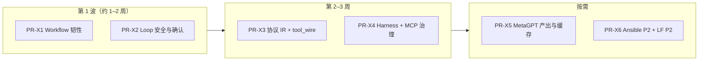

# 外部 Agent 对标五报告 — 合并改进路线图（2026-05）

> **状态**：**PR-X1–X6 已落地**（2026-05-25）；P5–P10 五报告子集见 [`five-reports-not-done-2026-05.md`](five-reports-not-done-2026-05.md) §3  
> **来源报告**：[`llamafactory-butler-comparison-report-2026-05.md`](llamafactory-butler-comparison-report-2026-05.md)、[`deer-flow-butler-comparison-report-2026-05.md`](deer-flow-butler-comparison-report-2026-05.md)、[`openhands-butler-comparison-report-2026-05.md`](openhands-butler-comparison-report-2026-05.md)、[`metagpt-butler-comparison-report-2026-05.md`](metagpt-butler-comparison-report-2026-05.md)、[`ansible-butler-comparison-2026-05.md`](ansible-butler-comparison-2026-05.md)  
> **事实基线**：[`../architecture/v4-architecture.md`](../architecture/v4-architecture.md)  
> **前置已落地**：[四报告路线图](four-reports-improvement-roadmap-2026-05.md)（**已收口**）、[五报告路线图](five-reports-improvement-roadmap-2026-05.md)（**PR-F1–F6 已落地**）、[CC 线束](cc-butler-gap-analysis-2026-05.md)  
> **否决 / 边界 / Backlog**：[`roadmap-backlog-and-boundaries-2026-05.md`](roadmap-backlog-and-boundaries-2026-05.md)（**决策入口**）  
> **原则**：零新增重依赖；不引入 LangGraph / 训练栈 / Docker 沙箱 / Web GUI；不改变「微信管家 + 自建 Agent Loop」边界

---

## 1. 这份文档解决什么问题

五份新对照报告与已收口的四报告、五报告**正交**，共同补强三类能力：

| 能力域 | 主要来源 | Butler 现状（简述） |
|--------|----------|---------------------|
| **协议与多模型** | LlamaFactory | `transport/` 分散适配；缺 canonical IR、tool 线方言层 |
| **Harness 工程细节** | DeerFlow | 压缩/队列/MCP 薄客户端已有；缺 skill rescue、deferred MCP、澄清中断 |
| **确认与安全态** | OpenHands | `permissions.yaml` + `human_gate`；缺两阶段确认、WAITING/STUCK 态 |
| **经验与结构化产出** | MetaGPT | ledger/outcomes 已有；缺 exp_cache、工具 recall、Pydantic 终局深化 |
| **Workflow 韧性** | Ansible | DAG + `max_retries` 已有；缺 rescue/optional/serial/handlers |

**TradingAgents** 的 outcome/handoff 已在五报告 **主线 I / PR-F5** 落地；本路线图**不重复**该线。

本路线图收敛为 **5 条主线（K–O）+ 3 个实施波次（PR-X1–X6）**。

---

## 2. 总体判断

### 2.1 应优先增强的

1. **Workflow 可恢复**：失败走 rescue、并行分支 optional、控并发 serial  
2. **Loop 更安全**：Skill 压缩保留、finish_reason 终止、Finish 截断、两阶段确认  
3. **协议更统一**：入站 Message IR、按厂商 tool_wire  
4. **Token 更省**：MCP deferred 发现、工具 BM25 recall、静态 system + reminder  
5. **产出更稳**：exp_cache 子集、output_schema 校验重试、workflow checkpoint  

### 2.2 已具备、本路线图不重复建设

| 能力 | 文档/模块 |
|------|-----------|
| CC 线束 P0–P4（压缩、队列、spill、delegate cache-safe） | `cc-butler-gap-analysis` |
| 四报告 A–D + 实验 harness | `four-reports-improvement-roadmap` §9 |
| 五报告 F–J（recall、熔断、PEG、outcome、tool_error_policy） | `five-reports-improvement-roadmap` §9 |
| DAG 真并行 + handoff_only | `task_orchestrator.py` |
| 微信 human_gate + message_queue | `gateway/` |
| 薄 MCP | `BUTLER_MCP_ENABLED`、`butler/mcp/` |

### 2.3 命名约定（勿与其他「P0」混用）

| 本路线图说法 | 含义 |
|--------------|------|
| **主线 K–O** | 本五报告五条能力线（§3） |
| **第 1/2/3 波** | PR-X1–X6 实施波次（§4） |
| **PR-X1 … PR-X6** | 本路线图实现 PR |
| **LF-/DF-/OH-/MG-/ANS-** | 各对照报告内原始优先级标签（见 §5 映射表） |

与 **CC 线束 P0–P4**、**四报告 PR1–PR6**、**五报告 PR-F1–F6**、**外部对标 P0–P2**（reference-learning）**无关**。

---

## 3. 五条主线

### 主线 K — 消息 IR 与多模型协议（LlamaFactory）

**目标**：多通道入站 → 规范中间表示 → 单一 context_pipeline；多厂商 tool 文本方言可插拔。

| 优先级 | 项 | 产出 | 主要落点 |
|--------|----|------|----------|
| **P0** | Canonical Message IR | `CanonicalMessage` / `ContentBlock` | `butler/core/message_ir.py` |
| **P0** | Converter 注册表 | wechat / openai / anthropic / mcp_result → IR | `gateway/`、`message_ir.py` |
| **P0** | `tool_wire` 适配器 | 按 provider 解析/序列化 tool_calls | `butler/transport/tool_wire.py` |
| **P1** | 入站消息序列校验 | 非法 u/a/tool 序列早失败 | `message_handler.py` 或 HTTP 入口 |
| **P1** | Prompt Renderer 解耦 | `render_system()`、`anchor_sections()` | `butler/core/prompt_renderer.py` |
| **P1** | `project.yaml` 的 `plugins:` 段 | 与 `BUTLER_*` 浅合并 | `project.py`、`reference.md` |
| **P2** | Loop 插件 Hub 扩展 | `on_turn_end`、`on_job_finish` 等 | `loop_plugins.py` |
| **P2** | `dataset_info.yaml` 多源记忆索引 | 路径/权重 | `memory/chunking.py` |

**边界**：不做训练栈、Gradio、vLLM 集群（四报告 #16、LF §7）。

---

### 主线 L — Harness 细节（DeerFlow）

**目标**：在自建 Loop 上吸收 Super Agent Harness 的 token 与安全细节，**不**引入 LangGraph。

| 优先级 | 项 | 产出 | 主要落点 |
|--------|----|------|----------|
| **P0** | Skill 压缩 rescue | 压缩前保留最近 skill 读取 tool 对 | `context_compressor.py` / `context_pipeline.py` |
| **P0** | Safety finish_reason | 拒答/content_filter 仍带 tool_calls 时终止 turn | `llm_retry.py` / transport |
| **P0** | MCP deferred `tool_search` | 不全量注入 MCP schema | `butler/mcp/`、`tools/registry.py` |
| **P0** | `ask_clarification` | 结束 turn 追问 | `tool_batch.py`、gateway |
| **P1** | 静态 system + `<system-reminder>` | 动态块进 user 侧 | `orchestrator.py` |
| **P1** | Deep Research skill 移植 | 方法论 skill（`web_fetch` + RAG） | `.butler/skills/` |
| **P1** | LoopMiddleware 协议（轻量） | `before_llm` / `after_tools` 钩子列表 | `butler/core/` 新模块 |
| **P2** | MCP Session 池 | 有状态 MCP 深化时 | `butler/mcp/` |

**边界**：不做 LangGraph checkpoint、Docker Sandbox、Next.js UI、多 IM（DF §6、五报告 S8–S10）。

---

### 主线 M — 确认、状态与安全（OpenHands）

**目标**：Owner 对高风险工具可感知；Loop 状态可解释。

| 优先级 | 项 | 产出 | 主要落点 |
|--------|----|------|----------|
| **P0** | `WAITING_CONFIRMATION` / `STUCK` | 扩展 `LoopStatus` 或 transition | `loop_types.py`、`session_registry` |
| **P0** | 两阶段工具确认 | pending → 下一 turn 执行 | `tool_batch.py`、`session_transcript` |
| **P0** | Finish 工具截断 | finish 前 batch 截断 | `tool_batch.py` |
| **P0** | 终端风险启发式 ask | 删库、curl\|bash 等规则 | `permissions.py` |
| **P1** | `.butler/agents/*.md` 子代理定义 | frontmatter + system | `delegate_task` |
| **P1** | Stuck detector（无 mutating 进展） | N 轮只 read/grep → STUCK | `tool_loop_detect` 或新模块 |
| **P1** | transcript tool_action/observation | 轻量审计行类型 | `session_transcript.py` |
| **P1** | Session `initializing` + pending | 冷启动入队不丢 | `session_registry`、`message_queue` |

**边界**：不做 Docker/E2B、Browser、EventLog+S3、React GUI（OH §6）。

---

### 主线 N — 经验、工具与结构化产出（MetaGPT）

**目标**：降辅助 LLM 成本、控 MCP schema 体积、workflow 终局可校验。

| 优先级 | 项 | 产出 | 主要落点 |
|--------|----|------|----------|
| **P0** | 轻量 exp_cache | prompt 指纹命中跳过调用 | `.butler/experiences/`、`transport/` |
| **P0** | 工具 BM25 recall + rank | MCP/terminal 仅暴露 top-k | `tools/registry.py` |
| **P0** | output_schema + Pydantic 校验 | 失败一次 LLM 修复 | `report.py` |
| **P1** | `.butler/artifacts/` SOP | REQUIREMENTS/TASKS 等固定路径 | workflow builtin |
| **P1** | transcript 语义标签剪枝 | source: tool\|workflow\|delegate | `tool_prune_policy` |
| **P1** | PlanSnapshot + FAIL 重跑 implement | `dev-qa-loop` 增强 | `task_orchestrator.py` |
| **P1** | workflow checkpoint JSON | `.butler/workflow_runs/<id>.json` | `workflows/runner.py` |
| **P2** | 会话 token 预算 | 接近预算压缩 + 微信提示 | `runtime_metrics.py` |

**边界**：不做 Team/Environment 全框架、AFlow/SPO、RoleZero 命令协议（MG §4.3）。

---

### 主线 O — Workflow 编排韧性（Ansible）

**目标**：YAML workflow 具备声明式失败处理与并发纪律。

| 优先级 | 项 | 产出 | 主要落点 |
|--------|----|------|----------|
| **P0** | `rescue_steps` | 失败后诊断/回滚子步骤 | `workflows/schema.py`、`task_orchestrator` |
| **P0** | `optional` 依赖 | 失败不拖死并行兄弟 | `TaskNode.optional` |
| **P1** | `max_parallel` / `serial` | 同层并发上限 | workflow YAML |
| **P1** | WorkflowCallback 协议 | step_ok/fail/retry | `hooks/` 或 `ops/` |
| **P1** | 失败步 facts 快照 | `.butler/workflow_run.json` | `WorkflowRunner` |
| **P2** | `until` 轻量断言 | 接 `output_schema` | `WorkflowStepDef` |
| **P2** | `handlers:` 延后副作用 | 成功后统一通知/ledger | `WorkflowRunner` |
| **P2** | `import_workflow` | YAML include 复用 | `workflows/loader.py` |
| **P2** | 变量 precedence 文档化 | extra > step.output > defaults | `workflows/variables.py` |
| **P3** | `.butler/discovery.yaml` | monorepo 项目发现 | `project_manager` |

**边界**：不做 Worker 池、Jinja 全生态、远程 Module（Ansible §6）。

---

## 4. 实施波次与 PR 拆分



| PR | 范围 | 主线 | 验收（pytest / 人工） |
|----|------|------|----------------------|
| **PR-X1** | rescue_steps + optional + 失败 facts 快照（子集） | O | `tests/test_workflow_rescue*.py`（待增） |
| **PR-X2** | skill rescue + safety finish + Finish 截断 + WAITING 态 + 两阶段确认（子集） | L、M | `tests/test_loop_safety*.py`（待增） |
| **PR-X3** | message_ir + converters + tool_wire | K | `tests/test_message_ir.py` |
| **PR-X4** | MCP tool_search + static system/reminder + ask_clarification | L | `tests/test_mcp_deferred.py` |
| **PR-X5** | exp_cache + tool recall + Pydantic 终局 + workflow checkpoint | N | `tests/test_external_agent_x5_x6.py` |
| **PR-X6** | serial/max_parallel、import_workflow（子集） | O、K | `tests/test_external_agent_x5_x6.py` |

**开工二选一（资源紧时）**：

1. **运维/长流程优先** → PR-X1 → PR-X2（`dev-qa-loop` 立刻受益）  
2. **多模型/ MCP 优先** → PR-X3 → PR-X4（provider 扩展成本下降）

---

## 5. 报告内标签 → 本路线图映射

| 报告标签 | 本路线图 | PR |
|----------|----------|-----|
| LF P0 IR / tool_wire | 主线 K P0 | X3 |
| DF P0 skill rescue / safety / MCP / clarification | 主线 L P0 | X2、X4 |
| OH-P0a/b/c/d/e | 主线 M P0 | X2、X4、X5（e→skill） |
| MG §4.1.1–4.1.3 | 主线 N P0 | X5 |
| ANS-P0 rescue/optional | 主线 O P0 | X1 |
| ANS-P1/P2 | 主线 O P1–P2 | X1、X6 |

---

## 6. 明确不做（五报告增量汇总）

> 完整表见各报告 §6–§7 与 [五报告未作](five-reports-not-done-2026-05.md) §1。立项前必读 [四报告 out-of-scope](four-reports-out-of-scope-2026-05.md) §2。

| # | 能力 | 主要来源 |
|---|------|----------|
| X1 | LangGraph / SQLite checkpoint 续跑 | DeerFlow、MetaGPT、TradingAgents（五报告 S9） |
| X2 | Docker/K8s/E2B 沙箱、浏览器 Loop | DeerFlow、OpenHands |
| X3 | 训练栈 / Gradio / vLLM 集群 | LlamaFactory |
| X4 | Tauri 桌面 / HTTP 代理全家桶 | cc-switch（五报告 S3–S5） |
| X5 | MetaGPT Team 默认软件公司自治 | MetaGPT |
| X6 | 全量 MCP Host + OTEL/LangSmith 默认 | LobeHub、OpenHands（五报告 S11） |
| X7 | Ansible Worker 池 + Jinja 全生态 | Ansible |
| X8 | Next.js / React Chat GUI | DeerFlow、OpenHands |

**Butler 替代摘要**：自建 Loop + transcript；宿主 workspace 工具；API transport；`outcomes.tsv` + handoff；`tool_error_policy`；薄 MCP + deferred 发现（规划）。

---

## 7. 与现有规划的关系

| 文档 | 关系 |
|------|------|
| [五报告路线图](five-reports-improvement-roadmap-2026-05.md) | **已落地**；TradingAgents/outcome 不重复 |
| [四报告路线图](four-reports-improvement-roadmap-2026-05.md) | **已收口**；RAG/实验/DESIGN 不重复 |
| [CC 线束](cc-butler-gap-analysis-2026-05.md) | 流式/spill/队列；本路线补 workflow 与协议 |
| [Dify 对照](dify-butler-comparison-2026-05.md) | VariablePool/HITL 已部分落地；Ansible 补 rescue |
| [reference-learning-plan](reference-learning-plan-2026-05.md) | **已关闭**；继续零 pip 依赖 |
| [five-reports-not-done](five-reports-not-done-2026-05.md) | MCP SSOT、Pydantic 深化与本路线 PR-X4/X5 重叠 |

---

## 8. 环境变量（草案，落地时写入 reference.md）

| 变量 | 建议默认 | 主线 | 说明 |
|------|----------|------|------|
| `BUTLER_COMPACT_SKILL_PRESERVE` | `1` | L | 压缩前保留 skill 相关 tool 消息 |
| `BUTLER_SAFETY_FINISH_GUARD` | `1` | L | finish_reason 安全终止 |
| `BUTLER_MCP_DEFERRED_TOOLS` | `0` | L | MCP 延迟 schema 注入 |
| `BUTLER_ASK_CLARIFICATION` | `1` | L | 启用澄清工具 |
| `BUTLER_TWO_PHASE_CONFIRM` | `0` | M | 高风险工具两阶段确认 |
| `BUTLER_PERMISSION_RISK_HEURISTIC` | `0` | M | 终端命令规则 ask |
| `BUTLER_MESSAGE_IR` | `1` | K | 入站 canonical IR |
| `BUTLER_TOOL_WIRE` | `1` | K | 厂商 tool 线适配 |
| `BUTLER_EXP_CACHE` | `0` | N | 辅助 LLM 经验缓存 |
| `BUTLER_TOOL_RECALL_BM25` | `0` | N | MCP 工具召回 |
| `BUTLER_WORKFLOW_RESCUE` | `1` | O | 启用 rescue_steps |
| `BUTLER_WORKFLOW_OPTIONAL` | `1` | O | 启用 optional 依赖 |

---

## 9. 测试守门（落地后写入 CONTRIBUTING）

```bash
cd /home/ailearn/projects/WFXM

# 第 1 波
PYTHONPATH=. pytest tests/test_p2_workflow_permissions.py tests/test_gateway_handler.py -q
# PR-X1/X2 落地后追加：
# PYTHONPATH=. pytest tests/test_workflow_rescue.py tests/test_loop_safety.py -q

# 第 2 波
# PYTHONPATH=. pytest tests/test_message_ir.py tests/test_mcp_deferred.py -q

# 回归：五报告 + CC（勿破坏已收口能力）
PYTHONPATH=. pytest tests/test_five_reports_f6.py tests/test_outcome_reflection.py \
  tests/test_cc_p3_p4_features.py tests/test_runtime_metrics.py -q
```

---

## 10. 落地核对表（2026-05）

| 项 | 状态 | 说明 |
|----|------|------|
| 主线 K P0 | ✅ | `message_ir.py`、gateway 入站、`tool_wire.py` |
| 主线 K P1+ | ✅ | `prompt_renderer` 接入 orchestrator、`plugins:`、入站序列校验 |
| 主线 L P0 | ✅ | skill rescue、safety finish、MCP deferred、`ask_clarification` |
| 主线 L P1+ | ✅ | system-reminder、`deep-research` skill、LoopMiddleware |
| 主线 M P0 | ✅ | 两阶段确认、`STUCK` 态、风险 ask、Finish/safety |
| 主线 M P1+ | ✅ | agents.md、transcript 语义 source、session initializing |
| 主线 N P0 | ✅ | exp_cache、BM25 recall、output_schema 校验 |
| 主线 N P1+ | ✅ | schema 修复、artifacts SOP、PlanSnapshot + QA replan |
| 主线 O P0 | ✅ | `rescue_steps` + `optional` + workflow_run 快照 |
| 主线 O P1 | ✅ | max_parallel/serial/import/checkpoint/handlers 子集 |
| 主线 O P2+ | ✅ | `until` 断言、变量 precedence 文档 |
| PR-X1 | ✅ | Ansible rescue/optional |
| PR-X2 | ✅ | Loop 安全子集 |
| PR-X3 | ✅ | Message IR + tool_wire |
| PR-X4 | ✅ | MCP deferred + clarification + system-reminder |
| PR-X5 | ✅ | exp_cache + BM25 + schema 校验 + checkpoint |
| PR-X6 | ✅ | parallel/import/handlers/until/agents.md/renderer 子集 |
| 对照报告文首状态 | 🟡 | 分析完成；指向本路线图 |
| 运维速查 | ✅ | [`guides/external-agent-reports-capabilities-2026-05.md`](../guides/external-agent-reports-capabilities-2026-05.md) |

---

## 11. 一句话总结

五份外部 Agent 对标报告的价值，不是把 Butler 变成 LangGraph / MetaGPT 公司 / OpenHands SaaS，而是在**已有微信 Loop 与五报告能力**上，补齐 **workflow 韧性、Harness 安全细节、多模型协议层、经验与工具治理**。推荐起步：**PR-X1 + PR-X2**（Ansible rescue + DeerFlow/OpenHands Loop 安全）。

---

## 12. 变更记录

| 日期 | 说明 |
|------|------|
| 2026-05-25 | 初版：五报告合并路线图、主线 K–O、PR-X1–X6、§10 核对表 |
| 2026-05-25 | PR-X1–X2 落地：workflow rescue/optional、loop safety |
| 2026-05-25 | PR-X3–X6 + M 后续 + P1–P4 深化；运维速查与 CONTRIBUTING 守门 |
