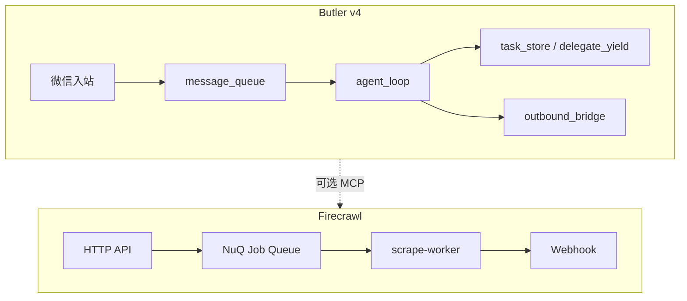

# Butler v4 与 Firecrawl 对照分析报告

> **日期**：2026-05-25  
> **对照代码**：`reference/firecrawl`（Firecrawl monorepo，重点 `apps/api/`）  
> **Butler 事实来源**：[`docs/architecture/v4-architecture.md`](../architecture/v4-architecture.md)  
> **相关规划**：[`reference-learning-plan-2026-05.md`](reference-learning-plan-2026-05.md)、[`cc-butler-gap-analysis-2026-05.md`](cc-butler-gap-analysis-2026-05.md)、[`butler-mcp-capability-2026-05.md`](butler-mcp-capability-2026-05.md)  
> **原则**：只借鉴设计、零新增 pip 依赖（不引入 NuQ/RabbitMQ/Redis 集群、Playwright 抓取农场、计费 SaaS）

---

## 1. 执行摘要

Firecrawl 是 **Web 数据采集 API**（Search / Scrape / Crawl / Batch / Agent），面向「把网页变成 LLM 可用 Markdown/JSON」；Butler v4 是 **微信管家 + 自建 Agent Loop + 多项目代码助手**。二者产品边界不同，对比价值在于 **异步作业生命周期、并发/限流、分桶重试、幂等、长任务 stale、可观测性、MCP 外挂**，而非把 Butler 做成抓取平台。

**结论**：

- Butler 在 **Loop/Gateway/上下文/委派** 上已按 Claude Code / OpenClaw 线束收口；Firecrawl **不替代** CC 差距分析主战场。
- **最值得继续吸收**（零依赖、单进程）：微信 `external_id` 幂等、委派任务 stale/组进度、重试原因分桶指标、会话级委派并发上限、可选薄 `web_fetch` 或 Firecrawl MCP 外挂。
- **明确不做**：NuQ + RabbitMQ + Postgres 作业平台、Redis 全局限流、Playwright 集群、URL Monitoring 产品化、GCS job 归档与 credits 计费队列。

---

## 2. 定位与架构对照

| 维度 | Butler v4 | Firecrawl |
|------|-----------|-----------|
| 核心产品 | 微信管家 + 自建 Loop + 多项目开发助手 | Web 上下文 API（Search / Scrape / Crawl / Batch / Agent） |
| 运行时 | 单进程 Gateway + 内存/文件状态 | API + Worker（NuQ + RabbitMQ + Redis + Playwright） |
| Agent 形态 | `agent_loop` 每轮同步推理 + 工具 | 长任务异步 Job + 状态轮询 / Webhook |
| 输出目标 | 对话回复、改代码、委派子 Agent | LLM 友好 Markdown / JSON、截图、结构化提取 |
| 学习原则 | 只借鉴设计、零依赖 | 全栈 Web 管道，不适合整体迁入 |



---

## 3. Firecrawl 架构要点（阅读路径）

| 模块 | 路径（`reference/firecrawl`） | 说明 |
|------|------------------------------|------|
| NuQ 作业队列 | `apps/api/src/services/worker/nuq.ts` | Postgres 作业表；状态 `queued/active/completed/failed/backlog`；`groupId`/`ownerId`/priority；可选 RabbitMQ LISTEN + prefetch worker |
| 并发 Semaphore | `apps/api/src/services/worker/team-semaphore.ts` | Redis Lua 按 team 限并发；阻塞 acquire + TTL lease；Prometheus 直方图 |
| 限流 | `apps/api/src/services/rate-limiter.ts` | 按模式（scrape/crawl/search/…）每分钟点数；`rate-limiter-flexible` + Redis |
| BullMQ 辅助队列 | `apps/api/src/services/queue-service.ts` | extract / billing / deepResearch 等；`removeOnComplete` 按队列类型设 TTL |
| 抓取主循环 | `apps/api/src/scraper/scrapeURL/index.ts` | 多引擎 fallback + Markdown 质量门 + proxy 策略 |
| 分桶重试 | `apps/api/src/scraper/scrapeURL/retryTracker.ts` | 按 `feature_toggle`/`pdf_antibot` 等分类型上限 |
| 取消层级 | `apps/api/src/scraper/scrapeURL/lib/abortManager.ts` | `external` / `scrape` / `engine` 多级 AbortSignal |
| Webhook | `apps/api/src/services/webhook/delivery.ts` | HMAC、事件过滤、`webhookId`、同步/异步投递 |
| 监控 Diff | `apps/api/src/services/monitoring/runner.ts` | 定时抓页 → diff → 邮件；stale 检测 |
| 幂等 | `apps/api/src/services/idempotency/create.ts` | `x-idempotency-key` 入库 |
| MCP / Skills | README、`firecrawl-skills`、`firecrawl-workflows` | 独立 MCP Server；可复用 workflow 配方 |

---

## 4. Butler 已对齐或更强的部分

| Firecrawl 能力 | Butler 现状 | 说明 |
|----------------|-------------|------|
| 长会话上下文 | `context_pipeline` + 分级剪枝 + post-compact 锚点 | CC 线束已收口 |
| 大工具结果落盘 | `tool_result_storage` + transcript spill 指针 | 对齐 CC tool result spill |
| 流式工具 | `streaming_tools` 只读预取 | 对齐 CC StreamingToolExecutor 子集 |
| 入站优先级队列 | `message_queue` + `queue_settings` | followup/collect/interrupt/steer |
| 子任务完成通知 | `delegate_yield` + `runtime/task_store.py` | 避免轮询 `list_runtime_jobs` |
| 委派 cache | `cache_safe_delegate.py` | prompt cache 对齐 |
| 读后再改 | `read_state.py` | `BUTLER_READ_BEFORE_EDIT` |
| 零依赖指标 | `butler/ops/runtime_metrics.py` | Prometheus 思想，无 `prometheus-client` |

**差距集中域**：异步作业状态机、Web IO、多租户 API 限流——与 Butler 微信管家定位部分重叠、部分无关。

---

## 5. 可提炼优化项（按优先级）

与 [`reference-learning-plan-2026-05.md`](reference-learning-plan-2026-05.md) 一致：**优先零依赖、单进程微信网关**。

### 5.1 P0 — 高收益、改动面可控

#### ① 入站幂等：从「2 秒文本去重」升级到「平台消息 ID」

| 项 | 内容 |
|----|------|
| Firecrawl | `x-idempotency-key` 入库防重放 |
| Butler 现状 | `message_queue._should_dedupe`：`(session, text)` + 2s 窗口 |
| 建议 | 对微信 `external_id` 做会话级已处理集合（内存 LRU + 可选 `session_transcript` 记录）；重连/重投不二次入队、不二次跑 Loop |
| 改动面 | `butler/gateway/message_handler.py`、`butler/gateway/message_queue.py` |

#### ② 委派任务 Stale 检测

| 项 | 内容 |
|----|------|
| Firecrawl | `monitoring/stale.ts`：`running` 超 1h 视为僵死 |
| Butler 现状 | `task_store` 仅 `running/completed/failed`，无超时语义 |
| 建议 | `/诊断` 或 `/任务` 标出超时 `running`；可选 `BUTLER_TASK_STALE_MINUTES` 自动标 `failed` + 微信提醒 |
| 改动面 | `butler/runtime/task_store.py`、诊断/任务命令 |

#### ③ 重试/失败「分桶」遥测

| 项 | 内容 |
|----|------|
| Firecrawl | `ScrapeRetryTracker` 按原因分桶计数 |
| Butler 现状 | `llm_retry`、`schema_recovery`、`transport/fallback`、`tool_guardrails` 有逻辑但诊断聚合弱 |
| 建议 | `runtime_metrics` 增加 labels：`schema_recovery`、`compress_fallback`、`provider_failover`、`tool_guardrail_block` 等 |
| 改动面 | `butler/core/llm_retry.py`、`butler/core/tool_batch.py`、`butler/ops/runtime_metrics.py` |

#### ④ Web 能力：产品二选一

| 选项 | 说明 |
|------|------|
| 薄工具 | stdlib 或现有依赖实现 `web_fetch`（URL 白名单、体积/超时、禁私网 IP，借鉴 `safeFetch`） |
| 外挂 | `BUTLER_MCP_ENABLED` + Firecrawl MCP，抓取作为可选插件 |

注：`butler/core/tool_prune_policy.py` 已列出 `web_fetch`，仓库内 **未见工具实现**——需补齐或文档明确仅走 MCP。

### 5.2 P1 — 中期增强（仍可不引中间件）

| # | 建议 | 借鉴来源 | Butler 落点 |
|---|------|----------|---------------|
| ⑤ | 作业组 `group_id` 聚合进度 | NuQ `group_id` 查询 | `TaskOrchestrator` / 多次 `delegate_task`；微信一条进度摘要 |
| ⑥ | 会话级委派并发上限（内存 Semaphore） | `team-semaphore.ts` | 限制同 `session_key` 同时 `running` 的 delegate 数 |
| ⑦ | HTTP 完成回调（可选） | `WebhookSender` | 委派完成 HMAC + `delivery_id`；默认仍走 `outbound_bridge` |
| ⑧ | Workflow Skill 包 | `firecrawl-workflows` | `.butler/workflows/*.yaml` + 固定 Skill 组合（巡检/发版等管家配方） |

### 5.3 P2 — 仅多实例 / Web 平台化时再考虑

| Firecrawl 模式 | 不建议 Butler 现阶段照搬的原因 |
|----------------|--------------------------------|
| NuQ + RabbitMQ + Postgres | 运维成本高；单网关 file task + transcript 够用 |
| Redis 全局限流 / Semaphore | 单租户微信无 API 配额场景 |
| Playwright 抓取农场 | 与「代码管家」定位不符；用外部 Firecrawl API |
| GCS job 归档 + billing 队列 | 需商业化 API 才值得 |
| URL Monitoring + diff 产品 | 非当前产品边界 |

---

## 6. 分项对照表

### 6.1 异步作业 vs 同步 Loop

| 能力 | Firecrawl | Butler |
|------|-----------|--------|
| 作业状态机 | NuQ 五态 + backlog | Loop 回合内同步；`task_store` 文件 JSON |
| 组级进度 | `group_id` 聚合 | 无统一 `group_id` |
| 完成通知 | Webhook / listenable job | 微信 outbound + `delegate_yield` |
| 持久化 | Postgres + 可选 GCS | `~/.butler/runtime/tasks/` + `transcript.jsonl` |

### 6.2 并发与限流

| 能力 | Firecrawl | Butler |
|------|-----------|--------|
| 租户并发 | Redis team semaphore | 无（单用户） |
| API 限流 | 按 endpoint 模式 RPM | 无 |
| 工具并行 | Worker 池 | `parallel_tools` + 路径冲突检测 |
| 死循环防护 | — | `tool_guardrails` + `tool_loop_detect` |

### 6.3 重试与降级

| 能力 | Firecrawl | Butler |
|------|-----------|--------|
| 分桶重试预算 | `ScrapeRetryTracker` | 分散在 llm_retry / guardrails |
| 引擎 fallback | 多 scrape engine + 质量门 | `transport/fallback.py` provider 链 |
| Schema 恢复 | — | `schema_recovery.py` |
| 上下文压缩回退 | — | `reactive_compact`、辅助模型摘要 |

### 6.4 可观测性

| 能力 | Firecrawl | Butler |
|------|-----------|--------|
| 指标 | prom-client 全链路 | `runtime_metrics` 零依赖 |
| Tracing | OTel span（NuQ） | 无分布式 trace |
| Job 日志 | GCS / structured log | `session_transcript`、completion 遥测 |

### 6.5 Agent 生态

| 能力 | Firecrawl | Butler |
|------|-----------|--------|
| MCP | 独立 `firecrawl-mcp-server` | 薄 Client，`BUTLER_MCP_ENABLED=0` 默认关 |
| Skills | `firecrawl-skills` | `skills_list` / `skill_view` + 项目 Skill |
| Workflows | `firecrawl-workflows` 配方库 | `workflow_steps` + 人工门控；无可视化 Graph |
| origin 归因 | SDK `origin` 含 mcp | 可借鉴到工具/委派 telemetry labels |

---

## 7. 与现有规划的关系

| 文档 | 关系 |
|------|------|
| [`cc-butler-gap-analysis-2026-05.md`](cc-butler-gap-analysis-2026-05.md) | Loop/队列/压缩主战场；Firecrawl **不替代** |
| [`reference-learning-plan-2026-05.md`](reference-learning-plan-2026-05.md) | Prometheus → `runtime_metrics` 已收口；Firecrawl prom 细节不必再加依赖 |
| [`butler-mcp-capability-2026-05.md`](butler-mcp-capability-2026-05.md) | Web 抓取最自然接点：**MCP 外挂 Firecrawl** |
| [`dify-butler-comparison-2026-05.md`](dify-butler-comparison-2026-05.md) | Dify 偏工作流/HITL；Firecrawl 偏 IO/队列，互补 |

---

## 8. 落地检查清单（实施 P0 时）

- [ ] `external_id` 幂等：重复消息不触发第二次 Loop
- [ ] `BUTLER_TASK_STALE_MINUTES` + `/诊断` 展示僵死 delegate
- [ ] `runtime_metrics` 重试 reason labels + `/诊断` 一节
- [ ] 明确 `web_fetch` 实现或文档声明「仅 MCP」
- [ ] （P1）`group_id` / 会话委派并发 / workflow 配方包 — 按产品排期

**建议测试**（改 gateway / task / metrics 后）：

```bash
cd /home/ailearn/projects/WFXM
PYTHONPATH=. pytest tests/test_message_queue.py tests/test_gateway_handler.py \
  tests/test_runtime_metrics.py -q
```

---

## 9. 总结：最值得落地的 5 条

1. **微信 `external_id` 幂等** — 防重放比 2s 文本去重更可靠。  
2. **`delegate` 任务 stale + 组进度** — 借 Firecrawl Job 状态机，零依赖用文件 store 即可。  
3. **重试原因分桶指标** — 借 `ScrapeRetryTracker`，强化 `/诊断`。  
4. **Web 抓取：内置薄 `web_fetch` 或 Firecrawl MCP** — 对齐 `tool_prune_policy` 与查资料场景。  
5. **会话级委派并发上限** — 借 team-semaphore 思想，内存实现即可。

**不建议**为学习 Firecrawl 引入 Redis/RabbitMQ/Playwright 集群；偏离 Butler「微信管家 + 零依赖线束」既定边界。

---

## 10. 修订记录

| 日期 | 说明 |
|------|------|
| 2026-05-25 | 初版：基于 `reference/firecrawl` 与 Butler v4 代码/架构文档对照 |
