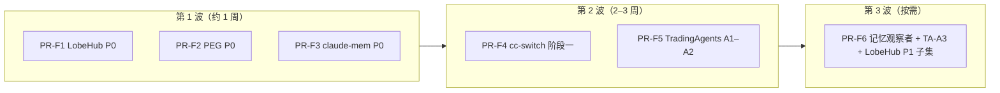

# 五份报告合并改进路线图（2026-05）

> **状态**：**第 1–2 波已落地**（2026-05-25）；PR-F5/F6 待做（见 §9）  
> **来源**：[`claude-mem-butler-comparison-report-2026-05.md`](claude-mem-butler-comparison-report-2026-05.md)、[`cc-switch-butler-analysis-2026-05.md`](cc-switch-butler-analysis-2026-05.md)、[`prompt-engineering-guide-butler-comparison-report-2026-05.md`](prompt-engineering-guide-butler-comparison-report-2026-05.md)、[`tradingagents-butler-comparison-report-2026-05.md`](tradingagents-butler-comparison-report-2026-05.md)、[`lobehub-butler-comparison-report-2026-05.md`](lobehub-butler-comparison-report-2026-05.md)  
> **事实基线**：[`../architecture/v4-architecture.md`](../architecture/v4-architecture.md)、[`four-reports-improvement-roadmap-2026-05.md`](four-reports-improvement-roadmap-2026-05.md)（**已收口**）、[`four-reports-out-of-scope-2026-05.md`](four-reports-out-of-scope-2026-05.md)  
> **原则**：零新增重依赖；不重复四报告 / CC 线束已落地项；不改变「微信管家 + 多项目 Agent Loop」边界

---

## 1. 这份文档解决什么问题

五份报告分别讨论了：

| 报告 | 主题 | 与四报告关系 |
|------|------|----------------|
| **claude-mem** | 工具级 observation、三层渐进检索、`<private>`、PreRead | 补强记忆，**不**替代四报告 A 线 hybrid RAG |
| **cc-switch** | 供应商熔断/failover、会话列表、MCP·Skill SSOT、用量盘 | **运维层**，**不**重复 CC 线束 Loop/Gateway |
| **prompt-engineering-guide** | 任务纪律、事实性、工具错误格式、轻量 Reflexion | **Prompt 层**，与 Prompt Corpus D/E **互补** |
| **tradingagents** | 阶段清子对话、outcome→反思、终局 schema | **编排层**，衔接 PR6 实验账本 |
| **lobehub** | 工具错误分类、参数 blacklist、UTF-16 截断、管道可观测 | **可靠性层**，**不**做浏览器 Loop / Chat UI |

它们与已收口的 [四报告路线图](four-reports-improvement-roadmap-2026-05.md) 正交，共同指向：

**Butler 在「能跑长会话」之后，还要「更好记、更好运维、更好收尾、更好解释失败」。**

本路线图收敛为 **5 条主线 + 3 个实施波次（PR-F1–F6）**。

---

## 2. 总体判断

### 2.1 应优先增强的

1. **更会记**：渐进披露 recall + 隐私标签 +（可选）工具级 observation  
2. **更好运维**：供应商健康、会话找回、用量可观测  
3. **更会写 prompt**：任务纪律、RAG 忠实度、统一工具失败 Observation  
4. **更会编排**：workflow 阶段只留 handoff/report；延后 outcome 反思  
5. **更抗失败**：工具错误 retry/replan/stop、参数级拒绝、安全截断  

### 2.2 已具备、本路线图不重复建设

| 能力 | 已落地文档/模块 |
|------|-----------------|
| Loop 压缩 / spill / 队列 / read-before-edit | [CC 线束](cc-butler-gap-analysis-2026-05.md)、`butler/core/*` |
| Hybrid RAG / chunking / sub-query 启发式 | [四报告 §9](four-reports-improvement-roadmap-2026-05.md)、`butler/memory/*` |
| DESIGN 管线 / 实验账本 PR6 | 四报告 C/D、`butler/experiments/` |
| Prompt Corpus 工具 DSL / transcript | [phase-d-prompt-corpus](../guides/phase-d-prompt-corpus.md) |
| LobeHub 技能市场适配 | `butler/registry/skill_sources/lobehub.py` |
| 反应性 provider fallback | `butler/transport/fallback.py` |

### 2.3 命名约定（避免与 CC / 四报告 P0 混用）

| 本路线图说法 | 含义 |
|--------------|------|
| **主线 F–J** | 五报告五条能力线（见 §3） |
| **第 1/2/3 波** | 实施波次（见 §4），**不是** CC 线束 P0–P4 |
| **PR-F1 … PR-F6** | 本路线图拆分的实现 PR |

---

## 3. 五条主线

### 主线 F — 记忆渐进披露（claude-mem）

**目标**：在现有 `MEMORY.md` + `semantic_index` 上，提高 recall 精度并降低注入 token，不引入 Chroma/Bun Worker。

| 优先级 | 项 | 产出 | 主要落点 |
|--------|----|------|----------|
| **P0** | `<private>` 隐私标签协议 | 用户/工具输出带标签不入正式 corpus / prefetch | `message_handler.py`、`session_lifecycle.py`、`memory/facade.py` |
| **P0** | 三层 recall API | search → timeline → fetch_observations（渐进披露） | `memory/facade.py`、`semantic_index.py`；工具或 `butler memory recall *` |
| **P1** | 观察者队列 | PostToolUse 入队 → 异步压成 observation 行 | 新 `butler/memory/observer_queue.py`、`gateway/hooks.py`、`tools/registry.py` |
| **P1** | PreRead 文件上下文 | 读文件前注入该路径历史摘要索引 | read 工具 / PreToolUse hook |
| **P1** | Session summary schema | Stop/SessionEnd 结构化摘要写入 experience | `session_lifecycle.py`、`post_session` 路径 |
| **P2** | 内联工具压缩实验开关 | `BUTLER_INLINE_TOOL_COMPRESS=1` 仅长会话评估 | `tool_result_storage` / observer 路径 |

**边界**：不做 IDE 插件、Chroma MCP、LLM 子 query（见 [四报告 out-of-scope #15](four-reports-out-of-scope-2026-05.md)）。

---

### 主线 G — 供应商与会话运维（cc-switch）

**目标**：从「失败后 fallback」升级为「预防性路由 + 主公可找回会话」，不做桌面配置台。

| 优先级 | 项 | 产出 | 主要落点 |
|--------|----|------|----------|
| **P0** | 熔断 + 有序 failover 队列 | `project.yaml` / 全局 `failover: [p1,p2]`；Open/HalfOpen/Closed | 新 `butler/transport/provider_health.py`；`orchestrator.py`、`llm_retry.py` |
| **P0** | 会话列表 CLI | `butler sessions list [--search] [--project]` | `session_transcript.py`、`cli/` |
| **P1** | 微信 `/会话` | 最近 N 条：session_key、项目、活跃时间、token 概览 | `message_handler.py` |
| **P1** | 流式探活 | 启动或 `/诊断` 触发首 chunk 检查 | `transport/llm_client.py`、`ops/health_report.py` |
| **P1** | 用量与 cache 命中率 | 日 cost、cache_read 占比进 `/诊断` | `NormalizedResponse.usage` 落盘、`runtime_metrics` 扩展 |
| **P1** | 配置原子写 + 备份 | yaml/json 写入统一 `atomic_write` | `project.py`、`project_manager.py` |
| **P2** | MCP/Skill SSOT + sync CLI | `.butler/mcp.yaml` 索引、`butler mcp sync` | `butler/mcp/`、`registry/` |
| **P2** | Thinking/协议整形 | 按模型注入 thinking 头 | `anthropic_transport.py`、`chat_completions.py` |

**边界**：不做 Tauri 桌面、五 CLI live 双向同步、内置 HTTP 代理全家桶。

---

### 主线 H — Prompt 与工具纪律（prompt-engineering-guide）

**目标**：零依赖提升 system/工具 Observation 质量，不引入 LangChain/notebook 运行时。

| 优先级 | 项 | 产出 | 主要落点 |
|--------|----|------|----------|
| **P0** | 任务完成显式纪律 | 禁止静默跳步；与 compaction IN-PROGRESS 一致 | `butler/prompts/butler_system.md` |
| **P0** | 场景化输出契约 | 规划/诊断/委派/实验摘要格式 | `butler_system.md`、`butler_plan_mode.md` |
| **P0** | 工具失败 Observation 标准化 | `错误类型 \| 原因 \| 建议下一步` | `tools/registry.py`、`tool_doc_templates.py` |
| **P0** | RAG 事实性 prompt | 无 chunk 依据则说不确定 | `butler_system.md`、`knowledge_search.py` |
| **P1** | Reflexion 轻量 | 连续同工具失败注入 ephemeral 反思 | `agent_loop.py` 或 gateway |
| **P1** | 委派 verification 片段 | delegate prompt 附 verify checklist | `delegate_categories.yaml`、`agent_profiles.py` |
| **P1** | 对抗性输入加固 | 用户消息 injection 标记；prefetch 过滤 | `message_handler.py`、`memory/facade.py` |
| **P1** | 规划模式 Generated Knowledge | plan 前先列已知事实/待验证 | `butler_plan_mode.md` |
| **P2** | Prompt 迭代 eval 闭环 | 语料 case + rubric（APE 思路，非自动搜 prompt） | `tests/corpus/`、可选脚本 |

**边界**：不做文本 ReAct、ToT、APE 全自动 prompt 搜索。

---

### 主线 I — Workflow 编排经济学（tradingagents）

**目标**：多步 workflow / 委派只向上游传递 **报告 + handoff**，并闭合「pending → 结果 → 短反思」学习链。

| 优先级 | 项 | 产出 | 主要落点 |
|--------|----|------|----------|
| **P0** | Outcome log | `status=pending\|resolved` + `reflection` 列或 `outcomes.tsv` | `butler/experiments/` 或新 `butler/outcomes/` |
| **P0** | 反思注入策略 | 同项目 N 条全文 + 跨项目 M 条仅 reflection | `orchestrator.py` |
| **P0** | 触发器 | runtime job 完成、`METRIC`、微信 `/评价` | `runtime/service.py`、`experiment_cli.py`、gateway |
| **P1** | 阶段清子 transcript | DAG 节点结束：仅 `AgentReport` + handoff 上行 | `task_orchestrator.py`、`handoff.py` |
| **P1** | `clear_child_transcript` 选项 | 父 Loop 不继承子 agent 全量 tool 轨迹 | `delegate_context.py`、`task_orchestrator.py` |
| **P1** | 终局 structured output | workflow 最后步 `output_schema` + render 回 markdown | `report.py`、workflow YAML、transport |
| **P1** | 确定性枚举解析 | `approve\|revise\|block`、`keep\|discard` → `AgentReport.decisions` | `report.py`、gateway 摘要 |
| **P2** | `model_capabilities` 表 | provider quirk 集中配置 | `butler/transport/model_capabilities.py` |
| **P2** | Workflow 步骤 wall time | per-step 耗时进 `/诊断` | `runtime_metrics.py`、`task_orchestrator.py` |

**边界**：不做 LangGraph、yfinance/Alpha Vantage、SQLite checkpoint 进 core、固定 Bull/Bear 图进默认微信路径。

---

### 主线 J — 工具与管道可靠性（lobehub）

**目标**：强化失败恢复与截断安全，渐进改造 ContextPipeline，不做 LobeHub 客户端 Loop。

| 优先级 | 项 | 产出 | 主要落点 |
|--------|----|------|----------|
| **P0** | 工具错误分类 | retry / replan / stop → Loop 策略 | `tool_batch.py` 或新 `tool_error_policy.py`；对齐 `error_classifier` |
| **P0** | 参数级 security_blacklist | `permissions.yaml` 扩展；PreToolUse 拒绝 | `permissions.py`、`registry.py` |
| **P0** | UTF-16 安全截断 | 工具 preview、微信分包共用 | 新 `butler/core/text_truncate.py` |
| **P1** | ContextPipeline 步骤化 | 注册 prune→compress→anchor；每步 ms 进 `/诊断` | `context_pipeline.py`、`health_report.py` |
| **P1** | 用户记忆分层 schema | post_session 写 persona/preference/experience 字段 | `session_lifecycle.py`、`butler_memory.py` |
| **P1** | Supervisor 指令协议 | TaskOrchestrator 多 agent 显式 state + 下一步指令 | `task_orchestrator.py` |
| **P2** | ToolsEngine 思想 | manifest 合并、FC 支持检查（MCP 深化时） | `butler/mcp/`、`tools/registry.py` |
| **P2** | 市场 manifest 安装前扫描 | 与 REG-P4 深化联动 | `registry/skill_sources/lobehub.py` |

**边界**：不做浏览器 Loop、conversation-flow UI、全量 MCP Host、OTEL 默认、25+ builtin-tool 包。

---

## 4. 实施波次与 PR 拆分



| PR | 范围 | 主线 | 验收（pytest / 人工） |
|----|------|------|----------------------|
| **PR-F1** | 工具错误分类 + UTF-16 截断 + 参数 blacklist | J | `tests/test_lobehub_p0_*.py`（待增）；改 `tool_batch` / `permissions` |
| **PR-F2** | 四条 PEG P0（system + registry 错误格式 + RAG 忠实度） | H | 语料或 snapshot 测 prompt 片段；`test_gateway_*` 无回归 |
| **PR-F3** | `<private>` + 三层 recall（CLI/工具） | F | `tests/test_memory_recall_layers.py`（待增） |
| **PR-F4** | Provider 熔断/failover + `sessions list` + `/会话` | G | `tests/test_provider_health.py`、`test_sessions_cli.py`（待增） |
| **PR-F5** | outcome log + 反思注入 + workflow 清子 transcript | I | `tests/test_outcome_reflection.py`、`test_task_orchestrator_clear.py`（待增） |
| **PR-F6** | 观察者队列（可选）+ 终局 schema + ContextPipeline 步骤诊断 | F/I/J | 分模块验收；可拆为 F6a/F6b |

**开工二选一（资源紧时）**：

1. **稳定性优先** → PR-F1 → PR-F4  
2. **记忆与编排优先** → PR-F3 → PR-F5  

---

## 5. 与现有规划的关系

| 文档 | 关系 |
|------|------|
| [`four-reports-improvement-roadmap-2026-05.md`](four-reports-improvement-roadmap-2026-05.md) | **前置已收口**；本路线图不重复 PR1–PR6 |
| [`four-reports-out-of-scope-2026-05.md`](four-reports-out-of-scope-2026-05.md) | **共享产品边界**；§7 仅列五报告增量「不做」 |
| [`cc-butler-gap-analysis-2026-05.md`](cc-butler-gap-analysis-2026-05.md) | Loop/Gateway 线束；本文 **不重复** P0–P4 |
| [`cc-switch-butler-analysis-2026-05.md`](cc-switch-butler-analysis-2026-05.md) | 主线 G 细节来源 |
| [`post-consolidation-roadmap-2026-05.md`](post-consolidation-roadmap-2026-05.md) | 产品运营轨；可将 PR-F4 `/会话` 并入运营验收 |
| [`docs/plans/README.md`](README.md) | 命名对照表需同步「五报告主线 F–J」 |

---

## 6. 明确不做（五报告增量）

> **共享边界**：[`four-reports-out-of-scope-2026-05.md`](four-reports-out-of-scope-2026-05.md) §2 总表仍有效。下表仅列**五报告特有**、未在四报告表中单独写明的项。

| # | 能力 | 来源 | 原因 |
|---|------|------|------|
| S1 | claude-mem **Bun Worker + Chroma MCP** | claude-mem | 运行时与依赖栈不符 |
| S2 | claude-mem **IDE 插件 / Viewer UI** | claude-mem | 产品入口是微信 |
| S3 | CC Switch **Tauri 桌面 + 托盘** | cc-switch | 非服务端产品 |
| S4 | CC Switch **五 CLI live 配置双向同步** | cc-switch | 维护面过大 |
| S5 | CC Switch **内置 HTTP 代理全家桶** | cc-switch | 除非产品改边界 |
| S6 | PEG **LangChain Agent / notebook 运行时** | PEG | 教学标本，非产品代码 |
| S7 | PEG **ToT / APE 全自动 prompt 搜索** | PEG | 成本与不可控 |
| S8 | TradingAgents **LangGraph + 行情 API** | tradingagents | 领域与依赖越界 |
| S9 | TradingAgents **SQLite checkpoint 进 core** | tradingagents | 用 transcript + 人工门控 + 节点重试 |
| S10 | LobeHub **浏览器 Agent Loop / Chat UI** | lobehub | 形态不同 |
| S11 | LobeHub **全量 MCP Host + OTEL 默认** | lobehub | 已有薄 MCP；零外部 APM |

**Butler 替代摘要**：自建 observation 表 + `semantic_index`；`ProviderHealthRegistry` + fallback；改 prompt 不引进框架；`outcomes.tsv` + handoff；`tool_error_policy` + `text_truncate`。

---

## 7. 环境变量（草案，落地时写入 reference.md）

| 变量 | 建议默认 | 主线 | 说明 |
|------|----------|------|------|
| `BUTLER_MEMORY_PRIVATE_TAGS` | `1` | F | 启用 `<private>` 剥离 |
| `BUTLER_MEMORY_RECALL_LAYERS` | `1` | F | 启用三层 recall 工具 |
| `BUTLER_MEMORY_OBSERVER_QUEUE` | `0` | F | PostToolUse 观察者队列 |
| `BUTLER_PROVIDER_CIRCUIT` | `1` | G | 供应商熔断 |
| `BUTLER_PROVIDER_FAILOVER` | _(空)_ | G | 全局 failover 列表（逗号分隔） |
| `BUTLER_SESSIONS_LIST_LIMIT` | `20` | G | `/会话` 默认条数 |
| `BUTLER_STREAM_PROBE` | `0` | G | 启动时流式探活 |
| `BUTLER_USAGE_PERSIST` | `1` | G | 用量落盘供 `/诊断` |
| `BUTLER_TOOL_ERROR_POLICY` | `1` | J | 工具错误 retry/replan/stop |
| `BUTLER_PERMISSIONS_PARAM_BLACKLIST` | `1` | J | 参数级 security_blacklist |
| `BUTLER_UTF16_SAFE_TRUNCATE` | `1` | J | 截断走 surrogate-safe |
| `BUTLER_OUTCOME_REFLECTION` | `1` | I | outcome log + 注入 |
| `BUTLER_WORKFLOW_CLEAR_CHILD` | `0` | I | DAG 节点后清子 transcript |
| `BUTLER_REFLEXION_EPHEMERAL` | `0` | H | 连续失败 ephemeral 反思 |

---

## 8. 测试守门（落地后写入 CONTRIBUTING）

```bash
cd /home/ailearn/projects/WFXM

# 第 1 波
PYTHONPATH=. pytest tests/test_lobehub_p0_features.py tests/test_peg_prompt_contracts.py \
  tests/test_memory_recall_layers.py -q

# 第 2 波
PYTHONPATH=. pytest tests/test_provider_health.py tests/test_sessions_cli.py \
  tests/test_outcome_reflection.py tests/test_task_orchestrator_clear.py -q

# 回归：四报告 + CC 线束（勿破坏已收口能力）
PYTHONPATH=. pytest tests/test_ragflow_p0_retrieval.py tests/test_design_md_sections.py \
  tests/test_experiment_ledger.py tests/test_tool_result_storage.py tests/test_message_queue.py -q
```

（`test_lobehub_p0_features.py` 等文件名在 PR 实现时创建，此处为预定守门。）

---

## 9. 落地核对表（2026-05）

| 项 | 状态 | 说明 |
|----|------|------|
| 主线 F P0 | ✅ | `<private>` + `butler_recall` mode=index/fetch/timeline |
| 主线 F P1 | ⬜ | 观察者队列、PreRead、Session summary |
| 主线 G P0 | ✅ | 熔断 + `filter_fallback_chain`；`butler sessions list` |
| 主线 G P1 | ⬜ | 微信 `/会话`、流式探活、用量盘、原子写 |
| 主线 G P2 | ⬜ | MCP/Skill SSOT |
| 主线 H P0 | ✅ | `butler_system.md` 任务纪律 / RAG 忠实度 / 工具错误格式 |
| 主线 H P1 | ⬜ | Reflexion、委派 verify、对抗加固 |
| 主线 I P0–P1 | ⬜ | outcome log、反思注入、清子 transcript |
| 主线 I P1 终局 schema | ⬜ | workflow `output_schema` + 枚举 parse |
| 主线 J P0 | ✅ | `tool_error_policy`、`security_blacklist`、`text_truncate` |
| 主线 J P1 | ⬜ | Pipeline 步骤化、记忆 schema、Supervisor |
| PR-F1 | ✅ | LobeHub P0 |
| PR-F2 | ✅ | PEG P0 |
| PR-F3 | ✅ | claude-mem P0 |
| PR-F4 | ✅ | cc-switch 阶段一（熔断 + sessions list） |
| PR-F5 … PR-F6 | ⬜ | TradingAgents + LobeHub P1 子集 |
| 文档同步 | 🟡 | `.env.example` 已补；`reference.md` / CONTRIBUTING 待补全 |
| 运维速查 | ⬜ | 可选 [`../guides/five-reports-capabilities-2026-05.md`](../guides/five-reports-capabilities-2026-05.md) |

---

## 10. 一句话总结

五份报告合并后的方向，不是「再做一个 claude-mem / CC Switch / LobeChat」，而是让现有 Butler：

- **更会记**（渐进 recall + 隐私）  
- **更好运维**（供应商与会话）  
- **更会说话**（prompt 与失败格式）  
- **更会收尾**（workflow 经济学 + outcome 反思）  
- **更耐失败**（工具错误与截断）  

推荐起步：**PR-F1 + PR-F2 + PR-F3**（第 1 波）；稳定后再 **PR-F4 + PR-F5**。

---

## 11. 变更记录

| 日期 | 说明 |
|------|------|
| 2026-05-25 | 初版：五报告合并路线图、主线 F–J、PR-F1–F6、out-of-scope S1–S11、§9 核对表 |
