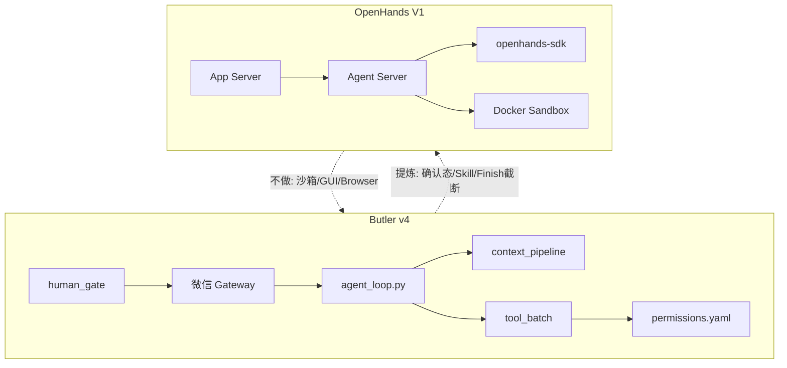

# OpenHands ↔ Butler v4 对照分析报告

> **日期**：2026-05-25  
> **对照源**：`reference/OpenHands`（本地 gitignore；V1 App Server + PyPI 包 `openhands-sdk` / `openhands-agent-server` / `openhands-tools` @ 1.22.1）  
> **Butler 基线**：[`v4-architecture.md`](../architecture/v4-architecture.md)、[`cc-butler-gap-analysis-2026-05.md`](cc-butler-gap-analysis-2026-05.md)、[`opencode-learning-plan-2026-05.md`](opencode-learning-plan-2026-05.md)  
> **原则**：只借鉴设计，**零新增 pip 依赖**；不引入 Docker 沙箱、React GUI、FastMCP PR 全家桶  
> **合并路线图**：[`external-agent-reports-improvement-roadmap-2026-05.md`](external-agent-reports-improvement-roadmap-2026-05.md) **主线 M**、PR-X2/X4/X5  
> **产品边界**：[`four-reports-out-of-scope-2026-05.md`](four-reports-out-of-scope-2026-05.md)、[`five-reports-not-done-2026-05.md`](five-reports-not-done-2026-05.md)

---

## 1. 执行摘要

| 维度 | OpenHands V1 | Butler v4 |
|------|--------------|-----------|
| 产品形态 | Web GUI + REST + 每会话 Docker/进程沙箱 | 微信管家 + 单进程自建 Loop |
| Loop 位置 | `openhands-sdk`（`Agent.step` + `LocalConversation.run`） | `butler/core/agent_loop.py` |
| 隔离 | 独立 agent-server 容器，tmux 终端 | 宿主项目目录，工具直接读写 |
| 事件 | 强类型 EventLog（每事件一个 JSON）+ Webhook 镜像 | `transcript.jsonl` 线性审计 |
| 权限 | `confirmation_policy` + `LLMSecurityAnalyzer` + Hooks 三层 | `permissions.yaml` allow/deny/ask + `human_gate` |
| 委派 | `TaskToolSet` + Markdown `AgentDefinition` | `delegate_task` + `task_orchestrator` DAG |
| 上下文 | `LLMSummarizingCondenser` 产出 `Condensation` 事件 | `context_pipeline` + post-compact 锚点 + reactive 413 |

**结论**：

- OpenHands 是 **「SaaS 产品 + 沙箱运行时 + 可组合 SDK」** 三层架构；Butler 是 **「微信通道 + 多项目管家 + 零重依赖 Loop」**。不应照搬 Docker 沙箱、浏览器工具、Git PR MCP 服务器等整包能力。
- Butler 在 **队列、压缩、guardrails、权限 YAML、DAG 委派、微信 human_gate** 上已不弱；OpenHands 强在 **沙箱隔离 + Web 产品壳 + 企业集成**，与微信管家边界不符。
- **最值得提炼的三类设计**：① 两阶段工具确认 + 显式 `WAITING_FOR_CONFIRMATION` 状态；② Condensation / Action-Observation 事件化审计；③ Markdown 子代理定义 + 分层 Skill + 关键词触发。
- **明确不做**：Docker/E2B 沙箱、BrowserGym/Playwright、Git worktree 每会话、PostHog/Laminar 默认外联、完整 EventLog 多存储（S3/GCS）。

---

## 2. OpenHands 架构速览

### 2.1 三层部署

```text
Frontend (React)
    ↓ REST /api/v1/*
App Server (openhands/app_server/)     ← 本仓库 reference/OpenHands
    - conversations, sandboxes, pending_messages, MCP proxy, webhooks
    ↓ HTTP (StartConversation, SendMessage, events)
Agent Server (openhands-agent-server)  ← PyPI 包，每沙箱一进程
    - conversation_service, event_service, PubSub, bash/file/git routers
    ↓ in-process
SDK (openhands-sdk)
    - Agent.step → LocalConversation.run → EventLog + tools
```

### 2.2 核心循环（SDK）

经典 monolithic `agent_controller.py` / `EventStream` 已迁入 PyPI 包。单步 `Agent.step()` 生命周期：

1. **Pending actions**（confirmation mode）：先执行未匹配的 `ActionEvent`，再返回
2. **Hook-blocked user message** → `FINISHED`
3. **`prepare_llm_messages()`** → condenser 可能产出 `Condensation` 事件而非直接调 LLM
4. **LLM completion** + tools；malformed history / context window → `CondensationRequest`
5. **`_ActionBatch`**：FinishTool 处截断 → 并行执行 →  emit `ActionEvent` + `ObservationEvent`
6. **`_requires_user_confirmation()`** → 可能设 `WAITING_FOR_CONFIRMATION`

### 2.3 执行状态机

`ConversationExecutionStatus`（SDK `conversation/state.py`）：

`IDLE` | `RUNNING` | `PAUSED` | `WAITING_FOR_CONFIRMATION` | `FINISHED` | `ERROR` | `STUCK` | `DELETING`

Butler 对应（`butler/core/loop_types.py`）仅 5 态：`RUNNING` | `COMPLETED` | `TOOL_LIMIT` | `ERROR` | `INTERRUPTED`。

### 2.4 关键文件索引

| 路径 | 角色 |
|------|------|
| `openhands/app_server/app_conversation/live_status_app_conversation_service.py` | 启动会话、LLM/MCP/tools/skills 组装 |
| `openhands/app_server/app_conversation/app_conversation_service_base.py` | Condenser、security analyzer、skill merge、确认策略 |
| `openhands/app_server/sandbox/docker_sandbox_service.py` | Docker 沙箱生命周期 |
| `openhands/app_server/event_callback/webhook_router.py` | Agent-server → App-server 事件 ingestion |
| `openhands/app_server/mcp/mcp_router.py` | App 级 FastMCP（PR 创建、Tavily 代理） |
| `openhands/app_server/pending_messages/` | SQL 队列：会话未就绪时缓存消息 |
| `skills/README.md` | Skill/microagent 模型与加载顺序 |
| `openhands-sdk`：`sdk/agent/agent.py` | 核心 `step()` |
| `openhands-sdk`：`sdk/conversation/impl/local_conversation.py` | `run()` 外层状态机 |
| `openhands-sdk`：`sdk/conversation/event_store.py` | EventLog 追加写 |
| `openhands-tools`：`tools/preset/default.py` | 默认工具集 |
| `openhands-tools`：`tools/task/definition.py` | 子代理委派（TaskToolSet） |

---

## 3. Butler 已覆盖能力（避免重复立项）

| OpenHands 机制 | Butler 现状 |
|----------------|-------------|
| 入站消息排队 | `message_queue.py`（now/next/later + 去重）+ `/steer` |
| Doom loop / stuck 倾向 | `tool_guardrails.py` + `permission_doom_loop.py` |
| 上下文压缩 | `context_pipeline` + `reactive_compact` + post-compact 锚点 |
| 压缩事件审计 | `session_transcript` 的 `compact_scheduled` / `compact_done` |
| 声明式权限 | `permissions.yaml`（last-match、workflow step 白名单） |
| 人工门控 | `human_gate.py`（workflow 步骤确认，微信「确认/取消」） |
| 子代理 | `delegate_task` + `delegate_subagent_permissions.py` |
| 运行指标 | `runtime_metrics.py` + `/诊断` |
| MCP（薄客户端） | `BUTLER_MCP_ENABLED` + `.butler/mcp.yaml` |
| Hook | `gateway/hooks.py`（含 mutating hooks） |

主学习线已在 CC / OpenCode / OpenClaw 规划中落地。OpenHands 补充 **IDE/SaaS 型 Agent 平台** 视角，不替代 CC 线束。

---

## 4. 分领域对照

### 4.1 运行时 / 沙箱

**OpenHands**

- 每会话独立 agent-server（Docker / Process / Remote）。
- 终端经 tmux；可选 E2B、Modal、Daytona 等。
- 每会话 **Git worktree**（`/tmp/conversation-worktrees/{id}/`，分支 `openhands/{id}`）。

**Butler**

- 工具在宿主 workspace 执行；`terminal` 默认关，allowlist argv。
- 无容器隔离；多 session 共享同一项目目录。

**提炼结论**：沙箱 + worktree **不做**（产品边界）。若未来多 session 写冲突频繁，可单独评估 worktree，非主路径。

---

### 4.2 事件与审计

**OpenHands**

- 追加写 EventLog：每事件一个 JSON 文件。
- 类型：`MessageEvent`、`ActionEvent` / `ObservationEvent`、`Condensation`、`HookExecutionEvent`、`StreamingDeltaEvent` 等。
- Agent-server `PubSub` + Webhook 镜像到 App-server（filesystem/S3/GCS）。

**Butler**

- `session_transcript.jsonl`：user/assistant/compact/queue/spill 指针。
- 无 per-event 文件、无跨服务 Webhook。

**提炼结论**：不必上 S3/Webhook；可在 jsonl 增加 `tool_action` / `tool_observation` 行类型，Condensation 带上 token 前后与触发原因。

---

### 4.3 上下文 / 压缩

**OpenHands**

- `LLMSummarizingCondenser`（默认 max_size 80 SDK / 240 app-server）。
- 独立 LLM `usage_id`：`condenser` / `planning_condenser`。
- 压缩产出 **`Condensation` 一等公民事件**，非静默截断。

**Butler**

- 五阶段 `context_compressor` + hygiene preflight + reactive 413。
- post-compact 重注入 MEMORY / DESIGN / Skill 锚点。
- transcript 已有 compact 事件（OpenCode 对标已落地）。

**提炼结论**：加深 transcript compact 元数据 + `/诊断` 一行摘要；不必改压缩算法本身。

---

### 4.4 权限 / 确认

**OpenHands**

| 机制 | 行为 |
|------|------|
| `confirmation_mode` | 开关确认流 |
| `NeverConfirm` / `AlwaysConfirm` / `ConfirmRisky` | 确认策略 |
| `LLMSecurityAnalyzer` | `"llm"` 时启用风险分级 |
| 两阶段执行 | 先创建 ActionEvent → `WAITING_FOR_CONFIRMATION` → 下一步执行 |
| Hooks | `PreToolUse` / `UserPromptSubmit` / `Stop` 可 block |

策略选择（`app_conversation_service_base.py`）：

- `confirmation_mode=False` → `NeverConfirm`
- `confirmation_mode=True` + analyzer `llm` → `ConfirmRisky`
- `confirmation_mode=True` + 无 analyzer → `AlwaysConfirm`

**Butler**

- `permissions.yaml`：allow / deny / ask；**无 LLM classifier**（见 `permissions.py` 模块注释）。
- `human_gate`：workflow 步骤级微信确认。
- doom loop：`ask` 路径（`permission_doom_loop.py`）。

**提炼结论**：高价值项为两阶段 defer + `WAITING_CONFIRMATION` 状态 + 终端命令规则打分（零 LLM 可选启发式）。

---

### 4.5 工具 / Action 批

**OpenHands**

- Pydantic `Action` / `Observation` 子类 + `ToolDefinition` 注册。
- `_ActionBatch`：FinishTool 截断、hook-block 分区、**ParallelToolExecutor**、有序 emit。

**Butler**

- `tool_batch.process_tool_calls`：spill、prefetch、guardrails、envelope。
- `parallel_tools.py`：路径冲突检测 + 安全并行。

**提炼结论**：Finish 截断可直接借鉴；Action/Observation 类型化进 transcript 为 P1。

---

### 4.6 委派 / 多 Agent

**OpenHands**

- `TaskToolSet` + `AgentDefinition`（Markdown + YAML frontmatter）。
- 字段：tools、skills、hooks、`permission_mode`、`mcp_servers`、`<example>` 触发。
- 内置 subagents：`code_explorer`、`web_researcher`、`bash_runner` 等。
- 子会话独立 `LocalConversation` + `permission_mode`（always_confirm / never_confirm / confirm_risky）。

**Butler**

- `delegate_task` + `task_orchestrator` DAG（真并行 asyncio）。
- `delegate_subagent_permissions.yaml` + `child_session_key` / `task_store`。

**提炼结论**：`.butler/agents/*.md` 子代理定义可 complement DAG，降低 orchestrator 硬编码。

---

### 4.7 Skills / Microagents

**OpenHands**（`skills/README.md`）

加载顺序（高优先级覆盖低）：

1. 公共 `OpenHands/skills/`
2. 用户 `~/.openhands/skills/`
3. Org（`.openhands` 或 config repo）
4. 项目 `.openhands/skills/` / `.agents/skills/`

触发：`KeywordTrigger`、`TaskTrigger`；`get_user_message_suffix()` 在发消息时注入；状态跟踪 `activated_knowledge_skills`。

**Butler**

- `skills_list` / `skill_view` 渐进披露。
- Orchestrator Skill 路由 + 项目 `MEMORY.md`。

**提炼结论**：keyword 触发 + public < user < project 分层 merge，本地实现即可，无需 HTTP skills API。

---

### 4.8 MCP

**OpenHands** 三层：

1. App-server FastMCP（`/mcp/mcp`）：create_pr、Tavily proxy 等
2. 会话启动时注入 `mcp_config`（default URL + 用户配置）
3. SDK `mcp/client.py`：动态 Pydantic 工具，300s 默认超时

**Butler**

- 可选 `BUTLER_MCP_ENABLED` + `.butler/mcp.yaml` 薄客户端。

**提炼结论**：可参考「密钥留服务端、Loop 只调 proxy」；不做 Git PR MCP 全家桶。

---

### 4.9 可观测性

**OpenHands**

- `ConversationStats`、PostHog、Laminar `@observe`、Webhook 终端状态分类（budget_exceeded、model_error…）。
- `stuck_detector.py` → `STUCK` 状态。

**Butler**

- `runtime_metrics.py`、`LoopTransitionReason`、`/诊断`。

**提炼结论**：独立 stuck 检测（无 mutating 进展 N 轮）可借鉴；外联 APM **不做**（五报告 S11、四报告 #18）。

---

### 4.10 入站队列

**OpenHands**

- SQL `pending_messages`：sandbox/会话 **未就绪** 时缓存，ready 后 bulk 投递。

**Butler**

- `message_queue`：turn **活跃** 时 now/next/later 排队 + drain。

**提炼结论**：`session_registry` 增加 `initializing` 态 + 未aw队，与 OpenHands pending 语义对齐。

---

## 5. 值得提炼的设计（按优先级）

### P0 — 高价值、低依赖、微信场景契合

| # | 项 | 说明 | 主要模块 |
|---|-----|------|----------|
| OH-P0a | 显式 `WAITING_CONFIRMATION` / `STUCK` 状态 | 扩展 `LoopStatus` 或 `LoopTransitionReason`；Gateway health + 微信文案 | `loop_types`, `session_registry`, `message_handler` |
| OH-P0b | 两阶段工具确认 | 高风险工具先 pending + transcript，用户「确认」后下一 turn 执行 | `tool_batch`, `human_gate`, `session_transcript` |
| OH-P0c | Finish 工具截断 | LLM 同轮返回 finish + 多余 read 时，只执行 finish 前 batch | `tool_batch` |
| OH-P0d | 终端命令风险启发式 ask | `BUTLER_PERMISSION_RISK_HEURISTIC=1`：删库、curl\|bash 等规则打分 | `permissions.py` |
| OH-P0e | Skill keyword 触发 + 分层 merge | frontmatter `triggers:`；public < user < project | `orchestrator`, `registry/skill_service` |

### P1 — 中等价值、边界内

| # | 项 | 说明 | 主要模块 |
|---|-----|------|----------|
| OH-P1a | `.butler/agents/*.md` 子代理定义 | YAML frontmatter + system；`delegate_task` 解析 `agent_type` | `delegate_task`, `delegate_subagent_permissions` |
| OH-P1b | Stuck detector（无 mutating 进展） | turn 级只 read/grep 循环 → nudge 或 STUCK | `tool_loop_detect` 或新模块 |
| OH-P1c | Transcript `tool_action` / `tool_observation` | 轻量 Action-Observation 审计 | `session_transcript` |
| OH-P1d | Condensation 元数据加深 | compact 事件带 token 前后、触发原因；`/诊断` 一行 | `session_transcript`, `context_pipeline` |
| OH-P1e | Session `initializing` + pending drain | 冷启动/workflow 门控期间入队不丢 | `session_registry`, `message_queue` |
| OH-P1f | Hook 三分法文档化 | UserPromptSubmit / Stop 与现有 PreTool 对齐 | `gateway/hooks.py` |

### P2 — 参考但谨慎或二期

| 项 | 评估 |
|----|------|
| Planning Agent / Build 切换 | 可用 workflow YAML + step 权限模拟 |
| MCP 服务端 proxy（Tavily 密钥不暴露） | 薄 MCP 深化时参考 |
| Secret Lookup JWT 回调 | OAuth MCP 远期 |
| Git worktree 每会话 | 多 session 写冲突时单独立项 |
| LLM `LLMSecurityAnalyzer` | 五报告 §2「injection 评分」未排期；与 ConfirmRisky 同思路 |

---

## 6. 明确不做（产品边界）

与 [`four-reports-out-of-scope-2026-05.md`](four-reports-out-of-scope-2026-05.md)、[`five-reports-not-done-2026-05.md`](five-reports-not-done-2026-05.md) 一致：

| # | OpenHands 能力 | 不做原因 |
|---|----------------|----------|
| 1 | Docker / E2B / Modal 沙箱 | 微信管家 + 宿主 workspace；非 SaaS IDE |
| 2 | BrowserGym / Playwright 工具 | 四报告 #1–2：CDP/截图 |
| 3 | VS Code / Desktop 容器路由 | 产品形态不同 |
| 4 | Git worktree 每会话（默认） | 成本高，非主路径 |
| 5 | FastMCP Git PR 全家桶 | 微信非 IDE SaaS |
| 6 | PostHog / Laminar 默认外联 | 四报告 #18、五报告 S11 |
| 7 | 完整 EventLog + S3/GCS 多存储 | jsonl 够用 |
| 8 | React GUI + REST 多客户端 | 入口是微信 Gateway |
| 9 | 企业 Jira/Linear/Slack 集成模板 | 领域越界 |

---

## 7. 与现有规划的关系

```text
已落地（勿重复立项）              OpenHands 可补充的新视角
─────────────────────              ─────────────────────────
CC P0–P4 线束                      两阶段确认 + WAITING 状态
OpenCode 压缩/prune/doom           Finish 截断 + stuck 独立态
OpenClaw 队列语义                  pending「未就绪」队列
reference-learning P0–P2           风险启发式确认（非 LLM 版）
四报告/五报告 out-of-scope         沙箱、浏览器、全量 MCP Host
```

OpenHands **尚未**列入 [`reference-learning-plan-2026-05.md`](reference-learning-plan-2026-05.md)。若实施 P0，建议新增 companion 文档 `openhands-learning-plan-2026-05.md`（仅设计备忘，零依赖原则不变）。

---

## 8. 推荐落地顺序

| 阶段 | 交付 | 预估 |
|------|------|------|
| 1 | OH-P0a + OH-P0b（状态机 + 两阶段确认） | 中 |
| 2 | OH-P0c + OH-P0d（Finish 截断 + 风险启发式） | 小 |
| 3 | OH-P0e（Skill keyword + 分层） | 中 |
| 4 | OH-P1a–P1f（按需） | 中–小 |

**首选**：OH-P0a + OH-P0b — 对 Owner 安全感知提升最大，与 `permissions.yaml` / `human_gate` 自然延伸，无新依赖。

---

## 9. 架构对照图



---

## 10. 维护

- 新否决项：同步 [`four-reports-out-of-scope-2026-05.md`](four-reports-out-of-scope-2026-05.md) 或 [`five-reports-not-done-2026-05.md`](five-reports-not-done-2026-05.md)。
- OH-P0+ 落地后：更新本文 §3「已覆盖」表 + 可选 `openhands-learning-plan-2026-05.md`。
- 改 Loop/Gateway 门控：同步 [`v4-architecture.md`](../architecture/v4-architecture.md)、[`config/reference.md`](../config/reference.md)。

---

*对照完成：2026-05-25*
