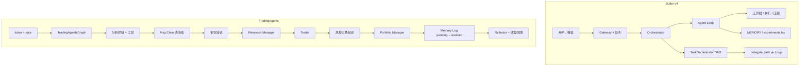

# Butler v4 ↔ TradingAgents 对照与提炼报告

> **状态**：分析完成（2026-05-25）；**主线 I 子集已落地**（见五报告路线图 §9、PR-F5/F6）  
> **本地对照代码**：`reference/TradingAgents/`（gitignore，上游 [TauricResearch/TradingAgents](https://github.com/TauricResearch/TradingAgents)）  
> **Butler 事实来源**：`docs/architecture/v4-architecture.md`、`butler/` 实现  
> **原则**：只借鉴**编排与上下文经济学**设计，**零新增依赖**（不引入 LangGraph / LangChain / yfinance）；金融数据层不进 `butler/core`

---

## 1. 执行摘要

**TradingAgents** 是基于 **LangGraph** 的多智能体**金融交易研究**框架：固定流水线（分析师 → 多空辩论 → Trader → 风控三角辩论 → Portfolio Manager），并配套 **决策日志 + 延后收益反思 + 可选 checkpoint 续跑**。

**Butler v4** 是 **微信管家 + 多项目通用 Agent Loop**（自建 `agent_loop`、`TaskOrchestrator` DAG、`delegate_task`、上下文压缩与 Gateway 队列）。

| 维度 | TradingAgents 更强 | Butler 更强 |
|------|-------------------|-------------|
| 领域流水线 | 角色固定、报告字段进 state、辩论轮次可控 | — |
| 结果驱动学习 | pending 决策 → 实测收益 → 短反思 → 下次注入 | 实验账本有标量，缺「延后反思 prose」闭环 |
| 上下文经济学 | 每分析师阶段 **清空 messages**（只留 state 报告） | 工具级剪枝、spill、post-compact 锚点 |
| 结构化终局 | Pydantic + render markdown + 确定性 parse_rating | `AgentReport` 事后抽取；workflow 终局可加强 |
| Agent 平台 | — | 微信网关、权限、人机门控、并行委派、观测 |

**结论**：最值得提炼的是 **① 分阶段丢对话、只保留报告/handoff；② pending→结果→短反思→注入 的学习链；③ 结构化终局 + 确定性解析 + 模型能力声明表**。不宜照搬 LangGraph 全图、行情 API 或固定 Bull/Bear 节点进默认 Butler 路径。

**明确不做**（与 [`four-reports-out-of-scope-2026-05.md`](four-reports-out-of-scope-2026-05.md) 一致）：LangGraph/SqliteSaver 作为 core 依赖、内嵌 yfinance/Alpha Vantage、通宵自治、LangSmith、无门控自动 git reset。

---

## 2. 两套系统定位对照

| 维度 | Butler v4 | TradingAgents |
|------|-----------|---------------|
| 产品定位 | 微信管家 + 多项目 **通用** Agent（编码、运维、实验等） | **金融交易研究** 专用流水线 |
| 编排引擎 | 自建 `agent_loop` + `TaskOrchestrator` DAG | LangGraph `StateGraph` 固定拓扑 |
| 子智能体 | `delegate_task` / `run_workflow`（动态任务） | 固定角色：4 分析师 → 辩论 → Trader → 风控 → PM |
| 记忆 | `MEMORY.md`、experience、`.butler/experiments.tsv` | `trading_memory.md`：决策 → 延后回填 → LLM 反思 |
| 断点续跑 | `session_transcript.jsonl`、入站队列 | LangGraph **SQLite checkpoint**（ticker+date） |
| 双模型 | `auxiliary`（压缩、post_session） | `deep_think_llm` / `quick_think_llm` 分工 |

---

## 3. 架构对照

### 3.1 概念流（Mermaid）



### 3.2 TradingAgents 主路径（代码锚点）

| 模块 | 路径 | 职责 |
|------|------|------|
| 图入口 | `tradingagents/graph/trading_graph.py` | `propagate()`、收益解析、memory 注入 |
| 图拓扑 | `tradingagents/graph/setup.py` | 分析师链、辩论边、PM 终点 |
| 条件路由 | `tradingagents/graph/conditional_logic.py` | 工具循环 / 辩论轮次 / 风控轮次 |
| 清消息 | `tradingagents/agents/utils/agent_utils.py` | `create_msg_delete()` |
| 决策记忆 | `tradingagents/agents/utils/memory.py` | `TradingMemoryLog` |
| 反思 | `tradingagents/graph/reflection.py` | `Reflector`（2–4 句 prose） |
| 结构化输出 | `tradingagents/agents/utils/structured.py` | `bind_structured` / `invoke_structured_or_freetext` |
| 终局 schema | `tradingagents/agents/schemas.py` | `PortfolioDecision` 等 |
| 评级解析 | `tradingagents/graph/signal_processing.py` | `parse_rating`（无二次 LLM） |
| Checkpoint | `tradingagents/graph/checkpointer.py` | 每 ticker SQLite |
| 模型能力 | `tradingagents/llm_clients/capabilities.py` | 声明式 API quirk |
| 数据路由 | `tradingagents/dataflows/interface.py` | category/tool 两级 vendor |

### 3.3 Butler 主路径（代码锚点）

| 模块 | 路径 | 职责 |
|------|------|------|
| Agent Loop | `butler/core/agent_loop.py` | 主循环、压缩、工具批 |
| DAG 编排 | `butler/task_orchestrator.py` | 拓扑、并行、`router`、人工审批 |
| 交接块 | `butler/core/handoff.py` | workflow/delegate 结构化 handoff |
| 结构化报告 | `butler/report.py` | `AgentReport` |
| 实验账本 | `butler/experiments/ledger.py` | `.butler/experiments.tsv` |
| 会话记忆 | `butler/session_lifecycle.py` | post-session、experience |
| 人机门控 | `butler/human_gate.py` | workflow 步骤确认 |
| 上下文剪枝 | `butler/core/tool_prune_policy.py`、`tool_result_storage.py` | 按工具/轮次减熵 |

---

## 4. TradingAgents 机制详解与 Butler 差距

### 4.1 两阶段决策日志 + 延后反思（高价值）

**机制**：

1. **Phase A**（`store_decision`）：流水线结束追加 `pending` 条目，**不调 LLM**。
2. **Phase B**（下次同 ticker）：拉价格算 raw/alpha → `Reflector` 写 2–4 句 → `batch_update_with_outcomes` 原子写回。
3. **注入**：`get_past_context(ticker, n_same=5, n_cross=3)` — 同标的全文 + 跨标的仅 reflection。

**Butler 差距**：`experiments.tsv` 有 `metric_value` / `hypothesis` / `keep|discard`，但缺少 **pending → 外部结果 → 短反思 prose → 下次 prompt** 的专用格式与注入策略。

**提炼建议（零依赖）**：

- 扩展 `.butler/`：`outcomes.md` 或 TSV 列 `reflection` / `status=pending|resolved`。
- 触发：runtime job 完成、`METRIC` 解析、或微信 `/评价`。
- 注入 orchestrator：同项目 N 条全文 + 跨项目 M 条仅 reflection（控 token）。

### 4.2 分阶段清空 messages（高价值）

**机制**：每个分析师完成后 `RemoveMessage` 全部对话，仅留 `HumanMessage("Continue")`；报告存在 `AgentState` 字段（如 `market_report`）。

**Butler 差距**：剪枝按**工具名/轮次**，非按 **workflow 阶段** 整块丢弃子 Loop 的 tool 轨迹。

**提炼建议**：

- `TaskOrchestrator` 节点结束后：仅 `AgentReport` + `handoff` 传入下游。
- 可选 `clear_child_transcript=True`，父 Loop 不继承子 agent 全量 messages。

### 4.3 结构化终局 + 渲染 + 回退（高价值）

**机制**：`with_structured_output(Schema)` → `render_*` 回 markdown → 失败则 `plain_llm.invoke` 一次。

**Butler 差距**：`AgentReport` 多从消息事后解析；workflow 最后一步无统一 schema 契约。

**提炼建议**：

- `run_workflow` 终局步骤可选 `output_schema`（Pydantic）。
- 结合 `schema_recovery` / transport 按 provider 选 json_schema | tool | json_mode。

### 4.4 确定性后处理（中高价值）

**机制**：`SignalProcessor` 仅 `parse_rating(full_signal)`，PM 已保证 `**Rating**:` 头。

**提炼建议**：为 Butler 定义枚举结论（`approve|revise|block`、`keep|discard`），正则/字段解析写入 `AgentReport.decisions`，供微信摘要与账本。

### 4.5 声明式模型能力表（中价值）

**机制**：`ModelCapabilities` 集中 `supports_tool_choice`、`requires_reasoning_content_roundtrip` 等；客户端查表。

**Butler 差距**：`butler/transport/providers.py` 偏 endpoint/env；quirk 分散在 retry 分支。

**提炼建议**：`butler/transport/model_capabilities.py`，迁移 DeepSeek/MiniMax 等已验证项。

### 4.6 其他可借鉴项（中低价值）

| 机制 | 说明 | Butler 建议 |
|------|------|-------------|
| deep / quick 双模型 | 复杂节点用 deep，分析师用 quick | workflow YAML `tier: fast\|deep` → 主模型 / auxiliary |
| `_ENV_OVERRIDES` + coerce | 单一表驱动配置 | 对齐 `BUTLER_*` 与 `Settings` |
| `PROVIDER_API_KEY_ENV` | 启动前缺 key 提示 | CLI / `/诊断` 预检 |
| 数据 vendor 路由 | category 默认 + tool 覆盖 | 仅当新增领域 dataflow 时 |
| `AnalystWallTimeTracker` | 每分析师 wall time | 扩 `runtime_metrics` per workflow step |
| `safe_ticker_component` | 防路径穿越 | 泛化 `safe_path_component` |
| SQLite checkpoint | 节点级续跑 | **不做进 core**；长任务用节点重试 + 人工门控 |
| 固定辩论图 | Bull/Bear/风控三角 | 可选 **workflow 模板**，不硬编码 LangGraph |

---

## 5. Butler 已具备、无需从 TradingAgents 引入

| 能力 | Butler | TradingAgents |
|------|--------|---------------|
| 通用编码工具 | read/patch/terminal/rg | 仅金融 data tools |
| 微信 + 入站队列 | `message_queue` | 无 |
| 人机门控 | `human_gate`、`requires_approval` | 无 |
| 上下文工程 | 五阶段压缩、413 reactive、cache-safe delegate | 仅 analyst Msg Clear |
| 并行子 agent | `asyncio.gather`、路径冲突检测 | 分析师链默认串行 |
| 声明式权限 | `.butler/permissions.yaml` | 无 |
| 委派治理 | `delegate_policy`、深度限制 | 无 |

---

## 6. 落地路线图（建议）

### 阶段 A（1–2 周，零依赖，优先）

| 项 | 改动方向 | 主要模块 |
|----|----------|----------|
| TA-A1 | outcome log：pending → resolved + reflection | `butler/experiments/` 或新 `butler/outcomes/` |
| TA-A2 | workflow 节点结束：handoff + AgentReport 上行，可选清子 transcript | `butler/task_orchestrator.py`、`handoff.py` |
| TA-A3 | 终局 structured output + render + 枚举 parse | `butler/report.py`、transport、workflow 定义 |

### 阶段 B（可选）

| 项 | 改动方向 |
|----|----------|
| TA-B1 | `model_capabilities` 并入 transport |
| TA-B2 | `BUTLER_*` 统一 env 覆盖表 |
| TA-B3 | workflow 步骤 wall time → `/诊断` |

### 阶段 C（另立项，非 core）

- 金融研究 **workflow 模板** + 可选 MCP 数据工具；**不**将 LangGraph 迁入 `butler/core`。

### 文档同步义务（落地后）

- `docs/architecture/v4-architecture.md`
- `docs/config/reference.md`、`.env.example`（若新增 `BUTLER_*`）
- 本报告 §6 状态改为「已落地」并链到 PR/提交

---

## 7. 验收建议（实现阶段 A 后）

```bash
cd /home/ailearn/projects/WFXM
PYTHONPATH=. pytest tests/test_experiment_ledger.py -q
# 新增 outcome / workflow handoff 测试后补充：
# PYTHONPATH=. pytest tests/test_<outcome|workflow>_*.py -q
```

---

## 8. 参考

| 资源 | 链接/路径 |
|------|-----------|
| TradingAgents 论文 | [arXiv:2412.20138](https://arxiv.org/abs/2412.20138) |
| 本地 clone | `reference/TradingAgents/` |
| Butler 架构 | [`../architecture/v4-architecture.md`](../architecture/v4-architecture.md) |
| 外部对标原则 | [`reference-learning-plan-2026-05.md`](reference-learning-plan-2026-05.md) |
| 明确不做 | [`four-reports-out-of-scope-2026-05.md`](four-reports-out-of-scope-2026-05.md) |
| 实验账本（已落地） | [`four-reports-improvement-roadmap-2026-05.md`](four-reports-improvement-roadmap-2026-05.md) §9 |

---

## 9. 变更记录

| 日期 | 说明 |
|------|------|
| 2026-05-25 | 初版：全量对照 + P0/P1/P2 提炼 + 阶段 A/B/C 路线图 |
