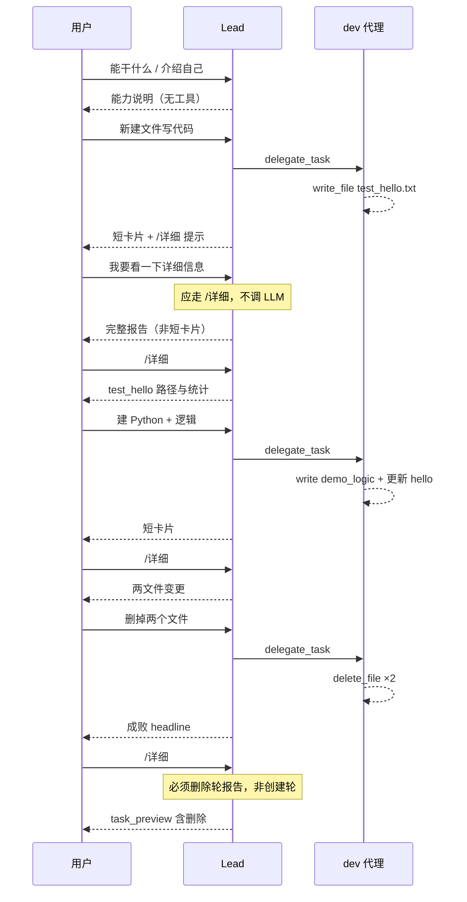

# 灵文1号真机对话衍射 — 自动化测试场景

> **来源**：2026-05-22 微信对话（鹿角象 × 灵文1号 Lead），见会话记录。  
> **实现**：[`tests/test_gateway_dev_conversations.py`](../../tests/test_gateway_dev_conversations.py)  
> **目录**：[`tests/scenarios/wechat_dev_conversations.yaml`](../../tests/scenarios/wechat_dev_conversations.yaml)  
> **运行**：`PYTHONPATH=. pytest tests/test_gateway_dev_conversations.py -q`

---

## 一、对话 → 场景衍射图



---

## 二、场景 ID 与 pytest 映射

| ID | 真机原话（摘要） | 测试类 / 方法 | 优先级 |
|----|------------------|---------------|--------|
| LW-INTRO-01 | 看下你都可以干什么 | `TestLingwenRealIntro::test_lw_intro_01_capabilities` | P2 |
| LW-INTRO-02 | 介绍一下你自己 | `TestLingwenRealIntro::test_lw_intro_02_lead_identity` | P2 |
| LW-CREATE-01 | 新建文件写代码 | `TestLingwenRealCreateAndDetail::test_lw_create_01_*` | P0 |
| LW-DETAIL-01 | 我要看一下详细信息 | `test_lw_detail_01_phrase_after_create_not_compact_card` | **P0 回归** |
| LW-DETAIL-02 | `/详细`（创建后） | `test_lw_detail_02_slash_detail_lists_both_files` | P0 |
| LW-CREATE-02 | 建 Python 写逻辑 | `test_lw_create_02_delegate_python_*` | P0 |
| LW-DELETE-01 | 删掉两个文件 | `TestLingwenRealDelete::test_lw_delete_01_*` | **P0** |
| LW-DETAIL-03 | `/详细`（删除后） | `test_lw_detail_03_after_delete_not_stale_create_report` | **P0 回归** |
| LW-DELETE-FAIL | 删失败 / 文件仍在 | `test_lw_delete_fail_*` | P0 |
| LW-REAL-GOLDEN | 整链 T3→T9 | `TestLingwenRealGoldenPath::test_lw_real_golden_path_full_dialogue` | P0 |

固定路径（与真机一致）：

- `docs/test_hello.txt`
- `docs/demo_logic.py`

---

## 三、断言策略（衍射规则）

| 规则 | 说明 | 对应真机 bug |
|------|------|--------------|
| **R1** | `详细信息` 不调 `AgentLoop` | T4 复读短卡片 |
| **R2** | 详细信息输出 ≠ 仅「已完成 \| 修改 N 个文件」 | 同上 |
| **R3** | 删除后磁盘两文件不存在 | T8 假成功 |
| **R4** | 删除后 `/详细` 含【本报告任务】+「删除」 | T9 陈旧创建报告 |
| **R5** | 删除后 `/详细` 不含「文件已创建完成」 | T9 summary 幻觉 |
| **R6** | `success=False` → headline 未能完成 + issues | T8 误报已完成 |
| **R7** | 一次 delegate 内 2×`delete_file` | 用户原话「两个文件」 |
| **R8** | Lead allowlist 无 write/terminal/delete | 厂长边界 |

---

## 四、刻意未自动化（待 P2 / live）

| 现象 | 原因 | 建议 |
|------|------|------|
| T6「仍在处理…/health」 | 依赖 outbound_bridge 计时 | live 或 bridge 单测 |
| T10–T16 选「2」死循环 | 需 `last_clarification` 会话状态 | 产品 + `LW-LOOP-02` |
| 模型是否主动 `delegate_task` | mock 剧本无法验路由 | `live_llm` 抽检 |

---

## 五、与通用「开发者习惯」场景关系

- [`wechat-dev-conversation-scenarios-2026-05.md`](wechat-dev-conversation-scenarios-2026-05.md) — 能力全集（A–G 簇）
- **本文档** — 真机黄金路径 **LW-REAL**，优先于习惯场景排期

CI 推荐：

```bash
PYTHONPATH=. pytest tests/test_gateway_dev_conversations.py -q
bash scripts/butler-wechat-gateway-smoke.sh   # 已含本文件
```
